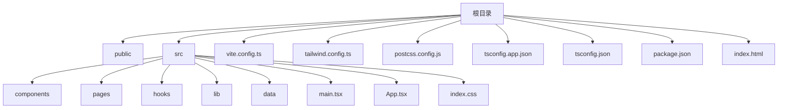
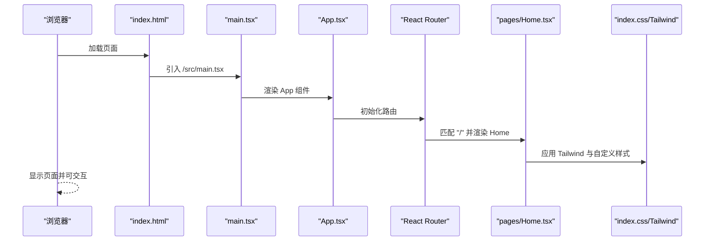
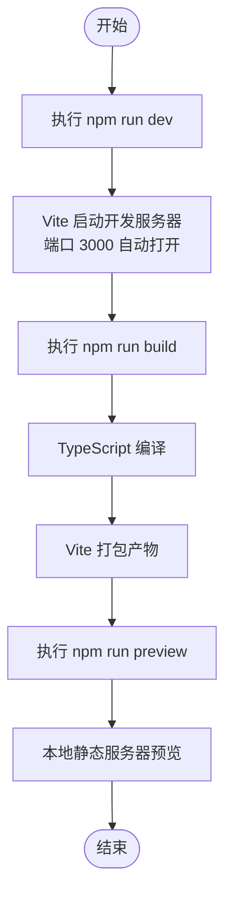
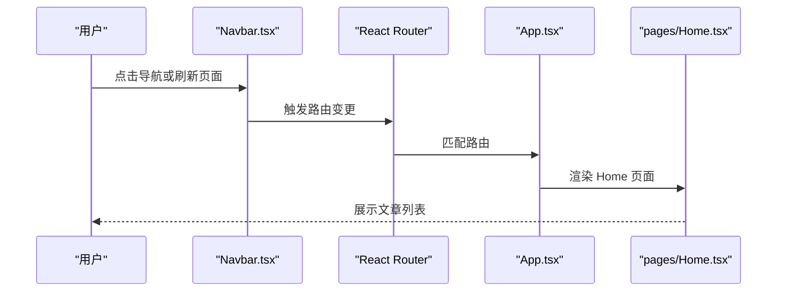
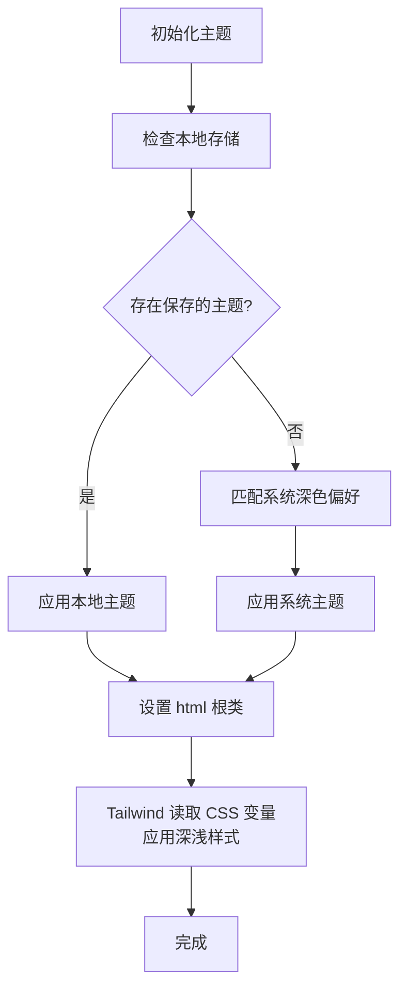

# 快速开始

<cite>
**本文引用的文件**
- [package.json](file://package.json)
- [vite.config.ts](file://vite.config.ts)
- [tailwind.config.ts](file://tailwind.config.ts)
- [postcss.config.js](file://postcss.config.js)
- [tsconfig.json](file://tsconfig.json)
- [tsconfig.app.json](file://tsconfig.app.json)
- [index.html](file://index.html)
- [src/main.tsx](file://src/main.tsx)
- [src/App.tsx](file://src/App.tsx)
- [src/index.css](file://src/index.css)
- [src/pages/Home.tsx](file://src/pages/Home.tsx)
- [src/data/posts.ts](file://src/data/posts.ts)
- [src/hooks/useTheme.ts](file://src/hooks/useTheme.ts)
- [src/components/Navbar.tsx](file://src/components/Navbar.tsx)
- [.gitignore](file://.gitignore)
</cite>

## 目录
1. [简介](#简介)
2. [项目结构](#项目结构)
3. [核心组件](#核心组件)
4. [架构总览](#架构总览)
5. [详细组件分析](#详细组件分析)
6. [依赖分析](#依赖分析)
7. [性能考虑](#性能考虑)
8. [故障排查指南](#故障排查指南)
9. [结论](#结论)
10. [附录](#附录)

## 简介
本指南面向首次接触 B02 项目的开发者，帮助你在 5 分钟内完成开发环境准备、依赖安装、本地运行与基础验证，并提供常见问题的快速解决路径。项目采用 React + TypeScript + Vite + Tailwind CSS 技术栈，具备现代化的开发体验与良好的可扩展性。

## 项目结构
项目采用“按功能分层 + 源码隔离”的组织方式，核心目录与关键文件如下：
- public：静态资源（如图标）
- src：源代码
  - components：可复用 UI 组件
  - pages：页面级组件
  - hooks：自定义 Hook
  - lib：工具函数
  - data：静态数据与类型定义
  - 根级入口：main.tsx、App.tsx、index.css
- 配置文件：vite.config.ts、tailwind.config.ts、postcss.config.js、tsconfig.app.json、tsconfig.json、package.json、index.html

图表来源
- [package.json](file://package.json)
- [vite.config.ts](file://vite.config.ts)
- [tailwind.config.ts](file://tailwind.config.ts)
- [postcss.config.js](file://postcss.config.js)
- [tsconfig.json](file://tsconfig.json)
- [tsconfig.app.json](file://tsconfig.app.json)
- [index.html](file://index.html)
- [src/main.tsx](file://src/main.tsx)
- [src/App.tsx](file://src/App.tsx)
- [src/index.css](file://src/index.css)

章节来源
- [package.json](file://package.json)
- [tsconfig.json](file://tsconfig.json)
- [tsconfig.app.json](file://tsconfig.app.json)
- [index.html](file://index.html)

## 核心组件
- 入口与路由
  - HTML 入口：index.html 中挂载 #root 容器并加载 /src/main.tsx
  - 应用入口：src/main.tsx 渲染 React 根节点并导入全局样式
  - 应用外壳：src/App.tsx 使用 React Router 管理路由，包含导航栏、页脚、滚动回到顶部等
- 页面与数据
  - 首页：src/pages/Home.tsx 展示文章列表，使用 src/data/posts.ts 中的静态数据
  - 主题钩子：src/hooks/useTheme.ts 管理明暗主题与本地存储
  - 导航栏：src/components/Navbar.tsx 提供桌面与移动端导航、主题切换
- 样式与主题
  - 全局样式：src/index.css 通过 Tailwind 指令与自定义 CSS 变量实现主题切换与动效
  - Tailwind 配置：tailwind.config.ts 定义内容扫描、主题扩展、动画与插件
  - PostCSS：postcss.config.js 启用 Tailwind 与 Autoprefixer
- 构建与开发
  - Vite 配置：vite.config.ts 设置插件、路径别名与开发服务器端口
  - TypeScript：tsconfig.app.json 限定模块解析、严格模式与 JSX 配置

章节来源
- [index.html](file://index.html)
- [src/main.tsx](file://src/main.tsx)
- [src/App.tsx](file://src/App.tsx)
- [src/pages/Home.tsx](file://src/pages/Home.tsx)
- [src/data/posts.ts](file://src/data/posts.ts)
- [src/hooks/useTheme.ts](file://src/hooks/useTheme.ts)
- [src/components/Navbar.tsx](file://src/components/Navbar.tsx)
- [src/index.css](file://src/index.css)
- [tailwind.config.ts](file://tailwind.config.ts)
- [postcss.config.js](file://postcss.config.js)
- [vite.config.ts](file://vite.config.ts)
- [tsconfig.app.json](file://tsconfig.app.json)

## 架构总览
下图展示了从浏览器访问到页面渲染的关键流程，涵盖开发服务器、模块解析、样式注入与路由切换。

图表来源
- [index.html](file://index.html)
- [src/main.tsx](file://src/main.tsx)
- [src/App.tsx](file://src/App.tsx)
- [src/pages/Home.tsx](file://src/pages/Home.tsx)
- [src/index.css](file://src/index.css)

## 详细组件分析

### 开发服务器与构建流程
- 启动开发服务器
  - 使用 Vite 插件 React，自动热更新与类型检查
  - 默认监听端口 3000，启动后自动打开浏览器
- 构建与预览
  - 构建：先执行 TypeScript 编译，再打包产物
  - 预览：本地启动静态服务器查看构建产物

图表来源
- [package.json](file://package.json)
- [vite.config.ts](file://vite.config.ts)

章节来源
- [package.json](file://package.json)
- [vite.config.ts](file://vite.config.ts)

### 路由与页面渲染
- 路由配置：App.tsx 中定义首页、详情页、关于页、分类页的路径映射
- 页面组件：Home.tsx 读取 posts 数据并渲染卡片列表
- 导航栏：Navbar.tsx 支持桌面与移动端导航、主题切换与活动态样式

图表来源
- [src/App.tsx](file://src/App.tsx)
- [src/pages/Home.tsx](file://src/pages/Home.tsx)
- [src/components/Navbar.tsx](file://src/components/Navbar.tsx)

章节来源
- [src/App.tsx](file://src/App.tsx)
- [src/pages/Home.tsx](file://src/pages/Home.tsx)
- [src/components/Navbar.tsx](file://src/components/Navbar.tsx)

### 主题与样式系统
- 主题钩子：useTheme.ts 读取本地存储或系统偏好，切换 light/dark 类到根元素
- 样式层叠：index.css 通过 @layer base/components/utilities 注入基础样式、组件样式与工具类
- Tailwind 扩展：tailwind.config.ts 定义颜色、字体、动画与内容扫描路径

图表来源
- [src/hooks/useTheme.ts](file://src/hooks/useTheme.ts)
- [src/index.css](file://src/index.css)
- [tailwind.config.ts](file://tailwind.config.ts)

章节来源
- [src/hooks/useTheme.ts](file://src/hooks/useTheme.ts)
- [src/index.css](file://src/index.css)
- [tailwind.config.ts](file://tailwind.config.ts)

## 依赖分析
- 运行时依赖（React 生态与 UI 工具）
  - react、react-dom、react-router-dom：页面与路由
  - lucide-react、class-variance-authority、clsx、tailwind-merge：图标与样式合并
  - @fontsource/inter：字体资源
- 开发时依赖（构建与样式）
  - @vitejs/plugin-react、vite：开发服务器与打包
  - tailwindcss、autoprefixer、postcss：样式管线
  - typescript：类型检查与编译
- 脚本命令
  - dev：启动开发服务器
  - build：TypeScript 编译 + Vite 打包
  - preview：本地预览构建产物

章节来源
- [package.json](file://package.json)
- [tsconfig.app.json](file://tsconfig.app.json)

## 性能考虑
- 代码分割与懒加载：建议将大型页面或组件按需加载，减少首屏体积
- 图片与字体优化：使用现代格式与合适的尺寸，避免阻塞渲染
- Tailwind 实战：仅启用所需工具类，避免无用样式；合理拆分动画与过渡，降低重绘
- 构建优化：生产构建开启压缩与 Tree-shaking，确保第三方库按需引入

## 故障排查指南
- 无法启动开发服务器
  - 确认端口 3000 未被占用，或在 vite.config.ts 中修改端口
  - 清理缓存后重试：删除 node_modules/.vite 并重新安装依赖
- 页面空白或样式异常
  - 检查 index.html 是否正确挂载 #root 容器
  - 确认 src/index.css 已在 main.tsx 中导入
  - 验证 Tailwind 指令与 postcss.config.js 配置生效
- 路由不生效或页面不更新
  - 确认 App.tsx 中的路由路径与页面组件导入正确
  - 检查路径参数与动态路由是否匹配
- 主题切换无效
  - 检查 useTheme.ts 是否将主题类写入 html 根元素
  - 确认 index.css 中的 CSS 变量与 :root/.dark 选择器生效
- 依赖安装失败
  - 使用推荐的包管理器（npm 或 yarn），避免混用导致 lock 文件冲突
  - 清理缓存后重试：npm cache clean --force 或 yarn cache clean

章节来源
- [vite.config.ts](file://vite.config.ts)
- [index.html](file://index.html)
- [src/main.tsx](file://src/main.tsx)
- [src/index.css](file://src/index.css)
- [src/App.tsx](file://src/App.tsx)
- [src/hooks/useTheme.ts](file://src/hooks/useTheme.ts)
- [postcss.config.js](file://postcss.config.js)
- [package.json](file://package.json)

## 结论
通过本指南，你已掌握 B02 项目的开发环境要求、依赖安装、启动与构建命令、关键配置文件作用以及首次运行后的验证步骤。建议在本地运行后，尝试修改主题、调整路由或新增页面，进一步熟悉项目结构与开发流程。

## 附录

### 开发环境要求与安装步骤
- 环境要求
  - Node.js：建议使用 LTS 版本（如 18.x 或 20.x）
  - 包管理器：推荐使用 npm（与脚本一致）或 yarn
- 安装步骤
  - 在项目根目录执行安装命令（任选其一）
    - npm install
    - yarn install
  - 安装完成后，执行以下命令进行开发与构建
    - 启动开发服务器：npm run dev
    - 构建项目：npm run build
    - 预览构建：npm run preview

章节来源
- [package.json](file://package.json)

### 常用命令与配置要点
- 命令
  - npm run dev：启动 Vite 开发服务器，默认端口 3000
  - npm run build：TypeScript 编译 + Vite 打包
  - npm run preview：本地预览构建产物
- 端口与别名
  - 端口：可在 vite.config.ts 的 server.port 修改
  - 路径别名：通过 resolve.alias 设置 @ 指向 src
- 样式管线
  - Tailwind 内容扫描：tailwind.config.ts 的 content 指向 index.html 与 src 下 TS/TSX
  - PostCSS：postcss.config.js 启用 tailwindcss 与 autoprefixer
- TypeScript
  - tsconfig.app.json 限定模块解析策略、严格模式与 JSX 配置

章节来源
- [vite.config.ts](file://vite.config.ts)
- [tailwind.config.ts](file://tailwind.config.ts)
- [postcss.config.js](file://postcss.config.js)
- [tsconfig.app.json](file://tsconfig.app.json)

### 首次运行后的验证步骤
- 启动开发服务器后，访问 http://localhost:3000
- 验证点
  - 页面正常显示，无空白或报错
  - 切换主题按钮可切换明/暗主题
  - 导航栏可点击，路由跳转正常
  - 文章列表展示正常，滚动与交互流畅
- 若出现异常，参考“故障排查指南”逐项检查

章节来源
- [index.html](file://index.html)
- [src/App.tsx](file://src/App.tsx)
- [src/components/Navbar.tsx](file://src/components/Navbar.tsx)
- [src/pages/Home.tsx](file://src/pages/Home.tsx)
- [src/hooks/useTheme.ts](file://src/hooks/useTheme.ts)