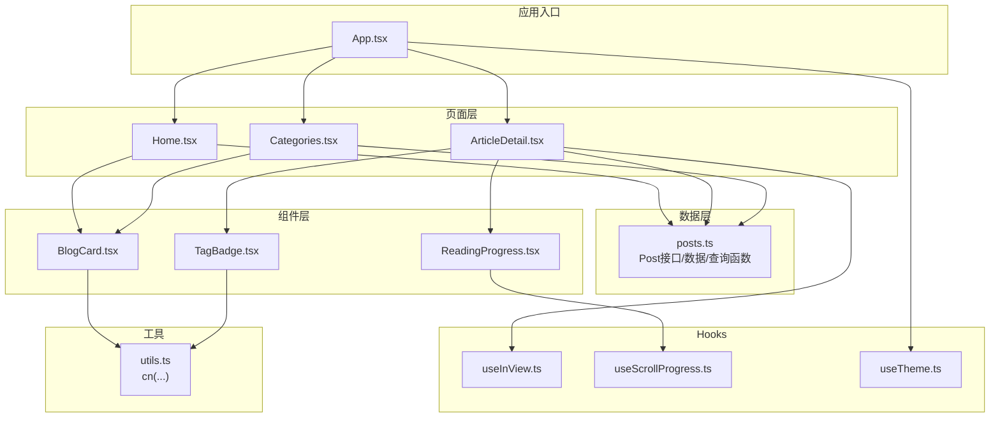
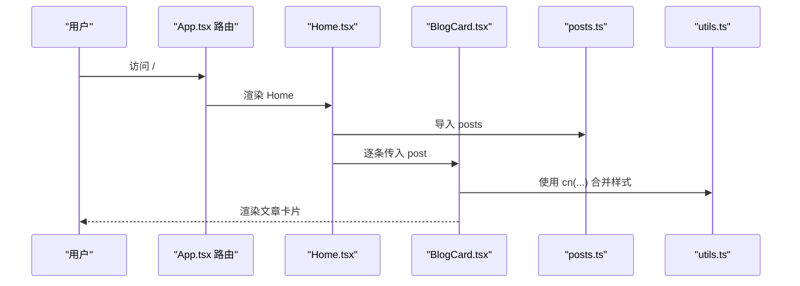
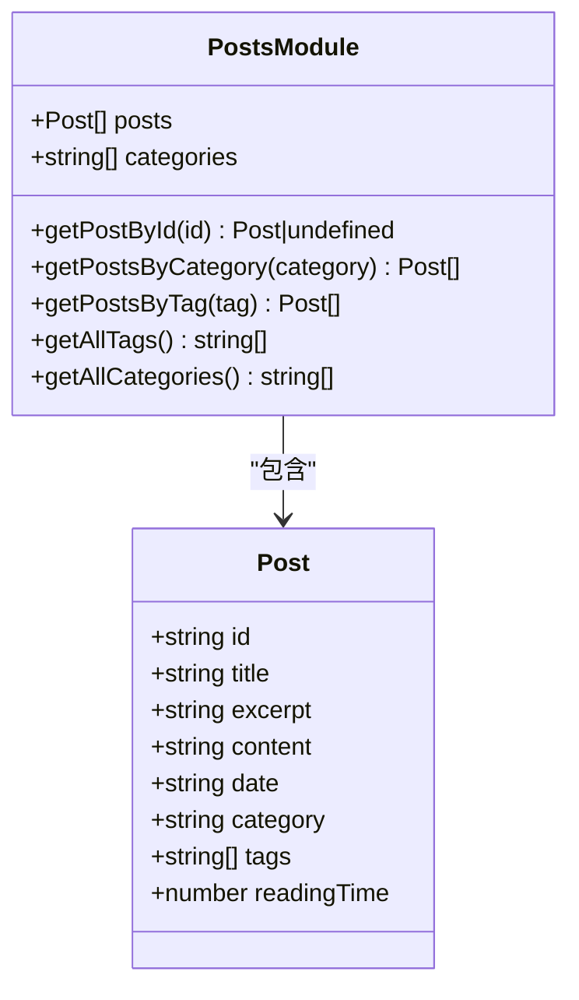
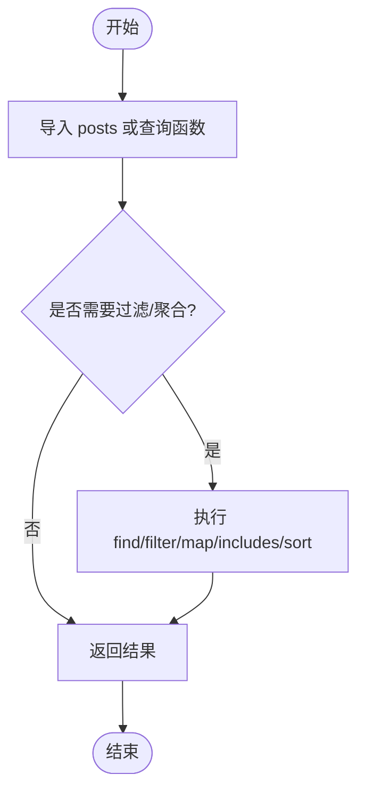
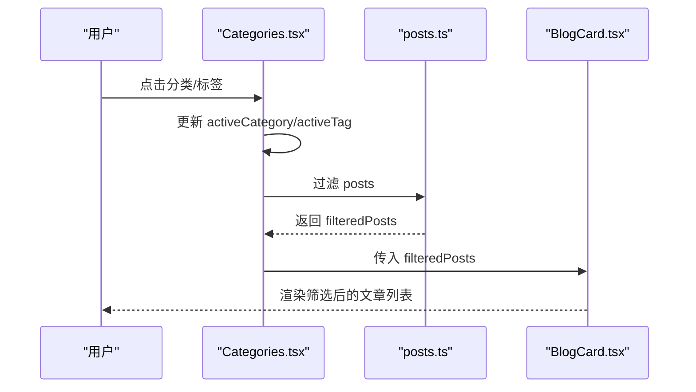
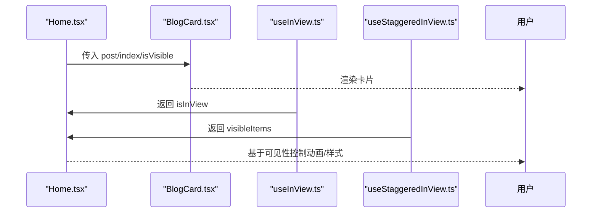
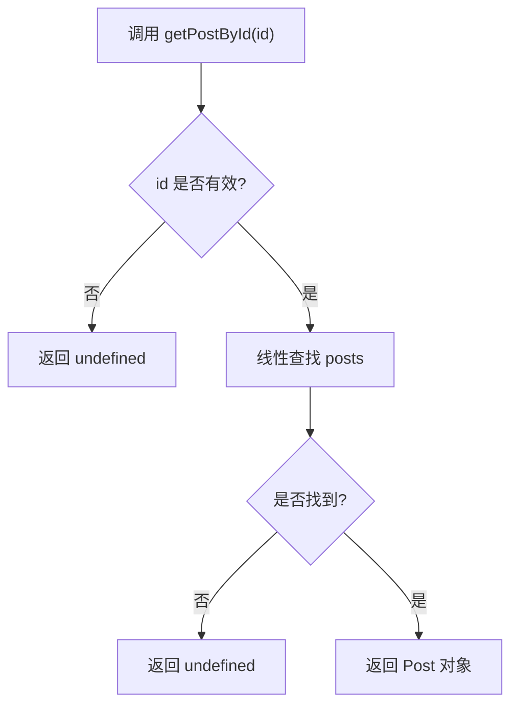
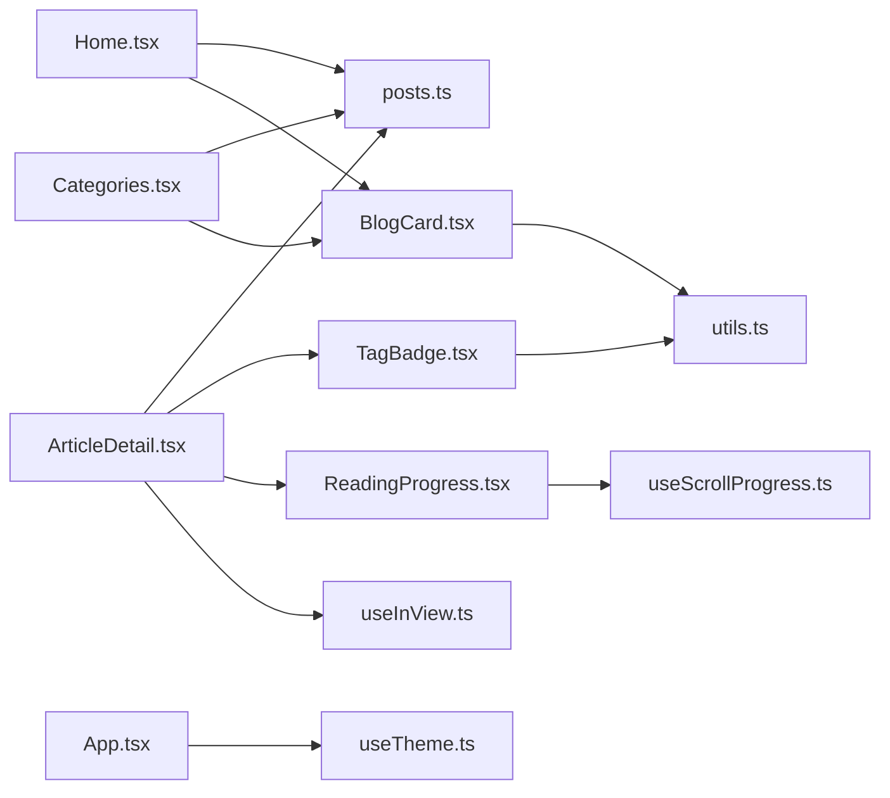

# 数据管理

<cite>
**本文引用的文件**
- [src/data/posts.ts](file://src/data/posts.ts)
- [src/pages/Home.tsx](file://src/pages/Home.tsx)
- [src/pages/ArticleDetail.tsx](file://src/pages/ArticleDetail.tsx)
- [src/pages/Categories.tsx](file://src/pages/Categories.tsx)
- [src/components/BlogCard.tsx](file://src/components/BlogCard.tsx)
- [src/components/TagBadge.tsx](file://src/components/TagBadge.tsx)
- [src/components/ReadingProgress.tsx](file://src/components/ReadingProgress.tsx)
- [src/hooks/useInView.ts](file://src/hooks/useInView.ts)
- [src/hooks/useScrollProgress.ts](file://src/hooks/useScrollProgress.ts)
- [src/hooks/useTheme.ts](file://src/hooks/useTheme.ts)
- [src/lib/utils.ts](file://src/lib/utils.ts)
- [src/App.tsx](file://src/App.tsx)
- [package.json](file://package.json)
</cite>

## 目录
1. [简介](#简介)
2. [项目结构](#项目结构)
3. [核心组件](#核心组件)
4. [架构总览](#架构总览)
5. [详细组件分析](#详细组件分析)
6. [依赖分析](#依赖分析)
7. [性能考量](#性能考量)
8. [故障排查指南](#故障排查指南)
9. [结论](#结论)
10. [附录](#附录)

## 简介
本文件面向数据架构师与前端工程师，系统化梳理 B02 项目的“数据管理系统”。重点覆盖：
- 文章数据模型结构与字段定义
- 数据获取、处理与缓存策略
- 查询与过滤机制实现原理
- 数据模型与 UI 组件的绑定与响应式更新
- 数据扩展与自定义最佳实践
- 数据验证与错误处理策略
- 数据持久化与本地存储方案
- 性能优化与扩展建议

## 项目结构
该项目采用按功能模块划分的组织方式，数据层集中在 src/data/posts.ts，页面与组件分别位于 src/pages 与 src/components，辅助逻辑分布在 src/hooks 与 src/lib。路由由 App.tsx 统一管理，页面通过导入数据模块与组件实现展示与交互。

图表来源
- [src/App.tsx:12-32](file://src/App.tsx#L12-L32)
- [src/pages/Home.tsx:1-34](file://src/pages/Home.tsx#L1-L34)
- [src/pages/ArticleDetail.tsx:118-200](file://src/pages/ArticleDetail.tsx#L118-L200)
- [src/pages/Categories.tsx:8-119](file://src/pages/Categories.tsx#L8-L119)
- [src/data/posts.ts:1-382](file://src/data/posts.ts#L1-L382)
- [src/components/BlogCard.tsx:12-65](file://src/components/BlogCard.tsx#L12-L65)
- [src/components/TagBadge.tsx:10-27](file://src/components/TagBadge.tsx#L10-L27)
- [src/components/ReadingProgress.tsx:3-18](file://src/components/ReadingProgress.tsx#L3-L18)
- [src/hooks/useInView.ts:9-75](file://src/hooks/useInView.ts#L9-L75)
- [src/hooks/useScrollProgress.ts:3-22](file://src/hooks/useScrollProgress.ts#L3-L22)
- [src/hooks/useTheme.ts:5-27](file://src/hooks/useTheme.ts#L5-L27)
- [src/lib/utils.ts:4-6](file://src/lib/utils.ts#L4-L6)

章节来源
- [src/App.tsx:12-32](file://src/App.tsx#L12-L32)
- [package.json:1-33](file://package.json#L1-L33)

## 核心组件
- 文章数据模型：统一的 Post 接口定义，包含标识、标题、摘要、正文、日期、分类、标签、阅读时长等字段。
- 数据源：静态 posts 数组与查询函数（按 ID、分类、标签检索，聚合标签与分类列表）。
- 页面与组件：Home 展示文章列表；ArticleDetail 展示详情与渲染；Categories 支持分类与标签筛选；BlogCard/TagBadge/ReadingProgress 提供 UI 绑定与交互。
- Hooks：useInView 与 useStaggeredInView 提供视口可见性检测与交错动画；useScrollProgress 提供滚动进度；useTheme 提供主题切换与持久化。
- 工具：cn(...) 合并样式类名。

章节来源
- [src/data/posts.ts:1-10](file://src/data/posts.ts#L1-L10)
- [src/data/posts.ts:14-382](file://src/data/posts.ts#L14-L382)
- [src/pages/Home.tsx:5-33](file://src/pages/Home.tsx#L5-L33)
- [src/pages/ArticleDetail.tsx:118-200](file://src/pages/ArticleDetail.tsx#L118-L200)
- [src/pages/Categories.tsx:8-119](file://src/pages/Categories.tsx#L8-L119)
- [src/hooks/useInView.ts:9-75](file://src/hooks/useInView.ts#L9-L75)
- [src/hooks/useScrollProgress.ts:3-22](file://src/hooks/useScrollProgress.ts#L3-L22)
- [src/hooks/useTheme.ts:5-27](file://src/hooks/useTheme.ts#L5-L27)
- [src/lib/utils.ts:4-6](file://src/lib/utils.ts#L4-L6)

## 架构总览
数据流从数据模块（posts.ts）出发，经由页面组件读取并传递给 UI 组件；UI 组件通过自定义 Hook 实现交互与响应式更新；路由与导航贯穿页面间的数据流转。

图表来源
- [src/App.tsx:12-32](file://src/App.tsx#L12-L32)
- [src/pages/Home.tsx:1-34](file://src/pages/Home.tsx#L1-L34)
- [src/components/BlogCard.tsx:12-65](file://src/components/BlogCard.tsx#L12-L65)
- [src/data/posts.ts:14-382](file://src/data/posts.ts#L14-L382)
- [src/lib/utils.ts:4-6](file://src/lib/utils.ts#L4-L6)

## 详细组件分析

### 文章数据模型与字段定义
- 接口定义：Post 包含 id、title、excerpt、content、date、category、tags、readingTime 等字段，确保文章元数据与渲染所需信息完整。
- 数据源：posts 数组提供初始数据；categories 常量限定分类集合；查询函数提供按 ID、分类、标签检索及聚合标签/分类列表的能力。
- 字段约束与校验：当前实现未内置运行时校验，字段类型来自 TypeScript 接口；如需增强，可在查询函数中加入参数校验与返回空值处理。

图表来源
- [src/data/posts.ts:1-10](file://src/data/posts.ts#L1-L10)
- [src/data/posts.ts:14-382](file://src/data/posts.ts#L14-L382)

章节来源
- [src/data/posts.ts:1-10](file://src/data/posts.ts#L1-L10)
- [src/data/posts.ts:12-12](file://src/data/posts.ts#L12-L12)
- [src/data/posts.ts:14-382](file://src/data/posts.ts#L14-L382)

### 数据获取、处理与缓存策略
- 获取：页面直接从数据模块导入 posts 或调用查询函数，无需网络请求。
- 处理：查询函数内部使用数组方法（find/filter/map/includes/sort）进行过滤与聚合，时间复杂度 O(n)。
- 缓存：当前为内存态缓存（模块级常量与数组），无持久化缓存；适合小规模静态数据场景。

图表来源
- [src/data/posts.ts:361-381](file://src/data/posts.ts#L361-L381)

章节来源
- [src/data/posts.ts:361-381](file://src/data/posts.ts#L361-L381)

### 数据查询方法与过滤机制
- 按 ID：线性查找，O(n)，适合小数据集。
- 按分类/标签：线性过滤，O(n)，结合 getAllCategories/getAllTags 生成筛选项。
- 聚合：使用 Set 去重后转数组排序，避免重复标签/分类。
- 页面级过滤：Categories 页面通过 useState 维护 activeCategory/activeTag，组合过滤 posts，实时响应。

图表来源
- [src/pages/Categories.tsx:8-119](file://src/pages/Categories.tsx#L8-L119)
- [src/data/posts.ts:361-381](file://src/data/posts.ts#L361-L381)
- [src/components/BlogCard.tsx:12-65](file://src/components/BlogCard.tsx#L12-L65)

章节来源
- [src/pages/Categories.tsx:15-19](file://src/pages/Categories.tsx#L15-L19)
- [src/data/posts.ts:365-381](file://src/data/posts.ts#L365-L381)

### 数据模型与 UI 组件的绑定与响应式更新
- 绑定：页面组件直接消费数据模块，将 Post 字段映射到 UI（标题、摘要、标签、日期、阅读时长）。
- 响应式：通过 useState 管理筛选状态与可见项集合；useInView/useStaggeredInView 基于 IntersectionObserver 实现视口可见性检测与交错动画；useScrollProgress 基于滚动事件计算进度。
- 组件复用：BlogCard/TagBadge 通过 props 接收数据与交互回调，实现高内聚低耦合。

图表来源
- [src/pages/Home.tsx:5-33](file://src/pages/Home.tsx#L5-L33)
- [src/components/BlogCard.tsx:12-65](file://src/components/BlogCard.tsx#L12-L65)
- [src/hooks/useInView.ts:9-75](file://src/hooks/useInView.ts#L9-L75)

章节来源
- [src/pages/Home.tsx:5-33](file://src/pages/Home.tsx#L5-L33)
- [src/hooks/useInView.ts:9-75](file://src/hooks/useInView.ts#L9-L75)

### 数据扩展与自定义最佳实践
- 新增字段：在 Post 接口中新增字段，并在 posts 数组中补齐默认值；如需动态生成，可在查询函数中提供默认值或转换逻辑。
- 新增查询：在数据模块新增查询函数，遵循现有命名与返回类型约定；避免在页面中重复实现相同逻辑。
- 过滤扩展：在页面中组合多个过滤条件（如分类+标签+日期区间），并在查询函数中封装复杂逻辑。
- UI 扩展：通过 props 传递更多交互状态（如点击回调、尺寸、激活态），在组件内部根据状态切换样式与行为。
- 性能扩展：对于大规模数据，考虑引入索引（Map/Set）或分页；在 UI 层采用虚拟滚动与懒加载。

章节来源
- [src/data/posts.ts:1-10](file://src/data/posts.ts#L1-L10)
- [src/data/posts.ts:361-381](file://src/data/posts.ts#L361-L381)
- [src/pages/Categories.tsx:15-19](file://src/pages/Categories.tsx#L15-L19)

### 数据验证规则与错误处理策略
- 参数校验：在查询函数中对输入参数进行类型检查与边界判断（如空字符串、非法 ID），返回 undefined 或空数组。
- 空值处理：ArticleDetail 在未找到文章时渲染“文章未找到”提示与返回按钮，避免空白页面。
- 错误降级：在渲染函数中对日期格式化、内容解析等潜在异常进行容错处理，保证页面稳定显示。

图表来源
- [src/pages/ArticleDetail.tsx:124-138](file://src/pages/ArticleDetail.tsx#L124-L138)
- [src/data/posts.ts:361-363](file://src/data/posts.ts#L361-L363)

章节来源
- [src/pages/ArticleDetail.tsx:124-138](file://src/pages/ArticleDetail.tsx#L124-L138)
- [src/data/posts.ts:361-363](file://src/data/posts.ts#L361-L363)

### 数据持久化与本地存储
- 主题持久化：useTheme 通过 localStorage 存储用户偏好主题，并在应用启动时读取系统偏好或本地保存的主题。
- 其他持久化：当前未实现文章数据的本地持久化；如需支持离线阅读或用户偏好，可在本地存储中引入 IndexedDB 或浏览器存储 API。

章节来源
- [src/hooks/useTheme.ts:5-27](file://src/hooks/useTheme.ts#L5-L27)

## 依赖分析
- 组件依赖：页面组件依赖数据模块与 UI 组件；UI 组件依赖工具函数与自身样式。
- 自定义 Hook 依赖：useInView/useStaggeredInView 依赖 IntersectionObserver；useScrollProgress 依赖 window 滚动事件。
- 路由依赖：App.tsx 统一注册路由，页面通过 react-router-dom 进行导航。

图表来源
- [src/pages/Home.tsx:1-34](file://src/pages/Home.tsx#L1-L34)
- [src/pages/ArticleDetail.tsx:118-200](file://src/pages/ArticleDetail.tsx#L118-L200)
- [src/pages/Categories.tsx:8-119](file://src/pages/Categories.tsx#L8-L119)
- [src/data/posts.ts:14-382](file://src/data/posts.ts#L14-L382)
- [src/components/BlogCard.tsx:12-65](file://src/components/BlogCard.tsx#L12-L65)
- [src/components/TagBadge.tsx:10-27](file://src/components/TagBadge.tsx#L10-L27)
- [src/components/ReadingProgress.tsx:3-18](file://src/components/ReadingProgress.tsx#L3-L18)
- [src/hooks/useInView.ts:9-75](file://src/hooks/useInView.ts#L9-L75)
- [src/hooks/useScrollProgress.ts:3-22](file://src/hooks/useScrollProgress.ts#L3-L22)
- [src/hooks/useTheme.ts:5-27](file://src/hooks/useTheme.ts#L5-L27)
- [src/lib/utils.ts:4-6](file://src/lib/utils.ts#L4-L6)
- [src/App.tsx:12-32](file://src/App.tsx#L12-L32)

章节来源
- [src/App.tsx:12-32](file://src/App.tsx#L12-L32)
- [src/hooks/useInView.ts:9-75](file://src/hooks/useInView.ts#L9-L75)
- [src/hooks/useScrollProgress.ts:3-22](file://src/hooks/useScrollProgress.ts#L3-L22)
- [src/hooks/useTheme.ts:5-27](file://src/hooks/useTheme.ts#L5-L27)

## 性能考量
- 时间复杂度：当前查询为 O(n)，适合小规模数据；若数据增长，建议：
  - 引入 Map 索引（如按 id/category/tag）以实现 O(1) 查找。
  - 分页与虚拟滚动减少 DOM 节点数量。
- 内存占用：posts 数组在内存中常驻，注意避免重复拷贝与不必要的对象创建。
- 渲染优化：利用 useStaggeredInView 控制动画触发时机，减少首屏压力；useScrollProgress 仅在滚动时更新，避免高频重绘。
- 资源加载：静态资源通过 Vite 打包优化，建议开启压缩与按需加载。

[本节为通用性能指导，不直接分析具体文件]

## 故障排查指南
- 文章未找到：ArticleDetail 在未命中时返回“文章未找到”页面，检查路由参数与数据 id 是否一致。
- 筛选无效：Categories 页面确认 activeCategory/activeTag 状态更新与过滤逻辑一致。
- 样式异常：检查 cn(...) 合并逻辑与 Tailwind 类名冲突；确认 useTheme 主题切换是否生效。
- 滚动进度不更新：确认 useScrollProgress 事件监听是否正常挂载与卸载。

章节来源
- [src/pages/ArticleDetail.tsx:124-138](file://src/pages/ArticleDetail.tsx#L124-L138)
- [src/pages/Categories.tsx:15-19](file://src/pages/Categories.tsx#L15-L19)
- [src/hooks/useScrollProgress.ts:3-22](file://src/hooks/useScrollProgress.ts#L3-L22)
- [src/hooks/useTheme.ts:5-27](file://src/hooks/useTheme.ts#L5-L27)

## 结论
B02 的数据管理以简洁的静态数据模型为核心，配合自定义 Hook 实现视口检测与滚动进度，页面通过组件化方式高效绑定数据。当前实现适合中小规模静态博客场景；随着数据体量与交互复杂度上升，建议引入索引、分页、虚拟滚动与本地持久化等优化手段。

[本节为总结性内容，不直接分析具体文件]

## 附录
- 依赖清单：React、React Router、Tailwind CSS、Lucide React、clsx/tailwind-merge 等。
- 构建与预览：Vite 提供开发与构建脚本，TypeScript 类型检查保障。

章节来源
- [package.json:11-31](file://package.json#L11-L31)