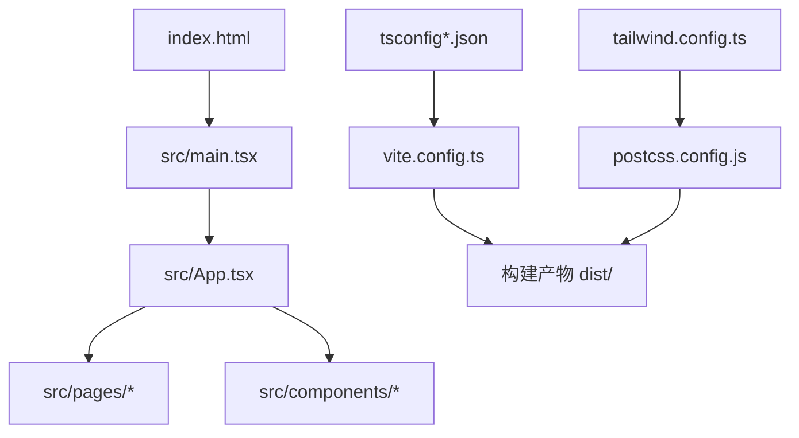
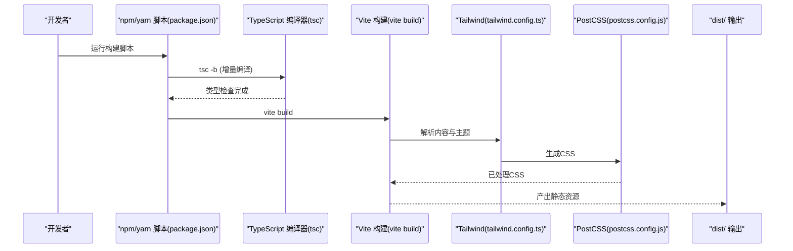
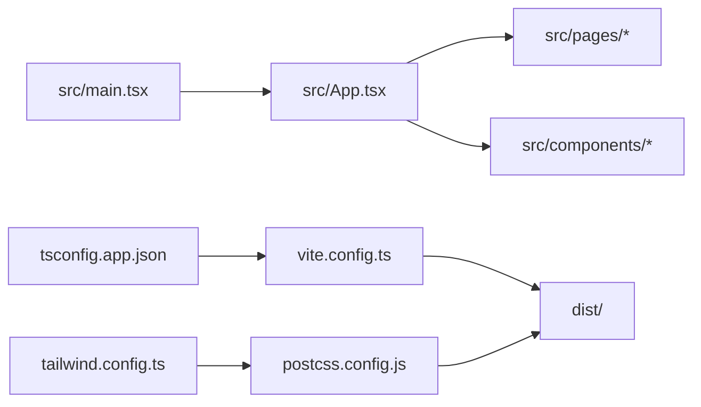

# 构建与部署

<cite>
**本文引用的文件**
- [vite.config.ts](file://vite.config.ts)
- [package.json](file://package.json)
- [tsconfig.json](file://tsconfig.json)
- [tsconfig.app.json](file://tsconfig.app.json)
- [tailwind.config.ts](file://tailwind.config.ts)
- [postcss.config.js](file://postcss.config.js)
- [src/main.tsx](file://src/main.tsx)
- [src/App.tsx](file://src/App.tsx)
- [index.html](file://index.html)
</cite>

## 目录
1. [简介](#简介)
2. [项目结构](#项目结构)
3. [核心组件](#核心组件)
4. [架构总览](#架构总览)
5. [详细组件分析](#详细组件分析)
6. [依赖关系分析](#依赖关系分析)
7. [性能考量](#性能考量)
8. [故障排除指南](#故障排除指南)
9. [结论](#结论)
10. [附录](#附录)

## 简介
本指南面向DevOps工程师与前端团队，围绕B02项目的构建与部署提供系统化方法论。内容涵盖：
- Vite构建工具的配置要点与优化策略
- TypeScript编译配置与类型检查机制
- 生产构建的性能优化与代码分割思路
- 多平台部署（Vercel、Netlify、GitHub Pages）参考配置路径
- CI/CD流水线与自动化部署建议
- 环境变量管理与安全处理
- 构建产物分析与性能监控方法
- 部署最佳实践与常见问题排查

## 项目结构
B02采用Vite + React + TypeScript + TailwindCSS组合，核心目录与文件如下：
- 源码入口：src/main.tsx、src/App.tsx
- 构建配置：vite.config.ts、tsconfig*.json、tailwind.config.ts、postcss.config.js
- 页面与组件：src/pages、src/components、src/hooks、src/lib
- 资源与公共文件：public、index.html
- 包管理与脚本：package.json

图表来源
- [index.html:1-16](file://index.html#L1-L16)
- [src/main.tsx:1-15](file://src/main.tsx#L1-L15)
- [src/App.tsx:1-43](file://src/App.tsx#L1-L43)
- [vite.config.ts:1-17](file://vite.config.ts#L1-L17)
- [tsconfig.app.json:1-26](file://tsconfig.app.json#L1-L26)
- [tailwind.config.ts:1-107](file://tailwind.config.ts#L1-L107)
- [postcss.config.js:1-7](file://postcss.config.js#L1-L7)

章节来源
- [index.html:1-16](file://index.html#L1-L16)
- [src/main.tsx:1-15](file://src/main.tsx#L1-L15)
- [src/App.tsx:1-43](file://src/App.tsx#L1-L43)
- [vite.config.ts:1-17](file://vite.config.ts#L1-L17)
- [tsconfig.json:1-7](file://tsconfig.json#L1-L7)
- [tsconfig.app.json:1-26](file://tsconfig.app.json#L1-L26)
- [tailwind.config.ts:1-107](file://tailwind.config.ts#L1-L107)
- [postcss.config.js:1-7](file://postcss.config.js#L1-L7)

## 核心组件
- Vite配置：启用React插件、路径别名@指向src、开发服务器端口与自动打开浏览器
- TypeScript配置：双层tsconfig组织、严格模式、bundler模块解析、路径映射
- Tailwind集成：内容扫描范围、暗色模式、动画与主题扩展
- PostCSS：Tailwind与Autoprefixer链式处理
- 入口与路由：index.html挂载点、main.tsx渲染、App.tsx集中路由与页面组件

章节来源
- [vite.config.ts:1-17](file://vite.config.ts#L1-L17)
- [tsconfig.json:1-7](file://tsconfig.json#L1-L7)
- [tsconfig.app.json:1-26](file://tsconfig.app.json#L1-L26)
- [tailwind.config.ts:1-107](file://tailwind.config.ts#L1-L107)
- [postcss.config.js:1-7](file://postcss.config.js#L1-L7)
- [src/main.tsx:1-15](file://src/main.tsx#L1-L15)
- [src/App.tsx:1-43](file://src/App.tsx#L1-L43)
- [index.html:1-16](file://index.html#L1-L16)

## 架构总览
下图展示从源码到构建产物的关键流程，以及与TypeScript、Tailwind、PostCSS的协作关系。

图表来源
- [package.json:6-10](file://package.json#L6-L10)
- [tsconfig.app.json:1-26](file://tsconfig.app.json#L1-L26)
- [tailwind.config.ts:1-107](file://tailwind.config.ts#L1-L107)
- [postcss.config.js:1-7](file://postcss.config.js#L1-L7)
- [vite.config.ts:1-17](file://vite.config.ts#L1-L17)

## 详细组件分析

### Vite 构建配置与优化策略
- 插件与别名
  - 启用React插件以支持JSX与HMR
  - 使用路径别名@简化导入路径，提升可维护性
- 开发服务器
  - 固定端口与自动打开浏览器，提升本地开发体验
- 生产构建优化建议（基于现有配置的扩展方向）
  - 代码分割：利用动态import进行路由级懒加载，减少首屏体积
  - 预构建依赖：对稳定第三方库启用预构建，缩短冷启动时间
  - 资源压缩：确保在生产模式下启用最小化与资源内联策略
  - 静态资源处理：合理设置静态资源的缓存与指纹命名
  - 动态导入与路由：结合React Router的Suspense边界实现渐进式加载

章节来源
- [vite.config.ts:1-17](file://vite.config.ts#L1-L17)

### TypeScript 编译配置与类型检查机制
- 双层tsconfig组织
  - 根tsconfig通过references聚合子配置，便于分层管理
- app配置要点
  - ES目标与模块解析：ES2020与bundler解析适配现代打包器
  - 严格模式：开启严格、未使用检查、无副作用导入限制
  - 路径映射：与Vite别名保持一致，避免路径漂移
  - JSX与输出：使用react-jsx，配合Vite与TypeScript的类型检查
- 建议
  - 在CI中运行tsc --noEmit确保类型安全
  - 对大型项目拆分子配置，提升增量编译效率

章节来源
- [tsconfig.json:1-7](file://tsconfig.json#L1-L7)
- [tsconfig.app.json:1-26](file://tsconfig.app.json#L1-L26)

### Tailwind 与 PostCSS 集成
- 内容扫描与暗色模式
  - 扫描index.html与src下的tsx文件，按需生成样式
  - 支持class驱动的暗色模式
- 主题与动画
  - 字体、最大宽度、颜色系统、圆角与自定义动画
- PostCSS链
  - Tailwind → Autoprefixer，保证跨浏览器兼容

章节来源
- [tailwind.config.ts:1-107](file://tailwind.config.ts#L1-L107)
- [postcss.config.js:1-7](file://postcss.config.js#L1-L7)

### 入口与路由
- HTML挂载点与字体资源引入
  - index.html提供根节点与基础元信息
  - main.tsx集中引入字体与全局样式后挂载应用
- 应用与路由
  - App.tsx集中声明路由与页面组件，便于后续懒加载改造

章节来源
- [index.html:1-16](file://index.html#L1-L16)
- [src/main.tsx:1-15](file://src/main.tsx#L1-L15)
- [src/App.tsx:1-43](file://src/App.tsx#L1-L43)

### 构建脚本与命令流
- 开发：vite
- 预览：vite preview
- 构建：先tsc -b进行类型检查，再vite build生成生产包

章节来源
- [package.json:6-10](file://package.json#L6-L10)

## 依赖关系分析
- 组件耦合
  - main.tsx依赖App.tsx与全局样式
  - App.tsx依赖各页面与组件模块
  - 构建侧依赖Vite、TypeScript、Tailwind与PostCSS
- 外部依赖
  - React生态、Tailwind与相关插件
- 潜在风险
  - 路径别名与模块解析不一致可能导致编译或运行时错误
  - Tailwind内容扫描范围不足会导致样式未生成

图表来源
- [src/main.tsx:1-15](file://src/main.tsx#L1-L15)
- [src/App.tsx:1-43](file://src/App.tsx#L1-L43)
- [vite.config.ts:1-17](file://vite.config.ts#L1-L17)
- [tsconfig.app.json:1-26](file://tsconfig.app.json#L1-L26)
- [tailwind.config.ts:1-107](file://tailwind.config.ts#L1-L107)
- [postcss.config.js:1-7](file://postcss.config.js#L1-L7)

章节来源
- [src/main.tsx:1-15](file://src/main.tsx#L1-L15)
- [src/App.tsx:1-43](file://src/App.tsx#L1-L43)
- [vite.config.ts:1-17](file://vite.config.ts#L1-L17)
- [tsconfig.app.json:1-26](file://tsconfig.app.json#L1-L26)
- [tailwind.config.ts:1-107](file://tailwind.config.ts#L1-L107)
- [postcss.config.js:1-7](file://postcss.config.js#L1-L7)

## 性能考量
- 代码分割与懒加载
  - 将路由级页面改为动态import，结合Suspense实现渐进式加载
- 预构建与依赖优化
  - 对稳定第三方库启用预构建，减少重复编译
- 资源与缓存
  - 合理设置静态资源指纹与缓存头；对CSS与JS进行最小化
- Tailwind与CSS
  - 控制内容扫描范围，避免生成冗余样式；按需引入动画与组件
- TypeScript
  - 在CI中执行类型检查，防止运行时错误影响性能

[本节为通用指导，无需列出章节来源]

## 故障排除指南
- 构建失败
  - 确认TypeScript已通过tsc -b；检查tsconfig与Vite别名一致性
- 样式异常
  - 检查Tailwind内容扫描路径是否覆盖到目标文件
  - 确保PostCSS链正确加载Tailwind与Autoprefixer
- 路由或页面空白
  - 核对index.html挂载点与main.tsx入口逻辑
  - 检查App.tsx路由声明与页面组件导出
- 开发服务器问题
  - 端口占用或权限问题导致无法启动，调整端口或以管理员权限运行

章节来源
- [tsconfig.app.json:1-26](file://tsconfig.app.json#L1-L26)
- [tailwind.config.ts:1-107](file://tailwind.config.ts#L1-L107)
- [postcss.config.js:1-7](file://postcss.config.js#L1-L7)
- [index.html:1-16](file://index.html#L1-L16)
- [src/main.tsx:1-15](file://src/main.tsx#L1-L15)
- [src/App.tsx:1-43](file://src/App.tsx#L1-L43)
- [vite.config.ts:1-17](file://vite.config.ts#L1-L17)

## 结论
B02项目已具备现代化前端工程的基础：清晰的TypeScript配置、Tailwind与PostCSS集成、以及简洁的Vite开发体验。建议在生产构建阶段引入代码分割、预构建与资源优化，并完善CI中的类型检查与构建产物分析，以获得更优的性能与可靠性。

[本节为总结性内容，无需列出章节来源]

## 附录

### 多平台部署参考（配置路径）
- Vercel
  - 使用框架检测与构建产物目录配置，参考项目根目录的构建输出目录
- Netlify
  - 设置构建命令与发布目录，确保与构建脚本一致
- GitHub Pages
  - 将构建产物发布至gh-pages分支或指定目录

[本节为通用部署建议，无需列出章节来源]

### CI/CD 流水线与自动化部署
- 建议步骤
  - 安装依赖 → 类型检查 → 构建 → 产物分析 → 部署
  - 在部署阶段根据平台设置环境变量与密钥
- 自动化
  - 使用平台提供的工作流或第三方CI服务，触发条件可基于分支保护规则

[本节为通用指导，无需列出章节来源]

### 环境变量与安全
- 环境变量
  - 仅注入客户端可见的公开变量；敏感数据通过后端接口或平台托管变量提供
- 配置文件
  - 不将密钥写入仓库；使用平台的加密变量或密钥管理服务

[本节为通用指导，无需列出章节来源]

### 构建产物分析与性能监控
- 产物分析
  - 使用Vite内置报告或第三方Bundle Analyzer查看包体构成
- 性能监控
  - 首屏时间、交互延迟与资源加载监控；结合平台日志与指标面板

[本节为通用指导，无需列出章节来源]