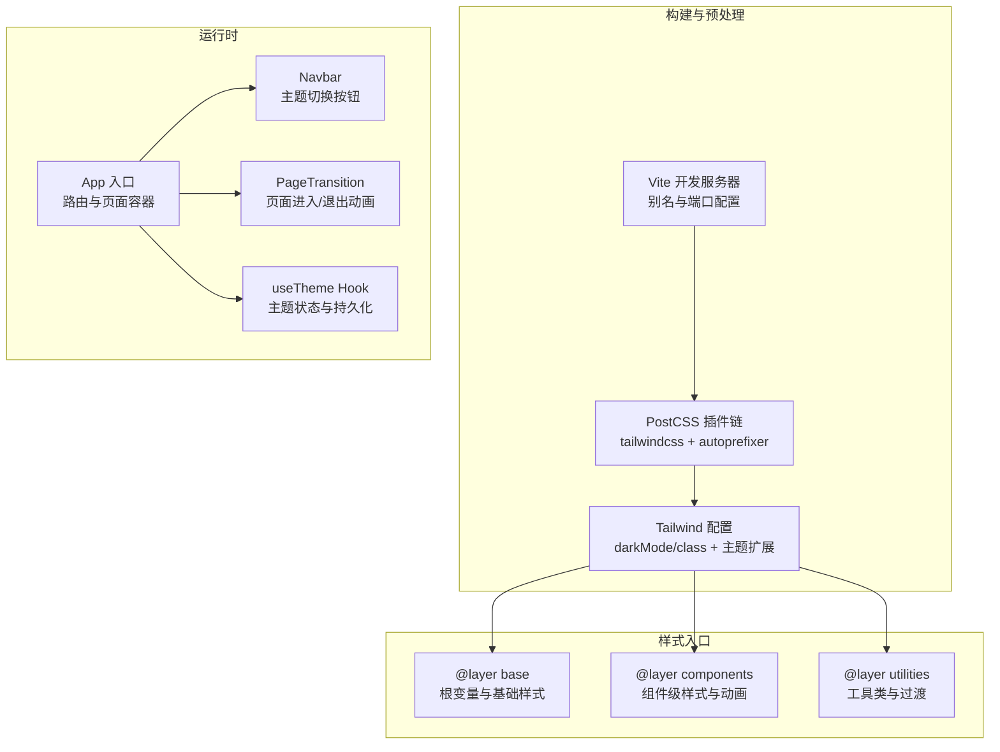
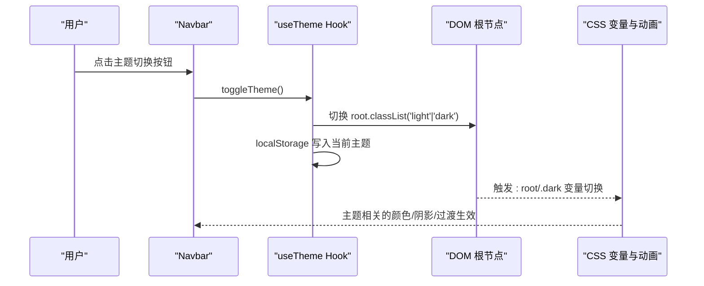
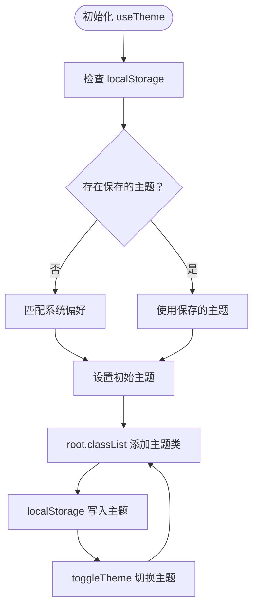
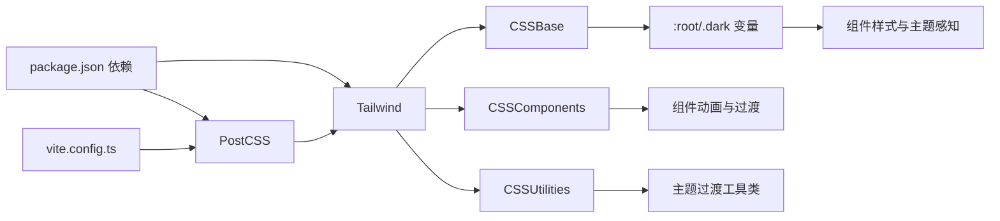

# 样式与主题

<cite>
**本文引用的文件列表**
- [tailwind.config.ts](file://tailwind.config.ts)
- [postcss.config.js](file://postcss.config.js)
- [src/index.css](file://src/index.css)
- [src/hooks/useTheme.ts](file://src/hooks/useTheme.ts)
- [src/App.tsx](file://src/App.tsx)
- [src/main.tsx](file://src/main.tsx)
- [src/components/Navbar.tsx](file://src/components/Navbar.tsx)
- [src/components/PageTransition.tsx](file://src/components/PageTransition.tsx)
- [src/lib/utils.ts](file://src/lib/utils.ts)
- [package.json](file://package.json)
- [vite.config.ts](file://vite.config.ts)
</cite>

## 目录
1. [简介](#简介)
2. [项目结构](#项目结构)
3. [核心组件](#核心组件)
4. [架构总览](#架构总览)
5. [详细组件分析](#详细组件分析)
6. [依赖关系分析](#依赖关系分析)
7. [性能考量](#性能考量)
8. [故障排查指南](#故障排查指南)
9. [结论](#结论)
10. [附录](#附录)

## 简介
本文件面向设计师与开发者，系统化梳理 B02 项目的样式系统与主题管理，涵盖 Tailwind CSS 配置、明暗主题切换机制、CSS 动画与过渡设计、响应式断点策略、字体与图标集成、主题定制与品牌化最佳实践、样式性能优化与打包策略，并提供扩展与维护指南。

## 项目结构
样式系统由以下层次构成：
- 构建与预处理：Vite + PostCSS + Tailwind CSS
- 主题与变量：CSS 自定义属性（HSL 变量）+ Tailwind HSL 主题映射
- 组件层：导航栏、页面过渡等组件使用统一的类名与动画
- 状态层：React Hook 管理主题状态并在 DOM 上应用类名

图表来源
- [vite.config.ts:1-17](file://vite.config.ts#L1-L17)
- [postcss.config.js:1-7](file://postcss.config.js#L1-L7)
- [tailwind.config.ts:1-107](file://tailwind.config.ts#L1-L107)
- [src/index.css:1-234](file://src/index.css#L1-L234)
- [src/App.tsx:1-43](file://src/App.tsx#L1-L43)
- [src/components/Navbar.tsx:1-113](file://src/components/Navbar.tsx#L1-L113)
- [src/components/PageTransition.tsx:1-39](file://src/components/PageTransition.tsx#L1-L39)
- [src/hooks/useTheme.ts:1-28](file://src/hooks/useTheme.ts#L1-L28)

章节来源
- [vite.config.ts:1-17](file://vite.config.ts#L1-L17)
- [postcss.config.js:1-7](file://postcss.config.js#L1-L7)
- [tailwind.config.ts:1-107](file://tailwind.config.ts#L1-L107)
- [src/index.css:1-234](file://src/index.css#L1-L234)
- [src/App.tsx:1-43](file://src/App.tsx#L1-L43)

## 核心组件
- Tailwind 配置：启用 class 模式的暗色模式，扩展字体族、最大宽度、颜色体系、圆角与关键帧动画。
- CSS 变量与主题：在 :root 与 .dark 中定义 HSL 设计令牌，配合 Tailwind 的 hsl(var(--token)) 映射。
- 主题 Hook：读取本地存储或系统偏好，设置根节点类名并持久化。
- 组件样式：导航栏、页面过渡、链接下划线、涟漪效果、阅读进度条、代码块呼吸边框等。
- 字体与图标：通过 @fontsource/inter 引入 Inter 字体，使用 lucide-react 图标库。

章节来源
- [tailwind.config.ts:1-107](file://tailwind.config.ts#L1-L107)
- [src/index.css:1-234](file://src/index.css#L1-L234)
- [src/hooks/useTheme.ts:1-28](file://src/hooks/useTheme.ts#L1-L28)
- [src/components/Navbar.tsx:1-113](file://src/components/Navbar.tsx#L1-L113)
- [src/components/PageTransition.tsx:1-39](file://src/components/PageTransition.tsx#L1-L39)
- [src/main.tsx:1-14](file://src/main.tsx#L1-L14)
- [package.json:11-21](file://package.json#L11-L21)

## 架构总览
样式系统采用“变量驱动 + Tailwind 扩展”的双轨设计：
- 变量层：以 CSS 自定义属性为核心，定义品牌主色、前景/背景、阴影、过渡曲线等设计令牌。
- 组件层：通过 Tailwind 类名与原生 CSS 动画组合，实现一致的交互体验与视觉节奏。
- 运行时：useTheme 在根节点添加 light/dark 类，触发 CSS 变量切换；组件通过类名与动画类实现主题感知。

图表来源
- [src/components/Navbar.tsx:57-63](file://src/components/Navbar.tsx#L57-L63)
- [src/hooks/useTheme.ts:15-24](file://src/hooks/useTheme.ts#L15-L24)
- [src/index.css:41-66](file://src/index.css#L41-L66)

## 详细组件分析

### Tailwind 配置与主题映射
- 暗色模式：使用 class 模式，通过根节点类名控制明暗主题。
- 内容扫描：扫描 HTML 与 TSX 文件，按需生成类名。
- 主题扩展：
  - 字体族：sans 使用 Inter 与系统字体栈。
  - 最大宽度：content 与 wide 用于内容区与宽屏布局。
  - 颜色体系：基于 HSL 变量映射到 Tailwind 主题键值。
  - 圆角：基于 CSS 变量 --radius，提供 lg/md/sm 递减。
  - 关键帧与动画：内置多种动画，如淡入、缩放弹跳、呼吸、进度脉冲、滑入等。

章节来源
- [tailwind.config.ts:3-107](file://tailwind.config.ts#L3-L107)

### CSS 变量与主题切换
- :root 定义浅色主题的 HSL 设计令牌，包括背景、前景、主色、次色、阴影等。
- .dark 定义深色主题的对应令牌，确保对比度与可读性。
- 组件层通过 hsl(var(--token)) 与 var(--transition-*) 实现主题感知与平滑过渡。
- 主题切换通过 useTheme 在根节点添加 light/dark 类，从而激活对应变量块。

章节来源
- [src/index.css:5-66](file://src/index.css#L5-L66)
- [src/index.css:203-211](file://src/index.css#L203-L211)
- [tailwind.config.ts:26-65](file://tailwind.config.ts#L26-L65)

### 主题 Hook 与状态管理
- 初始化：优先读取 localStorage，否则根据系统偏好自动选择。
- 更新：每次切换时移除 light/dark 类并添加当前主题，同时写入 localStorage。
- 组件消费：App 注入 theme 与 toggleTheme，Navbar 展示切换按钮并调用。

图表来源
- [src/hooks/useTheme.ts:5-27](file://src/hooks/useTheme.ts#L5-L27)

章节来源
- [src/hooks/useTheme.ts:1-28](file://src/hooks/useTheme.ts#L1-L28)
- [src/App.tsx:12-32](file://src/App.tsx#L12-L32)

### 导航栏与交互动效
- 主题切换按钮：根据当前主题显示太阳/月亮图标，点击触发 toggleTheme。
- 链接下划线：hover 时从左至右展开，使用 CSS transition。
- 涟漪效果：移动端按下时产生圆形波纹扩散，使用伪元素与过渡。
- 固定导航：滚动后添加模糊背景与阴影，使用 CSS 变量控制阴影强度。
- 移动端菜单：使用 max-h/opacity 控制展开/收起动画。

章节来源
- [src/components/Navbar.tsx:18-113](file://src/components/Navbar.tsx#L18-L113)
- [src/index.css:107-201](file://src/index.css#L107-L201)

### 页面过渡与阅读进度
- 页面过渡：PageTransition 在路由切换时触发出入场/退场动画，结合 CSS 动画实现分步淡入。
- 阅读进度：滚动时计算百分比并更新进度条宽度，使用 CSS transition 实现顺滑变化。

章节来源
- [src/components/PageTransition.tsx:1-39](file://src/components/PageTransition.tsx#L1-L39)
- [src/index.css:161-170](file://src/index.css#L161-L170)

### 字体系统与图标库
- 字体：通过 @fontsource/inter 引入 Inter 字体的 400/500/600/700 字重，Tailwind 中通过 sans 指向该字体栈。
- 图标：使用 lucide-react 提供的图标组件，直接在组件中渲染。

章节来源
- [src/main.tsx:3-6](file://src/main.tsx#L3-L6)
- [tailwind.config.ts:19-21](file://tailwind.config.ts#L19-L21)
- [package.json:12-15](file://package.json#L12-L15)

### 动画与过渡设计原理
- 动画类型：
  - 淡入/淡出：用于内容出现与隐藏，强调层级与节奏。
  - 缩放弹跳：用于强调交互反馈，提升触控体验。
  - 呼吸：用于强调元素（如代码块边框），营造动态氛围。
  - 进度脉冲：用于进度指示，避免静态视觉。
  - 滑入：用于侧边栏或面板的进入。
- 过渡曲线：使用自定义缓动函数（cubic-bezier）与统一的过渡时间，保证动效的一致性与流畅性。
- 工具类：theme-transition 对背景、文字、边框、阴影进行统一过渡，减少重复样式。

章节来源
- [tailwind.config.ts:66-100](file://tailwind.config.ts#L66-L100)
- [src/index.css:203-211](file://src/index.css#L203-L211)

### 响应式设计与断点策略
- 断点使用：项目广泛使用 md/lg 等 Tailwind 断点，配合容器与最大宽度实现桌面优先布局。
- 容器与最大宽度：container 配合 2xl 屏幕阈值，content/wide 最大宽度用于内容区与宽屏展示。
- 移动优先：移动端默认折叠导航，点击菜单展开；桌面端显示完整导航与主题切换按钮。

章节来源
- [tailwind.config.ts:11-17](file://tailwind.config.ts#L11-L17)
- [tailwind.config.ts:22-25](file://tailwind.config.ts#L22-L25)
- [src/components/Navbar.tsx:42-64](file://src/components/Navbar.tsx#L42-L64)

## 依赖关系分析
- 构建链路：Vite -> PostCSS -> Tailwind -> CSS 输出。
- 样式链路：Tailwind 配置 -> CSS 变量 -> 组件类名 -> 动画与过渡。
- 运行时链路：App -> useTheme -> DOM 根节点类名 -> CSS 变量切换 -> 组件样式更新。

图表来源
- [package.json:11-21](file://package.json#L11-L21)
- [postcss.config.js:1-7](file://postcss.config.js#L1-L7)
- [tailwind.config.ts:1-107](file://tailwind.config.ts#L1-L107)
- [src/index.css:1-234](file://src/index.css#L1-234)

章节来源
- [package.json:11-21](file://package.json#L11-L21)
- [postcss.config.js:1-7](file://postcss.config.js#L1-L7)
- [tailwind.config.ts:1-107](file://tailwind.config.ts#L1-L107)
- [src/index.css:1-234](file://src/index.css#L1-L234)

## 性能考量
- 构建与打包
  - 使用 Vite 快速开发与高效打包，PostCSS 仅在开发时处理，生产构建由 Vite 调用。
  - Tailwind 通过 content 扫描按需生成类名，避免无用 CSS。
- 样式体积
  - CSS 变量集中管理，减少重复定义；组件动画与过渡通过工具类复用。
  - 动画数量有限且使用缓动函数，避免过度动画导致性能问题。
- 交互与渲染
  - 页面过渡与滚动进度使用被动事件监听，降低主线程压力。
  - 主题切换仅修改根节点类名，避免大规模重排重绘。

章节来源
- [vite.config.ts:1-17](file://vite.config.ts#L1-L17)
- [tailwind.config.ts:4-8](file://tailwind.config.ts#L4-L8)
- [src/components/PageTransition.tsx:17-18](file://src/components/PageTransition.tsx#L17-L18)
- [src/hooks/useScrollProgress.ts:17-18](file://src/hooks/useScrollProgress.ts#L17-L18)

## 故障排查指南
- 主题未生效
  - 检查根节点是否正确添加 light/dark 类；确认 localStorage 是否被禁用或清空。
  - 确认 CSS 变量块 :root 与 .dark 是否正确加载。
- 动画不生效
  - 检查 Tailwind 动画类是否正确拼写；确认 tailwindcss-animate 插件已安装。
  - 检查组件是否正确引入 CSS 变量与过渡工具类。
- 响应式异常
  - 检查断点前缀是否正确（md/lg 等）；确认容器与最大宽度设置是否符合预期。
- 字体未加载
  - 确认 @fontsource/inter 的导入路径与字重是否正确；检查网络请求与字体回退。

章节来源
- [src/hooks/useTheme.ts:15-20](file://src/hooks/useTheme.ts#L15-L20)
- [src/index.css:41-66](file://src/index.css#L41-L66)
- [tailwind.config.ts:103](file://tailwind.config.ts#L103)
- [src/main.tsx:3-6](file://src/main.tsx#L3-L6)

## 结论
B02 的样式系统以变量驱动与 Tailwind 扩展为核心，结合轻量的 React Hook 实现明暗主题切换，辅以精心设计的动画与过渡，形成一致、可维护且高性能的视觉体验。通过合理的断点策略与字体/图标集成，满足从移动到桌面的全场景需求。建议在后续迭代中持续沉淀设计令牌与组件动效规范，保持风格一致性与可扩展性。

## 附录

### 主题定制与品牌化最佳实践
- 设计令牌
  - 在 :root 中集中定义品牌主色、辅助色、语义色与阴影；在 .dark 中同步调整。
  - 使用 HSL 变量而非固定 RGB/HSL，便于主题切换与无障碍对比度调整。
- 组件动效
  - 为高频交互（按钮、导航、卡片）定义统一的过渡曲线与时间，保持动效一致性。
  - 为强调元素（代码块、进度条）提供呼吸/脉冲等动态效果，避免单调。
- 响应式策略
  - 以桌面优先为主，移动端补充与折叠；合理使用容器与最大宽度，避免内容过宽。
  - 使用 md/lg 等断点，配合语义化类名，减少重复样式。

### 样式扩展与维护指南
- 新增组件样式
  - 优先使用 Tailwind 工具类；必要时在 @layer components 中新增组件级样式。
  - 复用 theme-transition 与现有动画类，避免重复定义。
- 主题扩展
  - 如需新增语义色（如 success/warning/danger），在 CSS 变量与 Tailwind 颜色扩展中同步添加。
  - 保持 :root 与 .dark 的对称性，确保切换前后视觉一致。
- 动画与过渡
  - 动画命名遵循语义化（如 fade-in-up、breathe、progress-pulse），便于团队协作与维护。
  - 控制动画数量与复杂度，避免在低端设备上造成卡顿。