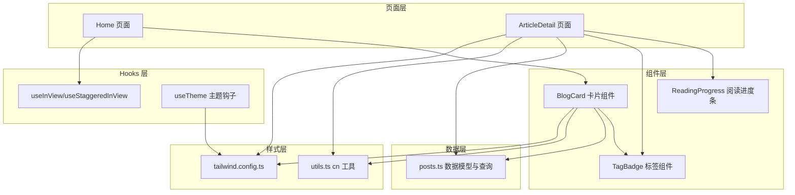
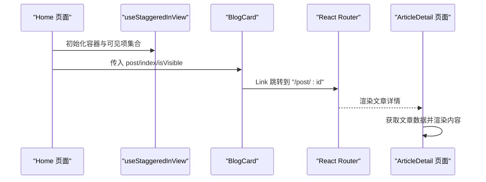
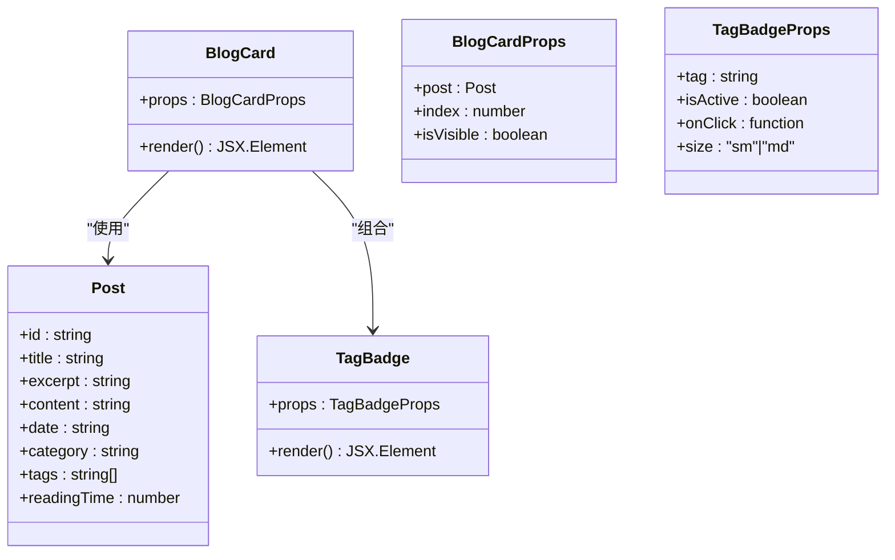
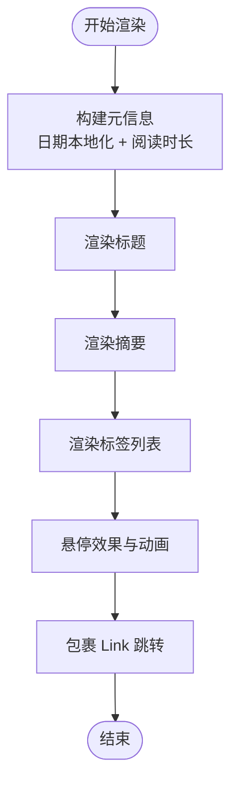
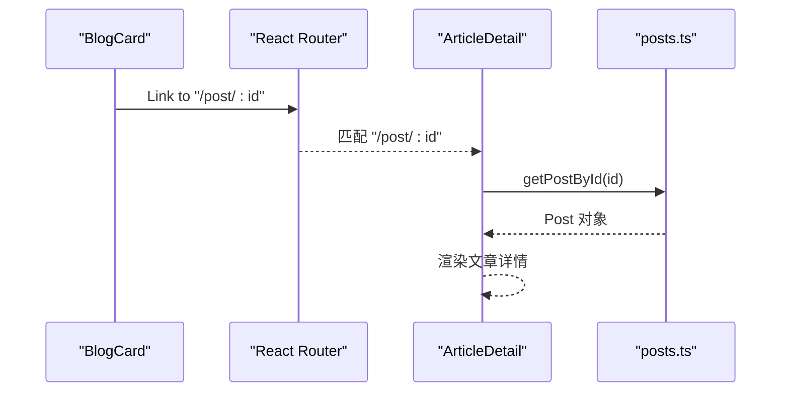
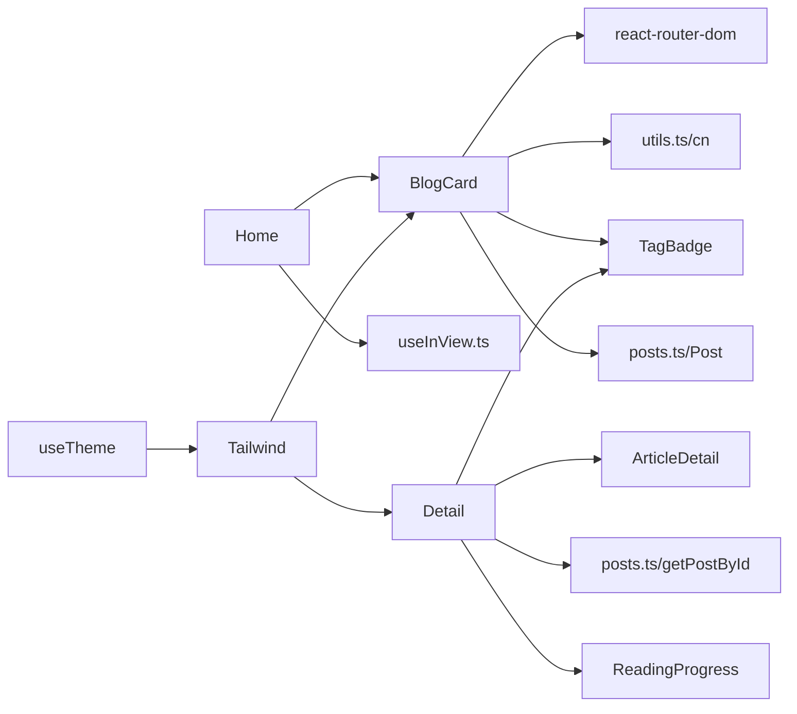

# 博客卡片组件 (BlogCard)

<cite>
**本文引用的文件**
- [BlogCard.tsx](file://src/components/BlogCard.tsx)
- [posts.ts](file://src/data/posts.ts)
- [Home.tsx](file://src/pages/Home.tsx)
- [ArticleDetail.tsx](file://src/pages/ArticleDetail.tsx)
- [App.tsx](file://src/App.tsx)
- [TagBadge.tsx](file://src/components/TagBadge.tsx)
- [useInView.ts](file://src/hooks/useInView.ts)
- [utils.ts](file://src/lib/utils.ts)
- [tailwind.config.ts](file://tailwind.config.ts)
- [ReadingProgress.tsx](file://src/components/ReadingProgress.tsx)
- [useTheme.ts](file://src/hooks/useTheme.ts)
- [package.json](file://package.json)
</cite>

## 目录
1. [简介](#简介)
2. [项目结构](#项目结构)
3. [核心组件](#核心组件)
4. [架构总览](#架构总览)
5. [详细组件分析](#详细组件分析)
6. [依赖分析](#依赖分析)
7. [性能考虑](#性能考虑)
8. [故障排除指南](#故障排除指南)
9. [结论](#结论)
10. [附录](#附录)

## 简介
本文件面向“博客卡片组件（BlogCard）”的完整技术文档，涵盖设计理念、实现细节、数据结构、交互行为、响应式布局与视觉层次、可定制样式与主题适配、路由集成与文章详情跳转等内容。文档同时提供使用示例与集成方法，帮助开发者快速理解并扩展该组件。

## 项目结构
博客卡片组件位于组件层，配合页面层、数据层、Hooks 层与样式配置共同构成完整的博客展示体系：
- 组件层：BlogCard、TagBadge、ReadingProgress 等
- 页面层：Home、ArticleDetail、About、Categories
- 数据层：posts.ts 提供文章数据模型与查询函数
- Hooks 层：useInView、useTheme 等
- 样式层：Tailwind 配置与工具函数 cn

图表来源
- [Home.tsx:1-34](file://src/pages/Home.tsx#L1-L34)
- [ArticleDetail.tsx:1-201](file://src/pages/ArticleDetail.tsx#L1-L201)
- [BlogCard.tsx:1-66](file://src/components/BlogCard.tsx#L1-L66)
- [TagBadge.tsx:1-28](file://src/components/TagBadge.tsx#L1-L28)
- [useInView.ts:1-76](file://src/hooks/useInView.ts#L1-L76)
- [useTheme.ts:1-28](file://src/hooks/useTheme.ts#L1-L28)
- [posts.ts:1-382](file://src/data/posts.ts#L1-L382)
- [tailwind.config.ts:1-107](file://tailwind.config.ts#L1-L107)
- [utils.ts:1-7](file://src/lib/utils.ts#L1-L7)

章节来源
- [Home.tsx:1-34](file://src/pages/Home.tsx#L1-L34)
- [BlogCard.tsx:1-66](file://src/components/BlogCard.tsx#L1-L66)
- [posts.ts:1-382](file://src/data/posts.ts#L1-L382)
- [tailwind.config.ts:1-107](file://tailwind.config.ts#L1-L107)

## 核心组件
本节聚焦 BlogCard 组件的 Props 接口、数据结构要求、渲染流程与交互行为。

- Props 接口定义
  - post: Post 对象，包含文章标识、标题、摘要、正文、发布日期、分类、标签数组、阅读时长等字段
  - index: number，用于控制入场动画的延时
  - isVisible: boolean，控制卡片可见性与动画触发

- 数据结构要求
  - Post 接口字段严格对应数据源 posts.ts，确保渲染时不会出现字段缺失
  - tags 为字符串数组，将映射为 TagBadge 列表
  - date 字符串遵循 ISO 8601 格式，便于本地化格式化

- 渲染要点
  - 使用 Link 包裹整个卡片，点击后跳转至文章详情页
  - meta 信息区展示本地化后的日期与阅读时长
  - 标题、摘要、标签按语义层级组织，保证可读性与可访问性
  - hover 效果与 scale 动画增强交互反馈

- 交互行为
  - 卡片悬停时放大、阴影与背景色变化
  - 通过 useStaggeredInView 控制入场动画延迟，形成“阶梯式”出现效果

章节来源
- [BlogCard.tsx:6-10](file://src/components/BlogCard.tsx#L6-L10)
- [BlogCard.tsx:12-65](file://src/components/BlogCard.tsx#L12-L65)
- [posts.ts:1-10](file://src/data/posts.ts#L1-L10)
- [useInView.ts:39-75](file://src/hooks/useInView.ts#L39-L75)

## 架构总览
BlogCard 在页面中的位置与数据流向如下：

图表来源
- [Home.tsx:5-33](file://src/pages/Home.tsx#L5-L33)
- [useInView.ts:39-75](file://src/hooks/useInView.ts#L39-L75)
- [BlogCard.tsx:22-30](file://src/components/BlogCard.tsx#L22-L30)
- [App.tsx:21-24](file://src/App.tsx#L21-L24)
- [ArticleDetail.tsx:118-200](file://src/pages/ArticleDetail.tsx#L118-L200)

## 详细组件分析

### BlogCard 组件类图

图表来源
- [BlogCard.tsx:6-10](file://src/components/BlogCard.tsx#L6-L10)
- [BlogCard.tsx:55-60](file://src/components/BlogCard.tsx#L55-L60)
- [posts.ts:1-10](file://src/data/posts.ts#L1-L10)
- [TagBadge.tsx:3-8](file://src/components/TagBadge.tsx#L3-L8)

章节来源
- [BlogCard.tsx:1-66](file://src/components/BlogCard.tsx#L1-L66)
- [TagBadge.tsx:1-28](file://src/components/TagBadge.tsx#L1-L28)
- [posts.ts:1-382](file://src/data/posts.ts#L1-L382)

### BlogCard 渲染流程与数据流

图表来源
- [BlogCard.tsx:33-43](file://src/components/BlogCard.tsx#L33-L43)
- [BlogCard.tsx:46-53](file://src/components/BlogCard.tsx#L46-L53)
- [BlogCard.tsx:55-60](file://src/components/BlogCard.tsx#L55-L60)
- [BlogCard.tsx:22-30](file://src/components/BlogCard.tsx#L22-L30)

章节来源
- [BlogCard.tsx:12-65](file://src/components/BlogCard.tsx#L12-L65)

### 路由集成与文章详情跳转
- 路由配置
  - 根路径 "/" 映射到 Home 页面
  - 文章详情路径 "/post/:id" 映射到 ArticleDetail 页面
- 卡片跳转
  - BlogCard 内部使用 Link 组件，to 属性指向 "/post/${post.id}"
- 文章详情渲染
  - ArticleDetail 通过 useParams 获取 id，调用 getPostById 查询文章
  - 渲染标题、元信息、标签与内容区域，并提供返回首页的导航

图表来源
- [BlogCard.tsx:22-23](file://src/components/BlogCard.tsx#L22-L23)
- [App.tsx:21-24](file://src/App.tsx#L21-L24)
- [ArticleDetail.tsx:118-122](file://src/pages/ArticleDetail.tsx#L118-L122)
- [posts.ts:361-363](file://src/data/posts.ts#L361-L363)

章节来源
- [App.tsx:1-43](file://src/App.tsx#L1-L43)
- [ArticleDetail.tsx:1-201](file://src/pages/ArticleDetail.tsx#L1-L201)
- [posts.ts:361-363](file://src/data/posts.ts#L361-L363)

### 响应式布局与视觉层次
- 布局策略
  - 使用 Tailwind 的断点类实现移动端到桌面端的自适应
  - 卡片容器采用圆角、边框与内边距，营造卡片式视觉层次
- 视觉反馈
  - 悬停时的 scale、阴影与背景色变化，提供明确的交互提示
  - 动画延迟通过 index 控制，形成阶梯式入场效果
- 可访问性
  - meta 信息使用 time 元素与本地化日期格式
  - 标题与摘要具备合适的对比度与行高

章节来源
- [BlogCard.tsx:24-30](file://src/components/BlogCard.tsx#L24-L30)
- [BlogCard.tsx:16-20](file://src/components/BlogCard.tsx#L16-L20)
- [tailwind.config.ts:18-101](file://tailwind.config.ts#L18-L101)

### 可定制样式选项与主题适配
- 样式工具
  - cn 工具函数合并与去重类名，避免冲突
- 主题适配
  - useTheme 钩子持久化主题并在 DOM 上设置类名
  - Tailwind 配置支持暗色模式类，颜色变量通过 CSS 变量注入
- 组件样式约定
  - 卡片 hover 效果使用 CSS 变量 --shadow-card-hover 与主题色系
  - TagBadge 支持尺寸与激活态样式，便于统一风格

章节来源
- [utils.ts:4-6](file://src/lib/utils.ts#L4-L6)
- [useTheme.ts:15-24](file://src/hooks/useTheme.ts#L15-L24)
- [tailwind.config.ts:26-60](file://tailwind.config.ts#L26-L60)
- [TagBadge.tsx:15-22](file://src/components/TagBadge.tsx#L15-L22)

### 使用示例与集成方法
- 在 Home 页面中使用 BlogCard
  - 通过 useStaggeredInView 获取容器引用与可见项集合
  - 遍历 posts 渲染 BlogCard，传入 post、index 与 isVisible
- 在文章详情页中展示标签
  - ArticleDetail 页面直接复用 TagBadge 渲染文章标签
- 自定义样式
  - 可通过覆盖 CSS 变量或新增 Tailwind 扩展来自定义阴影、圆角与过渡效果

章节来源
- [Home.tsx:5-33](file://src/pages/Home.tsx#L5-L33)
- [ArticleDetail.tsx:169-173](file://src/pages/ArticleDetail.tsx#L169-L173)
- [tailwind.config.ts:66-100](file://tailwind.config.ts#L66-L100)

## 依赖分析
- 组件依赖
  - BlogCard 依赖 Link（路由）、cn（样式合并）、TagBadge（标签）、Post 类型（数据）
- 页面依赖
  - Home 依赖 useStaggeredInView 与 posts 数据
  - ArticleDetail 依赖 useParams、getPostById、ReadingProgress、TagBadge
- 样式依赖
  - Tailwind 配置提供颜色、圆角、动画与容器宽度等扩展
- 外部库
  - react-router-dom 提供路由能力
  - lucide-react 提供图标
  - tailwindcss-animate 提供动画插件

图表来源
- [BlogCard.tsx:1-3](file://src/components/BlogCard.tsx#L1-L3)
- [Home.tsx:1-3](file://src/pages/Home.tsx#L1-L3)
- [ArticleDetail.tsx:1-7](file://src/pages/ArticleDetail.tsx#L1-L7)
- [useInView.ts:1-76](file://src/hooks/useInView.ts#L1-L76)
- [tailwind.config.ts:1-107](file://tailwind.config.ts#L1-L107)
- [useTheme.ts:1-28](file://src/hooks/useTheme.ts#L1-L28)

章节来源
- [package.json:11-21](file://package.json#L11-L21)
- [BlogCard.tsx:1-66](file://src/components/BlogCard.tsx#L1-L66)
- [Home.tsx:1-34](file://src/pages/Home.tsx#L1-L34)
- [ArticleDetail.tsx:1-201](file://src/pages/ArticleDetail.tsx#L1-L201)

## 性能考虑
- 动画与滚动
  - 使用 IntersectionObserver 控制入场动画，避免不必要的重排
  - 阅读进度条仅在有内容时渲染，减少空节点
- 渲染优化
  - BlogCard 通过 isVisible 控制可见性，减少非可视区域的渲染压力
  - 标签渲染使用 map，避免重复计算
- 样式合并
  - cn 工具函数合并类名，减少无效样式叠加

章节来源
- [useInView.ts:14-37](file://src/hooks/useInView.ts#L14-L37)
- [useInView.ts:51-72](file://src/hooks/useInView.ts#L51-L72)
- [ReadingProgress.tsx:3-18](file://src/components/ReadingProgress.tsx#L3-L18)
- [BlogCard.tsx:16-19](file://src/components/BlogCard.tsx#L16-L19)
- [utils.ts:4-6](file://src/lib/utils.ts#L4-L6)

## 故障排除指南
- 文章详情无法加载
  - 检查路由参数 id 是否存在，确认 getPostById 是否返回有效数据
  - 若无匹配文章，页面会显示“文章未找到”，并提供返回首页的链接
- 卡片不显示或动画异常
  - 确认 useStaggeredInView 的容器引用与 data-index 属性是否正确设置
  - 检查 isVisible 状态是否按预期更新
- 样式不生效
  - 确认 Tailwind 配置已正确扫描源文件
  - 检查 cn 合并类名是否导致样式冲突

章节来源
- [ArticleDetail.tsx:124-138](file://src/pages/ArticleDetail.tsx#L124-L138)
- [useInView.ts:55-72](file://src/hooks/useInView.ts#L55-L72)
- [BlogCard.tsx:14-20](file://src/components/BlogCard.tsx#L14-L20)
- [tailwind.config.ts:5-8](file://tailwind.config.ts#L5-L8)

## 结论
BlogCard 组件以简洁的数据结构与清晰的渲染流程为核心，结合路由系统与主题钩子，实现了从列表到详情的完整文章浏览体验。其响应式布局与动画效果提升了交互质量，同时通过 cn 工具与 Tailwind 配置提供了良好的可定制性。建议在扩展时保持数据模型的一致性与样式命名的规范性，以确保组件在不同页面与主题下的稳定表现。

## 附录
- 数据模型字段说明
  - id: 文章唯一标识，用于路由跳转
  - title: 文章标题
  - excerpt: 文章摘要
  - content: 文章正文（Markdown 片段）
  - date: 发布日期（ISO 8601 字符串）
  - category: 文章分类
  - tags: 标签数组
  - readingTime: 阅读时长（分钟）

章节来源
- [posts.ts:1-10](file://src/data/posts.ts#L1-L10)