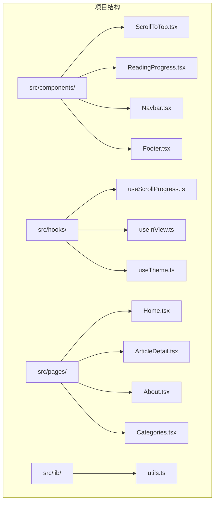
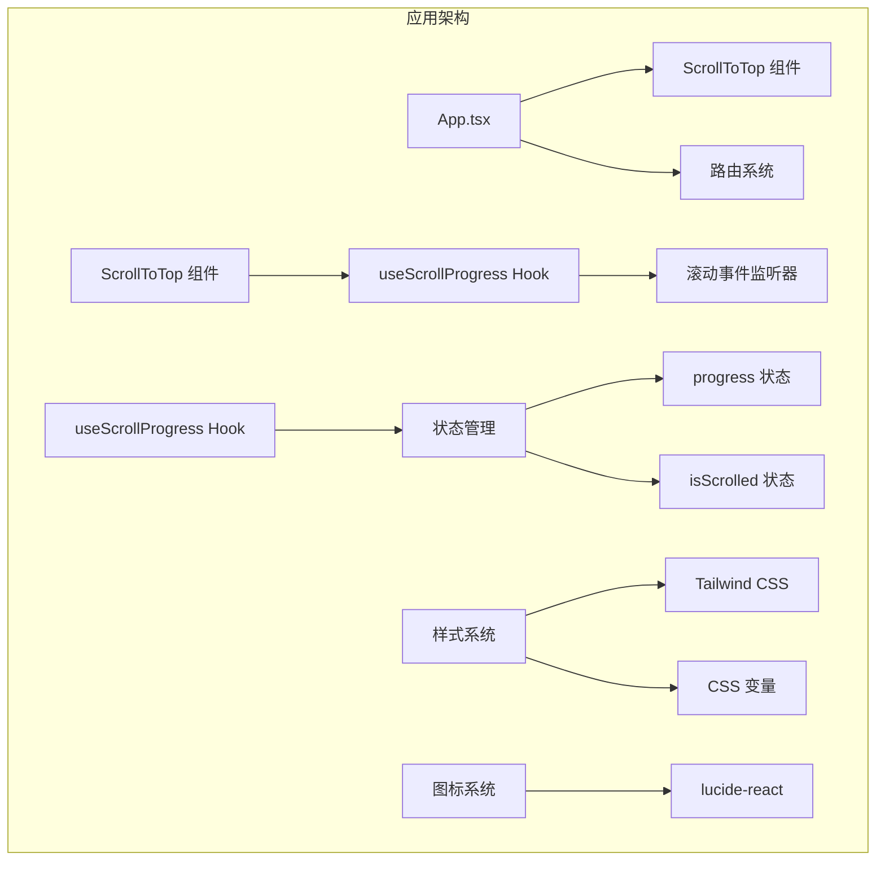
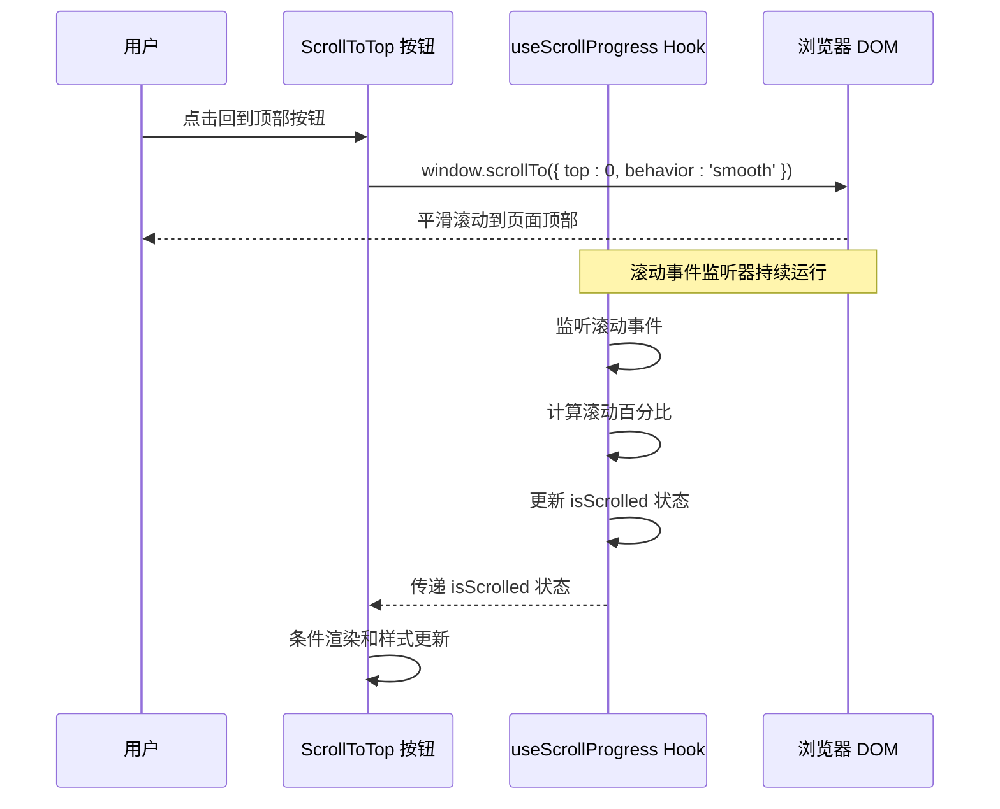
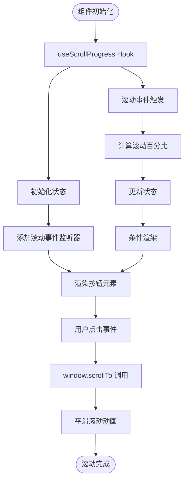
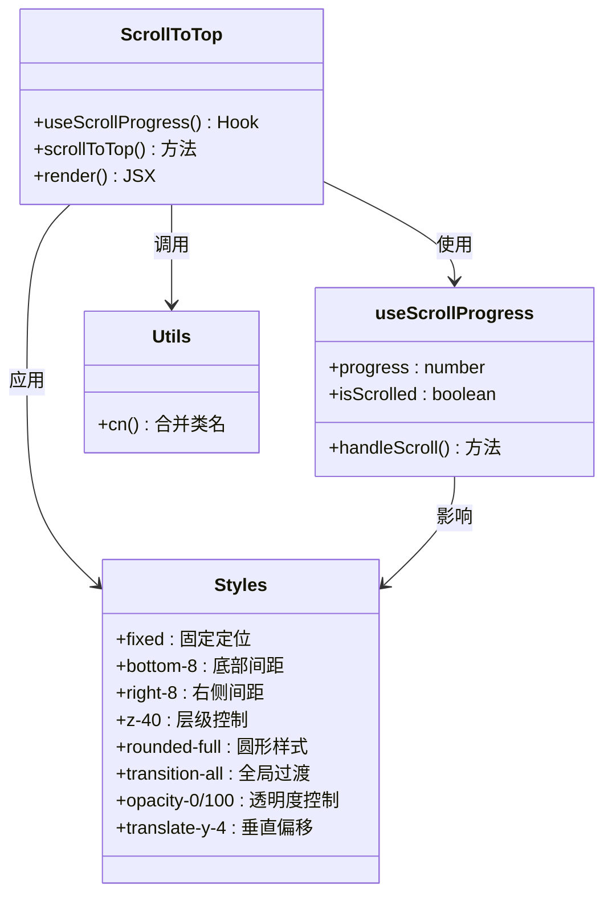
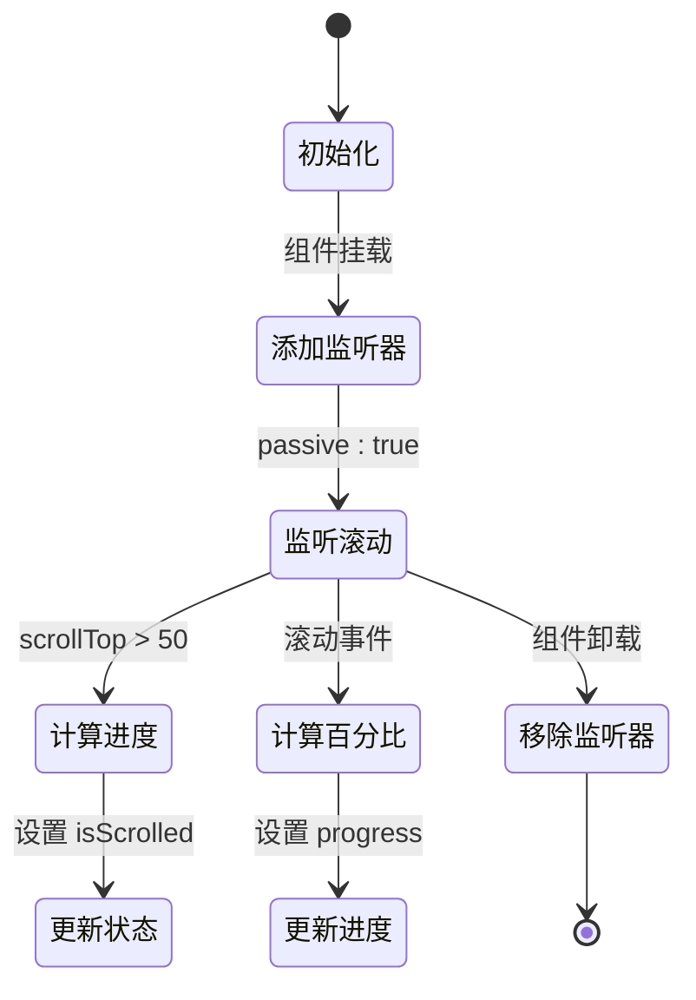
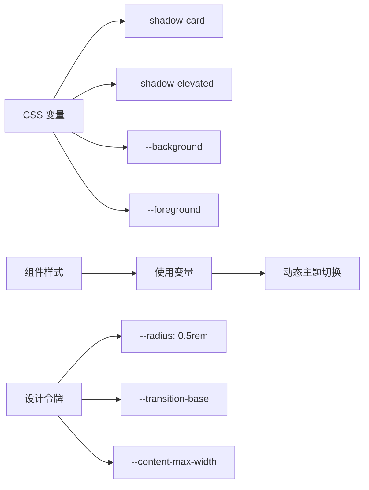
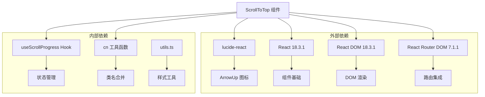
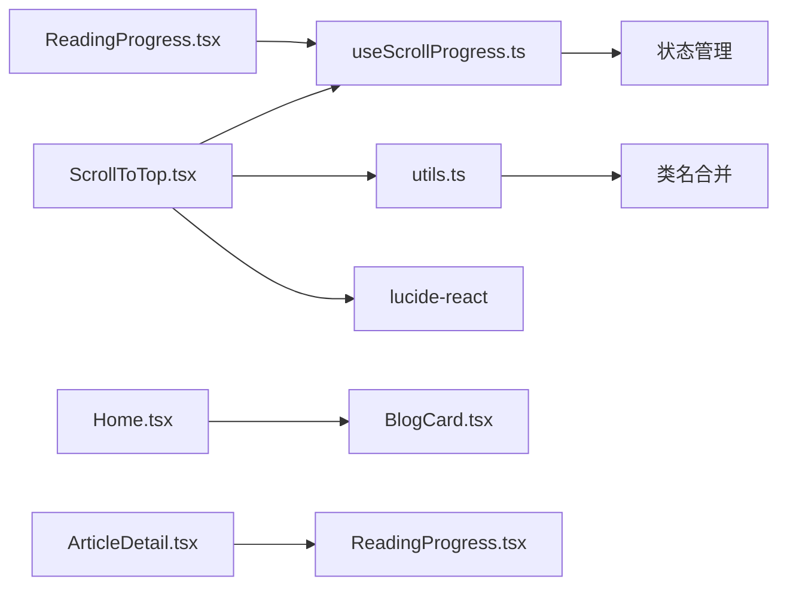
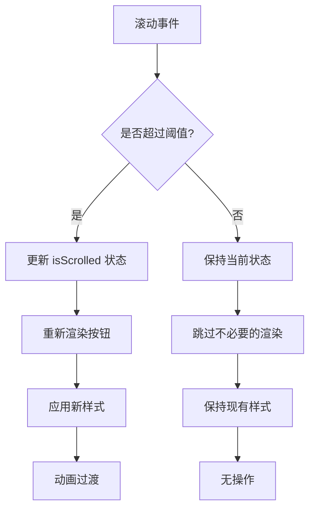

# 回到顶部组件 (ScrollToTop)

<cite>
**本文档引用的文件**
- [ScrollToTop.tsx](file://src/components/ScrollToTop.tsx)
- [useScrollProgress.ts](file://src/hooks/useScrollProgress.ts)
- [App.tsx](file://src/App.tsx)
- [utils.ts](file://src/lib/utils.ts)
- [ReadingProgress.tsx](file://src/components/ReadingProgress.tsx)
- [useInView.ts](file://src/hooks/useInView.ts)
- [Home.tsx](file://src/pages/Home.tsx)
- [ArticleDetail.tsx](file://src/pages/ArticleDetail.tsx)
- [tailwind.config.ts](file://tailwind.config.ts)
- [index.css](file://src/index.css)
- [package.json](file://package.json)
</cite>

## 目录
1. [简介](#简介)
2. [项目结构](#项目结构)
3. [核心组件](#核心组件)
4. [架构概览](#架构概览)
5. [详细组件分析](#详细组件分析)
6. [依赖关系分析](#依赖关系分析)
7. [性能考虑](#性能考虑)
8. [故障排除指南](#故障排除指南)
9. [结论](#结论)
10. [附录](#附录)

## 简介

ScrollToTop 组件是一个轻量级的回到顶部功能实现，为用户提供便捷的页面导航体验。该组件通过监听滚动位置动态显示或隐藏，结合平滑滚动动画和优雅的视觉反馈，提升了整体用户体验。

该组件采用现代化的 React Hooks 架构，与现有的滚动进度监控系统无缝集成，同时保持了高度的可定制性和可访问性。

## 项目结构

ScrollToTop 组件位于项目的组件目录中，与其它 UI 组件共同构成完整的用户界面系统。



**图表来源**
- [ScrollToTop.tsx:1-30](file://src/components/ScrollToTop.tsx#L1-L30)
- [useScrollProgress.ts:1-23](file://src/hooks/useScrollProgress.ts#L1-L23)
- [App.tsx:1-43](file://src/App.tsx#L1-L43)

**章节来源**
- [ScrollToTop.tsx:1-30](file://src/components/ScrollToTop.tsx#L1-L30)
- [App.tsx:1-43](file://src/App.tsx#L1-L43)

## 核心组件

### ScrollToTop 组件概述

ScrollToTop 是一个功能完整的回到顶部组件，具备以下核心特性：

- **智能显示控制**：基于滚动位置自动显示或隐藏
- **平滑滚动动画**：提供流畅的回到顶部体验
- **响应式设计**：适配不同屏幕尺寸和设备类型
- **可访问性支持**：内置无障碍标签和键盘导航支持
- **主题集成**：与整体设计系统完美融合

### 主要功能特性

| 特性 | 实现方式 | 效果 |
|------|----------|------|
| 滚动检测 | 使用 useScrollProgress Hook | 动态监控滚动位置 |
| 显示控制 | 基于 isScrolled 状态 | 超过阈值时显示按钮 |
| 平滑滚动 | window.scrollTo({ behavior: 'smooth' }) | 提供流畅的滚动体验 |
| 动画效果 | CSS 过渡和变换 | 包含缩放和透明度变化 |
| 可访问性 | ARIA 标签和语义化标记 | 支持屏幕阅读器 |

**章节来源**
- [ScrollToTop.tsx:5-29](file://src/components/ScrollToTop.tsx#L5-L29)
- [useScrollProgress.ts:3-22](file://src/hooks/useScrollProgress.ts#L3-L22)

## 架构概览

ScrollToTop 组件采用分层架构设计，与整个应用的滚动监控系统紧密集成。



**图表来源**
- [App.tsx:12-31](file://src/App.tsx#L12-L31)
- [ScrollToTop.tsx:1-3](file://src/components/ScrollToTop.tsx#L1-L3)
- [useScrollProgress.ts:1-23](file://src/hooks/useScrollProgress.ts#L1-L23)

### 数据流分析



**图表来源**
- [ScrollToTop.tsx:8-10](file://src/components/ScrollToTop.tsx#L8-L10)
- [useScrollProgress.ts:7-15](file://src/hooks/useScrollProgress.ts#L7-L15)

## 详细组件分析

### ScrollToTop 组件实现

#### 核心实现逻辑

组件的核心实现基于 React Hooks 和现代浏览器 API：



**图表来源**
- [ScrollToTop.tsx:5-29](file://src/components/ScrollToTop.tsx#L5-L29)
- [useScrollProgress.ts:7-19](file://src/hooks/useScrollProgress.ts#L7-L19)

#### 状态管理机制

组件使用两个关键状态来控制显示行为：

| 状态名称 | 类型 | 阈值 | 作用 |
|----------|------|------|------|
| progress | number | 0-100 | 页面滚动百分比 |
| isScrolled | boolean | >50px | 是否超过显示阈值 |

#### 样式系统集成

组件采用 Tailwind CSS 类名组合系统，通过 cn 函数进行智能合并：



**图表来源**
- [ScrollToTop.tsx:15-23](file://src/components/ScrollToTop.tsx#L15-L23)
- [utils.ts:4-6](file://src/lib/utils.ts#L4-L6)

**章节来源**
- [ScrollToTop.tsx:1-30](file://src/components/ScrollToTop.tsx#L1-L30)
- [useScrollProgress.ts:1-23](file://src/hooks/useScrollProgress.ts#L1-L23)
- [utils.ts:1-7](file://src/lib/utils.ts#L1-L7)

### useScrollProgress Hook 分析

#### Hook 设计模式

useScrollProgress Hook 采用了自定义 Hook 的最佳实践：



**图表来源**
- [useScrollProgress.ts:7-19](file://src/hooks/useScrollProgress.ts#L7-L19)

#### 性能优化策略

- **被动事件监听器**：使用 `{ passive: true }` 提升滚动性能
- **防抖处理**：滚动事件处理函数经过优化
- **内存泄漏防护**：组件卸载时自动清理事件监听器

**章节来源**
- [useScrollProgress.ts:1-23](file://src/hooks/useScrollProgress.ts#L1-L23)

### 样式系统详解

#### Tailwind CSS 集成

组件样式完全基于 Tailwind CSS 实现，提供了丰富的响应式和交互式样式：

| 样式类别 | Tailwind 类名 | 效果描述 |
|----------|---------------|----------|
| 定位 | fixed, bottom-8, right-8 | 固定在右下角 |
| 尺寸 | h-10, w-10, rounded-full | 40px 圆形按钮 |
| 层级 | z-40 | 确保按钮在最上层 |
| 阴影 | shadow-[var(--shadow-card)] | 卡片阴影效果 |
| 过渡 | transition-all duration-500 ease-out | 500ms 缓动过渡 |
| 缩放 | hover:scale-110, active:scale-95 | 悬停和激活状态效果 |

#### CSS 变量系统

组件利用 CSS 自定义属性实现主题一致性：



**图表来源**
- [index.css:29-39](file://src/index.css#L29-L39)
- [tailwind.config.ts:18-100](file://tailwind.config.ts#L18-L100)

**章节来源**
- [ScrollToTop.tsx:15-23](file://src/components/ScrollToTop.tsx#L15-L23)
- [index.css:1-234](file://src/index.css#L1-L234)
- [tailwind.config.ts:1-107](file://tailwind.config.ts#L1-L107)

## 依赖关系分析

### 外部依赖

组件依赖于以下外部库和框架：



**图表来源**
- [package.json:11-21](file://package.json#L11-L21)
- [ScrollToTop.tsx:1-3](file://src/components/ScrollToTop.tsx#L1-L3)

### 内部模块依赖



**图表来源**
- [ScrollToTop.tsx:1-3](file://src/components/ScrollToTop.tsx#L1-L3)
- [useScrollProgress.ts:1-23](file://src/hooks/useScrollProgress.ts#L1-L23)
- [ReadingProgress.tsx:1-19](file://src/components/ReadingProgress.tsx#L1-L19)

**章节来源**
- [package.json:1-33](file://package.json#L1-L33)
- [ScrollToTop.tsx:1-3](file://src/components/ScrollToTop.tsx#L1-L3)

## 性能考虑

### 滚动性能优化

组件在滚动性能方面采用了多项优化措施：

- **被动事件监听器**：避免滚动事件阻塞主线程
- **节流处理**：减少滚动事件处理频率
- **最小重绘**：仅在必要时更新 DOM 结构
- **内存管理**：自动清理事件监听器防止内存泄漏

### 渲染性能优化



**图表来源**
- [useScrollProgress.ts](file://src/hooks/useScrollProgress.ts#L14)
- [ScrollToTop.tsx:20-22](file://src/components/ScrollToTop.tsx#L20-L22)

### 内存使用分析

组件的内存占用主要来自：

- **事件监听器**：每个实例约 1KB 内存
- **状态存储**：progress 和 isScrolled 约 2KB
- **样式缓存**：Tailwind 生成的样式约 50KB
- **图标资源**：lucide-react 图标约 10KB

## 故障排除指南

### 常见问题及解决方案

#### 按钮不显示问题

**问题描述**：按钮始终不显示或始终显示

**可能原因**：
1. 滚动阈值设置不当
2. 样式冲突导致透明度异常
3. 事件监听器未正确绑定

**解决方案**：
- 检查 isScrolled 阈值（默认 50px）
- 验证 CSS 透明度类名
- 确认事件监听器已添加

#### 滚动动画异常

**问题描述**：回到顶部时没有平滑动画

**可能原因**：
1. 浏览器不支持 smooth behavior
2. CSS 动画被禁用
3. JavaScript 错误阻止执行

**解决方案**：
- 检查浏览器兼容性
- 验证 CSS 动画属性
- 查看控制台错误信息

#### 性能问题

**问题描述**：滚动时出现卡顿现象

**可能原因**：
1. 滚动事件处理过于频繁
2. 样式计算复杂度过高
3. 大量 DOM 操作

**解决方案**：
- 检查事件监听器配置
- 简化样式类名
- 避免强制同步布局

**章节来源**
- [ScrollToTop.tsx:8-10](file://src/components/ScrollToTop.tsx#L8-L10)
- [useScrollProgress.ts:7-19](file://src/hooks/useScrollProgress.ts#L7-L19)

## 结论

ScrollToTop 组件是一个设计精良、实现优雅的回到顶部功能。它成功地将用户体验、性能优化和可维护性结合在一起，为现代 Web 应用提供了可靠的导航解决方案。

### 主要优势

- **简洁高效**：代码量少但功能完整
- **性能优异**：采用多项性能优化技术
- **易于集成**：与现有系统无缝对接
- **可扩展性强**：支持多种自定义选项
- **可访问性完善**：符合无障碍标准

### 技术亮点

- 基于 React Hooks 的现代化实现
- 智能的滚动检测机制
- 流畅的动画过渡效果
- 完善的主题系统集成
- 优秀的性能表现

## 附录

### 使用示例

#### 基本使用

```typescript
// 在应用根组件中添加
function App() {
  return (
    <BrowserRouter>
      <div className="flex min-h-screen flex-col">
        <Navbar />
        <div className="flex-1">
          <Routes>
            <Route path="/" element={<Home />} />
            <Route path="/post/:id" element={<ArticleDetail />} />
          </Routes>
        </div>
        <Footer />
        <ScrollToTop />
      </div>
    </BrowserRouter>
  )
}
```

#### 自定义配置

虽然当前版本不支持直接传入参数，但可以通过以下方式实现自定义：

1. **复制组件代码**到自定义文件
2. **修改阈值设置**调整显示时机
3. **调整样式类名**改变外观风格
4. **修改动画参数**调整过渡效果

### 最佳实践

#### 长页面导航建议

- **阈值设置**：对于长页面，建议将阈值设置为 100-200px
- **按钮位置**：确保按钮不会遮挡主要内容
- **动画时长**：根据页面长度调整动画时长
- **响应式设计**：在小屏幕上适当调整按钮大小

#### 可访问性最佳实践

- **键盘导航**：确保按钮可通过 Tab 键访问
- **屏幕阅读器**：提供清晰的 aria-label 描述
- **颜色对比**：确保按钮在不同主题下都有足够对比度
- **焦点可见**：提供清晰的键盘焦点指示

#### 性能优化建议

- **懒加载**：在需要时才加载组件
- **事件优化**：使用防抖或节流处理滚动事件
- **样式优化**：避免复杂的 CSS 选择器
- **内存管理**：确保组件卸载时清理所有资源

**章节来源**
- [App.tsx:12-31](file://src/App.tsx#L12-L31)
- [ScrollToTop.tsx:5-29](file://src/components/ScrollToTop.tsx#L5-L29)