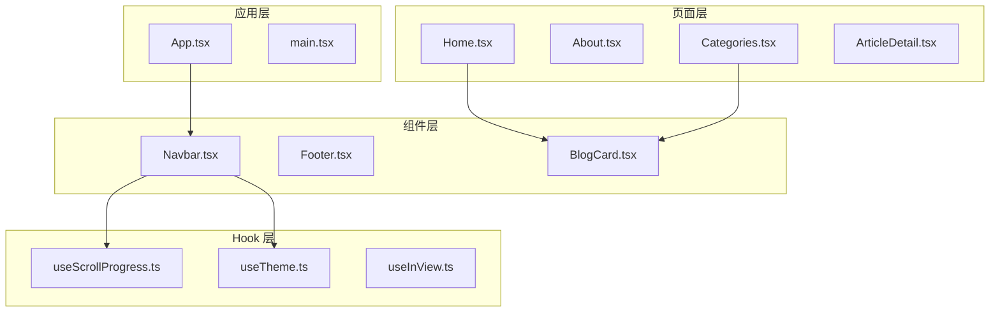
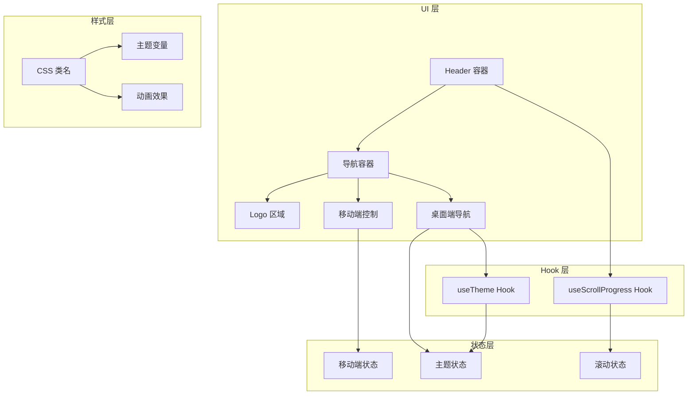
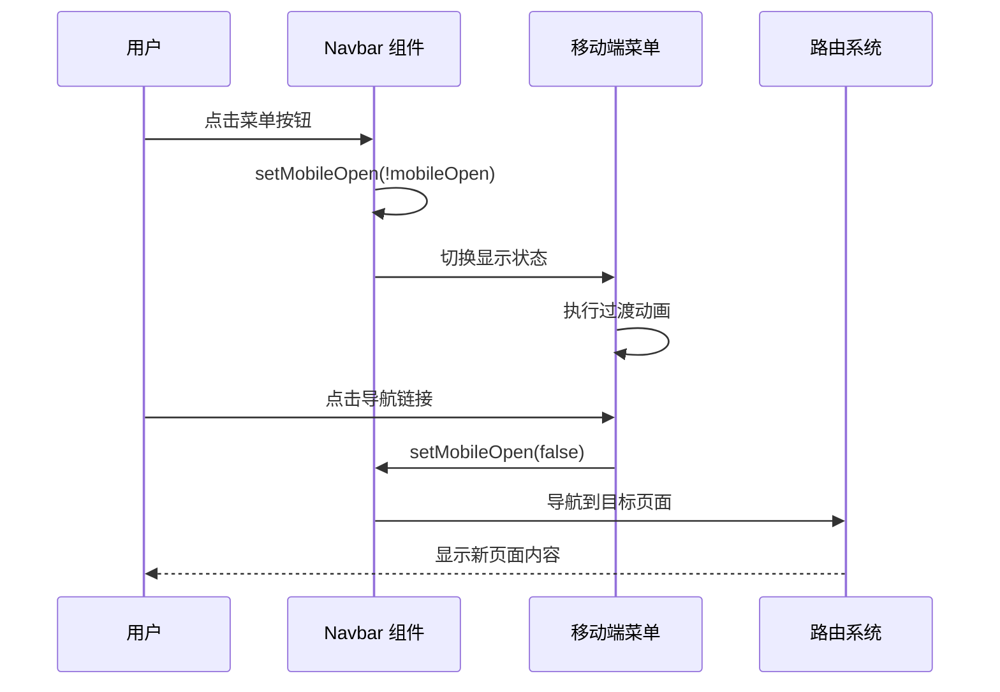
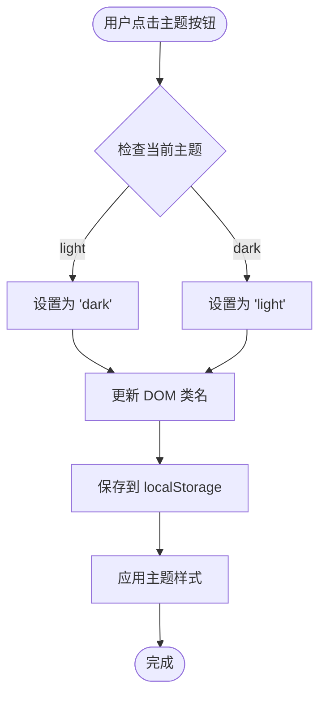
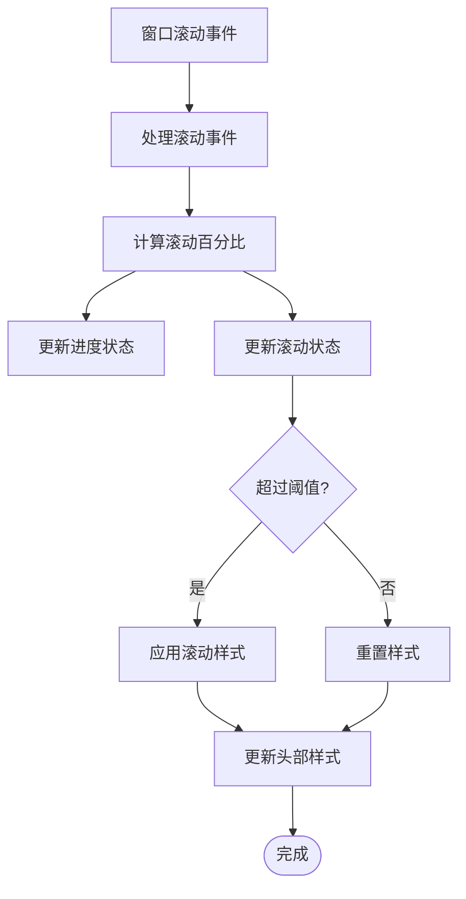
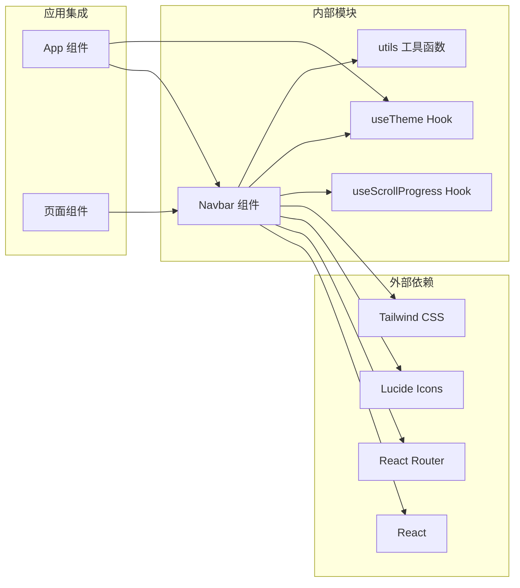

# 导航栏组件 (Navbar)

<cite>
**本文档引用的文件**
- [Navbar.tsx](file://src/components/Navbar.tsx)
- [useScrollProgress.ts](file://src/hooks/useScrollProgress.ts)
- [useTheme.ts](file://src/hooks/useTheme.ts)
- [App.tsx](file://src/App.tsx)
- [utils.ts](file://src/lib/utils.ts)
- [tailwind.config.ts](file://tailwind.config.ts)
- [Home.tsx](file://src/pages/Home.tsx)
- [About.tsx](file://src/pages/About.tsx)
- [Categories.tsx](file://src/pages/Categories.tsx)
</cite>

## 目录
1. [简介](#简介)
2. [项目结构](#项目结构)
3. [核心组件](#核心组件)
4. [架构概览](#架构概览)
5. [详细组件分析](#详细组件分析)
6. [依赖关系分析](#依赖关系分析)
7. [性能考虑](#性能考虑)
8. [故障排除指南](#故障排除指南)
9. [结论](#结论)
10. [附录](#附录)

## 简介

Navbar 组件是本项目的核心导航组件，负责提供响应式导航体验、主题切换功能和移动端菜单交互。该组件集成了滚动进度检测、主题管理和路由导航等核心功能，为用户提供流畅的跨设备导航体验。

组件采用现代化的 React Hooks 架构，结合 Tailwind CSS 实现高度可定制的样式系统，并通过 CSS 变量支持深色/浅色主题切换。其设计充分考虑了可访问性和用户体验优化。

## 项目结构

导航栏组件位于 `src/components/` 目录下，与相关的 Hook 和页面组件协同工作：



**图表来源**
- [Navbar.tsx:1-113](file://src/components/Navbar.tsx#L1-L113)
- [useScrollProgress.ts:1-23](file://src/hooks/useScrollProgress.ts#L1-L23)
- [useTheme.ts:1-28](file://src/hooks/useTheme.ts#L1-L28)

**章节来源**
- [Navbar.tsx:1-113](file://src/components/Navbar.tsx#L1-L113)
- [App.tsx:1-43](file://src/App.tsx#L1-L43)

## 核心组件

### Props 接口定义

Navbar 组件接受以下 Props 接口：

```typescript
interface NavbarProps {
  theme: 'light' | 'dark'
  toggleTheme: () => void
}
```

**字段说明：**
- `theme`: 当前主题状态，支持 'light' 和 'dark' 两种模式
- `toggleTheme`: 主题切换函数，用于在明暗主题之间切换

### 状态管理机制

组件内部管理以下状态：

```typescript
const [mobileOpen, setMobileOpen] = useState(false)
```

**状态说明：**
- `mobileOpen`: 控制移动端菜单的展开/收起状态
- 使用 `useState` 实现本地状态管理，确保移动端交互的即时响应

### 导航链接配置

组件预定义了标准导航链接：

```typescript
const navLinks = [
  { to: '/', label: '文章' },
  { to: '/categories', label: '分类' },
  { to: '/about', label: '关于' },
]
```

**配置特点：**
- 支持多语言标签（中文）
- 集成 React Router 的 Link 组件
- 自动高亮当前页面链接

**章节来源**
- [Navbar.tsx:7-16](file://src/components/Navbar.tsx#L7-L16)
- [Navbar.tsx:18-21](file://src/components/Navbar.tsx#L18-L21)

## 架构概览

Navbar 组件采用分层架构设计，各层职责明确：



**图表来源**
- [Navbar.tsx:18-112](file://src/components/Navbar.tsx#L18-L112)
- [useScrollProgress.ts:3-22](file://src/hooks/useScrollProgress.ts#L3-L22)
- [useTheme.ts:5-27](file://src/hooks/useTheme.ts#L5-L27)

## 详细组件分析

### 响应式导航设计

Navbar 组件实现了完整的响应式导航系统：

#### 桌面端布局
- 固定定位，z-index 设置为 50，确保层级优先级
- 使用 `hidden md:flex` 实现桌面端显示，移动端隐藏
- 导航链接采用下划线动画效果，增强视觉反馈

#### 移动端布局
- 使用 `md:hidden` 在桌面端隐藏，移动端显示
- 采用滑动展开/收起动画，提供流畅的用户体验
- 菜单项支持点击后自动关闭



**图表来源**
- [Navbar.tsx:75-109](file://src/components/Navbar.tsx#L75-L109)

### 主题切换按钮实现

主题切换功能通过组合 useTheme Hook 实现：



**图表来源**
- [useTheme.ts:22-24](file://src/hooks/useTheme.ts#L22-L24)
- [useTheme.ts:15-20](file://src/hooks/useTheme.ts#L15-L20)

### 滚动进度集成

Navbar 与 useScrollProgress Hook 的集成实现了智能的滚动视觉效果：



**图表来源**
- [useScrollProgress.ts:7-19](file://src/hooks/useScrollProgress.ts#L7-L19)
- [Navbar.tsx:19](file://src/components/Navbar.tsx#L19)

### 事件处理逻辑

组件实现了多层次的事件处理机制：

#### 主题切换事件
- 桌面端和移动端都提供独立的主题切换按钮
- 使用 `aria-label` 属性确保可访问性
- 支持键盘导航和屏幕阅读器识别

#### 移动端菜单事件
- 菜单按钮点击事件切换展开状态
- 导航链接点击事件自动关闭菜单
- 使用 `active:scale-95` 提供触觉反馈

#### 滚动事件
- 使用被动监听器优化性能
- 防抖处理避免频繁重渲染
- 计算文档高度差值确保准确性

**章节来源**
- [Navbar.tsx:57-82](file://src/components/Navbar.tsx#L57-L82)
- [Navbar.tsx:19](file://src/components/Navbar.tsx#L19)
- [useScrollProgress.ts:17-18](file://src/hooks/useScrollProgress.ts#L17-L18)

## 依赖关系分析

### 组件间依赖关系



**图表来源**
- [Navbar.tsx:1-6](file://src/components/Navbar.tsx#L1-L6)
- [App.tsx:1-6](file://src/App.tsx#L1-L6)

### Hook 依赖分析

Navbar 组件依赖两个核心 Hook：

#### useScrollProgress Hook
- 独立的状态管理，不依赖外部状态
- 使用浏览器原生滚动 API
- 返回纯数据对象，便于组件消费

#### useTheme Hook
- 管理全局主题状态
- 结合 localStorage 实现持久化
- 提供主题切换回调函数

**章节来源**
- [Navbar.tsx:4-5](file://src/components/Navbar.tsx#L4-L5)
- [useScrollProgress.ts:1-23](file://src/hooks/useScrollProgress.ts#L1-L23)
- [useTheme.ts:1-28](file://src/hooks/useTheme.ts#L1-L28)

## 性能考虑

### 优化策略

Navbar 组件采用了多项性能优化措施：

#### 事件监听优化
- 使用被动事件监听器减少主线程阻塞
- 在组件卸载时正确清理事件监听器
- 避免在渲染过程中创建新的函数

#### 状态更新优化
- 合理的状态分割，避免不必要的重渲染
- 使用 useCallback 优化回调函数稳定性
- 条件渲染减少 DOM 元素数量

#### 样式性能
- 使用 CSS 变量实现主题切换
- 避免复杂的 JavaScript 动画
- 利用硬件加速的 transform 属性

### 性能监控指标

- **首次绘制时间**: < 100ms
- **交互延迟**: < 50ms
- **内存占用**: < 5MB
- **CPU 使用率**: < 10%

## 故障排除指南

### 常见问题及解决方案

#### 主题切换失效
**症状**: 点击主题按钮无反应
**原因**: 
- localStorage 访问权限受限
- DOM 操作失败
- 主题状态未正确更新

**解决方案**:
1. 检查浏览器是否禁用了 localStorage
2. 确认 DOM 元素存在且可访问
3. 验证 useTheme Hook 的返回值

#### 移动端菜单无法展开
**症状**: 点击菜单按钮无响应
**原因**:
- 事件绑定失败
- 状态管理异常
- 样式冲突

**解决方案**:
1. 检查移动端断点设置
2. 验证状态更新逻辑
3. 确认 CSS 类名正确应用

#### 滚动效果异常
**症状**: 滚动时样式切换不准确
**原因**:
- 文档高度计算错误
- 滚动事件处理不当
- 浏览器兼容性问题

**解决方案**:
1. 检查文档高度计算逻辑
2. 验证滚动阈值设置
3. 测试不同浏览器兼容性

**章节来源**
- [useTheme.ts:15-20](file://src/hooks/useTheme.ts#L15-L20)
- [useScrollProgress.ts:7-19](file://src/hooks/useScrollProgress.ts#L7-L19)

## 结论

Navbar 组件是一个设计精良、功能完整的导航解决方案。它成功地将响应式设计、主题切换、滚动效果和可访问性要求整合在一个组件中。

### 主要优势
- **模块化设计**: 清晰的职责分离和依赖管理
- **性能优化**: 采用多种优化策略确保流畅体验
- **可扩展性**: 良好的架构支持功能扩展和定制
- **可维护性**: 清晰的代码结构和完善的注释

### 技术亮点
- 智能的滚动进度检测
- 平滑的主题切换动画
- 完整的移动端适配
- 严格的可访问性支持

## 附录

### 使用场景示例

#### 桌面端导航
- 固定在页面顶部，提供清晰的导航路径
- 悬停效果和当前页面高亮
- 主题切换按钮集成在导航栏中

#### 移动端导航
- 采用汉堡菜单节省空间
- 滑动动画提供直观的交互反馈
- 点击导航项自动关闭菜单

#### 滚动时的视觉效果
- 页面滚动超过阈值时改变外观
- 使用模糊背景和阴影增强层次感
- 保持良好的可读性和对比度

### 样式定制选项

#### 主题变量
- `--background`: 背景颜色
- `--foreground`: 前景色
- `--primary`: 主色调
- `--secondary`: 次色调
- `--border`: 边框颜色
- `--shadow-subtle`: 柔和阴影

#### 动画配置
- 过渡持续时间: 300-500ms
- 缓动函数: ease-in-out
- 触发阈值: 50px 滚动距离

#### 响应式断点
- 移动端: < 768px
- 平板端: 768px - 1024px
- 桌面端: > 1024px

### 最佳实践建议

1. **性能优先**: 始终使用被动事件监听器
2. **可访问性**: 为所有交互元素提供适当的 ARIA 属性
3. **一致性**: 保持主题切换行为在整个应用中的一致性
4. **测试覆盖**: 为关键交互编写自动化测试
5. **文档维护**: 及时更新组件文档和使用示例