# 标签徽章组件 (TagBadge)

<cite>
**本文档引用的文件**
- [TagBadge.tsx](file://src/components/TagBadge.tsx)
- [posts.ts](file://src/data/posts.ts)
- [ArticleDetail.tsx](file://src/pages/ArticleDetail.tsx)
- [Categories.tsx](file://src/pages/Categories.tsx)
- [BlogCard.tsx](file://src/components/BlogCard.tsx)
- [utils.ts](file://src/lib/utils.ts)
- [index.css](file://src/index.css)
- [tailwind.config.ts](file://tailwind.config.ts)
- [useTheme.ts](file://src/hooks/useTheme.ts)
</cite>

## 目录
1. [简介](#简介)
2. [项目结构](#项目结构)
3. [核心组件](#核心组件)
4. [架构概览](#架构概览)
5. [详细组件分析](#详细组件分析)
6. [依赖分析](#依赖分析)
7. [性能考虑](#性能考虑)
8. [故障排除指南](#故障排除指南)
9. [结论](#结论)
10. [附录](#附录)

## 简介

标签徽章组件（TagBadge）是本博客系统中的核心视觉元素，用于展示和交互文章标签。该组件实现了统一的标签样式管理、响应式设计和主题适配，为内容分类和标签系统提供了直观的用户界面。

组件采用轻量级设计，仅依赖于 Tailwind CSS 和自定义工具函数，确保了良好的性能表现和可维护性。通过简洁的 API 设计，开发者可以轻松集成到各种页面组件中。

## 项目结构

标签徽章组件位于组件目录中，与博客系统的其他核心组件协同工作：

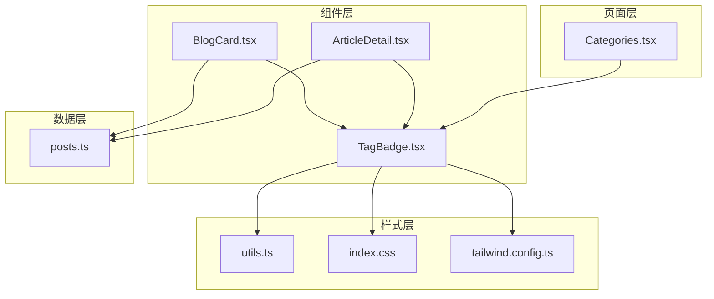

**图表来源**
- [TagBadge.tsx:1-28](file://src/components/TagBadge.tsx#L1-L28)
- [BlogCard.tsx:1-66](file://src/components/BlogCard.tsx#L1-L66)
- [ArticleDetail.tsx:1-201](file://src/pages/ArticleDetail.tsx#L1-L201)
- [Categories.tsx:1-120](file://src/pages/Categories.tsx#L1-L120)

**章节来源**
- [TagBadge.tsx:1-28](file://src/components/TagBadge.tsx#L1-L28)
- [BlogCard.tsx:1-66](file://src/components/BlogCard.tsx#L1-L66)
- [ArticleDetail.tsx:1-201](file://src/pages/ArticleDetail.tsx#L1-L201)
- [Categories.tsx:1-120](file://src/pages/Categories.tsx#L1-L120)

## 核心组件

### TagBadge 组件概述

TagBadge 是一个高度可定制的标签显示组件，支持多种交互模式和视觉状态。组件的核心特性包括：

- **统一样式管理**：通过 Tailwind CSS 类名实现一致的视觉外观
- **响应式设计**：支持不同的尺寸规格适应不同布局需求
- **交互状态**：提供激活状态和悬停效果增强用户体验
- **无障碍支持**：自动根据是否有点击事件决定语义元素类型

### Props 接口定义

组件通过简洁的接口提供完整的功能控制：

| 属性名 | 类型 | 默认值 | 必需 | 描述 |
|--------|------|--------|------|------|
| tag | string | - | 是 | 标签文本内容 |
| isActive | boolean | false | 否 | 是否处于激活状态 |
| onClick | () => void | - | 否 | 点击回调函数 |
| size | 'sm' \| 'md' | 'sm' | 否 | 标签尺寸规格 |

### 样式系统架构

组件采用分层样式架构，通过条件组合实现丰富的视觉效果：

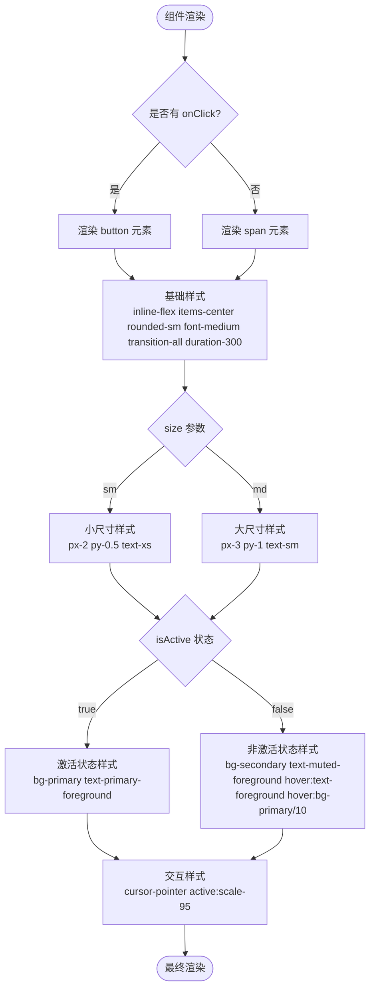

**图表来源**
- [TagBadge.tsx:10-27](file://src/components/TagBadge.tsx#L10-L27)

**章节来源**
- [TagBadge.tsx:3-8](file://src/components/TagBadge.tsx#L3-L8)
- [TagBadge.tsx:10-27](file://src/components/TagBadge.tsx#L10-L27)

## 架构概览

### 组件间协作关系

标签徽章组件在博客系统中扮演着多重角色，与多个组件形成紧密的协作关系：

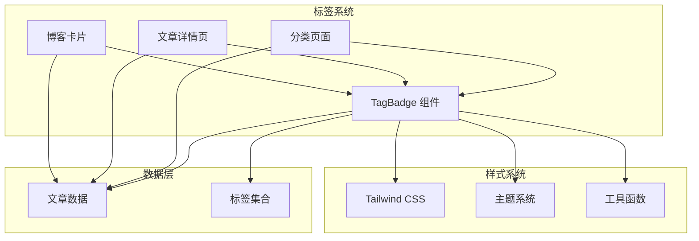

**图表来源**
- [Categories.tsx:72-82](file://src/pages/Categories.tsx#L72-L82)
- [ArticleDetail.tsx:169-173](file://src/pages/ArticleDetail.tsx#L169-L173)
- [BlogCard.tsx:56-60](file://src/components/BlogCard.tsx#L56-L60)

### 数据流分析

标签徽章组件的数据流体现了清晰的单向数据绑定模式：

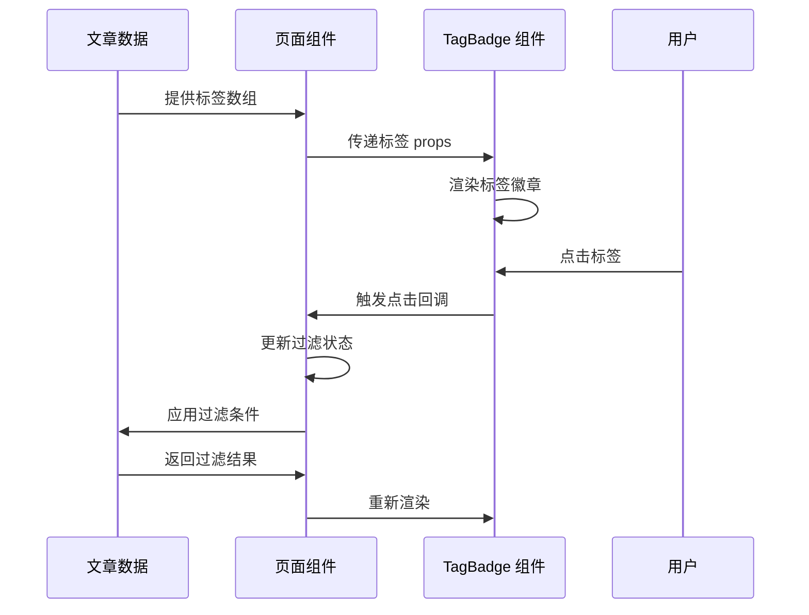

**图表来源**
- [Categories.tsx:72-82](file://src/pages/Categories.tsx#L72-L82)
- [posts.ts:369-377](file://src/data/posts.ts#L369-L377)

**章节来源**
- [Categories.tsx:15-19](file://src/pages/Categories.tsx#L15-L19)
- [posts.ts:369-377](file://src/data/posts.ts#L369-L377)

## 详细组件分析

### 标签样式管理

#### 激活状态设计

激活状态通过主色调实现突出显示，确保用户能够快速识别当前选中的标签：

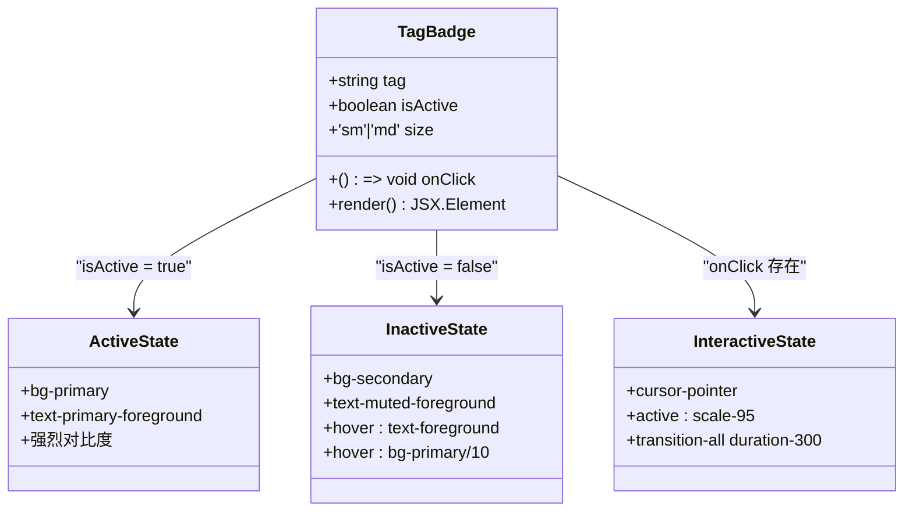

**图表来源**
- [TagBadge.tsx:18-22](file://src/components/TagBadge.tsx#L18-L22)

#### 尺寸规格系统

组件支持两种尺寸规格以适应不同的布局需求：

| 尺寸 | 内边距 | 字体大小 | 适用场景 |
|------|--------|----------|----------|
| sm | px-2 py-0.5 | text-xs | 博客卡片标签 |
| md | px-3 py-1 | text-sm | 分类页面标签 |

**章节来源**
- [TagBadge.tsx:16-17](file://src/components/TagBadge.tsx#L16-L17)
- [BlogCard.tsx:56-60](file://src/components/BlogCard.tsx#L56-L60)
- [Categories.tsx:72-82](file://src/pages/Categories.tsx#L72-L82)

### 交互行为实现

#### 动态元素选择

组件根据是否存在点击回调动态选择合适的 HTML 元素：

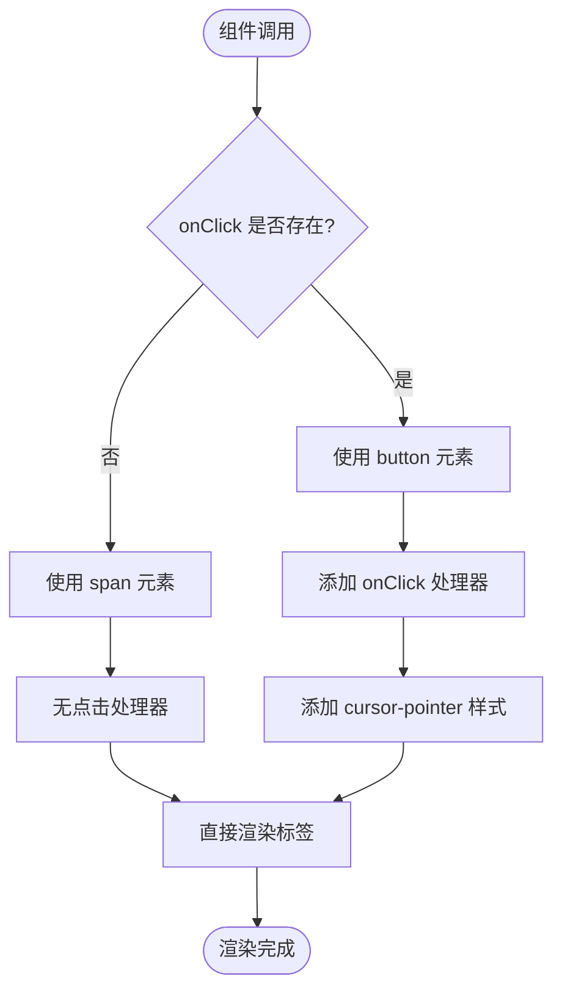

**图表来源**
- [TagBadge.tsx:10-11](file://src/components/TagBadge.tsx#L10-L11)

#### 状态切换机制

激活状态的切换通过外部状态管理实现，确保组件的无状态设计：

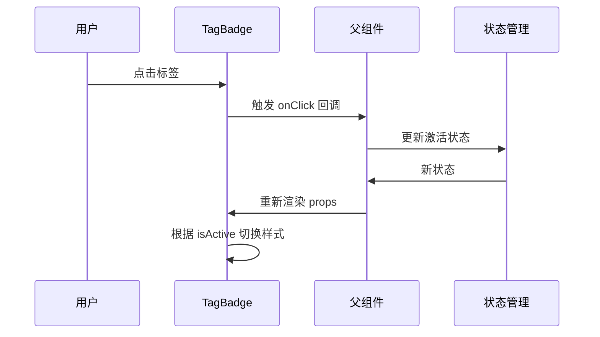

**图表来源**
- [Categories.tsx:78-81](file://src/pages/Categories.tsx#L78-L81)

**章节来源**
- [TagBadge.tsx:10-11](file://src/components/TagBadge.tsx#L10-L11)
- [Categories.tsx:78-81](file://src/pages/Categories.tsx#L78-L81)

### 响应式设计实现

#### 尺寸适配策略

组件通过 Tailwind CSS 的响应式工具类实现跨设备兼容：

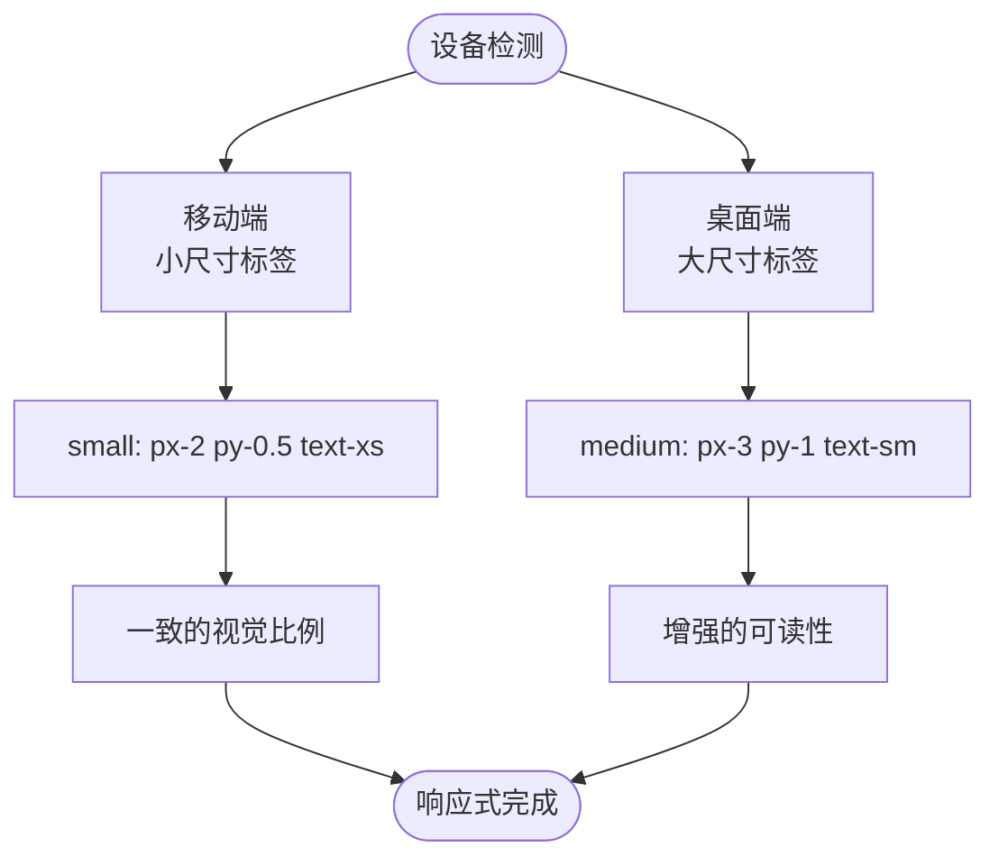

**图表来源**
- [TagBadge.tsx:16-17](file://src/components/TagBadge.tsx#L16-L17)

#### 视觉一致性保证

通过统一的颜色变量和过渡动画确保不同状态下的一致体验：

**章节来源**
- [TagBadge.tsx:16-22](file://src/components/TagBadge.tsx#L16-L22)
- [index.css:14-26](file://src/index.css#L14-L26)

### 主题适配机制

#### 深色模式支持

组件自动适配深色模式，通过 CSS 变量实现无缝切换：

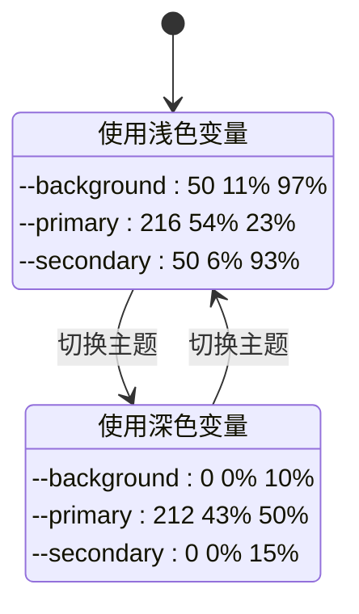

**图表来源**
- [index.css:41-66](file://src/index.css#L41-L66)

**章节来源**
- [index.css:41-66](file://src/index.css#L41-L66)
- [tailwind.config.ts:26-60](file://src/tailwind.config.ts#L26-L60)

## 依赖分析

### 外部依赖关系

标签徽章组件的依赖关系简洁明了，主要依赖于以下核心库：

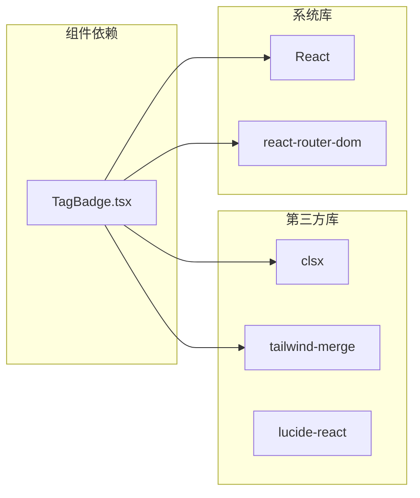

**图表来源**
- [package.json:11-21](file://package.json#L11-L21)

### 内部依赖关系

组件间的依赖关系体现了清晰的层次结构：

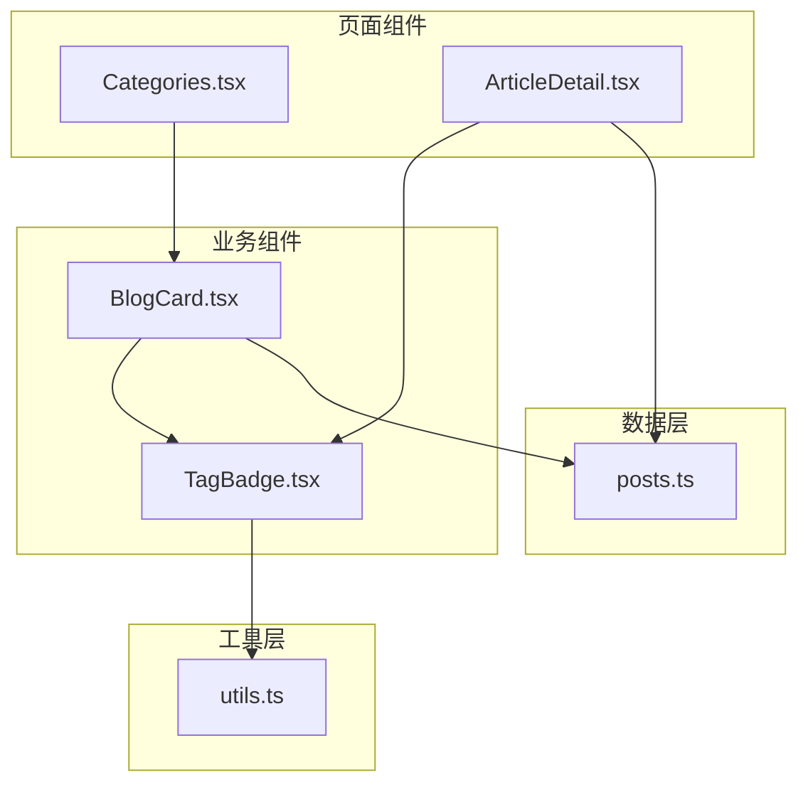

**图表来源**
- [Categories.tsx:3-4](file://src/pages/Categories.tsx#L3-L4)
- [ArticleDetail.tsx:5](file://src/pages/ArticleDetail.tsx#L5)
- [BlogCard.tsx:3](file://src/components/BlogCard.tsx#L3)

**章节来源**
- [package.json:11-21](file://package.json#L11-L21)
- [utils.ts:1-7](file://src/lib/utils.ts#L1-L7)

## 性能考虑

### 渲染优化策略

组件采用了多项性能优化措施：

- **最小化重渲染**：通过 props 的稳定性和不可变性减少不必要的更新
- **条件样式组合**：使用工具函数合并样式类，避免重复计算
- **语义化元素选择**：根据交互需求选择最优的 HTML 元素类型

### 内存使用优化

组件设计遵循内存效率原则：

- **无状态设计**：避免在组件内部存储不必要的状态
- **轻量级依赖**：仅依赖必要的工具函数和样式系统
- **可预测的生命周期**：清晰的渲染和卸载流程

## 故障排除指南

### 常见问题诊断

#### 样式不生效问题

**症状**：标签徽章显示异常或样式不正确

**可能原因**：
1. Tailwind CSS 配置问题
2. CSS 变量未正确设置
3. 样式类名冲突

**解决方案**：
1. 检查 Tailwind 配置文件
2. 验证 CSS 变量定义
3. 确认样式优先级

#### 交互功能失效

**症状**：点击事件无法触发或状态切换异常

**可能原因**：
1. onClick 回调未正确传递
2. 父组件状态管理问题
3. 事件冒泡阻止

**解决方案**：
1. 验证回调函数传递
2. 检查状态更新逻辑
3. 确认事件处理机制

**章节来源**
- [TagBadge.tsx:10-11](file://src/components/TagBadge.tsx#L10-L11)
- [Categories.tsx:78-81](file://src/pages/Categories.tsx#L78-L81)

## 结论

标签徽章组件展现了优秀的前端组件设计原则：简洁的 API、清晰的职责分离、良好的可扩展性和优秀的用户体验。通过统一的样式管理和响应式设计，该组件成功地为博客系统的标签功能提供了可靠的技术支撑。

组件的设计充分考虑了实际使用场景，既满足了基本的标签显示需求，又提供了足够的灵活性来适应不同的布局和交互要求。其模块化的架构使得组件易于维护和扩展，为后续的功能增强奠定了坚实的基础。

## 附录

### 使用示例

#### 基础用法

```typescript
// 在文章详情页中使用
<TagBadge tag="React" />

// 在分类页面中使用（带交互）
<TagBadge 
  tag="TypeScript" 
  size="md"
  isActive={activeTag === 'TypeScript'}
  onClick={() => setActiveTag('TypeScript')}
/>
```

#### 集成方法

组件可以轻松集成到各种页面组件中，通过 props 传递实现灵活的配置。

**章节来源**
- [ArticleDetail.tsx:169-173](file://src/pages/ArticleDetail.tsx#L169-L173)
- [Categories.tsx:72-82](file://src/pages/Categories.tsx#L72-L82)