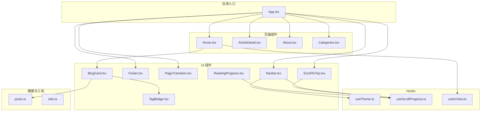
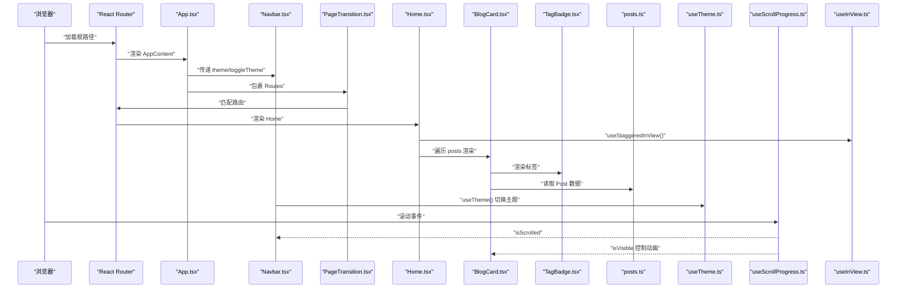
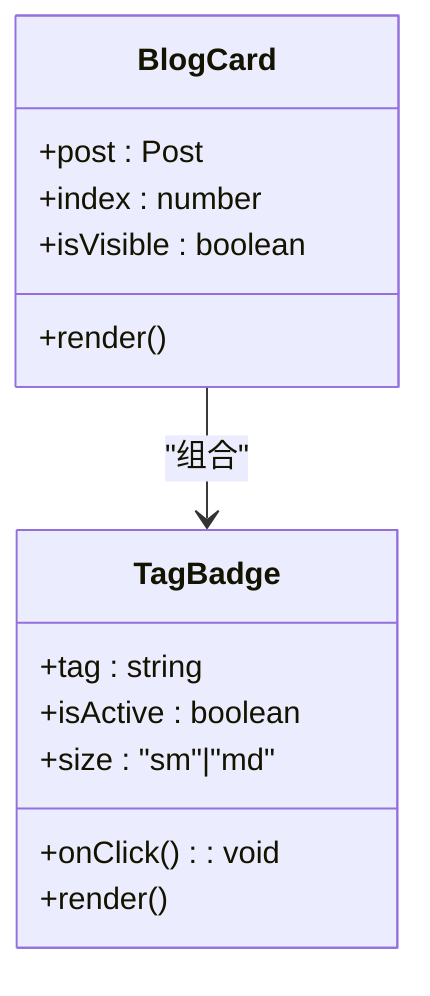
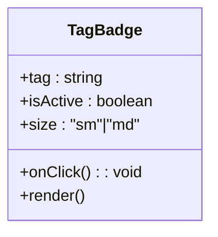
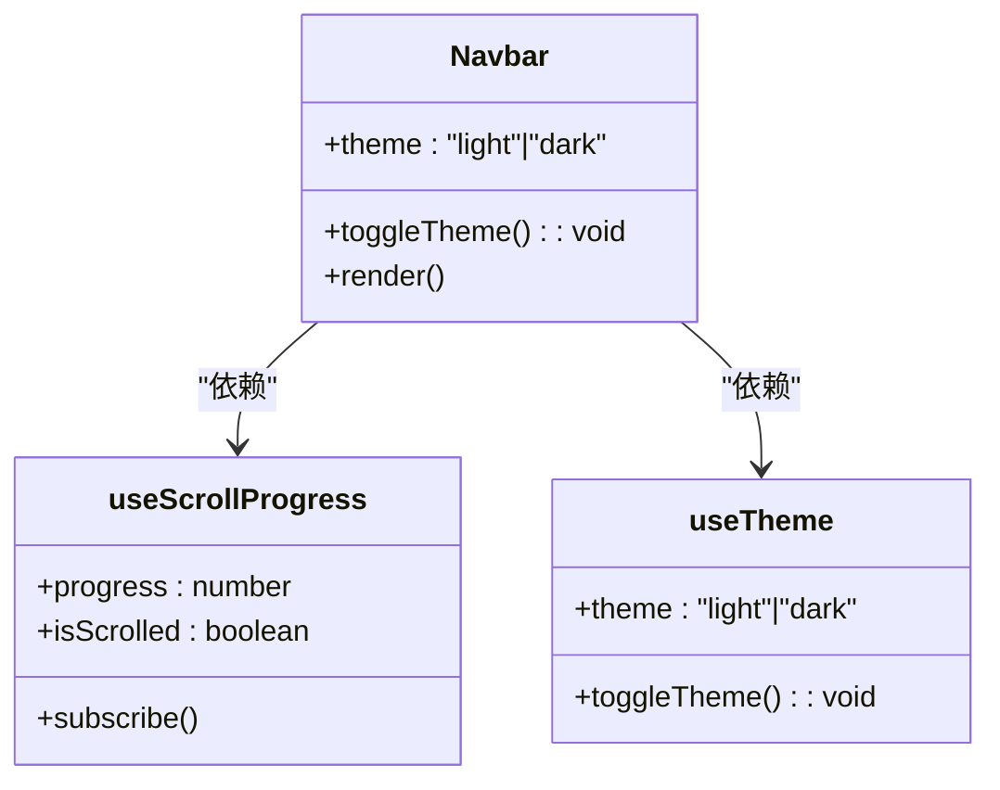
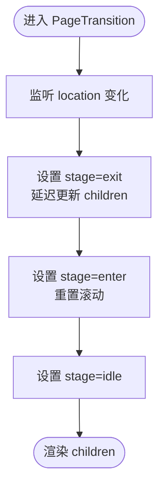
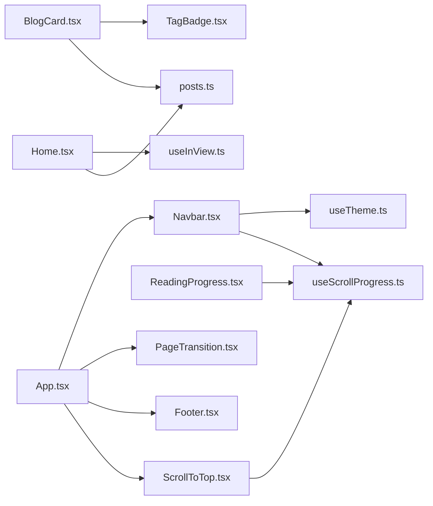

# 组件系统

<cite>
**本文引用的文件**
- [src/components/BlogCard.tsx](file://src/components/BlogCard.tsx)
- [src/components/Footer.tsx](file://src/components/Footer.tsx)
- [src/components/Navbar.tsx](file://src/components/Navbar.tsx)
- [src/components/PageTransition.tsx](file://src/components/PageTransition.tsx)
- [src/components/ReadingProgress.tsx](file://src/components/ReadingProgress.tsx)
- [src/components/ScrollToTop.tsx](file://src/components/ScrollToTop.tsx)
- [src/components/TagBadge.tsx](file://src/components/TagBadge.tsx)
- [src/hooks/useInView.ts](file://src/hooks/useInView.ts)
- [src/hooks/useScrollProgress.ts](file://src/hooks/useScrollProgress.ts)
- [src/hooks/useTheme.ts](file://src/hooks/useTheme.ts)
- [src/data/posts.ts](file://src/data/posts.ts)
- [src/lib/utils.ts](file://src/lib/utils.ts)
- [src/pages/Home.tsx](file://src/pages/Home.tsx)
- [src/App.tsx](file://src/App.tsx)
- [package.json](file://package.json)
</cite>

## 目录
1. [简介](#简介)
2. [项目结构](#项目结构)
3. [核心组件](#核心组件)
4. [架构总览](#架构总览)
5. [详细组件分析](#详细组件分析)
6. [依赖分析](#依赖分析)
7. [性能考虑](#性能考虑)
8. [故障排查指南](#故障排查指南)
9. [结论](#结论)
10. [附录](#附录)

## 简介
本文件系统性梳理 B02 项目的组件体系，覆盖 UI 组件的设计理念、实现细节、Props 接口、状态管理与事件处理、组件组合与复用策略，并提供可访问性与响应式适配建议、性能优化技巧及与自定义 Hook 的集成方式。文档面向设计师与开发者，既提供高层次的架构视图，也给出可直接定位到源码位置的“代码片段路径”，便于快速查阅与落地。

## 项目结构
项目采用按功能分层的组织方式：页面组件位于 pages 目录，通用 UI 组件位于 components 目录，可复用的业务/交互逻辑封装在 hooks 目录，共享的工具函数位于 lib 目录，静态数据模型位于 data 目录。应用入口在 App.tsx，通过 React Router 管理路由与页面切换。

图表来源
- [src/App.tsx:1-43](file://src/App.tsx#L1-L43)
- [src/pages/Home.tsx:1-34](file://src/pages/Home.tsx#L1-L34)
- [src/components/Navbar.tsx:1-113](file://src/components/Navbar.tsx#L1-L113)
- [src/components/PageTransition.tsx:1-40](file://src/components/PageTransition.tsx#L1-L40)
- [src/components/Footer.tsx:1-30](file://src/components/Footer.tsx#L1-L30)
- [src/components/ScrollToTop.tsx:1-30](file://src/components/ScrollToTop.tsx#L1-L30)
- [src/components/ReadingProgress.tsx:1-19](file://src/components/ReadingProgress.tsx#L1-L19)
- [src/components/BlogCard.tsx:1-66](file://src/components/BlogCard.tsx#L1-L66)
- [src/components/TagBadge.tsx:1-28](file://src/components/TagBadge.tsx#L1-L28)
- [src/hooks/useTheme.ts:1-28](file://src/hooks/useTheme.ts#L1-L28)
- [src/hooks/useScrollProgress.ts:1-23](file://src/hooks/useScrollProgress.ts#L1-L23)
- [src/hooks/useInView.ts:1-76](file://src/hooks/useInView.ts#L1-L76)
- [src/data/posts.ts:1-382](file://src/data/posts.ts#L1-L382)
- [src/lib/utils.ts:1-7](file://src/lib/utils.ts#L1-L7)

章节来源
- [src/App.tsx:1-43](file://src/App.tsx#L1-L43)
- [package.json:1-33](file://package.json#L1-L33)

## 核心组件
本节概述各组件的职责、Props 接口、状态与事件处理要点，以及与其他组件的协作关系。

- BlogCard
  - 职责：展示文章卡片，包含标题、摘要、元信息与标签集合；支持进入视口时的交错动画可见性控制。
  - Props 接口：接收 Post 数据、索引 index、以及是否可见 isVisible。
  - 状态与事件：内部无本地状态；通过 Link 导航至详情页；与 useStaggeredInView 协作实现交错入场。
  - 复用策略：可复用于不同列表场景；TagBadge 作为子组件复用。
  - 代码片段路径：[BlogCardProps 定义与渲染:6-66](file://src/components/BlogCard.tsx#L6-L66)

- TagBadge
  - 职责：展示标签徽标，支持激活态与点击回调；根据尺寸 sm/md 切换样式。
  - Props 接口：tag、isActive、onClick、size。
  - 状态与事件：根据是否存在 onClick 动态选择 button 或 span；内部无状态。
  - 复用策略：在 BlogCard 中用于展示文章标签；可在分类筛选等场景复用。
  - 代码片段路径：[TagBadgeProps 与渲染:3-28](file://src/components/TagBadge.tsx#L3-L28)

- Navbar
  - 职责：主导航栏，含站点 Logo、导航链接、移动端菜单、主题切换按钮；滚动时具有视觉反馈。
  - Props 接口：theme、toggleTheme。
  - 状态与事件：本地维护 mobileOpen 状态；调用 useScrollProgress 获取滚动进度；与 useTheme 协同。
  - 复用策略：作为全局头部复用；可抽取为独立模块供其他页面使用。
  - 代码片段路径：[NavbarProps 与渲染:7-113](file://src/components/Navbar.tsx#L7-L113)

- Footer
  - 职责：页脚版权与外部链接区域。
  - Props 接口：无。
  - 状态与事件：无本地状态；使用 LinkUnderline 样式增强交互。
  - 复用策略：作为全局页脚复用。
  - 代码片段路径：[Footer 渲染:1-30](file://src/components/Footer.tsx#L1-L30)

- PageTransition
  - 职责：页面切换过渡动画容器，负责在路由变化时触发出场/入场动画并重置滚动。
  - Props 接口：children。
  - 状态与事件：内部维护 stage 状态与 displayChildren；监听 location 变化触发过渡。
  - 复用策略：包裹 Routes，统一页面切换动效。
  - 代码片段路径：[PageTransition 状态与渲染:4-40](file://src/components/PageTransition.tsx#L4-L40)

- ScrollToTop
  - 职责：滚动超过阈值后显示“回到顶部”按钮，点击平滑滚动至顶部。
  - Props 接口：无。
  - 状态与事件：依赖 useScrollProgress 判断 isScrolled；点击事件触发滚动。
  - 复用策略：作为全局滚动辅助控件复用。
  - 代码片段路径：[ScrollToTop 渲染与交互:5-30](file://src/components/ScrollToTop.tsx#L5-L30)

- ReadingProgress
  - 职责：在文章阅读过程中展示滚动进度条。
  - Props 接口：无。
  - 状态与事件：依赖 useScrollProgress 获取 progress；使用 ARIA 属性提升可访问性。
  - 复用策略：在文章详情页等长内容页面复用。
  - 代码片段路径：[ReadingProgress 渲染:3-19](file://src/components/ReadingProgress.tsx#L3-L19)

章节来源
- [src/components/BlogCard.tsx:6-66](file://src/components/BlogCard.tsx#L6-L66)
- [src/components/TagBadge.tsx:3-28](file://src/components/TagBadge.tsx#L3-L28)
- [src/components/Navbar.tsx:7-113](file://src/components/Navbar.tsx#L7-L113)
- [src/components/Footer.tsx:1-30](file://src/components/Footer.tsx#L1-L30)
- [src/components/PageTransition.tsx:4-40](file://src/components/PageTransition.tsx#L4-L40)
- [src/components/ScrollToTop.tsx:5-30](file://src/components/ScrollToTop.tsx#L5-L30)
- [src/components/ReadingProgress.tsx:3-19](file://src/components/ReadingProgress.tsx#L3-L19)

## 架构总览
下图展示了应用启动到页面渲染的关键流程，以及组件与 Hooks 的协作关系。

图表来源
- [src/App.tsx:12-32](file://src/App.tsx#L12-L32)
- [src/components/Navbar.tsx:18-113](file://src/components/Navbar.tsx#L18-L113)
- [src/components/PageTransition.tsx:4-40](file://src/components/PageTransition.tsx#L4-L40)
- [src/pages/Home.tsx:5-34](file://src/pages/Home.tsx#L5-L34)
- [src/components/BlogCard.tsx:12-66](file://src/components/BlogCard.tsx#L12-L66)
- [src/components/TagBadge.tsx:10-28](file://src/components/TagBadge.tsx#L10-L28)
- [src/data/posts.ts:1-382](file://src/data/posts.ts#L1-L382)
- [src/hooks/useTheme.ts:5-27](file://src/hooks/useTheme.ts#L5-L27)
- [src/hooks/useScrollProgress.ts:3-22](file://src/hooks/useScrollProgress.ts#L3-L22)
- [src/hooks/useInView.ts:39-76](file://src/hooks/useInView.ts#L39-L76)

## 详细组件分析

### BlogCard 组件分析
- 设计理念
  - 卡片采用悬停放大、阴影与背景叠加的交互反馈，强调“可点击”的视觉层级。
  - 使用 data-index 与动画延迟实现交错入场，提升列表浏览的节奏感。
- Props 接口
  - post: Post
  - index: number
  - isVisible: boolean
- 状态与事件
  - 无本地状态；通过 Link 导航到文章详情。
- 子组件与组合
  - 内部组合 TagBadge，实现标签集合的复用。
- 可访问性与响应式
  - 使用语义化 time 元素展示日期；在小屏设备上调整内边距与字号。
- 性能优化
  - 仅在 isVisible 为真时显示可见类名，避免不必要的样式计算。
- 代码片段路径
  - [BlogCard 渲染与样式:12-66](file://src/components/BlogCard.tsx#L12-L66)
  - [TagBadge 在 BlogCard 中的使用:55-60](file://src/components/BlogCard.tsx#L55-L60)

图表来源
- [src/components/BlogCard.tsx:6-66](file://src/components/BlogCard.tsx#L6-L66)
- [src/components/TagBadge.tsx:3-28](file://src/components/TagBadge.tsx#L3-L28)

章节来源
- [src/components/BlogCard.tsx:6-66](file://src/components/BlogCard.tsx#L6-L66)
- [src/components/TagBadge.tsx:3-28](file://src/components/TagBadge.tsx#L3-L28)
- [src/data/posts.ts:1-10](file://src/data/posts.ts#L1-L10)

### TagBadge 组件分析
- 设计理念
  - 支持“可点击”与“不可点击”两种形态；通过 isActive 切换强调态。
  - 尺寸 sm/md 通过条件类名控制，保证在不同密度下的可用性。
- Props 接口
  - tag: string
  - isActive?: boolean
  - onClick?: () => void
  - size?: 'sm' | 'md'
- 状态与事件
  - 无本地状态；根据 onClick 自动切换为 button 或 span。
- 复用策略
  - 在 BlogCard 中展示标签；可用于分类筛选、标签云等场景。
- 代码片段路径
  - [TagBadge Props 与渲染:10-28](file://src/components/TagBadge.tsx#L10-L28)

图表来源
- [src/components/TagBadge.tsx:3-28](file://src/components/TagBadge.tsx#L3-L28)

章节来源
- [src/components/TagBadge.tsx:3-28](file://src/components/TagBadge.tsx#L3-L28)

### Navbar 组件分析
- 设计理念
  - 滚动时自动添加毛玻璃背景与阴影，提升可读性；移动端菜单折叠与展开。
  - 主题切换按钮在桌面与移动端分别放置，兼顾不同交互习惯。
- Props 接口
  - theme: 'light' | 'dark'
  - toggleTheme: () => void
- 状态与事件
  - 本地维护 mobileOpen；结合 useScrollProgress 切换样式；与 useTheme 协同。
- 代码片段路径
  - [Navbar Props 与渲染:18-113](file://src/components/Navbar.tsx#L18-L113)

图表来源
- [src/components/Navbar.tsx:7-113](file://src/components/Navbar.tsx#L7-L113)
- [src/hooks/useScrollProgress.ts:3-22](file://src/hooks/useScrollProgress.ts#L3-L22)
- [src/hooks/useTheme.ts:5-27](file://src/hooks/useTheme.ts#L5-L27)

章节来源
- [src/components/Navbar.tsx:7-113](file://src/components/Navbar.tsx#L7-L113)
- [src/hooks/useScrollProgress.ts:3-22](file://src/hooks/useScrollProgress.ts#L3-L22)
- [src/hooks/useTheme.ts:5-27](file://src/hooks/useTheme.ts#L5-L27)

### Footer 组件分析
- 设计理念
  - 页脚采用居中与两端布局，在小屏设备上自动切换为垂直排列。
  - 外部链接使用下划线样式，增强可点击性提示。
- Props 接口
  - 无。
- 代码片段路径
  - [Footer 渲染:1-30](file://src/components/Footer.tsx#L1-L30)

章节来源
- [src/components/Footer.tsx:1-30](file://src/components/Footer.tsx#L1-L30)

### PageTransition 组件分析
- 设计理念
  - 通过 stage 状态机控制出场/入场动画；在路由切换时重置滚动位置。
- Props 接口
  - children: ReactNode
- 状态与事件
  - 内部维护 stage 与 displayChildren；监听 location 变化触发过渡。
- 代码片段路径
  - [PageTransition 状态与渲染:4-40](file://src/components/PageTransition.tsx#L4-L40)

图表来源
- [src/components/PageTransition.tsx:9-20](file://src/components/PageTransition.tsx#L9-L20)

章节来源
- [src/components/PageTransition.tsx:4-40](file://src/components/PageTransition.tsx#L4-L40)

### ScrollToTop 组件分析
- 设计理念
  - 滚动超过阈值后渐显“回到顶部”按钮；点击平滑滚动至顶部。
- Props 接口
  - 无。
- 状态与事件
  - 依赖 useScrollProgress 的 isScrolled；点击事件触发滚动。
- 代码片段路径
  - [ScrollToTop 渲染与交互:5-30](file://src/components/ScrollToTop.tsx#L5-L30)

章节来源
- [src/components/ScrollToTop.tsx:5-30](file://src/components/ScrollToTop.tsx#L5-L30)
- [src/hooks/useScrollProgress.ts:3-22](file://src/hooks/useScrollProgress.ts#L3-L22)

### ReadingProgress 组件分析
- 设计理念
  - 在文章阅读过程中展示滚动进度条；使用 ARIA 属性提升可访问性。
- Props 接口
  - 无。
- 状态与事件
  - 依赖 useScrollProgress 的 progress；当 progress<=0 时不渲染。
- 代码片段路径
  - [ReadingProgress 渲染:3-19](file://src/components/ReadingProgress.tsx#L3-L19)

章节来源
- [src/components/ReadingProgress.tsx:3-19](file://src/components/ReadingProgress.tsx#L3-L19)
- [src/hooks/useScrollProgress.ts:3-22](file://src/hooks/useScrollProgress.ts#L3-L22)

## 依赖分析
- 组件间依赖
  - BlogCard 依赖 TagBadge 与 posts 数据模型。
  - Navbar 依赖 useTheme 与 useScrollProgress。
  - ScrollToTop 与 ReadingProgress 依赖 useScrollProgress。
  - Home 页面依赖 useStaggeredInView 与 posts。
- 外部依赖
  - React Router 用于路由与页面切换。
  - Tailwind CSS/TW Merge 用于样式合并与主题变量。
  - lucide-react 提供图标。
- 代码片段路径
  - [依赖声明与版本:11-21](file://package.json#L11-L21)

图表来源
- [src/components/BlogCard.tsx:1-4](file://src/components/BlogCard.tsx#L1-L4)
- [src/components/TagBadge.tsx](file://src/components/TagBadge.tsx#L1)
- [src/data/posts.ts:1-10](file://src/data/posts.ts#L1-L10)
- [src/components/Navbar.tsx:1-6](file://src/components/Navbar.tsx#L1-L6)
- [src/hooks/useTheme.ts:1-28](file://src/hooks/useTheme.ts#L1-L28)
- [src/hooks/useScrollProgress.ts:1-23](file://src/hooks/useScrollProgress.ts#L1-L23)
- [src/components/ScrollToTop.tsx:1-3](file://src/components/ScrollToTop.tsx#L1-L3)
- [src/components/ReadingProgress.tsx](file://src/components/ReadingProgress.tsx#L1)
- [src/pages/Home.tsx:1-3](file://src/pages/Home.tsx#L1-L3)
- [src/hooks/useInView.ts:1-76](file://src/hooks/useInView.ts#L1-L76)
- [src/App.tsx:1-11](file://src/App.tsx#L1-L11)

章节来源
- [package.json:11-21](file://package.json#L11-L21)
- [src/App.tsx:1-11](file://src/App.tsx#L1-L11)

## 性能考虑
- 滚动事件优化
  - useScrollProgress 使用被动监听，降低主线程阻塞风险。
  - 代码片段路径：[被动监听实现:17-19](file://src/hooks/useScrollProgress.ts#L17-L19)
- 视口观察与交错动画
  - useInView 与 useStaggeredInView 结合 IntersectionObserver，仅在元素进入视口时触发后续逻辑，减少不必要的计算。
  - 代码片段路径：[useInView 基础实现:9-37](file://src/hooks/useInView.ts#L9-L37)、[useStaggeredInView 实现:39-76](file://src/hooks/useInView.ts#L39-L76)
- 样式合并与主题切换
  - 使用 cn 函数合并类名，避免冲突；useTheme 将主题类名写入根节点，利于 CSS 变量生效。
  - 代码片段路径：[cn 工具:4-6](file://src/lib/utils.ts#L4-L6)、[useTheme 主题写入:15-20](file://src/hooks/useTheme.ts#L15-L20)
- 动画与过渡
  - PageTransition 与 BlogCard 的动画延迟通过 data-index 计算，避免集中触发导致的抖动。
  - 代码片段路径：[PageTransition 动画控制:22-35](file://src/components/PageTransition.tsx#L22-L35)、[BlogCard 动画延迟:20-20](file://src/components/BlogCard.tsx#L20-L20)

## 故障排查指南
- 页面切换无动画
  - 检查 PageTransition 是否包裹 Routes，以及 location 变化是否触发状态更新。
  - 代码片段路径：[PageTransition 状态监听:9-20](file://src/components/PageTransition.tsx#L9-L20)
- 卡片未出现交错动画
  - 确认 Home 中 useStaggeredInView 返回的 visibleItems 是否包含对应 index，且 BlogCard 的 isVisible 生效。
  - 代码片段路径：[Home 中的 useStaggeredInView:5-7](file://src/pages/Home.tsx#L5-L7)、[BlogCard 可见性控制:16-19](file://src/components/BlogCard.tsx#L16-L19)
- 主题切换无效
  - 检查 useTheme 是否正确写入根节点类名与本地存储，以及 Navbar 是否传入 toggleTheme。
  - 代码片段路径：[useTheme 主题写入:15-20](file://src/hooks/useTheme.ts#L15-L20)、[Navbar 主题切换按钮:57-63](file://src/components/Navbar.tsx#L57-L63)
- 滚动进度条不显示
  - 确认 useScrollProgress 的 progress 是否大于 0，以及 ReadingProgress 的条件渲染逻辑。
  - 代码片段路径：[ReadingProgress 条件渲染:6-7](file://src/components/ReadingProgress.tsx#L6-L7)

章节来源
- [src/components/PageTransition.tsx:9-20](file://src/components/PageTransition.tsx#L9-L20)
- [src/pages/Home.tsx:5-7](file://src/pages/Home.tsx#L5-L7)
- [src/components/BlogCard.tsx:16-19](file://src/components/BlogCard.tsx#L16-L19)
- [src/hooks/useTheme.ts:15-20](file://src/hooks/useTheme.ts#L15-L20)
- [src/components/Navbar.tsx:57-63](file://src/components/Navbar.tsx#L57-L63)
- [src/components/ReadingProgress.tsx:6-7](file://src/components/ReadingProgress.tsx#L6-L7)

## 结论
B02 的组件系统以“可组合、可复用、可扩展”为核心设计目标：通过清晰的 Props 接口与最小状态设计，配合自定义 Hook 实现跨组件的状态与行为复用；借助 Tailwind CSS 与 cn 工具实现一致的样式约定；通过 IntersectionObserver 与被动滚动监听保障性能。该体系既满足当前页面需求，也为未来扩展（如文章详情页的阅读进度、分类筛选等）提供了良好基础。

## 附录
- 使用场景与代码片段路径
  - 在首页展示文章列表：[Home 渲染 BlogCard:20-31](file://src/pages/Home.tsx#L20-L31)
  - 在文章卡片中展示标签：[BlogCard 中的 TagBadge:55-60](file://src/components/BlogCard.tsx#L55-L60)
  - 切换主题：[Navbar 中的 toggleTheme:57-63](file://src/components/Navbar.tsx#L57-L63)、[useTheme 返回值:22-24](file://src/hooks/useTheme.ts#L22-L24)
  - 页面切换过渡：[App 包裹 PageTransition:18-27](file://src/App.tsx#L18-L27)、[PageTransition 动画:22-35](file://src/components/PageTransition.tsx#L22-L35)
  - 滚动到顶部：[ScrollToTop 点击事件:8-10](file://src/components/ScrollToTop.tsx#L8-L10)
  - 阅读进度条：[ReadingProgress 渲染:8-17](file://src/components/ReadingProgress.tsx#L8-L17)