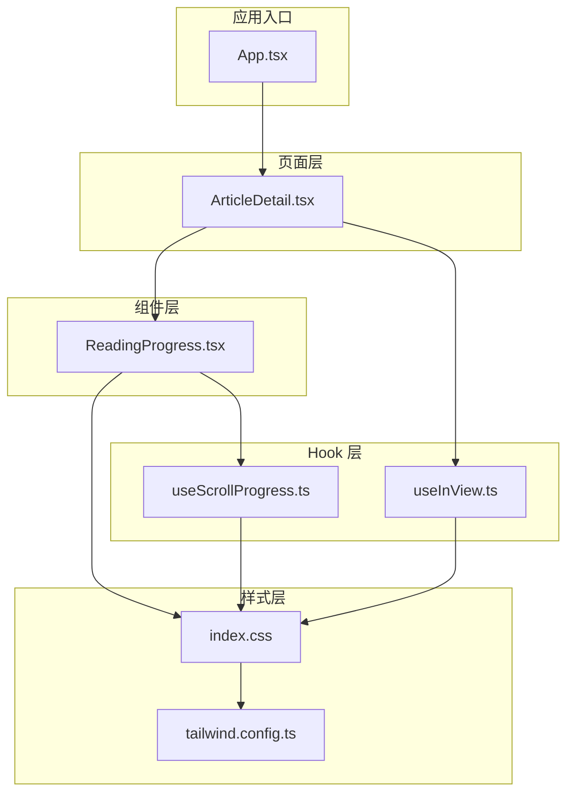
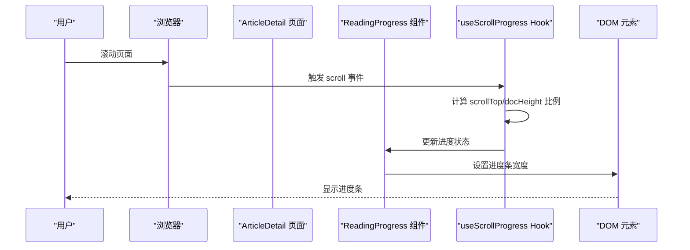
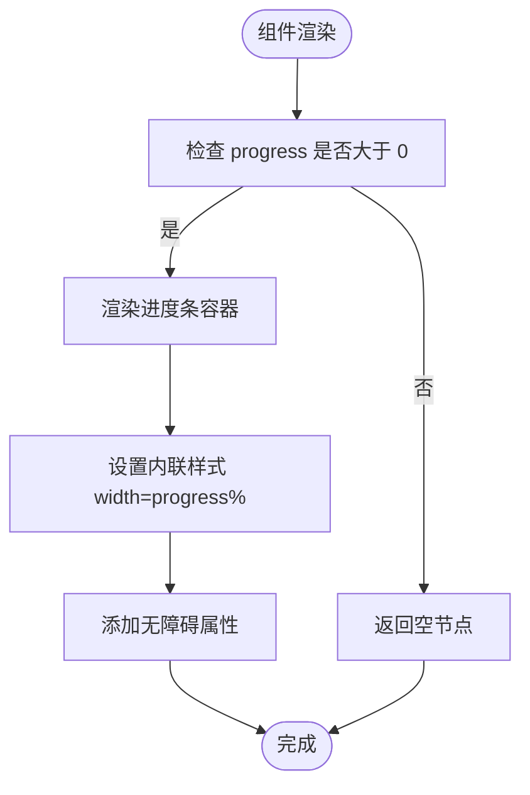
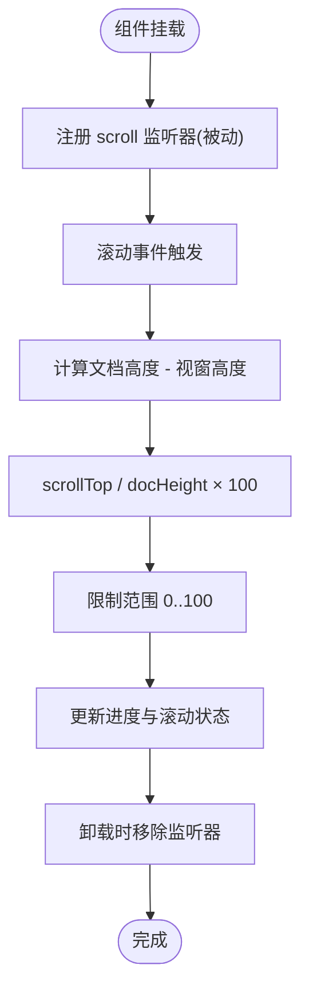
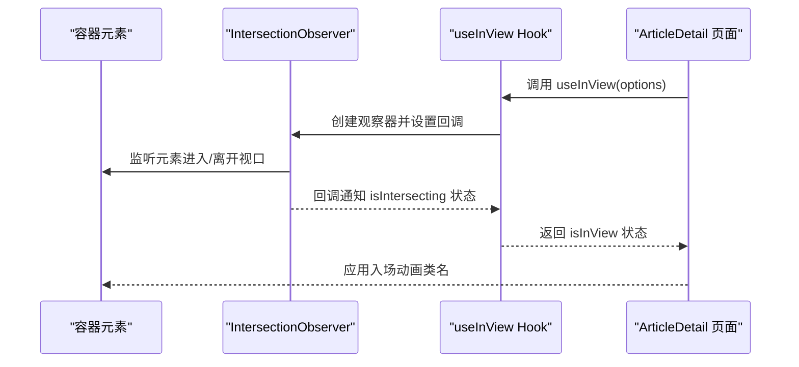
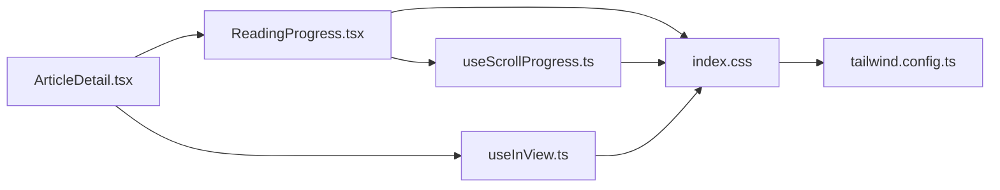

# 阅读进度组件 (ReadingProgress)

<cite>
**本文档引用的文件**
- [src/components/ReadingProgress.tsx](file://src/components/ReadingProgress.tsx)
- [src/hooks/useScrollProgress.ts](file://src/hooks/useScrollProgress.ts)
- [src/hooks/useInView.ts](file://src/hooks/useInView.ts)
- [src/pages/ArticleDetail.tsx](file://src/pages/ArticleDetail.tsx)
- [src/index.css](file://src/index.css)
- [tailwind.config.ts](file://tailwind.config.ts)
- [src/App.tsx](file://src/App.tsx)
</cite>

## 目录
1. [简介](#简介)
2. [项目结构](#项目结构)
3. [核心组件](#核心组件)
4. [架构总览](#架构总览)
5. [详细组件分析](#详细组件分析)
6. [依赖关系分析](#依赖关系分析)
7. [性能考量](#性能考量)
8. [故障排查指南](#故障排查指南)
9. [结论](#结论)
10. [附录](#附录)

## 简介
阅读进度组件用于在用户滚动页面时，以一条固定在页面顶部的进度条直观展示当前阅读进度。该组件通过监听滚动事件计算滚动百分比，并结合无障碍属性提供可访问性支持；同时，它与 Intersection Observer API 协作，为内容区域提供进入视口时的入场动画与交互增强。该组件旨在提升阅读体验，帮助用户感知阅读位置、剩余内容长度以及整体阅读节奏。

## 项目结构
阅读进度组件位于组件层，配合自定义 Hook 实现滚动进度计算，并在文章详情页中被引入使用。样式通过 Tailwind CSS 定义，支持主题切换与过渡动画。

**图表来源**
- [src/App.tsx:12-40](file://src/App.tsx#L12-L40)
- [src/pages/ArticleDetail.tsx:118-200](file://src/pages/ArticleDetail.tsx#L118-L200)
- [src/components/ReadingProgress.tsx:1-19](file://src/components/ReadingProgress.tsx#L1-L19)
- [src/hooks/useScrollProgress.ts:1-23](file://src/hooks/useScrollProgress.ts#L1-L23)
- [src/hooks/useInView.ts:1-76](file://src/hooks/useInView.ts#L1-L76)
- [src/index.css:161-170](file://src/index.css#L161-L170)
- [tailwind.config.ts:1-107](file://tailwind.config.ts#L1-L107)

**章节来源**
- [src/App.tsx:12-40](file://src/App.tsx#L12-L40)
- [src/pages/ArticleDetail.tsx:118-200](file://src/pages/ArticleDetail.tsx#L118-L200)
- [src/components/ReadingProgress.tsx:1-19](file://src/components/ReadingProgress.tsx#L1-L19)
- [src/hooks/useScrollProgress.ts:1-23](file://src/hooks/useScrollProgress.ts#L1-L23)
- [src/hooks/useInView.ts:1-76](file://src/hooks/useInView.ts#L1-L76)
- [src/index.css:161-170](file://src/index.css#L161-L170)
- [tailwind.config.ts:1-107](file://tailwind.config.ts#L1-L107)

## 核心组件
- ReadingProgress 组件：负责渲染进度条，根据 Hook 返回的进度值动态设置宽度，并提供无障碍属性。
- useScrollProgress Hook：封装滚动事件监听与进度计算逻辑，返回进度百分比与是否已滚动的状态。
- useInView Hook：基于 Intersection Observer API 提供元素进入视口检测能力，支持一次性触发与延迟可见性控制。

**章节来源**
- [src/components/ReadingProgress.tsx:1-19](file://src/components/ReadingProgress.tsx#L1-L19)
- [src/hooks/useScrollProgress.ts:1-23](file://src/hooks/useScrollProgress.ts#L1-L23)
- [src/hooks/useInView.ts:1-76](file://src/hooks/useInView.ts#L1-L76)

## 架构总览
阅读进度组件的运行流程如下：
- 应用启动后，文章详情页引入 ReadingProgress 组件。
- ReadingProgress 调用 useScrollProgress 获取进度数据。
- useScrollProgress 在组件挂载时注册滚动事件监听器，计算滚动百分比并更新状态。
- ReadingProgress 将进度值映射到进度条宽度，实现视觉反馈。
- 文章详情页同时使用 useInView 对内容区域进行观察，实现进入视口时的入场动画。

**图表来源**
- [src/pages/ArticleDetail.tsx:140-145](file://src/pages/ArticleDetail.tsx#L140-L145)
- [src/components/ReadingProgress.tsx:3-17](file://src/components/ReadingProgress.tsx#L3-L17)
- [src/hooks/useScrollProgress.ts:7-19](file://src/hooks/useScrollProgress.ts#L7-L19)

## 详细组件分析

### ReadingProgress 组件
- 设计思路
  - 采用受控组件模式，仅在进度大于 0 时渲染进度条，避免无意义的 DOM 渲染。
  - 使用固定定位将进度条置于页面顶部，确保在任何滚动场景下都可见。
  - 通过内联样式动态设置宽度，实现平滑的进度变化。
  - 提供无障碍属性 role 和 aria-*，提升可访问性。
- 实现细节
  - 依赖 useScrollProgress Hook 获取 progress 值。
  - 当 progress <= 0 时直接返回空节点，减少不必要的渲染。
  - 进度条容器具备过渡动画，使宽度变化更自然。
- 可扩展点
  - 可增加最小可见阈值，避免轻微滚动导致的频繁重绘。
  - 可添加动画延迟或缓动函数，进一步优化视觉体验。

**图表来源**
- [src/components/ReadingProgress.tsx:3-17](file://src/components/ReadingProgress.tsx#L3-L17)

**章节来源**
- [src/components/ReadingProgress.tsx:1-19](file://src/components/ReadingProgress.tsx#L1-L19)

### useScrollProgress Hook
- 设计思路
  - 在组件挂载时注册滚动事件监听器，使用被动事件监听器以提升滚动性能。
  - 计算滚动百分比：scrollTop / (documentHeight - windowHeight) × 100。
  - 对结果进行边界约束，确保范围在 0-100。
  - 同时维护 isScrolled 状态，用于控制组件在滚动一定距离后的显示行为。
- 实现细节
  - 使用 window.addEventListener('scroll', handler, { passive: true }) 注册监听。
  - 在清理函数中移除监听器，防止内存泄漏。
  - 使用 Math.min/Math.max 保证进度值在有效范围内。
- 性能影响
  - 被动监听器避免主线程阻塞，适合高频滚动事件。
  - 若需要进一步优化，可在事件处理器中加入节流/防抖逻辑。

**图表来源**
- [src/hooks/useScrollProgress.ts:7-19](file://src/hooks/useScrollProgress.ts#L7-L19)

**章节来源**
- [src/hooks/useScrollProgress.ts:1-23](file://src/hooks/useScrollProgress.ts#L1-L23)

### useInView Hook（与阅读进度的协作）
- 设计思路
  - 基于 Intersection Observer API 监测目标元素是否进入视口。
  - 支持阈值、根边距等参数配置，满足不同场景需求。
  - 提供一次性触发与持续可见性控制，避免重复回调。
- 与阅读进度的协作
  - 文章详情页使用 useInView 观察内容区域，实现进入视口时的入场动画。
  - 虽然不直接参与进度计算，但两者共同提升阅读体验：前者提供内容呈现的仪式感，后者提供阅读进度的可视化反馈。
- 注意事项
  - 观察器需在组件挂载时初始化，并在卸载时断开连接。
  - 根边距设置会影响触发时机，应根据实际布局调整。

**图表来源**
- [src/hooks/useInView.ts:14-34](file://src/hooks/useInView.ts#L14-L34)
- [src/pages/ArticleDetail.tsx:122-122](file://src/pages/ArticleDetail.tsx#L122-L122)

**章节来源**
- [src/hooks/useInView.ts:1-76](file://src/hooks/useInView.ts#L1-L76)
- [src/pages/ArticleDetail.tsx:118-200](file://src/pages/ArticleDetail.tsx#L118-L200)

## 依赖关系分析
- 组件依赖
  - ReadingProgress 依赖 useScrollProgress 获取进度数据。
  - ArticleDetail 页面同时依赖 ReadingProgress 与 useInView。
- 外部依赖
  - 浏览器原生 API：window.scrollY、documentElement.scrollHeight、IntersectionObserver。
  - 样式系统：Tailwind CSS 提供进度条的基础样式与主题变量。
- 潜在耦合点
  - 进度条样式与主题变量紧密耦合，若需自定义样式，建议通过 CSS 变量或 Tailwind 扩展进行统一管理。
  - useInView 的根边距与滚动行为可能相互影响，需在布局上协调。

**图表来源**
- [src/components/ReadingProgress.tsx:1-19](file://src/components/ReadingProgress.tsx#L1-L19)
- [src/hooks/useScrollProgress.ts:1-23](file://src/hooks/useScrollProgress.ts#L1-L23)
- [src/hooks/useInView.ts:1-76](file://src/hooks/useInView.ts#L1-L76)
- [src/pages/ArticleDetail.tsx:118-200](file://src/pages/ArticleDetail.tsx#L118-L200)
- [src/index.css:161-170](file://src/index.css#L161-L170)
- [tailwind.config.ts:1-107](file://tailwind.config.ts#L1-L107)

**章节来源**
- [src/components/ReadingProgress.tsx:1-19](file://src/components/ReadingProgress.tsx#L1-L19)
- [src/hooks/useScrollProgress.ts:1-23](file://src/hooks/useScrollProgress.ts#L1-L23)
- [src/hooks/useInView.ts:1-76](file://src/hooks/useInView.ts#L1-L76)
- [src/pages/ArticleDetail.tsx:118-200](file://src/pages/ArticleDetail.tsx#L118-L200)
- [src/index.css:161-170](file://src/index.css#L161-L170)
- [tailwind.config.ts:1-107](file://tailwind.config.ts#L1-L107)

## 性能考量
- 滚动事件监听
  - 已使用被动监听器，避免滚动阻塞主线程。
  - 建议在高频滚动场景下加入节流/防抖，降低重绘频率。
- 内存管理
  - 在清理函数中移除事件监听器，防止内存泄漏。
  - Intersection Observer 在组件卸载时断开连接，避免残留回调。
- 视觉反馈
  - 进度条宽度使用线性过渡，时间较短，视觉响应迅速。
  - 可根据设备性能调整过渡时长或禁用动画以节省资源。
- 主题与样式
  - 使用 CSS 变量与 Tailwind 扩展，便于在不同主题间保持一致的视觉表现。
  - 避免在组件内部硬编码颜色，优先通过主题变量与类名控制。

[本节为通用性能建议，无需特定文件引用]

## 故障排查指南
- 进度条不显示
  - 检查组件是否在 progress <= 0 时返回空节点。
  - 确认滚动容器是否正确设置高度，避免文档高度为 0。
- 进度计算异常
  - 确认 scrollTop 与文档高度的计算逻辑是否正确。
  - 检查窗口尺寸变化是否影响了计算结果。
- 无障碍属性问题
  - 确保 aria-valuenow、aria-valuemin、aria-valuemax 值与实际状态一致。
- Intersection Observer 不生效
  - 检查目标元素是否存在且可观察。
  - 确认根边距与阈值设置是否合理。
- 样式冲突
  - 检查是否有其他样式覆盖了进度条的定位与宽度。
  - 确认主题切换时颜色变量是否正确解析。

**章节来源**
- [src/components/ReadingProgress.tsx:3-17](file://src/components/ReadingProgress.tsx#L3-L17)
- [src/hooks/useScrollProgress.ts:7-19](file://src/hooks/useScrollProgress.ts#L7-L19)
- [src/hooks/useInView.ts:14-34](file://src/hooks/useInView.ts#L14-L34)
- [src/index.css:161-170](file://src/index.css#L161-L170)

## 结论
阅读进度组件通过简洁的滚动监听与无障碍设计，为用户提供清晰的阅读进度反馈。其与 Intersection Observer API 的协作进一步增强了内容呈现的体验。在性能方面，组件已采用被动监听与清理机制，建议在高负载场景下结合节流/防抖与主题化样式定制，以获得更佳的用户体验与开发效率。

[本节为总结性内容，无需特定文件引用]

## 附录

### 使用示例与配置选项
- 在文章详情页中引入组件
  - 在页面渲染树中直接渲染 ReadingProgress 组件，即可自动监听滚动并显示进度条。
- 自定义 Hook 行为
  - 如需调整滚动阈值或最小可见进度，可在 useScrollProgress 中扩展逻辑。
- 样式定制与主题适配
  - 通过 CSS 变量与 Tailwind 扩展，统一管理进度条的颜色、高度与过渡效果。
  - 在深色/浅色主题下，进度条颜色会自动跟随主题变量，确保一致性。

**章节来源**
- [src/pages/ArticleDetail.tsx:140-145](file://src/pages/ArticleDetail.tsx#L140-L145)
- [src/components/ReadingProgress.tsx:1-19](file://src/components/ReadingProgress.tsx#L1-L19)
- [src/index.css:161-170](file://src/index.css#L161-L170)
- [tailwind.config.ts:26-60](file://tailwind.config.ts#L26-L60)