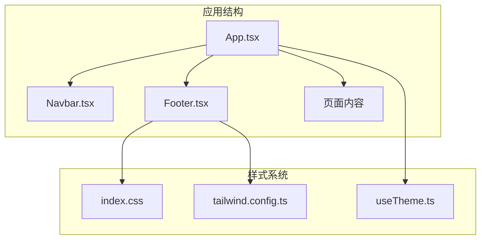
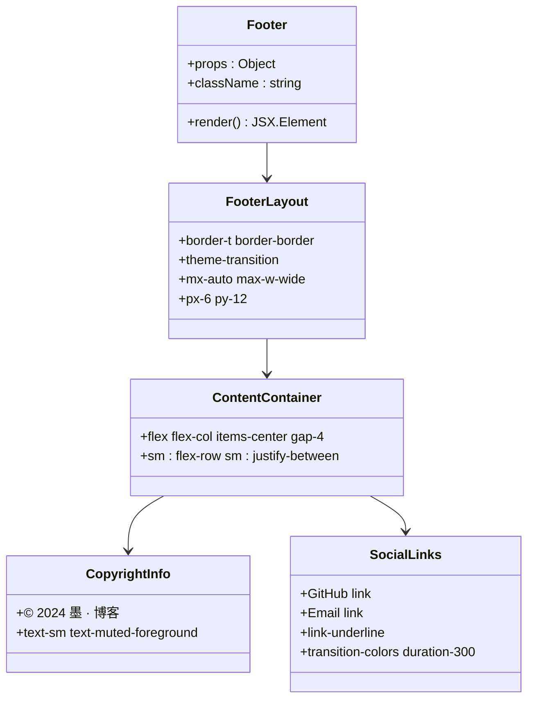
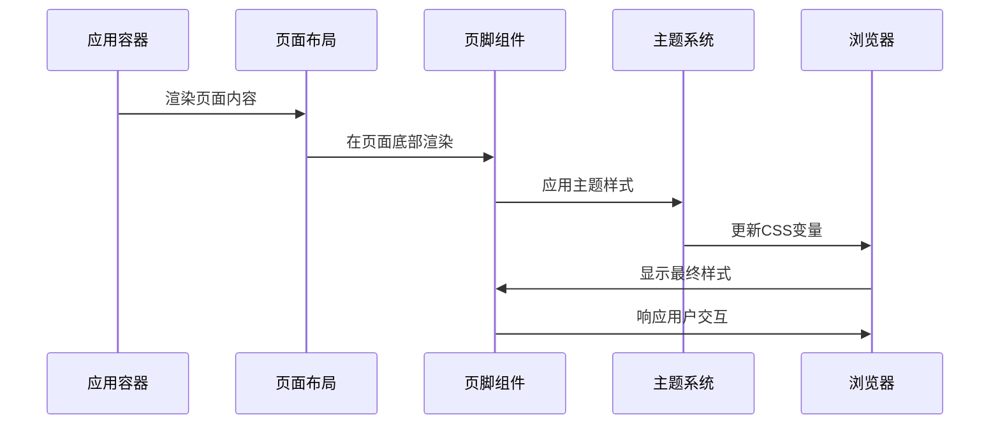
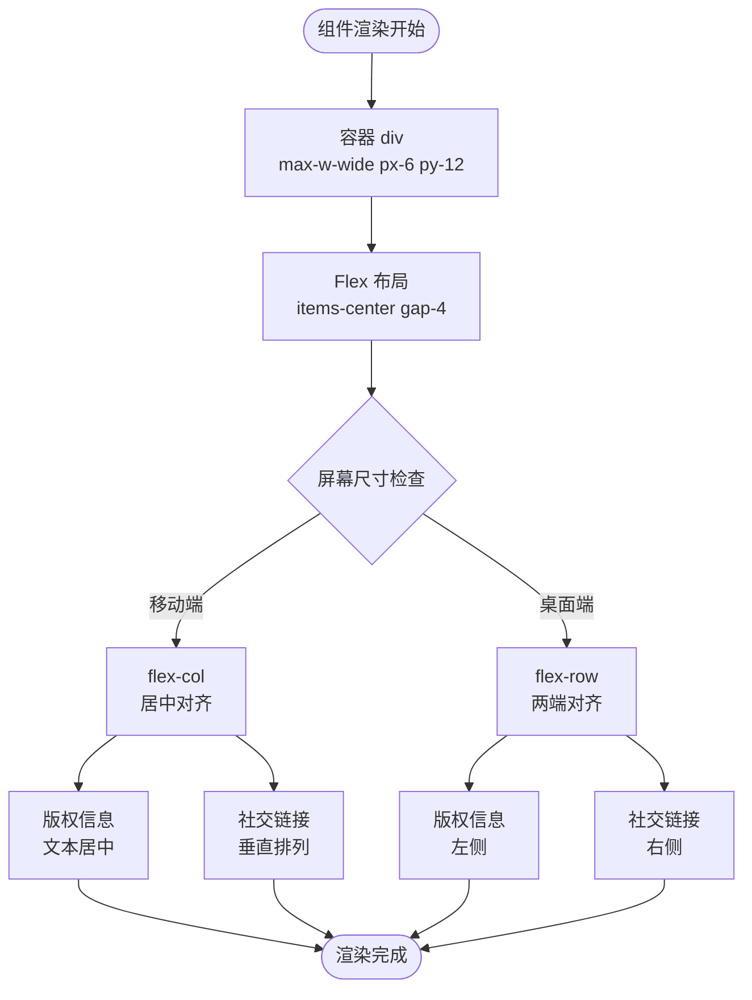
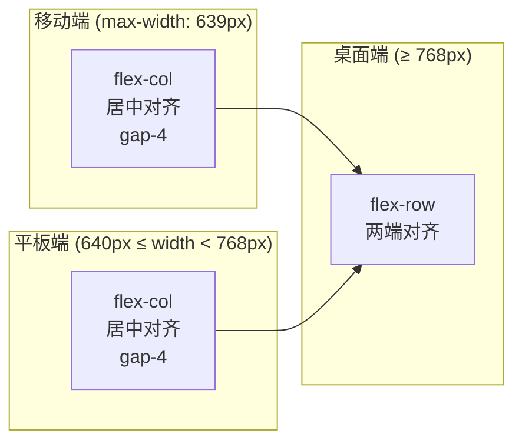
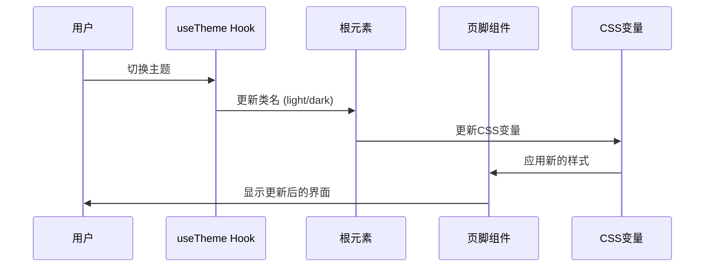
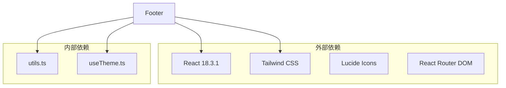
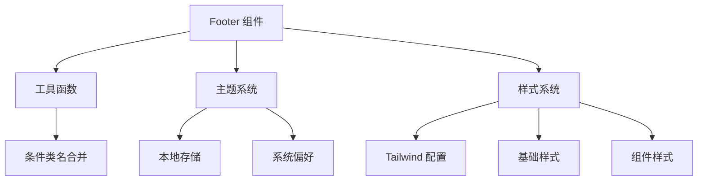

# 页脚组件 (Footer)

<cite>
**本文档引用的文件**
- [Footer.tsx](file://src/components/Footer.tsx)
- [App.tsx](file://src/App.tsx)
- [index.css](file://src/index.css)
- [tailwind.config.ts](file://tailwind.config.ts)
- [useTheme.ts](file://src/hooks/useTheme.ts)
- [About.tsx](file://src/pages/About.tsx)
</cite>

## 目录
1. [简介](#简介)
2. [项目结构](#项目结构)
3. [核心组件](#核心组件)
4. [架构概览](#架构概览)
5. [详细组件分析](#详细组件分析)
6. [依赖关系分析](#依赖关系分析)
7. [性能考虑](#性能考虑)
8. [故障排除指南](#故障排除指南)
9. [结论](#结论)

## 简介

页脚组件（Footer）是本博客项目中负责展示版权信息、社交媒体链接和网站基本信息的重要组件。该组件采用现代化的响应式设计，支持深色/浅色主题切换，并提供了优雅的交互效果和视觉体验。

## 项目结构

该项目采用基于功能模块的组织方式，页脚组件位于 `src/components/` 目录下，与其他核心组件如导航栏、博客卡片等协同工作。

**图表来源**
- [App.tsx:12-32](file://src/App.tsx#L12-L32)
- [Footer.tsx:1-30](file://src/components/Footer.tsx#L1-L30)

**章节来源**
- [App.tsx:1-43](file://src/App.tsx#L1-L43)
- [Footer.tsx:1-30](file://src/components/Footer.tsx#L1-L30)

## 核心组件

### 组件结构分析

页脚组件采用简洁而功能完整的结构设计：

**图表来源**
- [Footer.tsx:1-30](file://src/components/Footer.tsx#L1-L30)

### 核心特性

1. **响应式布局**：使用 `flex-col` 和 `sm:flex-row` 实现移动端和桌面端的不同布局
2. **主题适配**：通过 `theme-transition` 类实现深色/浅色主题的平滑过渡
3. **语义化结构**：使用语义化的 HTML 结构，便于无障碍访问
4. **安全链接**：为外部链接设置适当的 `rel` 属性

**章节来源**
- [Footer.tsx:1-30](file://src/components/Footer.tsx#L1-L30)

## 架构概览

页脚组件在整个应用架构中扮演着重要的角色，它与应用的主要布局紧密集成：

**图表来源**
- [App.tsx:16-31](file://src/App.tsx#L16-L31)
- [Footer.tsx:3-4](file://src/components/Footer.tsx#L3-L4)

**章节来源**
- [App.tsx:1-43](file://src/App.tsx#L1-L43)

## 详细组件分析

### 布局结构详解

页脚组件采用了灵活的布局系统：

**图表来源**
- [Footer.tsx:4-5](file://src/components/Footer.tsx#L4-L5)

### 样式设计分析

组件的样式设计体现了现代网页设计的最佳实践：

#### 颜色系统
- **背景色**：继承自根元素的 `--background` 变量
- **边框色**：使用 `border-border` 类，确保与主题一致
- **文字色**：`text-muted-foreground` 提供合适的对比度
- **悬停色**：`hover:text-foreground` 实现颜色过渡

#### 动画效果
- **主题过渡**：`theme-transition` 类提供平滑的颜色变化
- **链接动画**：`link-underline` 实现下划线的宽度动画效果
- **持续时间**：所有过渡动画使用 `duration-300` 确保流畅体验

**章节来源**
- [Footer.tsx:1-30](file://src/components/Footer.tsx#L1-L30)
- [index.css:108-125](file://src/index.css#L108-L125)
- [index.css:204-210](file://src/index.css#L204-L210)

### 响应式适配

组件实现了完整的响应式设计：

**图表来源**
- [Footer.tsx:5](file://src/components/Footer.tsx#L5)

### 主题集成

页脚组件与全局主题系统无缝集成：

**图表来源**
- [useTheme.ts:15-20](file://src/hooks/useTheme.ts#L15-L20)
- [index.css:41-66](file://src/index.css#L41-L66)

**章节来源**
- [useTheme.ts:1-28](file://src/hooks/useTheme.ts#L1-L28)

## 依赖关系分析

### 外部依赖

页脚组件主要依赖以下外部库和框架：

**图表来源**
- [package.json:11-21](file://package.json#L11-L21)

### 内部依赖关系

**图表来源**
- [Footer.tsx:1-30](file://src/components/Footer.tsx#L1-L30)
- [useTheme.ts:1-28](file://src/hooks/useTheme.ts#L1-L28)

**章节来源**
- [package.json:1-33](file://package.json#L1-L33)

## 性能考虑

### 渲染优化

1. **最小化重排**：使用单一的容器元素避免复杂的DOM层次
2. **样式复用**：通过Tailwind类实现样式的高效复用
3. **事件处理**：链接点击事件简单直接，无额外开销

### 主题切换性能

- **CSS变量更新**：主题切换通过更新CSS变量实现，避免重新渲染整个组件树
- **本地存储缓存**：用户偏好的主题设置存储在localStorage中，减少初始化时间

## 故障排除指南

### 常见问题及解决方案

#### 1. 主题切换不生效
**症状**：切换主题后页脚颜色没有变化
**原因**：根元素类名未正确更新
**解决**：检查 `useTheme` hook 的实现，确认 `document.documentElement` 类名更新逻辑

#### 2. 响应式布局异常
**症状**：在移动设备上链接重叠或布局错乱
**原因**：Tailwind断点配置问题
**解决**：验证 `tailwind.config.ts` 中的 `screens` 配置

#### 3. 链接无法打开
**症状**：点击社交链接无反应
**原因**：缺少 `target="_blank"` 或 `rel` 属性
**解决**：检查链接的 `rel` 属性设置

**章节来源**
- [Footer.tsx:10-24](file://src/components/Footer.tsx#L10-L24)
- [useTheme.ts:15-20](file://src/hooks/useTheme.ts#L15-L20)

## 结论

页脚组件作为博客项目的重要组成部分，展现了现代前端开发的最佳实践。其设计充分考虑了用户体验、可访问性和性能优化，同时保持了代码的简洁性和可维护性。

### 设计亮点

1. **简洁而功能完整**：在有限的空间内提供了必要的信息展示
2. **优雅的交互效果**：通过CSS动画和过渡提供了流畅的用户体验
3. **完善的响应式设计**：适应各种设备和屏幕尺寸
4. **深度的主题集成**：与整体设计系统完美融合

### 改进建议

1. **内容扩展**：可以考虑添加更多社交媒体平台链接
2. **SEO优化**：为链接添加适当的 `aria-label` 属性
3. **无障碍增强**：为外部链接添加 `title` 属性

页脚组件不仅是一个简单的UI组件，更是整个博客项目设计哲学的体现，为用户提供了清晰、一致且美观的浏览体验。