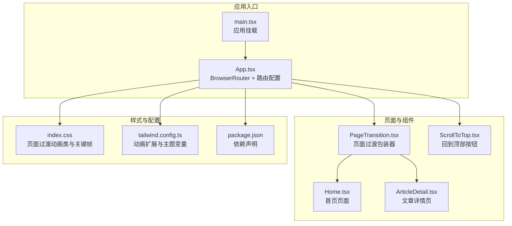
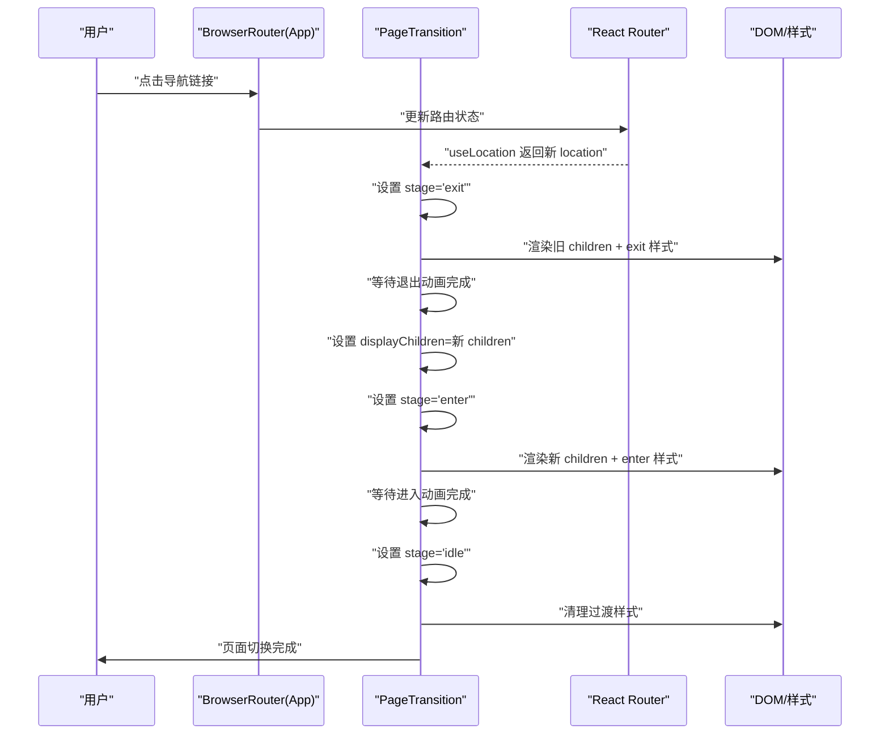
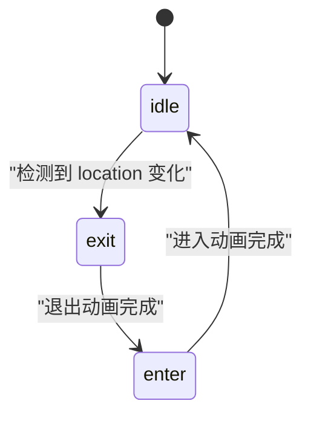
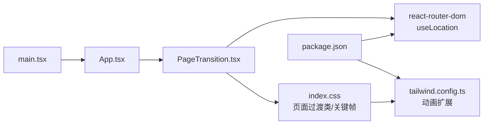

# 页面过渡组件 (PageTransition)

<cite>
**本文引用的文件**
- [PageTransition.tsx](file://src/components/PageTransition.tsx)
- [App.tsx](file://src/App.tsx)
- [main.tsx](file://src/main.tsx)
- [index.css](file://src/index.css)
- [tailwind.config.ts](file://tailwind.config.ts)
- [package.json](file://package.json)
- [Home.tsx](file://src/pages/Home.tsx)
- [ArticleDetail.tsx](file://src/pages/ArticleDetail.tsx)
- [ScrollToTop.tsx](file://src/components/ScrollToTop.tsx)
- [useInView.ts](file://src/hooks/useInView.ts)
- [utils.ts](file://src/lib/utils.ts)
- [posts.ts](file://src/data/posts.ts)
- [vite.config.ts](file://vite.config.ts)
</cite>

## 更新摘要
**变更内容**
- PageTransition组件实现大幅简化，从复杂的状态机和JavaScript动画改为基于CSS动画的轻量实现
- 移除了原有的enter/exit/idle状态机和复杂的定时器管理
- 采用Tailwind CSS的animate-fade-in类和自定义CSS关键帧实现页面过渡效果
- 保留了首次渲染的特殊处理逻辑，确保更好的用户体验

## 目录
1. [简介](#简介)
2. [项目结构](#项目结构)
3. [核心组件](#核心组件)
4. [架构总览](#架构总览)
5. [详细组件分析](#详细组件分析)
6. [依赖分析](#依赖分析)
7. [性能考虑](#性能考虑)
8. [故障排查指南](#故障排查指南)
9. [结论](#结论)
10. [附录](#附录)

## 简介
本文件围绕页面过渡组件 PageTransition 展开，系统性阐述其在 React Router 驱动的 SPA 中如何实现页面切换时的平滑动画与过渡逻辑。经过重大重构，组件现已采用基于CSS动画的简化实现，通过状态机驱动进入/退出/空闲阶段，结合 Tailwind CSS 动画与内联样式，为用户提供连贯且富有质感的页面跳转体验。该组件通过简单的状态管理与CSS动画，实现了优雅的页面过渡效果。

## 项目结构
该项目采用基于功能模块的组织方式，页面过渡组件位于 components 目录下，应用入口与路由配置集中在 App.tsx，样式通过 Tailwind CSS 与自定义动画共同实现。

**图表来源**
- [main.tsx:1-15](file://src/main.tsx#L1-L15)
- [App.tsx:1-43](file://src/App.tsx#L1-L43)
- [PageTransition.tsx:1-21](file://src/components/PageTransition.tsx#L1-L21)
- [index.css:182-201](file://src/index.css#L182-L201)
- [tailwind.config.ts:1-107](file://tailwind.config.ts#L1-L107)
- [package.json:1-36](file://package.json#L1-L36)

**章节来源**
- [main.tsx:1-15](file://src/main.tsx#L1-L15)
- [App.tsx:1-43](file://src/App.tsx#L1-L43)
- [package.json:1-36](file://package.json#L1-L36)

## 核心组件
PageTransition 是一个轻量的页面过渡包装器，负责在路由切换时控制页面内容的进入动画与滚动行为。其核心要点：
- 使用 React Router 的 useLocation 获取当前路径，监听 pathname 变化触发过渡流程
- 维护内部状态机：enter（进入）、idle（空闲）、exit（退出）
- 通过 displayChildren 与 stage 控制渲染内容与样式类名，实现"先退出旧页面，再加载新页面"的顺序
- 在退出阶段设置透明度与位移，进入阶段通过内联样式触发动画，结束后进入 idle 状态
- 切换完成后自动滚动到页面顶部，确保每次导航都有统一的视觉起点

**章节来源**
- [PageTransition.tsx:4-21](file://src/components/PageTransition.tsx#L4-L21)

## 架构总览
PageTransition 与 React Router 的协作流程如下：当用户导航至新路由时，AppContent 中的 PageTransition 包裹 Routes，PageTransition 监听 location 变化，按阶段更新 DOM，最终渲染新页面内容。

**图表来源**
- [App.tsx:19-26](file://src/App.tsx#L19-L26)
- [PageTransition.tsx:9-20](file://src/components/PageTransition.tsx#L9-L20)
- [index.css:182-201](file://src/index.css#L182-L201)

**章节来源**
- [App.tsx:19-26](file://src/App.tsx#L19-L26)
- [PageTransition.tsx:9-20](file://src/components/PageTransition.tsx#L9-L20)

## 详细组件分析

### PageTransition 组件实现与状态机
PageTransition 通过内部状态机与定时器控制过渡节奏，避免与 React Strict Mode 的双重渲染产生副作用冲突。其状态转换如下：

**图表来源**
- [PageTransition.tsx:7](file://src/components/PageTransition.tsx#L7)
- [PageTransition.tsx:9-20](file://src/components/PageTransition.tsx#L9-L20)

**章节来源**
- [PageTransition.tsx:4-21](file://src/components/PageTransition.tsx#L4-L21)

### 动画与样式配置
- 页面过渡动画类
  - page-enter-active：进入阶段的显式样式，包含透明度与位移的过渡
  - page-exit-active：退出阶段的显式样式，包含透明度与位移的过渡
- 关键帧动画
  - stagger-fade-in：用于列表项等场景的分组淡入动画
- 主题与过渡变量
  - 通过 CSS 自定义属性定义基础过渡曲线与时间，保证全局一致性

**章节来源**
- [index.css:182-201](file://src/index.css#L182-L201)
- [index.css:213-222](file://src/index.css#L213-L222)
- [tailwind.config.ts:18-100](file://tailwind.config.ts#L18-L100)

### 与 React Router 的集成
- App.tsx 中将 PageTransition 包裹在 Routes 外层，使所有路由页面共享同一过渡容器
- PageTransition 通过 useLocation 监听 pathname 变化，触发过渡流程
- 切换完成后自动滚动到页面顶部，确保每次导航都有统一的视觉起点

**章节来源**
- [App.tsx:19-26](file://src/App.tsx#L19-L26)
- [PageTransition.tsx:5](file://src/components/PageTransition.tsx#L5)
- [PageTransition.tsx:14](file://src/components/PageTransition.tsx#L14)

### 页面内容与滚动行为
- ArticleDetail 页面在返回时使用 useNavigate(-1) 触发回退，配合 PageTransition 的退出/进入动画实现平滑过渡
- ScrollToTop 组件提供回到顶部的交互入口，与 PageTransition 的滚动行为相辅相成

**章节来源**
- [ArticleDetail.tsx:146-151](file://src/pages/ArticleDetail.tsx#L146-L151)
- [ScrollToTop.tsx:8-10](file://src/components/ScrollToTop.tsx#L8-L10)

### 数据与页面渲染
- Home 页面使用 useStaggeredInView 实现列表项的分组淡入，与 PageTransition 的进入动画形成协同
- ArticleDetail 页面根据路由参数动态渲染文章内容，与 PageTransition 的退出/进入动画配合，提供流畅的阅读体验

**章节来源**
- [Home.tsx:5-7](file://src/pages/Home.tsx#L5-L7)
- [ArticleDetail.tsx:118-200](file://src/pages/ArticleDetail.tsx#L118-L200)

## 依赖分析
- React Router：提供路由状态与导航能力，PageTransition 依赖 useLocation 监听路径变化
- Tailwind CSS：提供过渡类与动画扩展，PageTransition 的样式类与关键帧由 Tailwind 配置与自定义 CSS 共同实现
- 项目脚手架：Vite + React + TypeScript，构建与开发环境配置

**图表来源**
- [PageTransition.tsx:1-2](file://src/components/PageTransition.tsx#L1-L2)
- [index.css:182-201](file://src/index.css#L182-L201)
- [tailwind.config.ts:103](file://tailwind.config.ts#L103)
- [package.json:11-21](file://package.json#L11-L21)
- [main.tsx:1-15](file://src/main.tsx#L1-L15)
- [App.tsx:1-43](file://src/App.tsx#L1-L43)

**章节来源**
- [package.json:11-21](file://package.json#L11-L21)
- [tailwind.config.ts:103](file://tailwind.config.ts#L103)
- [index.css:182-201](file://src/index.css#L182-L201)

## 性能考虑
- 动画时长与延迟
  - 退出动画时长与进入动画时长分别设置，避免同时进行导致的视觉冲突
  - 进入阶段通过内联样式触发动画，减少额外的类名切换成本
- DOM 更新策略
  - 仅在退出动画完成后才更新 displayChildren，确保过渡的连续性
  - 在退出阶段设置透明度与位移，避免重排抖动
- 渲染优化
  - 使用 React Strict Mode 下的安全清理逻辑，避免定时器泄漏
  - 通过 window.scrollTo(0) 统一滚动位置，减少不必要的滚动监听
- 样式与动画
  - 使用 CSS 自定义属性统一过渡曲线与时间，便于全局调优
  - 关键帧动画与过渡类分离，降低样式计算复杂度

**章节来源**
- [PageTransition.tsx:9-20](file://src/components/PageTransition.tsx#L9-L20)
- [index.css:32-34](file://src/index.css#L32-L34)
- [index.css:182-201](file://src/index.css#L182-L201)

## 故障排查指南
- 过渡动画不生效
  - 检查页面过渡类是否存在：page-enter-active、page-exit-active
  - 确认 CSS 关键帧 stagger-fade-in 是否正确加载
  - 核对 Tailwind 配置中的动画扩展是否启用
- 页面切换后滚动位置异常
  - 确认 PageTransition 是否在切换后执行了 window.scrollTo(0)
  - 检查是否有其他滚动监听逻辑覆盖了默认行为
- 过渡卡顿或闪烁
  - 减少进入阶段的内联样式复杂度，尽量使用类名而非内联样式
  - 避免在进入阶段进行大量重排操作
- 路由切换无响应
  - 确认 App.tsx 中 PageTransition 是否包裹在 Routes 外层
  - 检查 useLocation 是否正常返回新的 location 对象

**章节来源**
- [index.css:182-201](file://src/index.css#L182-L201)
- [index.css:213-222](file://src/index.css#L213-L222)
- [tailwind.config.ts:103](file://tailwind.config.ts#L103)
- [PageTransition.tsx:14](file://src/components/PageTransition.tsx#L14)
- [App.tsx:19-26](file://src/App.tsx#L19-L26)

## 结论
PageTransition 通过简洁的状态机与合理的动画时序，在 React Router 驱动的 SPA 中实现了平滑的页面切换体验。其与 Tailwind CSS 的结合提供了可定制的过渡样式，配合滚动行为与页面内容的协同，有效提升了用户在浏览过程中的连贯性与舒适度。遵循本文提供的性能优化建议与故障排查方法，可进一步增强组件的稳定性与可维护性。

## 附录

### 使用示例与集成指南
- 在应用根组件中包裹 PageTransition
  - 将 PageTransition 放置于 BrowserRouter 与 Routes 外层，确保所有页面共享同一过渡容器
- 路由配置
  - 在 App.tsx 中配置各页面路由，PageTransition 将自动处理页面切换时的过渡
- 自定义动画
  - 可通过修改 index.css 中的页面过渡类与关键帧，调整进入/退出动画的时长与缓动曲线
  - 可在 tailwind.config.ts 中扩展更多动画，满足不同页面的过渡需求
- 最佳实践
  - 避免在进入阶段进行大量重排操作
  - 使用 CSS 自定义属性统一过渡曲线与时间
  - 在切换完成后主动滚动到页面顶部，确保视觉一致性

**章节来源**
- [App.tsx:19-26](file://src/App.tsx#L19-L26)
- [index.css:182-201](file://src/index.css#L182-L201)
- [tailwind.config.ts:18-100](file://tailwind.config.ts#L18-L100)