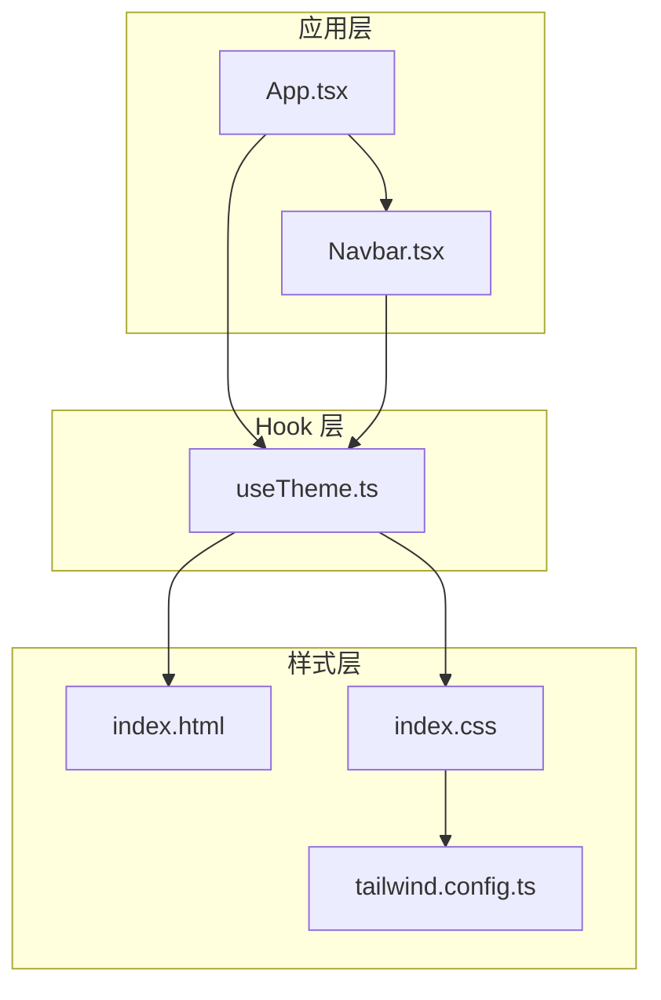
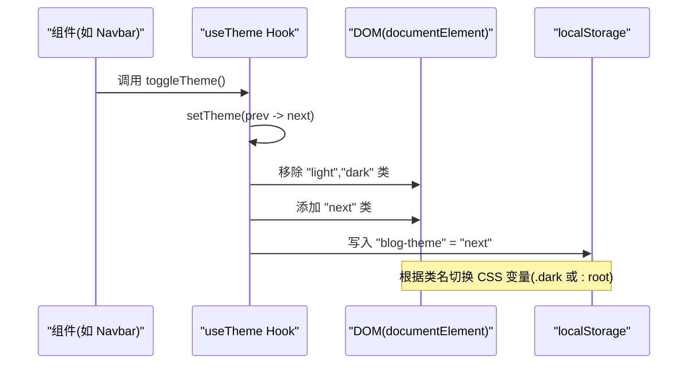
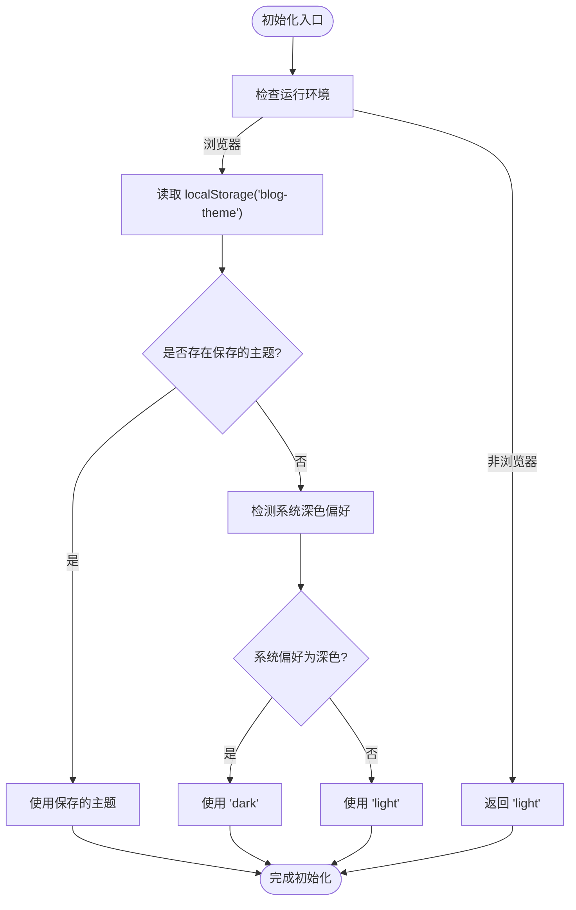
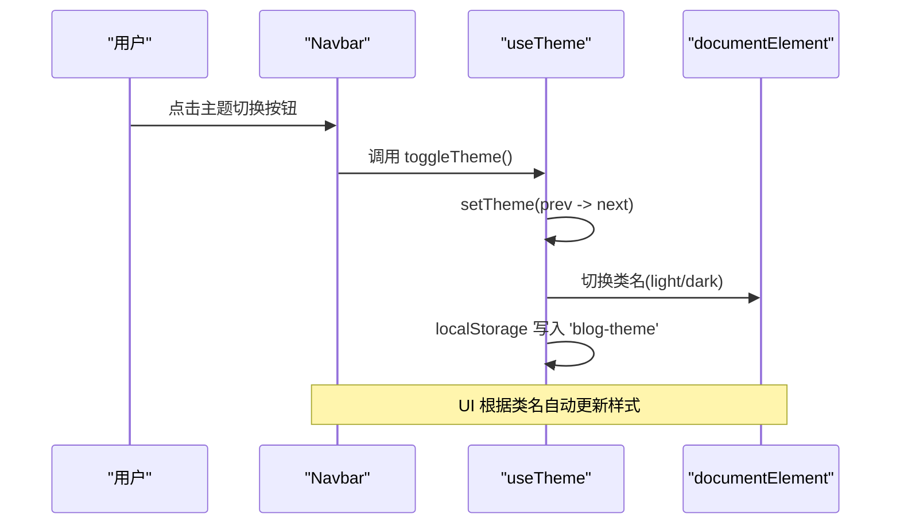
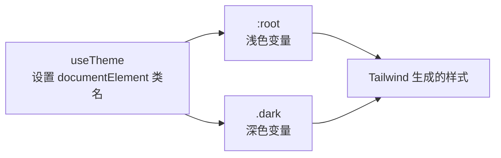
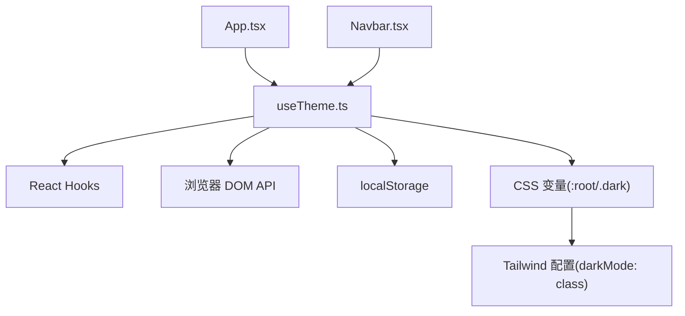

# 主题管理Hook (useTheme)

<cite>
**本文档引用的文件**
- [useTheme.ts](file://src/hooks/useTheme.ts)
- [App.tsx](file://src/App.tsx)
- [Navbar.tsx](file://src/components/Navbar.tsx)
- [tailwind.config.ts](file://tailwind.config.ts)
- [index.css](file://src/index.css)
- [index.html](file://index.html)
- [package.json](file://package.json)
</cite>

## 目录
1. [简介](#简介)
2. [项目结构](#项目结构)
3. [核心组件](#核心组件)
4. [架构总览](#架构总览)
5. [详细组件分析](#详细组件分析)
6. [依赖关系分析](#依赖关系分析)
7. [性能考虑](#性能考虑)
8. [故障排除指南](#故障排除指南)
9. [结论](#结论)
10. [附录](#附录)

## 简介
本文件围绕 useTheme 自定义 Hook 提供系统性文档，涵盖主题状态管理的实现原理（本地存储持久化、系统主题偏好检测、动态 DOM 类名切换）、初始化逻辑、状态更新流程与副作用处理，并结合项目中的实际使用场景（如导航栏主题切换按钮）进行说明。同时给出与 Tailwind CSS 暗色模式类别的集成方式、性能优化策略、内存管理技巧、错误处理与边界情况处理方案，以及扩展与定制指导，帮助开发者快速理解并安全地在组件中集成主题切换功能。

## 项目结构
本项目采用 React + Vite + Tailwind CSS 技术栈，主题管理通过自定义 Hook 实现，UI 组件通过 props 接收主题状态与切换函数，样式系统基于 Tailwind 的 class 驱动暗色模式。

图表来源
- [App.tsx:12-32](file://src/App.tsx#L12-L32)
- [Navbar.tsx:18-63](file://src/components/Navbar.tsx#L18-L63)
- [useTheme.ts:5-27](file://src/hooks/useTheme.ts#L5-L27)
- [index.html:11-14](file://index.html#L11-L14)
- [index.css:41-66](file://src/index.css#L41-L66)
- [tailwind.config.ts:4](file://tailwind.config.ts#L4)

章节来源
- [App.tsx:12-32](file://src/App.tsx#L12-L32)
- [Navbar.tsx:18-63](file://src/components/Navbar.tsx#L18-L63)
- [useTheme.ts:5-27](file://src/hooks/useTheme.ts#L5-L27)
- [index.html:11-14](file://index.html#L11-L14)
- [index.css:41-66](file://src/index.css#L41-L66)
- [tailwind.config.ts:4](file://tailwind.config.ts#L4)

## 核心组件
- useTheme Hook：负责主题状态的初始化、持久化与 DOM 类名同步，提供主题值与切换函数。
- Navbar 组件：接收主题状态与切换函数，渲染主题切换按钮并根据当前主题显示不同图标。
- App.tsx：应用入口，注入路由与页面组件，调用 useTheme 并将主题状态传递给 Navbar。
- Tailwind 配置：启用 class 驱动的暗色模式，使根元素的类名决定样式变量。
- 样式表：定义 :root 与 .dark 两套 CSS 变量，配合类名切换实现主题切换。

章节来源
- [useTheme.ts:5-27](file://src/hooks/useTheme.ts#L5-L27)
- [Navbar.tsx:18-63](file://src/components/Navbar.tsx#L18-L63)
- [App.tsx:12-32](file://src/App.tsx#L12-L32)
- [tailwind.config.ts:4](file://tailwind.config.ts#L4)
- [index.css:41-66](file://src/index.css#L41-L66)

## 架构总览
useTheme Hook 的工作流如下：
- 初始化阶段：优先从本地存储读取主题；若不存在则根据系统偏好检测默认主题；否则回退到 light。
- 更新阶段：当主题变化时，移除根元素上的 light/dark 类，添加新的主题类，并将新主题写入本地存储。
- 外部交互：组件通过调用 toggleTheme 切换主题，从而触发上述流程。

图表来源
- [useTheme.ts:15-20](file://src/hooks/useTheme.ts#L15-L20)
- [useTheme.ts:22-24](file://src/hooks/useTheme.ts#L22-L24)
- [index.css:41-66](file://src/index.css#L41-L66)

## 详细组件分析

### useTheme Hook 实现解析
- 类型与状态
  - 主题类型限定为 'light' | 'dark'。
  - 使用 useState 初始化主题，初始值通过惰性初始化函数确定。
- 初始化逻辑
  - 若运行环境非浏览器（SSR），直接返回 'light'。
  - 否则尝试从 localStorage 读取保存的主题；若存在则使用该值。
  - 若无本地存储记录，则根据系统偏好检测是否为深色模式，决定默认主题。
  - 若均不可用，回退到 'light'。
- 副作用与 DOM 同步
  - 依赖数组包含 theme，每次主题变化时执行副作用。
  - 获取 document.documentElement，先移除 'light' 和 'dark' 类，再添加当前主题类，确保仅保留一个主题类。
  - 将主题写入 localStorage，键名为 'blog-theme'。
- 切换函数
  - 使用 useCallback 包裹，避免在渲染期间产生新的函数实例，减少下游组件重渲染。
  - 切换逻辑为三元表达式：light <-> dark 循环切换。

图表来源
- [useTheme.ts:6-13](file://src/hooks/useTheme.ts#L6-L13)

章节来源
- [useTheme.ts:5-27](file://src/hooks/useTheme.ts#L5-L27)

### 组件集成与使用示例
- 在 App.tsx 中调用 useTheme，解构出 theme 与 toggleTheme，并将其传递给 Navbar。
- 在 Navbar.tsx 中，按钮点击事件绑定 toggleTheme，图标根据当前主题动态显示太阳或月亮。
- 这种模式可推广到任意需要主题切换的组件，只需接收 theme 与 toggleTheme 两个参数。

图表来源
- [App.tsx:13](file://src/App.tsx#L13)
- [Navbar.tsx:57-62](file://src/components/Navbar.tsx#L57-L62)
- [useTheme.ts:22-24](file://src/hooks/useTheme.ts#L22-L24)

章节来源
- [App.tsx:12-32](file://src/App.tsx#L12-L32)
- [Navbar.tsx:18-63](file://src/components/Navbar.tsx#L18-L63)
- [useTheme.ts:22-24](file://src/hooks/useTheme.ts#L22-L24)

### Tailwind CSS 暗色模式集成
- 配置启用
  - tailwind.config.ts 中设置 darkMode: ["class"]，表示使用类名驱动暗色模式。
- 样式变量映射
  - index.css 定义了 :root 与 .dark 两套 CSS 变量，分别对应浅色与深色主题的颜色体系。
- DOM 类名同步
  - useTheme 在副作用中为 document.documentElement 添加/移除 'light'/'dark' 类，从而触发布局层的 CSS 变量切换，实现全局主题变更。

图表来源
- [tailwind.config.ts:4](file://tailwind.config.ts#L4)
- [index.css:6-66](file://src/index.css#L6-L66)
- [useTheme.ts:15-20](file://src/hooks/useTheme.ts#L15-L20)

章节来源
- [tailwind.config.ts:4](file://tailwind.config.ts#L4)
- [index.css:6-66](file://src/index.css#L6-L66)
- [useTheme.ts:15-20](file://src/hooks/useTheme.ts#L15-L20)

## 依赖关系分析
- useTheme 依赖
  - React 核心 API：useState、useEffect、useCallback。
  - 浏览器 API：window、localStorage、matchMedia、documentElement。
- 样式与配置依赖
  - Tailwind CSS：class 驱动的暗色模式。
  - CSS 变量：:root 与 .dark 定义颜色体系。
- 组件依赖
  - App.tsx 作为容器组件，注入路由与页面组件，并向子组件传递主题状态。
  - Navbar 作为展示组件，消费主题状态并触发切换。

图表来源
- [useTheme.ts:1-27](file://src/hooks/useTheme.ts#L1-L27)
- [tailwind.config.ts:4](file://tailwind.config.ts#L4)
- [index.css:6-66](file://src/index.css#L6-L66)
- [App.tsx:12-32](file://src/App.tsx#L12-L32)
- [Navbar.tsx:18-63](file://src/components/Navbar.tsx#L18-L63)

章节来源
- [useTheme.ts:1-27](file://src/hooks/useTheme.ts#L1-L27)
- [tailwind.config.ts:4](file://tailwind.config.ts#L4)
- [index.css:6-66](file://src/index.css#L6-L66)
- [App.tsx:12-32](file://src/App.tsx#L12-L32)
- [Navbar.tsx:18-63](file://src/components/Navbar.tsx#L18-L63)

## 性能考虑
- 函数稳定性
  - 使用 useCallback 包裹 toggleTheme，避免每次渲染都产生新的函数实例，降低下游组件不必要的重渲染。
- 副作用最小化
  - useEffect 仅监听 theme，且只做类名切换与本地存储写入，开销极小。
- 本地存储访问
  - 仅在主题变化时写入一次，避免频繁 IO。
- 样式切换成本
  - 通过为根元素添加单一类名实现主题切换，样式计算成本低，且由 Tailwind 生成的原子类进一步降低选择器复杂度。
- SSR 兼容
  - 初始化时对运行环境进行判断，避免在 SSR 期间访问浏览器 API，防止报错与不必要计算。

章节来源
- [useTheme.ts:22-24](file://src/hooks/useTheme.ts#L22-L24)
- [useTheme.ts:15-20](file://src/hooks/useTheme.ts#L15-L20)
- [useTheme.ts:6-13](file://src/hooks/useTheme.ts#L6-L13)

## 故障排除指南
- 本地存储异常
  - 场景：localStorage 不可用或被禁用。
  - 影响：无法读取或写入主题，初始化将回退到 'light'。
  - 建议：在生产环境中捕获异常并降级处理；或在初始化前进行能力检测。
- 浏览器 API 访问限制
  - 场景：SSR 环境或受限沙箱。
  - 影响：window、localStorage、matchMedia 可能未定义。
  - 建议：确保在客户端渲染阶段调用 useTheme；或在服务端渲染时提供默认主题。
- 类名冲突
  - 场景：手动添加了与主题类同名的类。
  - 影响：类名切换可能失效或样式异常。
  - 建议：统一通过 useTheme 控制主题类，避免手动干预根元素类名。
- 样式未生效
  - 场景：Tailwind 配置未启用 class 模式或未正确引入 CSS。
  - 影响：切换主题后样式不变。
  - 建议：确认 tailwind.config.ts 的 darkMode 设置与 index.css 的引入顺序。

章节来源
- [useTheme.ts:6-13](file://src/hooks/useTheme.ts#L6-L13)
- [useTheme.ts:15-20](file://src/hooks/useTheme.ts#L15-L20)
- [tailwind.config.ts:4](file://tailwind.config.ts#L4)
- [index.css:41-66](file://src/index.css#L41-L66)

## 结论
useTheme Hook 以极简的实现提供了完整的主题状态管理：初始化时兼顾本地存储与系统偏好，副作用中通过根元素类名同步样式，切换函数稳定高效。结合 Tailwind 的 class 暗色模式与 CSS 变量，实现了高性能、可维护的主题切换体验。建议在生产环境中增加异常处理与能力检测，并保持类名控制的集中化，以获得更稳健的用户体验。

## 附录

### 扩展与定制指导
- 支持更多主题
  - 新增主题类型与类名，扩展 useTheme 的状态与切换逻辑，并在 index.css 中补充对应 CSS 变量。
- 自定义存储键名
  - 修改 localStorage 键名以适配多站点或多用户场景。
- 系统偏好监听
  - 可选：监听 window.matchMedia('prefers-color-scheme: dark') 的变化，实现系统主题变化时的自动切换。
- 动画与过渡
  - 可在 index.css 中为主题切换添加过渡动画，提升视觉体验。
- SSR 主题预设
  - 在服务端渲染时根据请求头或静态资源预设主题，避免首屏闪烁。
- 多用户配置
  - 将主题存储迁移至用户上下文或后端配置，实现跨设备一致的主题体验。

章节来源
- [useTheme.ts:5-27](file://src/hooks/useTheme.ts#L5-L27)
- [index.css:41-66](file://src/index.css#L41-L66)