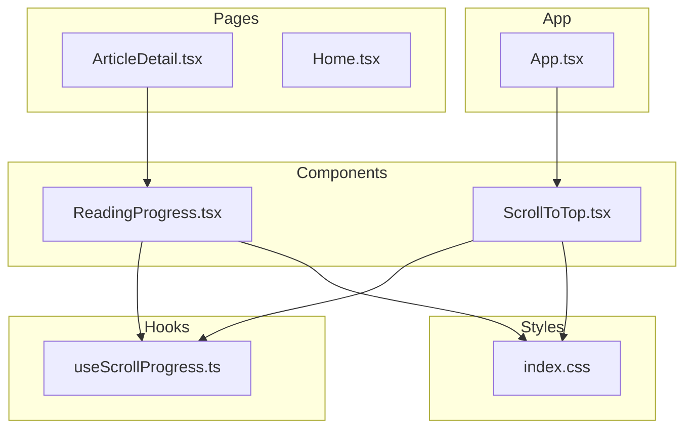
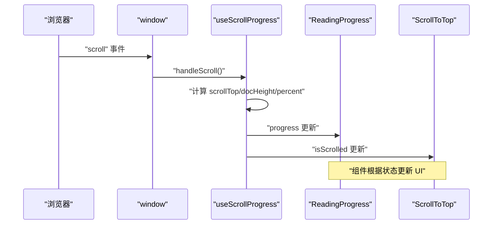
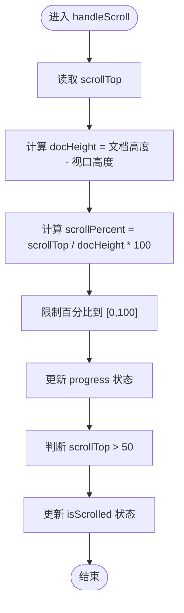
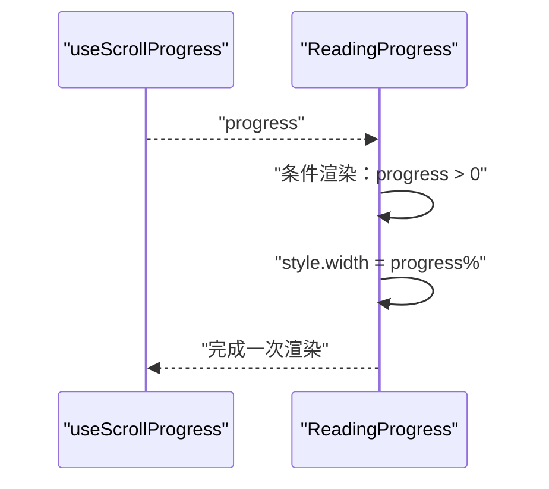
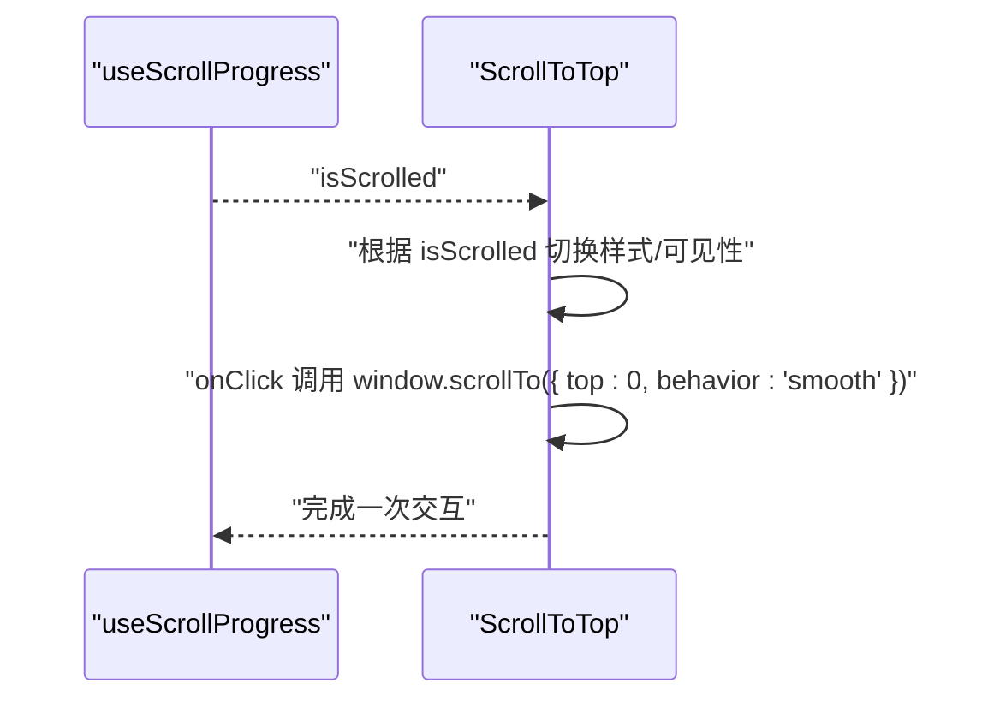
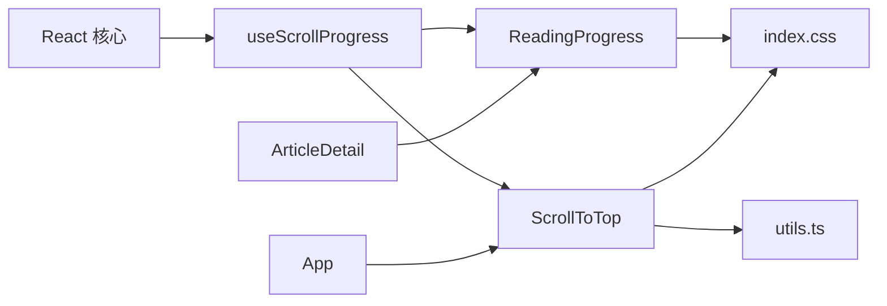

# 滚动进度Hook (useScrollProgress)

<cite>
**本文引用的文件列表**
- [useScrollProgress.ts](file://src/hooks/useScrollProgress.ts)
- [ReadingProgress.tsx](file://src/components/ReadingProgress.tsx)
- [ScrollToTop.tsx](file://src/components/ScrollToTop.tsx)
- [App.tsx](file://src/App.tsx)
- [ArticleDetail.tsx](file://src/pages/ArticleDetail.tsx)
- [index.css](file://src/index.css)
- [utils.ts](file://src/lib/utils.ts)
- [Home.tsx](file://src/pages/Home.tsx)
</cite>

## 目录
1. [简介](#简介)
2. [项目结构](#项目结构)
3. [核心组件](#核心组件)
4. [架构总览](#架构总览)
5. [详细组件分析](#详细组件分析)
6. [依赖关系分析](#依赖关系分析)
7. [性能考量](#性能考量)
8. [故障排查指南](#故障排查指南)
9. [结论](#结论)
10. [附录：扩展与定制](#附录扩展与定制)

## 简介
本文件围绕 useScrollProgress 自定义 Hook 提供系统化文档，涵盖滚动事件监听机制、滚动进度计算算法、状态管理与防抖策略、内存清理与事件解绑、与页面布局变化的响应处理，以及在实际组件中的使用方式（阅读进度条、滚动指示器、页面导航）。同时给出可扩展的定制建议，帮助开发者在不同场景下灵活应用该 Hook。

## 项目结构
useScrollProgress 位于 hooks 目录中，配合组件 ReadingProgress 和 ScrollToTop 使用；在 App 中统一渲染 ScrollToTop，文章详情页 ArticleDetail 中集成 ReadingProgress。

图表来源
- [useScrollProgress.ts:1-23](file://src/hooks/useScrollProgress.ts#L1-L23)
- [ReadingProgress.tsx:1-19](file://src/components/ReadingProgress.tsx#L1-L19)
- [ScrollToTop.tsx:1-30](file://src/components/ScrollToTop.tsx#L1-L30)
- [App.tsx:1-43](file://src/App.tsx#L1-L43)
- [ArticleDetail.tsx:1-201](file://src/pages/ArticleDetail.tsx#L1-L201)
- [index.css:161-170](file://src/index.css#L161-L170)

章节来源
- [useScrollProgress.ts:1-23](file://src/hooks/useScrollProgress.ts#L1-L23)
- [ReadingProgress.tsx:1-19](file://src/components/ReadingProgress.tsx#L1-L19)
- [ScrollToTop.tsx:1-30](file://src/components/ScrollToTop.tsx#L1-L30)
- [App.tsx:1-43](file://src/App.tsx#L1-L43)
- [ArticleDetail.tsx:1-201](file://src/pages/ArticleDetail.tsx#L1-L201)
- [index.css:161-170](file://src/index.css#L161-L170)

## 核心组件
- useScrollProgress：提供滚动进度百分比与“是否已滚动”状态，内部通过 window.scrollY、document.documentElement.scrollHeight、window.innerHeight 计算进度，并在卸载时移除滚动事件监听。
- ReadingProgress：基于 useScrollProgress 的进度值渲染一条固定在顶部的进度条。
- ScrollToTop：基于 useScrollProgress 的 isScrolled 状态控制按钮显示/隐藏，并提供平滑滚动到顶部的行为。

章节来源
- [useScrollProgress.ts:1-23](file://src/hooks/useScrollProgress.ts#L1-L23)
- [ReadingProgress.tsx:1-19](file://src/components/ReadingProgress.tsx#L1-L19)
- [ScrollToTop.tsx:1-30](file://src/components/ScrollToTop.tsx#L1-L30)

## 架构总览
useScrollProgress 将滚动事件监听与状态更新封装为 Hook，ReadingProgress 与 ScrollToTop 作为消费方，分别用于 UI 展示与交互行为。整体采用“事件监听 + 状态分发”的模式，避免在多个组件中重复实现相同的逻辑。

图表来源
- [useScrollProgress.ts:7-19](file://src/hooks/useScrollProgress.ts#L7-L19)
- [ReadingProgress.tsx:3-18](file://src/components/ReadingProgress.tsx#L3-L18)
- [ScrollToTop.tsx:5-29](file://src/components/ScrollToTop.tsx#L5-L29)

## 详细组件分析

### useScrollProgress 实现机制
- 状态管理
  - progress：滚动进度百分比，范围限制在 0–100。
  - isScrolled：是否超过阈值（默认 50 像素）以决定 UI 行为（如显示回到顶部按钮）。
- 事件监听与清理
  - 在组件挂载时添加滚动事件监听，使用 { passive: true } 提升滚动性能。
  - 在卸载时移除监听，防止内存泄漏。
- 进度计算算法
  - scrollTop：当前滚动偏移量。
  - docHeight：文档总高度减去视口高度，确保当内容不足一屏时不产生负值或除零错误。
  - scrollPercent：scrollTop / docHeight × 100，边界值通过 Math.min/Math.max 限制在 0–100。
  - 阈值判断：scrollTop > 50 触发 isScrolled 为真。

图表来源
- [useScrollProgress.ts:8-15](file://src/hooks/useScrollProgress.ts#L8-L15)

章节来源
- [useScrollProgress.ts:1-23](file://src/hooks/useScrollProgress.ts#L1-L23)

### ReadingProgress 组件
- 功能：渲染一条固定在页面顶部的进度条，宽度随滚动进度变化。
- 无障碍属性：提供 role="progressbar" 与 aria-* 属性，便于屏幕阅读器识别。
- 条件渲染：当进度小于等于 0 时不渲染，避免无意义的空元素。

图表来源
- [ReadingProgress.tsx:3-18](file://src/components/ReadingProgress.tsx#L3-L18)
- [useScrollProgress.ts:21-21](file://src/hooks/useScrollProgress.ts#L21-L21)

章节来源
- [ReadingProgress.tsx:1-19](file://src/components/ReadingProgress.tsx#L1-L19)
- [index.css:161-170](file://src/index.css#L161-L170)

### ScrollToTop 组件
- 功能：当页面滚动超过阈值时显示“回到顶部”按钮，点击后平滑滚动至顶部。
- 样式：使用工具函数合并类名，结合 CSS 变换实现显隐与动画效果。
- 可访问性：提供 aria-label。

图表来源
- [ScrollToTop.tsx:5-29](file://src/components/ScrollToTop.tsx#L5-L29)
- [utils.ts:4-6](file://src/lib/utils.ts#L4-L6)
- [index.css:161-170](file://src/index.css#L161-L170)

章节来源
- [ScrollToTop.tsx:1-30](file://src/components/ScrollToTop.tsx#L1-L30)
- [utils.ts:1-7](file://src/lib/utils.ts#L1-L7)

### App 与页面集成
- App 中统一渲染 ScrollToTop，确保全局可用。
- ArticleDetail 页面中渲染 ReadingProgress，用于文章阅读进度可视化。
- Home 页面不直接使用 useScrollProgress，但不影响其他页面的功能。

章节来源
- [App.tsx:1-43](file://src/App.tsx#L1-L43)
- [ArticleDetail.tsx:140-145](file://src/pages/ArticleDetail.tsx#L140-L145)

## 依赖关系分析
- useScrollProgress 依赖 React 的 useState 与 useEffect 生命周期。
- ReadingProgress 依赖 useScrollProgress 的返回值，样式来自 index.css。
- ScrollToTop 依赖 useScrollProgress 的返回值与工具函数 cn，样式来自 index.css。
- App 作为容器组件，负责路由与全局组件的组合。

图表来源
- [useScrollProgress.ts:1-23](file://src/hooks/useScrollProgress.ts#L1-L23)
- [ReadingProgress.tsx:1-19](file://src/components/ReadingProgress.tsx#L1-L19)
- [ScrollToTop.tsx:1-30](file://src/components/ScrollToTop.tsx#L1-L30)
- [utils.ts:1-7](file://src/lib/utils.ts#L1-L7)
- [index.css:161-170](file://src/index.css#L161-L170)
- [App.tsx:1-43](file://src/App.tsx#L1-L43)
- [ArticleDetail.tsx:140-145](file://src/pages/ArticleDetail.tsx#L140-L145)

章节来源
- [useScrollProgress.ts:1-23](file://src/hooks/useScrollProgress.ts#L1-L23)
- [ReadingProgress.tsx:1-19](file://src/components/ReadingProgress.tsx#L1-L19)
- [ScrollToTop.tsx:1-30](file://src/components/ScrollToTop.tsx#L1-L30)
- [utils.ts:1-7](file://src/lib/utils.ts#L1-L7)
- [index.css:161-170](file://src/index.css#L161-L170)
- [App.tsx:1-43](file://src/App.tsx#L1-L43)
- [ArticleDetail.tsx:140-145](file://src/pages/ArticleDetail.tsx#L140-L145)

## 性能考量
- 事件监听优化
  - 使用 { passive: true } 注册滚动监听，减少主线程阻塞风险，提升滚动流畅度。
- 状态更新频率
  - 当前实现会在每次滚动事件触发时更新状态。对于高频滚动，可考虑引入节流（throttle）或防抖（debounce）策略，以降低重渲染次数。
- 边界值处理
  - 通过 Math.min/Math.max 限制进度范围，避免异常值导致 UI 异常。
- 内存与资源
  - 在卸载时移除事件监听，防止内存泄漏与悬挂回调。

章节来源
- [useScrollProgress.ts:17-19](file://src/hooks/useScrollProgress.ts#L17-L19)

## 故障排查指南
- 进度条不显示
  - 检查 ReadingProgress 是否正确接收 progress 并进行条件渲染。
  - 确认 index.css 中的 .reading-progress 样式是否生效。
- 按钮不出现
  - 检查 isScrolled 阈值是否合理，确认滚动距离是否超过 50 像素。
  - 确认 ScrollToTop 的样式切换逻辑与 CSS 类名合并是否正确。
- 滚动卡顿
  - 考虑对滚动事件进行节流或防抖处理，减少状态更新频率。
- 文档高度异常
  - 确保文档内容足够长以产生滚动；若内容较短，docHeight 会为 0，进度应保持为 0。

章节来源
- [ReadingProgress.tsx:6-6](file://src/components/ReadingProgress.tsx#L6-L6)
- [ScrollToTop.tsx:20-23](file://src/components/ScrollToTop.tsx#L20-L23)
- [index.css:161-170](file://src/index.css#L161-L170)
- [useScrollProgress.ts:10-15](file://src/hooks/useScrollProgress.ts#L10-L15)

## 结论
useScrollProgress 以简洁的方式实现了滚动进度计算与状态分发，配合 ReadingProgress 与 ScrollToTop 形成了完整的阅读体验增强方案。其事件监听采用被动模式，具备良好的性能基础；通过合理的边界处理与内存清理，保证了稳定性。未来可在滚动事件上引入节流/防抖策略，进一步优化高频滚动场景下的性能表现。

## 附录：扩展与定制
- 参数化配置
  - 可扩展为支持自定义阈值（如滚动阈值、最大/最小进度范围、是否启用被动监听等），通过 Hook 参数传入。
- 多目标进度
  - 支持对特定 DOM 区域（如文章主体）计算进度，而非整页滚动，需传入目标元素并使用 getBoundingClientRect 计算相对位置。
- 动画与插值
  - 对进度更新增加缓动或插值，使 UI 进度条更顺滑。
- 主题与样式
  - 将样式变量抽取为主题 token，便于在深色/浅色模式下动态调整颜色与尺寸。
- 无障碍增强
  - 为进度条补充实时数值播报，或在按钮上提供键盘可达性与焦点管理。
- 与布局变化联动
  - 监听 resize 或布局变化事件，在变化后重新计算 docHeight 与阈值，确保精度。

章节来源
- [useScrollProgress.ts:3-22](file://src/hooks/useScrollProgress.ts#L3-L22)
- [ReadingProgress.tsx:8-17](file://src/components/ReadingProgress.tsx#L8-L17)
- [ScrollToTop.tsx:8-10](file://src/components/ScrollToTop.tsx#L8-L10)
- [index.css:161-170](file://src/index.css#L161-L170)