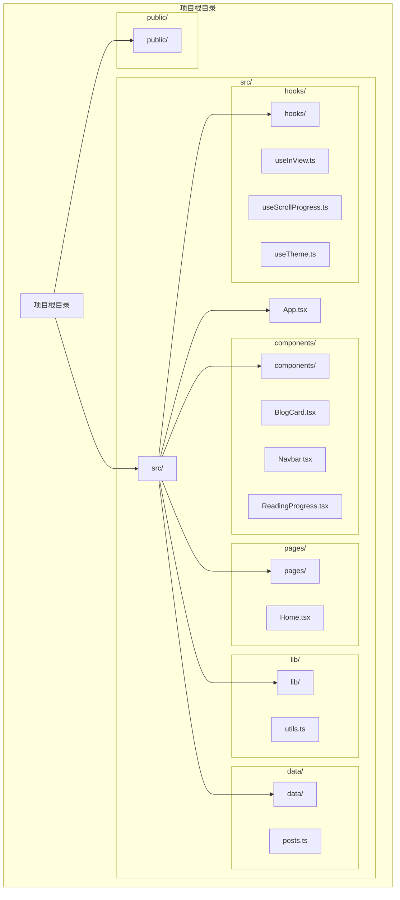
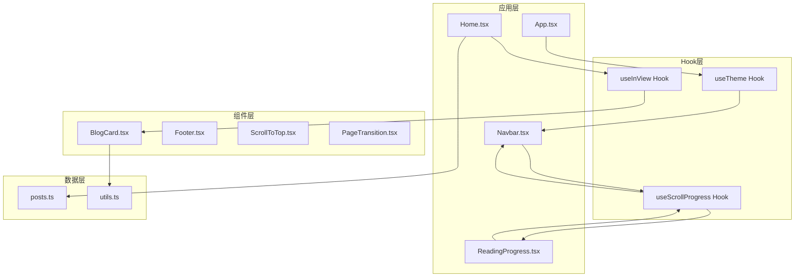
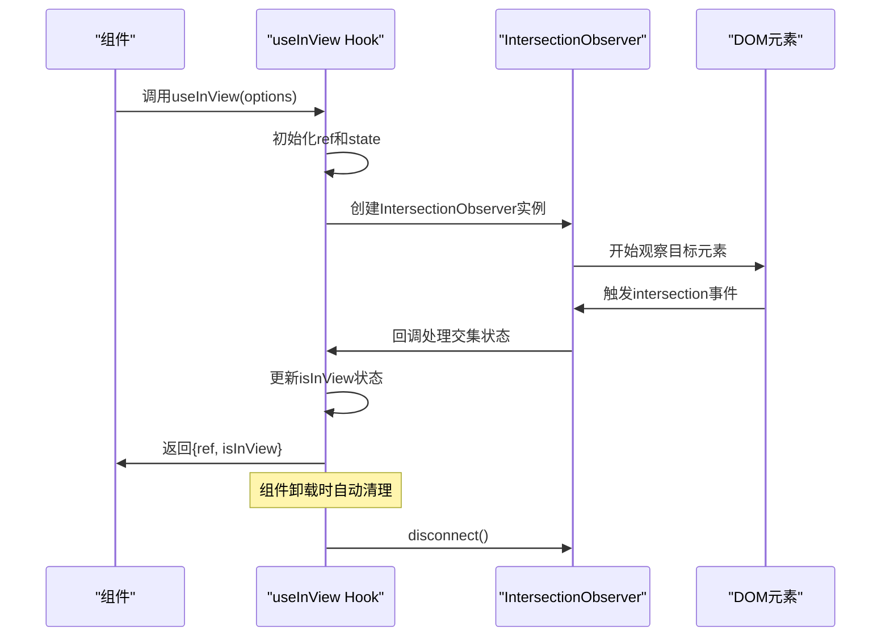
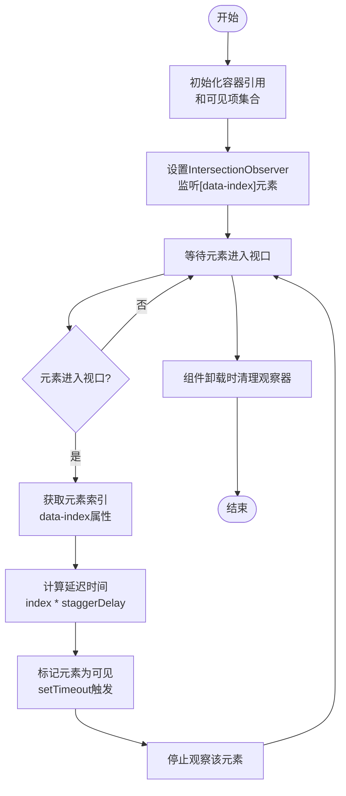
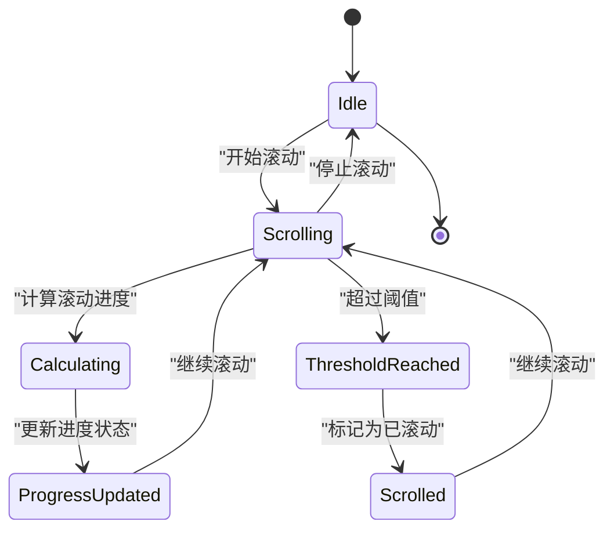
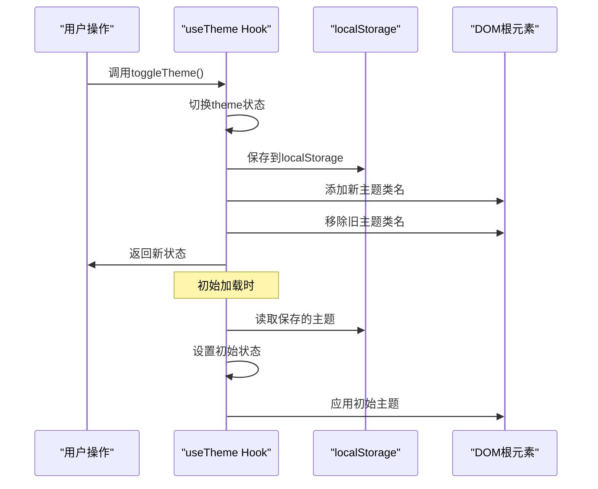
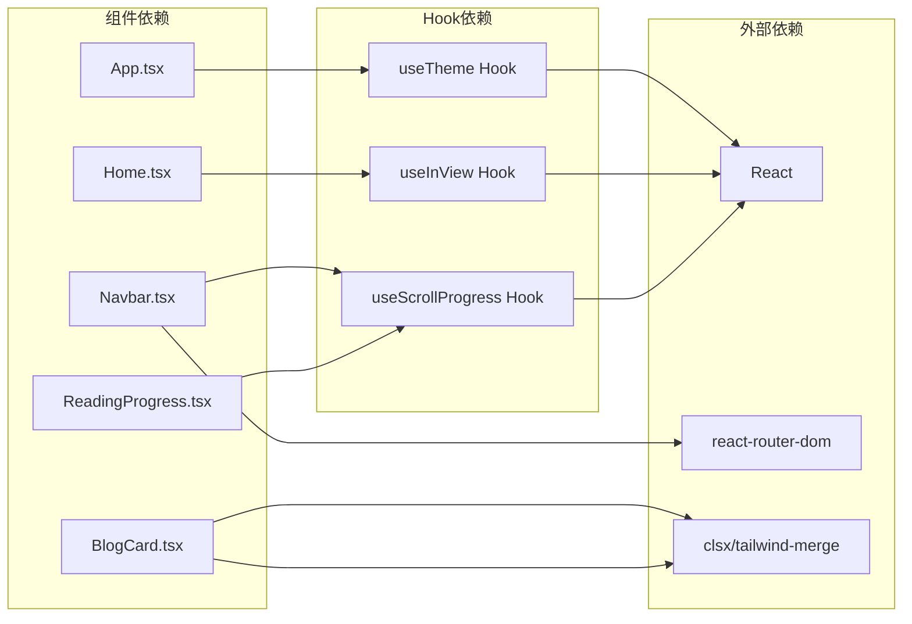
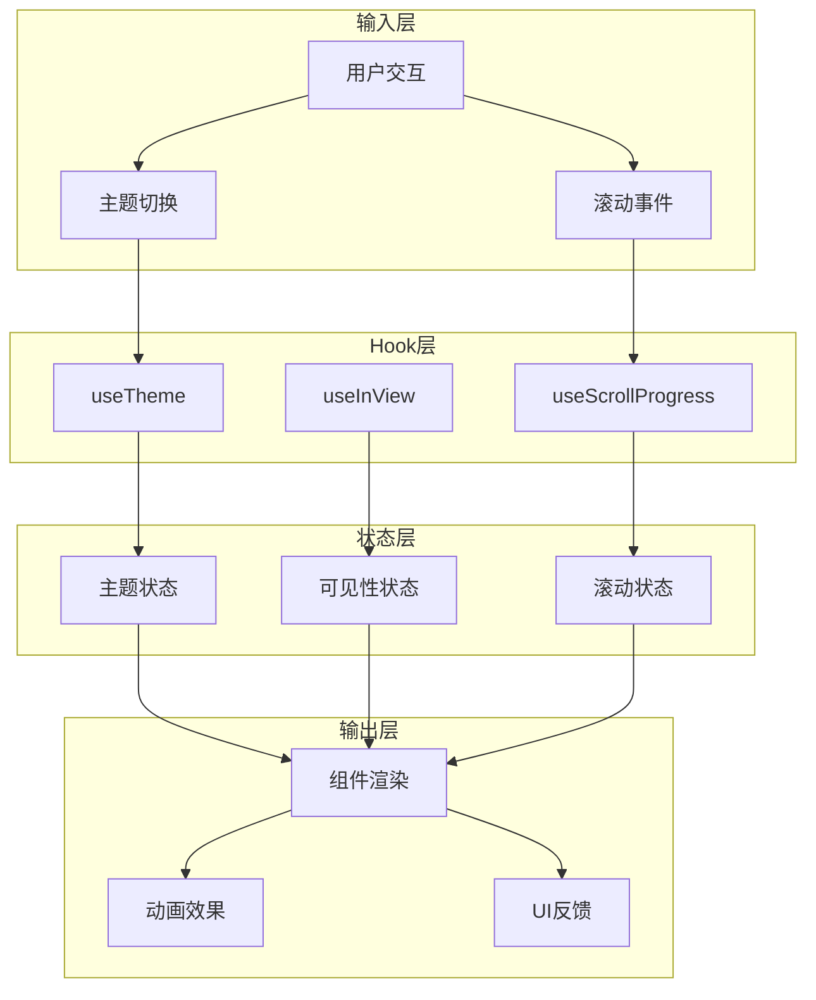
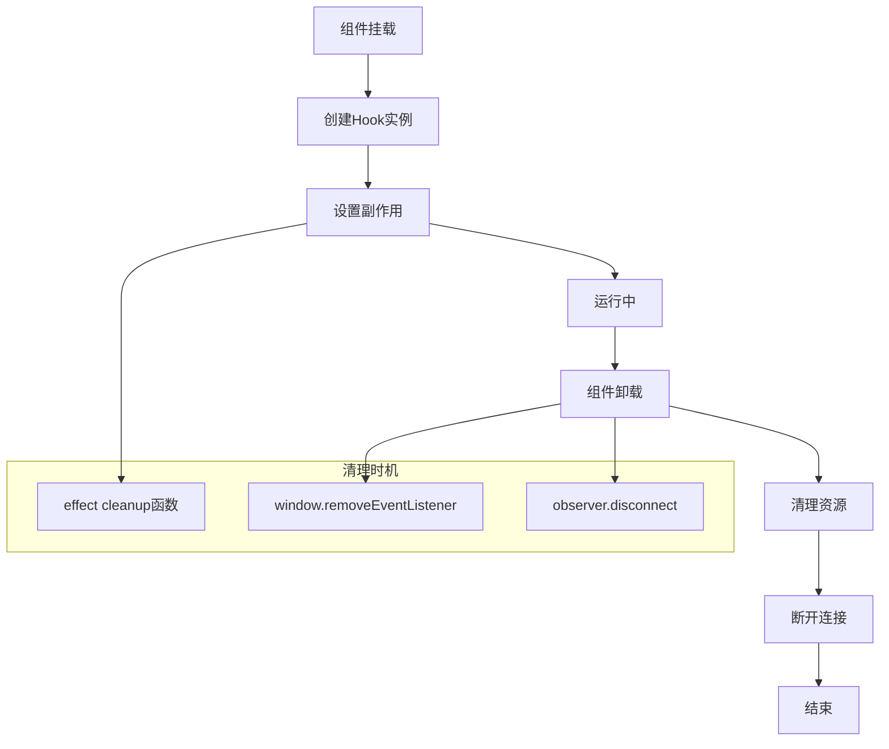
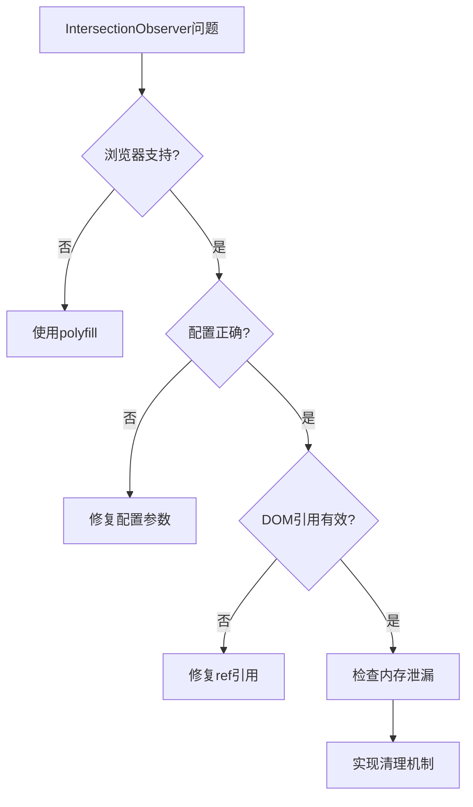

# 自定义Hook系统

<cite>
**本文档引用的文件**
- [useInView.ts](file://src/hooks/useInView.ts)
- [useScrollProgress.ts](file://src/hooks/useScrollProgress.ts)
- [useTheme.ts](file://src/hooks/useTheme.ts)
- [utils.ts](file://src/lib/utils.ts)
- [BlogCard.tsx](file://src/components/BlogCard.tsx)
- [ReadingProgress.tsx](file://src/components/ReadingProgress.tsx)
- [Navbar.tsx](file://src/components/Navbar.tsx)
- [Home.tsx](file://src/pages/Home.tsx)
- [posts.ts](file://src/data/posts.ts)
- [App.tsx](file://src/App.tsx)
- [package.json](file://package.json)
</cite>

## 目录
1. [简介](#简介)
2. [项目结构](#项目结构)
3. [核心组件](#核心组件)
4. [架构概览](#架构概览)
5. [详细组件分析](#详细组件分析)
6. [依赖分析](#依赖分析)
7. [性能考虑](#性能考虑)
8. [故障排除指南](#故障排除指南)
9. [结论](#结论)
10. [附录](#附录)

## 简介

B02项目的自定义Hook系统是一套精心设计的React Hook集合，旨在提供可复用、高性能且易于测试的状态管理和副作用逻辑。该系统包含三个核心Hook：`useInView`用于处理元素可见性检测，`useScrollProgress`用于跟踪滚动进度，`useTheme`用于管理主题切换。

这些Hook采用函数式编程范式，遵循React Hooks的最佳实践，通过依赖注入机制实现松耦合的设计。每个Hook都专注于单一职责，通过组合模式实现复杂功能，并提供了完善的错误处理和性能优化策略。

## 项目结构

项目采用模块化架构，将自定义Hook集中管理在`src/hooks/`目录下，与组件、页面和其他辅助模块形成清晰的层次结构：



**图表来源**
- [useInView.ts:1-76](file://src/hooks/useInView.ts#L1-L76)
- [useScrollProgress.ts:1-23](file://src/hooks/useScrollProgress.ts#L1-L23)
- [useTheme.ts:1-28](file://src/hooks/useTheme.ts#L1-L28)

**章节来源**
- [package.json:1-33](file://package.json#L1-L33)

## 核心组件

### useInView Hook系列

`useInView`系列Hook提供了强大的元素可见性检测功能，支持单元素检测和交错动画效果。

#### 主要特性
- **IntersectionObserver API集成**：利用浏览器原生API实现高性能的元素可见性检测
- **可配置参数**：支持阈值、根边距和一次性触发等配置选项
- **交错动画支持**：提供`useStaggeredInView`实现延迟触发的动画序列
- **自动清理**：组件卸载时自动断开观察器连接

#### 状态管理策略
- 使用`useState`管理元素可见状态
- 通过`useRef`存储DOM引用和状态
- 采用`useCallback`优化回调函数性能

**章节来源**
- [useInView.ts:1-76](file://src/hooks/useInView.ts#L1-L76)

### useScrollProgress Hook

专门用于跟踪页面滚动进度的Hook，提供百分比进度和滚动状态检测功能。

#### 核心功能
- **滚动进度计算**：实时计算页面滚动百分比
- **滚动状态检测**：判断页面是否已滚动超过特定阈值
- **被动事件监听**：使用passive事件监听器提升性能
- **状态同步**：与滚动位置保持实时同步

#### 性能优化
- 使用`useEffect`确保仅在组件挂载时添加事件监听器
- 组件卸载时自动清理事件监听器
- 采用防抖策略避免频繁重绘

**章节来源**
- [useScrollProgress.ts:1-23](file://src/hooks/useScrollProgress.ts#L1-L23)

### useTheme Hook

统一管理应用主题状态的Hook，支持本地存储持久化和系统偏好检测。

#### 主要功能
- **主题状态管理**：维护当前主题状态（light/dark）
- **本地存储集成**：自动保存和恢复用户偏好设置
- **系统偏好检测**：根据系统设置自动选择初始主题
- **主题切换控制**：提供便捷的主题切换接口

#### 状态同步机制
- 通过DOM根元素类名同步主题状态
- 使用localStorage实现跨会话持久化
- 支持手动切换和系统偏好两种模式

**章节来源**
- [useTheme.ts:1-28](file://src/hooks/useTheme.ts#L1-L28)

## 架构概览

整个Hook系统采用分层架构设计，通过依赖注入实现松耦合的组件协作：



**图表来源**
- [App.tsx:1-43](file://src/App.tsx#L1-L43)
- [Home.tsx:1-34](file://src/pages/Home.tsx#L1-L34)
- [Navbar.tsx:1-113](file://src/components/Navbar.tsx#L1-L113)
- [ReadingProgress.tsx:1-19](file://src/components/ReadingProgress.tsx#L1-L19)

## 详细组件分析

### useInView Hook深度解析

#### 设计原理
`useInView`基于IntersectionObserver API实现，该API提供了高效的方式来异步观察目标元素与祖先元素或视口的交集变化。



**图表来源**
- [useInView.ts:14-34](file://src/hooks/useInView.ts#L14-L34)

#### 实现细节
- **配置参数**：支持阈值（threshold）、根边距（rootMargin）和一次性触发（triggerOnce）
- **状态管理**：使用`useState`管理可见性状态，`useRef`存储DOM引用
- **性能优化**：使用`useCallback`优化回调函数，避免不必要的重渲染
- **内存管理**：组件卸载时自动断开观察器连接

#### 使用场景
- **懒加载实现**：检测元素进入视口后加载内容
- **无限滚动**：在接近底部时触发更多内容加载
- **动画触发**：元素进入视口时触发动画效果
- **性能监控**：统计元素曝光率和观看时长

**章节来源**
- [useInView.ts:1-76](file://src/hooks/useInView.ts#L1-L76)

### useStaggeredInView Hook详解

#### 组合模式实现
`useStaggeredInView`是`useInView`的增强版本，专门处理交错动画场景：



**图表来源**
- [useInView.ts:39-75](file://src/hooks/useInView.ts#L39-L75)

#### 复用机制
- **参数化配置**：支持动态传入项目数量和延迟间隔
- **状态共享**：通过Set数据结构高效管理多个元素状态
- **回调优化**：使用useCallback确保markVisible函数稳定

**章节来源**
- [useInView.ts:39-75](file://src/hooks/useInView.ts#L39-L75)

### useScrollProgress Hook实现

#### 状态管理策略
`useScrollProgress`采用双状态管理模式：
- **progress**：页面滚动百分比（0-100）
- **isScrolled**：是否已滚动超过阈值（默认50px）



**图表来源**
- [useScrollProgress.ts:7-19](file://src/hooks/useScrollProgress.ts#L7-L19)

#### 性能优化技巧
- **被动事件监听**：使用passive: true避免主线程阻塞
- **防抖策略**：减少频繁的重绘操作
- **内存泄漏防护**：组件卸载时自动移除事件监听器

**章节来源**
- [useScrollProgress.ts:1-23](file://src/hooks/useScrollProgress.ts#L1-L23)

### useTheme Hook架构

#### 状态同步机制
`useTheme`实现了完整的状态同步循环：



**图表来源**
- [useTheme.ts:5-20](file://src/hooks/useTheme.ts#L5-L20)

#### 主题持久化策略
- **本地存储**：使用localStorage保存用户偏好
- **系统检测**：自动检测系统深色模式偏好
- **降级处理**：在无window对象环境下提供默认值

**章节来源**
- [useTheme.ts:1-28](file://src/hooks/useTheme.ts#L1-L28)

## 依赖分析

### 组件间依赖关系



**图表来源**
- [App.tsx:1-43](file://src/App.tsx#L1-L43)
- [Home.tsx:1-34](file://src/pages/Home.tsx#L1-L34)
- [Navbar.tsx:1-113](file://src/components/Navbar.tsx#L1-L113)
- [ReadingProgress.tsx:1-19](file://src/components/ReadingProgress.tsx#L1-L19)
- [BlogCard.tsx:1-66](file://src/components/BlogCard.tsx#L1-L66)

### 数据流分析

Hook系统中的数据流向呈现单向数据流特征：



**图表来源**
- [useTheme.ts:1-28](file://src/hooks/useTheme.ts#L1-L28)
- [useInView.ts:1-76](file://src/hooks/useInView.ts#L1-L76)
- [useScrollProgress.ts:1-23](file://src/hooks/useScrollProgress.ts#L1-L23)

**章节来源**
- [App.tsx:1-43](file://src/App.tsx#L1-L43)
- [Home.tsx:1-34](file://src/pages/Home.tsx#L1-L34)
- [Navbar.tsx:1-113](file://src/components/Navbar.tsx#L1-L113)

## 性能考虑

### 内存管理策略

#### 自动清理机制
所有Hook都实现了完整的生命周期管理：



#### 性能优化技术
- **useCallback优化**：防止回调函数重新创建
- **useMemo优化**：缓存昂贵的计算结果
- **被动事件监听**：避免主线程阻塞
- **节流防抖**：控制事件处理频率

### 内存泄漏防护

Hook系统通过以下机制防止内存泄漏：

1. **清理函数模式**：每个effect都有对应的清理函数
2. **依赖数组优化**：精确控制effect的重新执行
3. **自动断连**：组件卸载时自动断开所有连接
4. **状态清理**：清理临时状态和引用

**章节来源**
- [useScrollProgress.ts:7-19](file://src/hooks/useScrollProgress.ts#L7-L19)
- [useInView.ts:33-34](file://src/hooks/useInView.ts#L33-L34)

## 故障排除指南

### 常见问题诊断

#### IntersectionObserver兼容性问题


#### 性能问题排查
- **过度重渲染**：检查依赖数组是否正确
- **内存泄漏**：确认清理函数是否正确实现
- **事件冲突**：避免重复绑定相同事件

### 调试技巧

#### 开发者工具使用
- **React DevTools**：监控组件重渲染次数
- **Performance面板**：分析性能瓶颈
- **Elements面板**：检查DOM状态变化

#### 日志记录策略
```typescript
// 在关键位置添加日志
console.log('Hook mounted:', hookName);
console.log('State updated:', newState);
console.log('Cleanup executed:', hookName);
```

**章节来源**
- [useInView.ts:14-34](file://src/hooks/useInView.ts#L14-L34)
- [useScrollProgress.ts:7-19](file://src/hooks/useScrollProgress.ts#L7-L19)

## 结论

B02项目的自定义Hook系统展现了现代React开发的最佳实践。通过精心设计的Hook架构，实现了：

1. **高内聚低耦合**：每个Hook专注于单一职责
2. **可复用性强**：通过组合模式实现复杂功能
3. **性能优化完善**：采用多种技术确保高效运行
4. **易于测试**：纯函数设计便于单元测试
5. **扩展性良好**：遵循开放封闭原则

这套Hook系统不仅满足了当前项目的需求，还为未来的功能扩展奠定了坚实基础。其设计思想和实现模式可以作为React Hook开发的参考模板。

## 附录

### Hook使用最佳实践

#### 参数化设计
- 使用配置对象传递参数
- 提供合理的默认值
- 支持运行时配置修改

#### 错误处理
- 优雅处理边界情况
- 提供有意义的错误信息
- 实现降级策略

#### 类型安全
- 使用TypeScript确保类型安全
- 提供完整的类型定义
- 支持泛型参数

### 扩展开发指导

#### 新Hook开发流程
1. **需求分析**：明确Hook的功能和使用场景
2. **接口设计**：设计简洁的公共接口
3. **实现验证**：编写单元测试验证功能
4. **性能测试**：评估性能影响
5. **文档编写**：提供详细的使用说明

#### 组合模式应用
- **Hook组合**：将多个Hook组合实现复杂功能
- **条件组合**：根据条件选择不同的Hook组合
- **动态组合**：支持运行时动态调整Hook组合