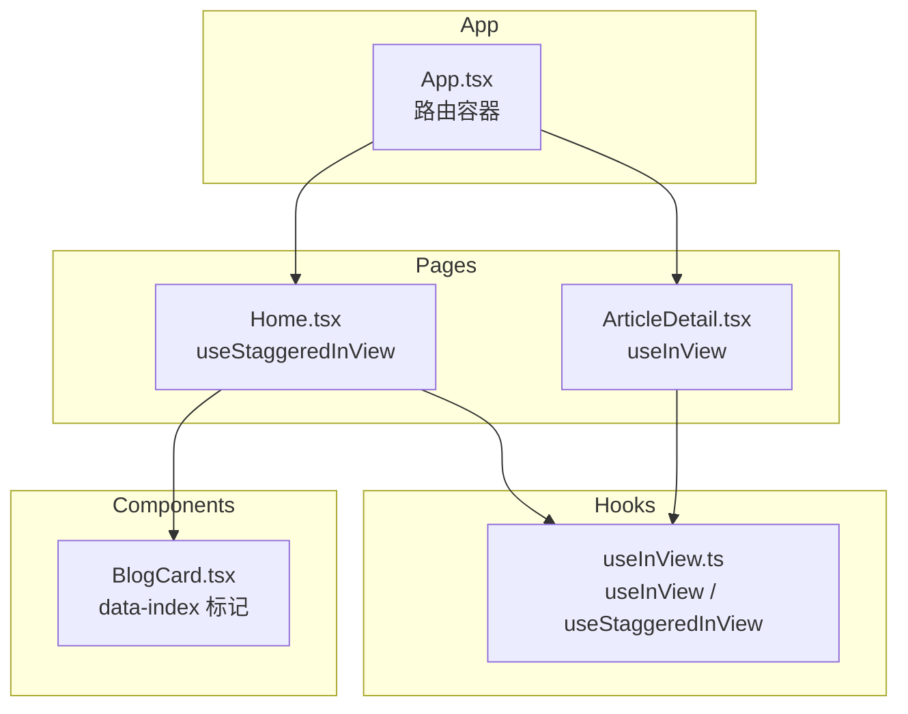
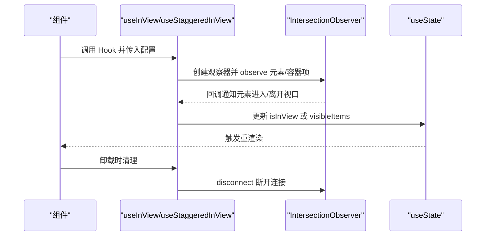
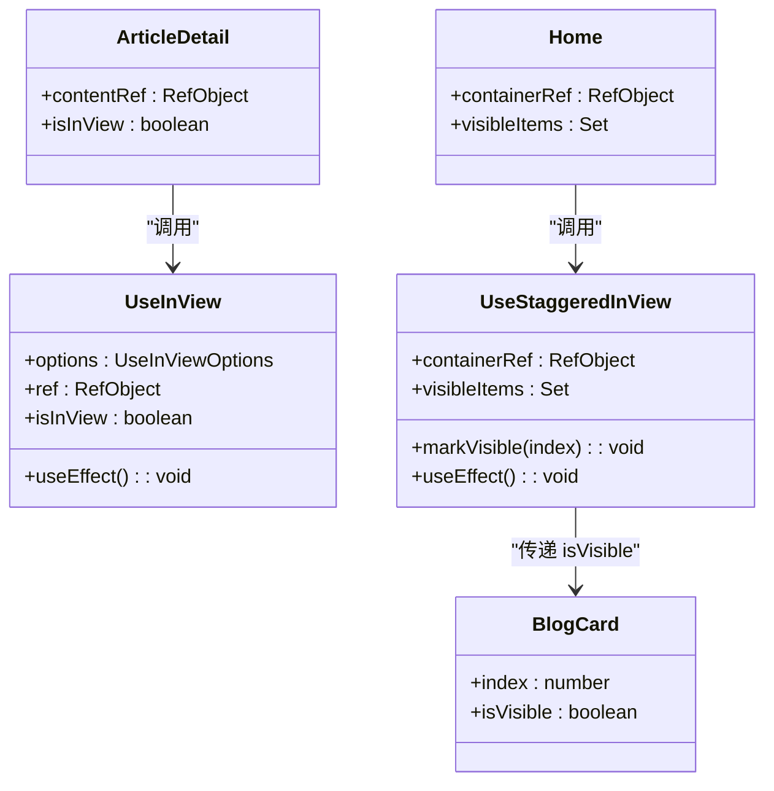

# 视口检测Hook (useInView)

<cite>
**本文引用的文件**
- [useInView.ts](file://src/hooks/useInView.ts)
- [Home.tsx](file://src/pages/Home.tsx)
- [ArticleDetail.tsx](file://src/pages/ArticleDetail.tsx)
- [BlogCard.tsx](file://src/components/BlogCard.tsx)
- [App.tsx](file://src/App.tsx)
- [package.json](file://package.json)
</cite>

## 目录
1. [简介](#简介)
2. [项目结构](#项目结构)
3. [核心组件](#核心组件)
4. [架构总览](#架构总览)
5. [详细组件分析](#详细组件分析)
6. [依赖关系分析](#依赖关系分析)
7. [性能考量](#性能考量)
8. [故障排查指南](#故障排查指南)
9. [结论](#结论)
10. [附录](#附录)

## 简介
本文件围绕项目中的视口检测自定义Hook进行系统化文档化，重点覆盖以下方面：
- Intersection Observer API 的封装与浏览器兼容性处理
- 视口检测的触发条件、回调机制与性能优化策略
- Hook 的状态管理（可见性状态跟踪与事件监听器管理）
- 使用示例：滚动动画触发、懒加载、无限滚动思路
- 配置选项与自定义参数
- 性能监控与内存泄漏防护
- 与 React 组件生命周期的协调机制
- 扩展与定制方案

## 项目结构
useInView 相关代码位于 hooks 目录中，配合页面组件在 pages 中使用；组件层通过 data 层提供的数据驱动渲染。

图表来源
- [useInView.ts:1-76](file://src/hooks/useInView.ts#L1-L76)
- [Home.tsx:1-34](file://src/pages/Home.tsx#L1-L34)
- [ArticleDetail.tsx:1-201](file://src/pages/ArticleDetail.tsx#L1-L201)
- [BlogCard.tsx:1-66](file://src/components/BlogCard.tsx#L1-L66)
- [App.tsx:1-43](file://src/App.tsx#L1-L43)

章节来源
- [useInView.ts:1-76](file://src/hooks/useInView.ts#L1-L76)
- [Home.tsx:1-34](file://src/pages/Home.tsx#L1-L34)
- [ArticleDetail.tsx:1-201](file://src/pages/ArticleDetail.tsx#L1-L201)
- [BlogCard.tsx:1-66](file://src/components/BlogCard.tsx#L1-L66)
- [App.tsx:1-43](file://src/App.tsx#L1-L43)

## 核心组件
- useInView：单元素视口检测 Hook，返回 ref 与 isInView 状态，支持阈值、根边距与一次性触发等配置。
- useStaggeredInView：列表项分批可见性检测 Hook，按索引延迟标记可见，用于实现“瀑布流”式入场动画。

章节来源
- [useInView.ts:9-37](file://src/hooks/useInView.ts#L9-L37)
- [useInView.ts:39-75](file://src/hooks/useInView.ts#L39-L75)

## 架构总览
useInView 基于 IntersectionObserver API 实现，通过 React 的 useEffect 在组件挂载时创建观察器，在卸载时断开连接，避免内存泄漏。useStaggeredInView 则对容器内多个带 data-index 的子元素分别观察，并在首次进入视口时按索引延迟标记可见。

图表来源
- [useInView.ts:14-34](file://src/hooks/useInView.ts#L14-L34)
- [useInView.ts:51-72](file://src/hooks/useInView.ts#L51-L72)

## 详细组件分析

### useInView：单元素视口检测
- 功能要点
  - 接收配置项：阈值（threshold）、根边距（rootMargin）、是否仅触发一次（triggerOnce）。
  - 返回 ref 与 isInView 状态，供组件绑定到目标 DOM 并根据可见性切换样式或行为。
  - 观察器回调中，当元素进入视口时设置 isInView 为 true；若 triggerOnce 为真，则自动取消对该元素的观察，避免重复触发。
  - 当元素离开视口且未开启 triggerOnce 时，将 isInView 设为 false。
  - 清理：组件卸载时断开观察器，防止内存泄漏。

- 触发条件与回调机制
  - 阈值（threshold）决定元素与视口相交比例达到何种程度才视为“进入”。
  - 根边距（rootMargin）可提前或延后触发时机，例如将根边距设为负值可让元素在即将进入视口前就触发。
  - 回调函数接收一个条目数组，取第一个条目即可判断 isIntersecting。

- 性能优化策略
  - 使用 React 的 useEffect 与依赖数组，确保仅在阈值、根边距、触发策略变化时重建观察器。
  - 一次性触发模式下主动取消观察，减少回调频率。
  - 使用 ref 持有 DOM 引用，避免重复查询选择器。

- 浏览器兼容性
  - IntersectionObserver 是现代浏览器的标准特性，项目未提供降级方案。建议在需要兼容旧浏览器时引入 polyfill（如第三方库），并在入口处做能力检测后再初始化观察器。

- 生命周期协调
  - 在 useEffect 内部创建观察器，返回的清理函数在组件卸载时执行，保证观察器被正确断开。

- 使用示例路径
  - 页面中使用：在文章详情页对内容区域使用 useInView，结合 isInView 控制过渡动画。
  - 示例路径：[ArticleDetail.tsx:118-122](file://src/pages/ArticleDetail.tsx#L118-L122)，[ArticleDetail.tsx:177-182](file://src/pages/ArticleDetail.tsx#L177-L182)

- 配置选项
  - threshold：数字，范围 0~1，默认 0.1。
  - rootMargin：字符串，如 "0px 0px -40px 0px"，默认 "-40px 0px 0px 0px"。
  - triggerOnce：布尔值，是否仅触发一次，默认 true。

- 状态管理逻辑
  - useState 管理 isInView，useEffect 管理观察器生命周期。

章节来源
- [useInView.ts:9-37](file://src/hooks/useInView.ts#L9-L37)
- [ArticleDetail.tsx:118-122](file://src/pages/ArticleDetail.tsx#L118-L122)
- [ArticleDetail.tsx:177-182](file://src/pages/ArticleDetail.tsx#L177-L182)

### useStaggeredInView：列表项分批可见性检测
- 功能要点
  - 接收 itemCount 与 staggerDelay 参数，内部维护 visibleItems（Set<number>）记录已可见的索引。
  - 容器内所有带 data-index 的子元素都会被观察；当某元素首次进入视口时，按其索引乘以延迟时间触发标记为可见。
  - 观察器回调中，对每个进入视口的元素读取 data-index，设置定时器后标记该索引为可见，并立即取消对该元素的观察，避免重复触发。
  - 清理：组件卸载时断开观察器。

- 触发条件与回调机制
  - 阈值与根边距固定，元素进入视口即触发延迟标记。
  - 通过 data-index 将 DOM 与索引关联，便于批量处理。

- 性能优化策略
  - 一次性触发：元素进入后立即取消观察，降低回调次数。
  - 使用 Set 记录可见项，避免重复渲染。
  - 定时器按索引线性延迟，形成“瀑布流”式动画效果。

- 使用示例路径
  - 页面中使用：在首页对文章列表使用 useStaggeredInView，并将 isVisible 传递给 BlogCard。
  - 示例路径：[Home.tsx:6-6](file://src/pages/Home.tsx#L6-L6)，[Home.tsx:21-28](file://src/pages/Home.tsx#L21-L28)，[BlogCard.tsx:14-19](file://src/components/BlogCard.tsx#L14-L19)

- 配置选项
  - itemCount：列表项总数，用于副作用依赖。
  - staggerDelay：毫秒级延迟，控制入场动画的时间差，默认 100ms。

- 状态管理逻辑
  - useState 维护 visibleItems，useCallback 包装 markVisible 以稳定引用。

章节来源
- [useInView.ts:39-75](file://src/hooks/useInView.ts#L39-L75)
- [Home.tsx:6-6](file://src/pages/Home.tsx#L6-L6)
- [Home.tsx:21-28](file://src/pages/Home.tsx#L21-L28)
- [BlogCard.tsx:14-19](file://src/components/BlogCard.tsx#L14-L19)

### 类图：Hook 与组件交互

图表来源
- [useInView.ts:9-37](file://src/hooks/useInView.ts#L9-L37)
- [useInView.ts:39-75](file://src/hooks/useInView.ts#L39-L75)
- [Home.tsx:6-6](file://src/pages/Home.tsx#L6-L6)
- [ArticleDetail.tsx:118-122](file://src/pages/ArticleDetail.tsx#L118-L122)
- [BlogCard.tsx:12-19](file://src/components/BlogCard.tsx#L12-L19)

## 依赖关系分析
- useInView 依赖 React 的基础 Hooks：useEffect、useRef、useState、useCallback。
- 未直接依赖其他第三方库，但需浏览器支持 IntersectionObserver。
- 项目未包含 polyfill，若需兼容旧浏览器，应在应用入口处进行能力检测并按需引入 polyfill。

章节来源
- [useInView.ts:1-1](file://src/hooks/useInView.ts#L1-L1)
- [package.json:11-31](file://package.json#L11-L31)

## 性能考量
- 观察器复用与依赖控制
  - 通过依赖数组仅在阈值、根边距、触发策略变化时重建观察器，避免频繁创建销毁带来的开销。
- 一次性触发优化
  - triggerOnce 为真时，元素进入视口后立即取消观察，减少后续回调。
- 列表项延迟标记
  - useStaggeredInView 对进入视口的元素立即取消观察，再通过定时器延迟标记可见，既保证首屏体验，又避免重复触发。
- 事件监听器清理
  - useEffect 返回的清理函数确保卸载时断开观察器，防止内存泄漏。
- 动画与渲染
  - 结合 isInView 或 isVisible 控制样式类名或透明度/位移，避免不必要的重排重绘。

[本节为通用性能指导，不直接分析具体文件，故无章节来源]

## 故障排查指南
- 元素未触发
  - 检查目标元素是否正确绑定 ref，且 ref.current 不为空。
  - 检查阈值与根边距设置是否合理，必要时增大阈值或调整根边距。
  - 确认容器滚动区域存在且可滚动。
- 重复触发
  - 若未设置 triggerOnce，元素离开视口时会再次触发 isInView 变更，这是预期行为。
  - 对于列表项，确认已取消对该元素的观察。
- 内存泄漏
  - 确保组件卸载时清理观察器；检查 useEffect 返回的清理函数是否执行。
- 样式未生效
  - 确认 isInView 或 isVisible 已正确传递到组件样式逻辑中。
- 浏览器兼容性
  - 未提供 polyfill 时，旧版浏览器可能不支持 IntersectionObserver。可在入口处进行能力检测并按需引入 polyfill。

章节来源
- [useInView.ts:14-34](file://src/hooks/useInView.ts#L14-L34)
- [useInView.ts:51-72](file://src/hooks/useInView.ts#L51-L72)

## 结论
useInView 与 useStaggeredInView 提供了简洁而高效的视口检测能力，结合 React 生命周期与 IntersectionObserver API，实现了良好的性能与可维护性。通过合理的配置与清理策略，可满足滚动动画、懒加载与瀑布流入场等常见场景。对于旧浏览器兼容需求，建议在应用入口处引入 polyfill 并进行能力检测。

[本节为总结性内容，不直接分析具体文件，故无章节来源]

## 附录

### 使用示例与最佳实践
- 滚动动画触发
  - 在文章详情页对内容区域使用 useInView，并根据 isInView 切换过渡动画类名。
  - 示例路径：[ArticleDetail.tsx:118-122](file://src/pages/ArticleDetail.tsx#L118-L122)，[ArticleDetail.tsx:177-182](file://src/pages/ArticleDetail.tsx#L177-L182)
- 懒加载实现
  - 将图片或内容块放置在目标元素上，使用 isInView 控制资源加载时机。
  - 可参考 useInView 的 isInView 状态与 ref 绑定方式。
- 无限滚动思路
  - 使用 isInView 观察“加载更多”占位元素，当其进入视口时触发数据加载。
  - 注意：当前 Hook 未内置分页逻辑，需在业务层自行实现数据请求与状态更新。
- 自定义参数
  - threshold：根据视觉需求调整元素进入视口的比例。
  - rootMargin：通过负值提前触发，营造“即将进入”的预加载感。
  - triggerOnce：适合一次性动画或只希望触发一次的场景。

[本节为概念性说明，不直接分析具体文件，故无章节来源]

### 扩展与定制方案
- 增强 useInView
  - 支持多元素观察：在 Hook 内维护多个观察器实例与状态映射。
  - 添加回调钩子：在进入/离开视口时触发外部回调。
  - 支持自定义 root 容器：允许指定观察的根容器而非视窗。
- 增强 useStaggeredInView
  - 支持动态列表：监听列表长度变化并重新观察新增项。
  - 支持自定义延迟函数：按指数或随机延迟生成不同入场节奏。
- 性能监控
  - 记录观察器回调触发次数与时延，辅助定位性能问题。
- 内存泄漏防护
  - 在组件卸载时统一断开所有观察器，并在重渲染时及时更新依赖。

[本节为概念性说明，不直接分析具体文件，故无章节来源]