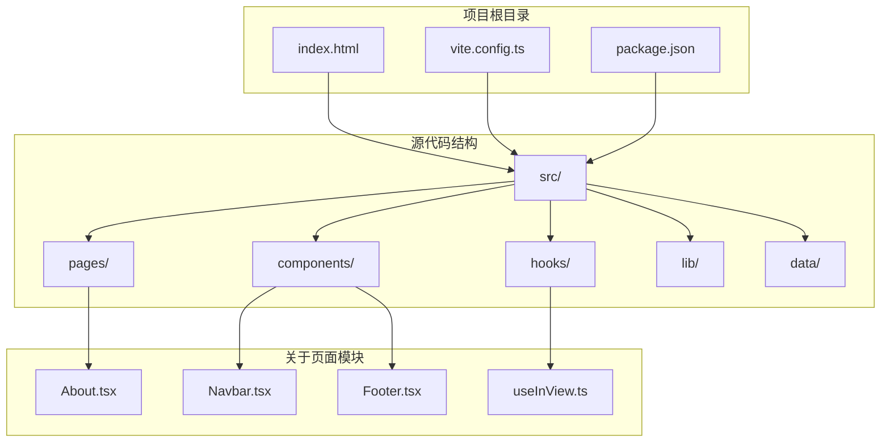
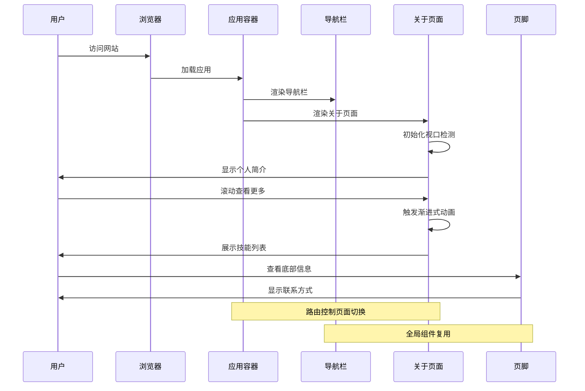
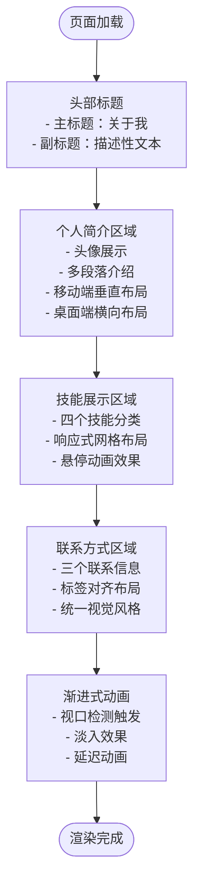
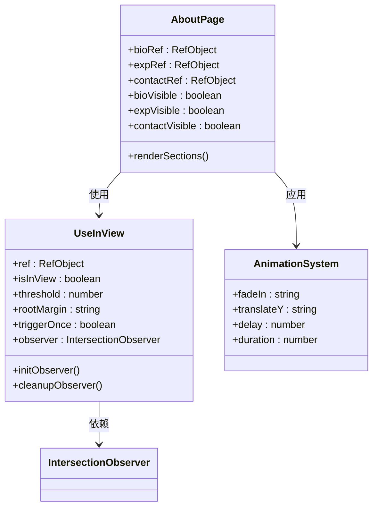
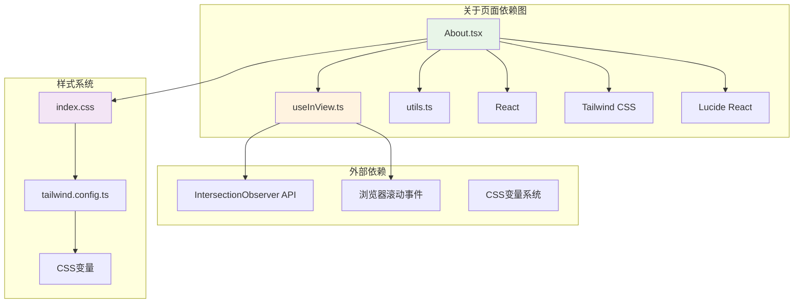
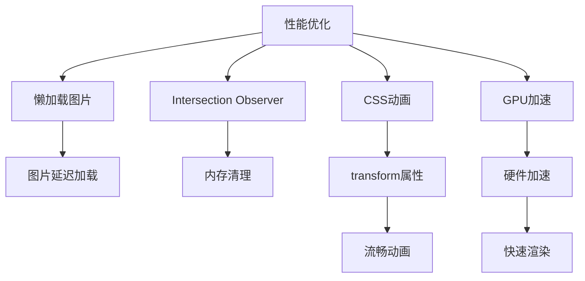
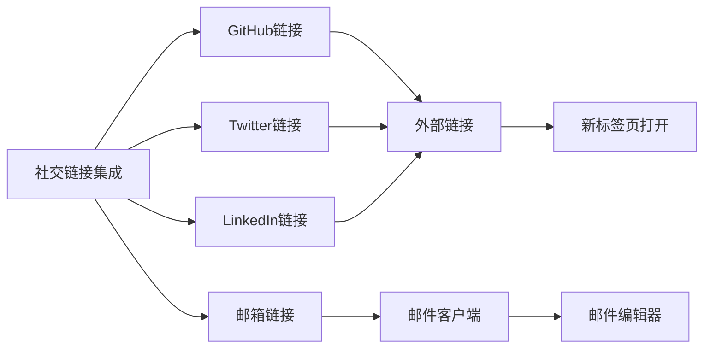

# 关于页面

<cite>
**本文档引用的文件**
- [About.tsx](file://src/pages/About.tsx)
- [Navbar.tsx](file://src/components/Navbar.tsx)
- [Footer.tsx](file://src/components/Footer.tsx)
- [App.tsx](file://src/App.tsx)
- [useInView.ts](file://src/hooks/useInView.ts)
- [utils.ts](file://src/lib/utils.ts)
- [index.html](file://index.html)
- [index.css](file://src/index.css)
- [tailwind.config.ts](file://tailwind.config.ts)
- [main.tsx](file://src/main.tsx)
- [vite.config.ts](file://vite.config.ts)
</cite>

## 目录
1. [简介](#简介)
2. [项目结构](#项目结构)
3. [核心组件](#核心组件)
4. [架构概览](#架构概览)
5. [详细组件分析](#详细组件分析)
6. [依赖关系分析](#依赖关系分析)
7. [性能考虑](#性能考虑)
8. [故障排除指南](#故障排除指南)
9. [结论](#结论)
10. [附录](#附录)

## 简介

B02项目的关于页面是一个精心设计的个人介绍页面，采用现代化的React技术栈构建。该页面专注于展示个人简介、技能专长和联系方式，通过流畅的动画效果和响应式设计为用户提供优质的浏览体验。页面采用了Intersection Observer API实现智能的视口检测，配合Tailwind CSS实现优雅的视觉呈现。

## 项目结构

B02项目采用模块化的文件组织结构，关于页面作为独立的功能模块位于`src/pages/`目录下，与其他页面组件保持一致的架构模式。



**图表来源**
- [About.tsx:1-104](file://src/pages/About.tsx#L1-L104)
- [App.tsx:1-43](file://src/App.tsx#L1-L43)

**章节来源**
- [About.tsx:1-104](file://src/pages/About.tsx#L1-L104)
- [App.tsx:1-43](file://src/App.tsx#L1-L43)

## 核心组件

关于页面的核心功能由多个精心设计的组件协同完成，每个组件都有明确的职责分工：

### 页面布局结构

关于页面采用经典的三段式布局：头部标题区域、主体内容区域和底部信息区域。每个区域都经过精心设计以确保信息层次的清晰性和视觉的和谐统一。

### 动画交互系统

页面集成了基于Intersection Observer API的视口检测系统，实现了智能的进入视口检测和渐进式动画效果。这种设计不仅提升了用户体验，还优化了页面性能。

**章节来源**
- [About.tsx:9-103](file://src/pages/About.tsx#L9-L103)
- [useInView.ts:1-76](file://src/hooks/useInView.ts#L1-L76)

## 架构概览

关于页面在整个应用架构中扮演着重要的角色，它与导航组件、页脚组件形成完整的用户界面框架。



**图表来源**
- [App.tsx:12-32](file://src/App.tsx#L12-L32)
- [About.tsx:4-7](file://src/pages/About.tsx#L4-L7)

**章节来源**
- [App.tsx:12-32](file://src/App.tsx#L12-L32)
- [Navbar.tsx:18-16](file://src/components/Navbar.tsx#L18-L16)

## 详细组件分析

### 关于页面组件（About）

关于页面是整个应用的核心组件之一，采用了模块化的结构设计，将内容分为三个主要部分：个人简介、技能展示和技术栈、联系方式。

#### 内容结构分析

页面采用响应式布局设计，针对不同屏幕尺寸提供了优化的显示效果：



**图表来源**
- [About.tsx:21-100](file://src/pages/About.tsx#L21-L100)

#### 视口检测系统

页面使用自定义的`useInView` Hook实现了智能的视口检测功能：



**图表来源**
- [useInView.ts:9-37](file://src/hooks/useInView.ts#L9-L37)
- [About.tsx:5-7](file://src/pages/About.tsx#L5-L7)

**章节来源**
- [About.tsx:21-100](file://src/pages/About.tsx#L21-L100)
- [useInView.ts:14-34](file://src/hooks/useInView.ts#L14-L34)

### 导航组件集成

关于页面与导航组件形成了完整的用户界面框架，导航组件提供了全局的页面访问入口。

#### 导航集成模式

```mermaid
graph LR
subgraph "导航组件"
A[Logo: 墨]
B[文章]
C[分类]
D[关于]
E[主题切换]
F[移动端菜单]
end
subgraph "关于页面"
G[个人简介]
H[技能展示]
I[联系方式]
end
subgraph "路由系统"
J[/]
K[/post/:id]
L[/about]
M[/categories]
end
A --> J
B --> J
C --> M
D --> L
L --> G
L --> H
L --> I
style D fill:#e1f5fe
style G fill:#f3e5f5
style H fill:#f3e5f5
style I fill:#f3e5f5
```

**图表来源**
- [Navbar.tsx:12-16](file://src/components/Navbar.tsx#L12-L16)
- [App.tsx:20-25](file://src/App.tsx#L20-L25)

**章节来源**
- [Navbar.tsx:12-16](file://src/components/Navbar.tsx#L12-L16)
- [App.tsx:20-25](file://src/App.tsx#L20-L25)

### 页脚组件集成

页脚组件为关于页面提供了统一的品牌展示和额外的导航入口。

#### 页脚功能特性

页脚组件采用了简洁的设计风格，提供了版权信息和外部链接的展示功能。

**章节来源**
- [Footer.tsx:1-30](file://src/components/Footer.tsx#L1-L30)

## 依赖关系分析

关于页面的依赖关系体现了现代React应用的最佳实践，通过清晰的模块化设计实现了高内聚低耦合的架构。



**图表来源**
- [About.tsx:1-2](file://src/pages/About.tsx#L1-L2)
- [useInView.ts:1](file://src/hooks/useInView.ts#L1)
- [index.css:1-3](file://src/index.css#L1-L3)

**章节来源**
- [About.tsx:1-2](file://src/pages/About.tsx#L1-L2)
- [useInView.ts:1-76](file://src/hooks/useInView.ts#L1-L76)

## 性能考虑

关于页面在设计时充分考虑了性能优化，采用了多种策略来确保最佳的用户体验。

### 视口检测优化

页面使用Intersection Observer API替代传统的滚动事件监听，提供了更好的性能表现：

- **懒加载支持**：图片资源使用`loading="lazy"`属性实现延迟加载
- **内存管理**：自动清理观察器实例，防止内存泄漏
- **触发频率**：优化的阈值设置减少不必要的重绘

### 动画性能优化



**图表来源**
- [useInView.ts:18-34](file://src/hooks/useInView.ts#L18-L34)
- [About.tsx:32-36](file://src/pages/About.tsx#L32-L36)

**章节来源**
- [useInView.ts:18-34](file://src/hooks/useInView.ts#L18-L34)
- [About.tsx:32-36](file://src/pages/About.tsx#L32-L36)

## 故障排除指南

### 常见问题及解决方案

#### 视口检测失效

**问题症状**：动画效果不触发或触发时机异常

**可能原因**：
- Intersection Observer API不被支持
- DOM元素未正确挂载
- 根元素配置错误

**解决方案**：
1. 检查浏览器兼容性
2. 确保DOM元素已渲染完成
3. 验证根元素和阈值设置

#### 图片加载问题

**问题症状**：头像或其他图片无法显示

**可能原因**：
- 图片路径错误
- 图片格式不支持
- 网络连接问题

**解决方案**：
1. 验证图片文件存在
2. 检查图片格式兼容性
3. 确认网络连接正常

**章节来源**
- [useInView.ts:14-34](file://src/hooks/useInView.ts#L14-L34)
- [About.tsx:31-36](file://src/pages/About.tsx#L31-L36)

## 结论

B02项目的关于页面展现了现代前端开发的最佳实践，通过精心设计的组件架构、优雅的动画效果和完善的响应式布局，为用户提供了优质的个人介绍体验。页面不仅在技术实现上体现了先进的设计理念，在用户体验方面也达到了很高的水准。

该页面的成功之处在于：
- 清晰的模块化架构
- 智能的交互设计
- 优秀的性能表现
- 完善的可维护性

## 附录

### 扩展开发指南

#### 添加项目作品集功能

要在现有基础上添加项目作品集功能，可以按照以下步骤进行：

1. **创建新的数据模型**：
   ```typescript
   interface Project {
     id: number
     title: string
     description: string
     technologies: string[]
     imageUrl: string
     githubUrl?: string
     demoUrl?: string
   }
   ```

2. **更新状态管理**：
   在About组件中添加项目数据的状态管理

3. **实现项目展示组件**：
   创建专门的项目卡片组件，支持图片懒加载和悬停效果

#### 集成社交链接功能



**图表来源**
- [Footer.tsx:10-24](file://src/components/Footer.tsx#L10-L24)

#### SEO优化策略

关于页面已经具备了基本的SEO优化基础，可以通过以下方式进行增强：

1. **结构化数据标记**：
   ```html
   <script type="application/ld+json">
   {
     "@context": "https://schema.org",
     "@type": "Person",
     "name": "你的姓名",
     "jobTitle": "前端工程师",
     "description": "专注于Web技术和用户体验的技术专家",
     "sameAs": [
       "https://github.com/yourusername",
       "https://twitter.com/yourusername"
     ]
   }
   </script>
   ```

2. **元数据优化**：
   - 为不同页面设置独特的描述
   - 添加关键词标签
   - 实现Open Graph协议

3. **内容优化**：
   - 确保内容的唯一性和价值性
   - 使用语义化HTML标签
   - 优化图片的alt属性

**章节来源**
- [index.html:6-7](file://index.html#L6-L7)
- [Footer.tsx:10-24](file://src/components/Footer.tsx#L10-L24)