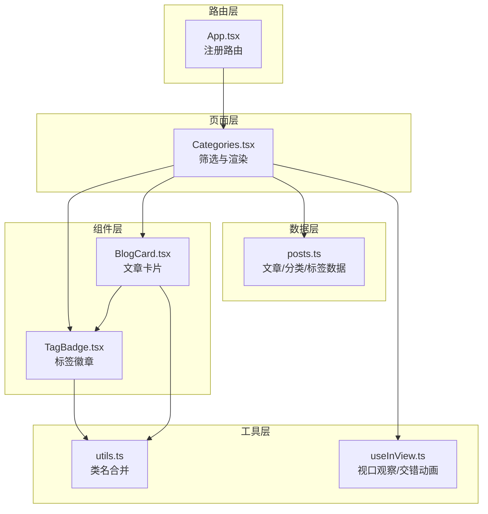
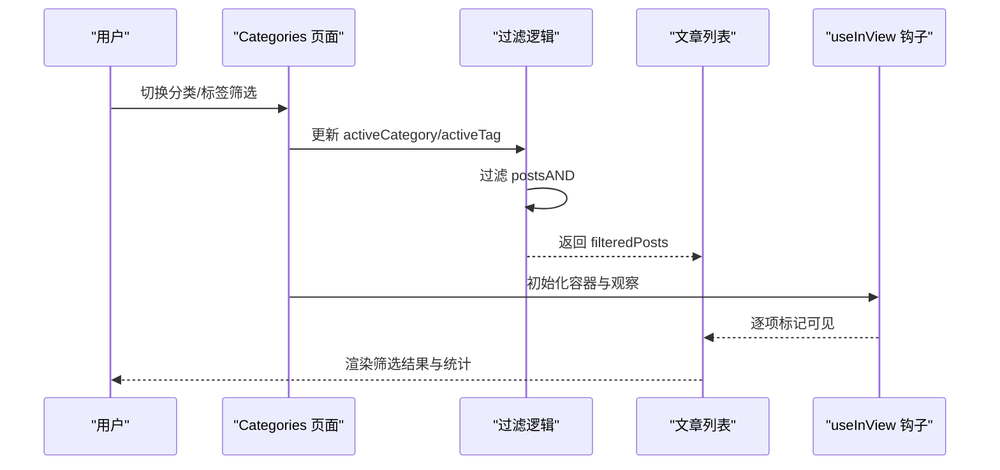
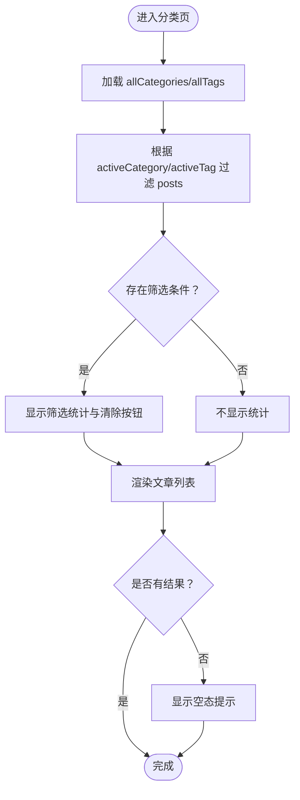
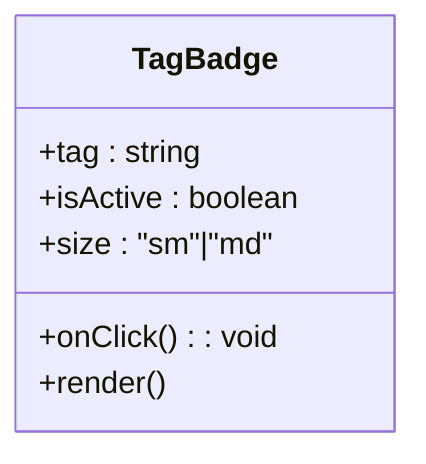
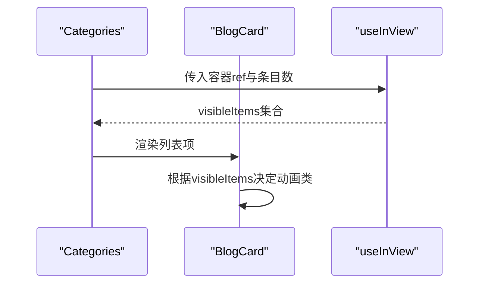
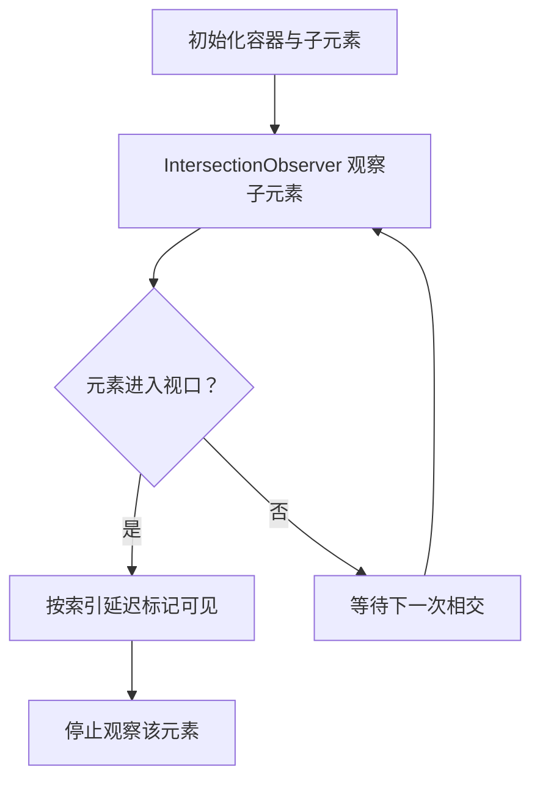
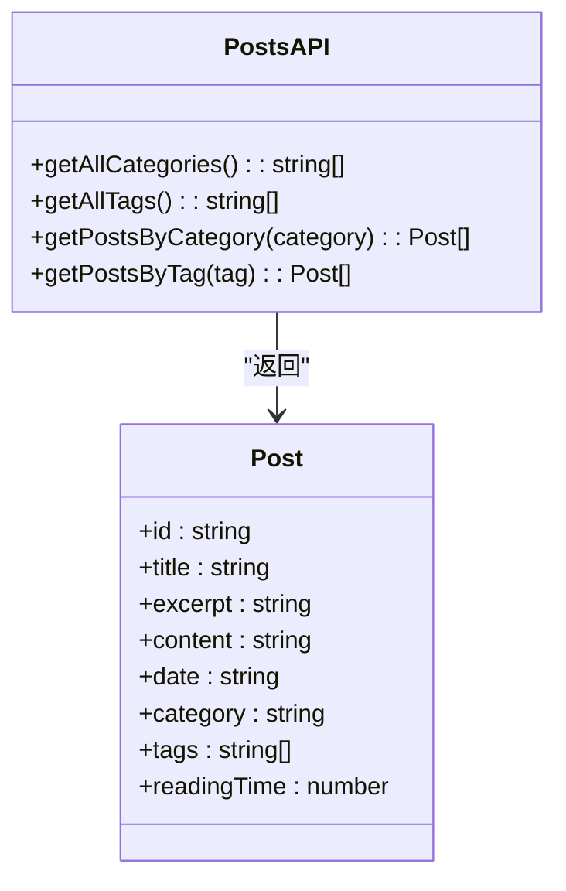
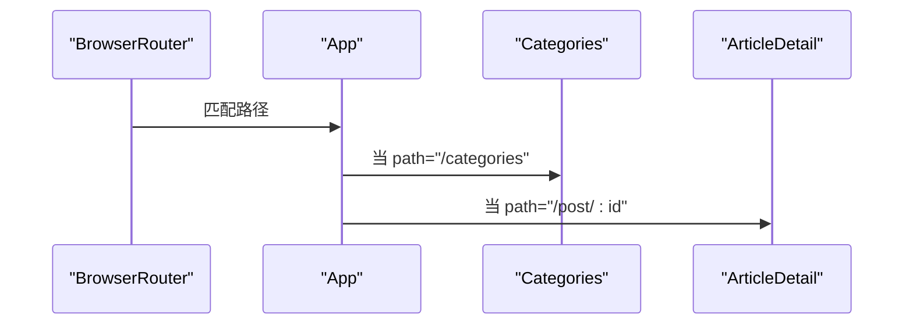
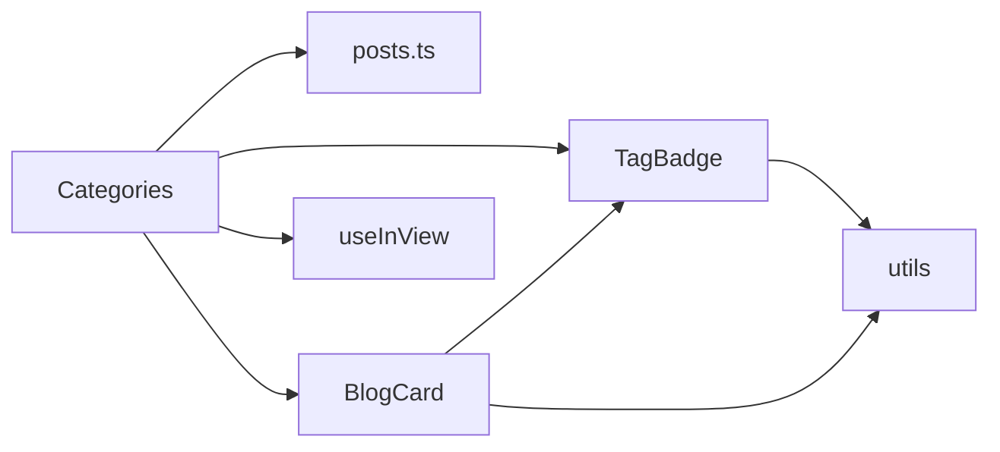

# 分类页面

<cite>
**本文引用的文件**
- [src/pages/Categories.tsx](file://src/pages/Categories.tsx)
- [src/components/TagBadge.tsx](file://src/components/TagBadge.tsx)
- [src/data/posts.ts](file://src/data/posts.ts)
- [src/App.tsx](file://src/App.tsx)
- [src/components/BlogCard.tsx](file://src/components/BlogCard.tsx)
- [src/hooks/useInView.ts](file://src/hooks/useInView.ts)
- [src/lib/utils.ts](file://src/lib/utils.ts)
- [src/index.css](file://src/index.css)
- [tailwind.config.ts](file://tailwind.config.ts)
</cite>

## 目录
1. [简介](#简介)
2. [项目结构](#项目结构)
3. [核心组件](#核心组件)
4. [架构总览](#架构总览)
5. [详细组件分析](#详细组件分析)
6. [依赖分析](#依赖分析)
7. [性能考量](#性能考量)
8. [故障排查指南](#故障排查指南)
9. [结论](#结论)
10. [附录](#附录)

## 简介
本文件面向B02项目的“分类页面”，系统性阐述其数据过滤与筛选机制、TagBadge组件在分类展示中的使用模式与交互设计、URL路由与参数传递、分类统计信息的计算与展示逻辑，并提供用户体验优化策略、SEO优化技巧以及扩展开发指南（如多级分类与标签云）。文档同时给出可视化图表与来源标注，便于读者快速定位实现细节。

## 项目结构
分类页面位于pages层，依赖数据层、组件层与工具层：
- 页面层：Categories.tsx负责筛选状态管理、过滤逻辑与UI渲染
- 数据层：posts.ts提供文章数据、分类与标签集合及查询函数
- 组件层：TagBadge.tsx用于标签展示；BlogCard.tsx用于文章卡片展示
- 工具层：utils.ts提供类名合并；useInView.ts提供视口可见性与交错动画
- 路由层：App.tsx注册路由，将“分类”映射到Categories页面

**图表来源**
- [src/App.tsx:12-25](file://src/App.tsx#L12-L25)
- [src/pages/Categories.tsx:1-120](file://src/pages/Categories.tsx#L1-L120)
- [src/data/posts.ts:1-382](file://src/data/posts.ts#L1-L382)
- [src/components/TagBadge.tsx:1-28](file://src/components/TagBadge.tsx#L1-L28)
- [src/components/BlogCard.tsx:1-66](file://src/components/BlogCard.tsx#L1-L66)
- [src/hooks/useInView.ts:1-76](file://src/hooks/useInView.ts#L1-L76)
- [src/lib/utils.ts:1-7](file://src/lib/utils.ts#L1-L7)

**章节来源**
- [src/App.tsx:12-25](file://src/App.tsx#L12-L25)
- [src/pages/Categories.tsx:1-120](file://src/pages/Categories.tsx#L1-L120)
- [src/data/posts.ts:1-382](file://src/data/posts.ts#L1-L382)

## 核心组件
- 分类页面（Categories）
  - 状态：当前激活的分类与标签
  - 过滤：基于分类与标签的AND组合过滤
  - 展示：分类与标签的可视化筛选区，文章列表与空态提示
  - 统计：显示筛选后的文章数量
- 标签徽章（TagBadge）
  - 支持尺寸、激活态、点击回调
  - 无点击回调时渲染为静态元素
- 文章卡片（BlogCard）
  - 展示文章元信息、标题、摘要与标签
  - 使用TagBadge渲染文章标签
- 视口观察与交错动画（useInView）
  - 提供容器级观察与逐项交错可见性
- 工具函数（utils）
  - 类名合并与Tailwind合并

**章节来源**
- [src/pages/Categories.tsx:8-120](file://src/pages/Categories.tsx#L8-L120)
- [src/components/TagBadge.tsx:10-28](file://src/components/TagBadge.tsx#L10-L28)
- [src/components/BlogCard.tsx:12-66](file://src/components/BlogCard.tsx#L12-L66)
- [src/hooks/useInView.ts:39-76](file://src/hooks/useInView.ts#L39-L76)
- [src/lib/utils.ts:4-6](file://src/lib/utils.ts#L4-L6)

## 架构总览
分类页面采用“本地状态 + 本地过滤”的轻量架构，无需外部状态管理库或网络请求。路由层负责将“/categories”映射到页面组件，页面组件内部通过useState管理筛选状态，通过数组filter实现内容分组与筛选，再结合视口观察钩子实现列表项的交错入场动画。

**图表来源**
- [src/pages/Categories.tsx:15-19](file://src/pages/Categories.tsx#L15-L19)
- [src/pages/Categories.tsx:21](file://src/pages/Categories.tsx#L21)
- [src/hooks/useInView.ts:39-76](file://src/hooks/useInView.ts#L39-L76)

## 详细组件分析

### 分类页面（Categories）
- 状态与筛选
  - 使用useState维护activeCategory与activeTag
  - 过滤规则：若设置了分类且文章分类不匹配则排除；若设置了标签且文章tags不包含该标签则排除；两者均设置时为AND关系
- 统计与清空
  - 在存在筛选条件时显示“筛选结果：N篇文章”
  - 提供“清除筛选”按钮，重置两个筛选状态
- 渲染
  - 分类区：按钮列表，点击切换激活态
  - 标签区：使用TagBadge组件渲染，支持点击切换激活态
  - 文章区：使用BlogCard渲染，结合useInView实现交错动画
- 空态
  - 当filteredPosts为空时显示“没有找到匹配的文章”

**图表来源**
- [src/pages/Categories.tsx:12-26](file://src/pages/Categories.tsx#L12-L26)
- [src/pages/Categories.tsx:15-19](file://src/pages/Categories.tsx#L15-L19)
- [src/pages/Categories.tsx:87-99](file://src/pages/Categories.tsx#L87-L99)
- [src/pages/Categories.tsx:102-116](file://src/pages/Categories.tsx#L102-L116)

**章节来源**
- [src/pages/Categories.tsx:8-120](file://src/pages/Categories.tsx#L8-L120)

### 标签徽章（TagBadge）
- 设计要点
  - 支持sm/md两种尺寸
  - 支持isActive高亮态
  - 支持onClick回调；未传入回调时渲染为静态span
  - 通过cn合并类名，统一过渡与交互效果
- 在分类页的使用
  - 分类页标签区直接传入tag、size、isActive与onClick
  - 文章卡片中也使用TagBadge渲染文章标签

**图表来源**
- [src/components/TagBadge.tsx:3-8](file://src/components/TagBadge.tsx#L3-L8)
- [src/components/TagBadge.tsx:10-28](file://src/components/TagBadge.tsx#L10-L28)

**章节来源**
- [src/components/TagBadge.tsx:10-28](file://src/components/TagBadge.tsx#L10-L28)
- [src/components/BlogCard.tsx:57-59](file://src/components/BlogCard.tsx#L57-L59)

### 文章卡片（BlogCard）
- 展示内容
  - 元信息：日期、阅读时长
  - 标题与摘要
  - 标签区：使用TagBadge渲染文章标签
- 交互与动画
  - 使用useInView的容器ref与visibleItems控制可见性
  - 通过style.animationDelay实现交错入场动画
- 链接
  - 点击卡片跳转至文章详情页（/post/:id）

**图表来源**
- [src/pages/Categories.tsx:103-110](file://src/pages/Categories.tsx#L103-L110)
- [src/hooks/useInView.ts:39-76](file://src/hooks/useInView.ts#L39-L76)
- [src/components/BlogCard.tsx:12-21](file://src/components/BlogCard.tsx#L12-L21)

**章节来源**
- [src/components/BlogCard.tsx:12-66](file://src/components/BlogCard.tsx#L12-L66)

### 视口观察与交错动画（useInView）
- useInView
  - 提供单元素可见性观察，默认阈值与根边距
  - 支持triggerOnce仅触发一次
- useStaggeredInView
  - 对容器内带data-index的子元素逐一观察
  - 通过setTimeout按索引延迟标记可见，实现交错动画
  - 默认staggerDelay为80ms

**图表来源**
- [src/hooks/useInView.ts:51-72](file://src/hooks/useInView.ts#L51-L72)

**章节来源**
- [src/hooks/useInView.ts:9-37](file://src/hooks/useInView.ts#L9-L37)
- [src/hooks/useInView.ts:39-76](file://src/hooks/useInView.ts#L39-L76)

### 数据层（posts.ts）
- 数据模型
  - Post接口包含id、title、excerpt、content、date、category、tags、readingTime
- 集合与查询
  - getAllCategories：去重并排序后的分类数组
  - getAllTags：去重并排序后的标签数组
  - getPostsByCategory / getPostsByTag：按分类/标签过滤
- 分类页依赖
  - 分类页通过getAllCategories与getAllTags生成筛选区
  - 通过posts.filter实现本地过滤

**图表来源**
- [src/data/posts.ts:1-10](file://src/data/posts.ts#L1-L10)
- [src/data/posts.ts:373-381](file://src/data/posts.ts#L373-L381)

**章节来源**
- [src/data/posts.ts:12-10](file://src/data/posts.ts#L12-L10)
- [src/data/posts.ts:361-381](file://src/data/posts.ts#L361-L381)

### 路由与URL设计
- 路由注册
  - “分类”页面路由路径为“/categories”
- 参数传递机制
  - 分类页使用本地状态（activeCategory/activeTag）进行筛选，不依赖URL参数
  - 文章详情通过“/post/:id”传递参数
- 用户体验
  - 由于筛选状态在内存中，刷新页面会重置筛选
  - 若需保留筛选状态，可在后续版本引入URL同步（见扩展指南）

**图表来源**
- [src/App.tsx:20-25](file://src/App.tsx#L20-L25)

**章节来源**
- [src/App.tsx:20-25](file://src/App.tsx#L20-L25)

## 依赖分析
- 组件耦合
  - Categories依赖posts.ts（数据）、TagBadge（UI）、BlogCard（UI）、useInView（动画）、utils（类名）
  - TagBadge与BlogCard共享utils与TagBadge
- 外部依赖
  - react-router-dom用于路由
  - Tailwind CSS与自定义动画类提供样式与动效
- 潜在循环依赖
  - 本模块间无循环导入

**图表来源**
- [src/pages/Categories.tsx:1-6](file://src/pages/Categories.tsx#L1-L6)
- [src/components/TagBadge.tsx:1](file://src/components/TagBadge.tsx#L1)
- [src/components/BlogCard.tsx:1-3](file://src/components/BlogCard.tsx#L1-L3)
- [src/hooks/useInView.ts:1](file://src/hooks/useInView.ts#L1)
- [src/lib/utils.ts:1](file://src/lib/utils.ts#L1)

**章节来源**
- [src/pages/Categories.tsx:1-6](file://src/pages/Categories.tsx#L1-L6)

## 性能考量
- 本地过滤
  - 过滤逻辑在内存中进行，复杂度O(N)，N为文章总数
  - 适合中小规模数据集；若文章量增长，可考虑：
    - 预构建索引（按分类/标签）
    - 使用虚拟滚动（仅渲染可视区域）
    - 引入URL同步与缓存策略，避免重复计算
- 动画与观察
  - useStaggeredInView对每个子元素设置观察，元素较多时建议：
    - 合理设置阈值与根边距
    - 控制staggerDelay，避免过度延迟
- 样式与主题
  - Tailwind变量与暗色主题切换在CSS层实现，避免JS频繁重排

[本节为通用性能建议，不直接分析具体文件]

## 故障排查指南
- 筛选无效
  - 检查activeCategory/activeTag是否正确更新
  - 确认过滤条件是否为AND关系
- 标签徽章无点击反馈
  - 确认传入onClick回调
  - 检查isActive是否正确传递
- 文章列表不显示
  - 检查filteredPosts长度与空态渲染逻辑
  - 确认useInView是否正确初始化容器ref
- 路由不生效
  - 确认路由路径与App中注册一致

**章节来源**
- [src/pages/Categories.tsx:15-19](file://src/pages/Categories.tsx#L15-L19)
- [src/pages/Categories.tsx:73-81](file://src/pages/Categories.tsx#L73-L81)
- [src/pages/Categories.tsx:102-116](file://src/pages/Categories.tsx#L102-L116)
- [src/hooks/useInView.ts:39-76](file://src/hooks/useInView.ts#L39-L76)
- [src/App.tsx:20-25](file://src/App.tsx#L20-L25)

## 结论
分类页面通过简洁的本地状态与过滤逻辑实现了高效的内容分组与筛选，配合视口观察与交错动画提升了用户体验。当前实现未使用URL参数，具备良好的可读性与可维护性。后续可通过引入URL同步、虚拟滚动与标签云等增强功能，进一步提升性能与交互体验。

[本节为总结性内容，不直接分析具体文件]

## 附录

### 用户体验优化策略
- 筛选条件可视化
  - 在页面顶部展示当前激活的筛选条件，提供一键清除
  - 使用TagBadge展示已选标签，直观反馈
- 搜索功能
  - 在现有基础上增加全文搜索输入框，结合title/excerpt/tags进行过滤
  - 支持模糊匹配与防抖
- 加载与骨架
  - 大量文章时提供骨架屏或占位符
- 响应式与无障碍
  - 确保移动端筛选区可滚动
  - 为按钮与链接提供ARIA标签

[本节为通用优化建议，不直接分析具体文件]

### SEO优化技巧
- 页面标题与描述
  - 在页面头部设置合适的<title>与<meta name="description">
  - 可根据当前筛选动态生成描述（例如“筛选结果：共N篇关于XX的文章”）
- 结构化数据
  - 可考虑添加Article类型的JSON-LD，包含作者、发布日期、关键词等
- 面包屑导航
  - 添加“首页 > 分类与标签”的面包屑，提升可发现性
- 可访问性
  - 为筛选区提供语义化标题与aria-label
  - 确保键盘可操作性

[本节为通用SEO建议，不直接分析具体文件]

### 扩展开发指南
- 多级分类
  - 在数据层引入categoryTree结构，支持父子关系
  - 在页面层使用树形控件或折叠面板展示
  - 过滤逻辑需支持祖先/后代关系
- 标签云
  - 统计各标签出现频次，按频次映射字号或透明度
  - 提供“热门标签”与“全部标签”两种视图
- URL同步
  - 使用URL查询参数同步筛选状态（如?category=技术&tag=React）
  - 在页面加载时解析参数并恢复筛选状态
- 性能优化
  - 引入虚拟滚动与懒加载
  - 对过滤逻辑进行缓存与去抖
- 主题与动效
  - 保持Tailwind变量与暗色主题的一致性
  - 控制动画时长与延迟，避免过度动画影响性能

[本节为扩展开发建议，不直接分析具体文件]