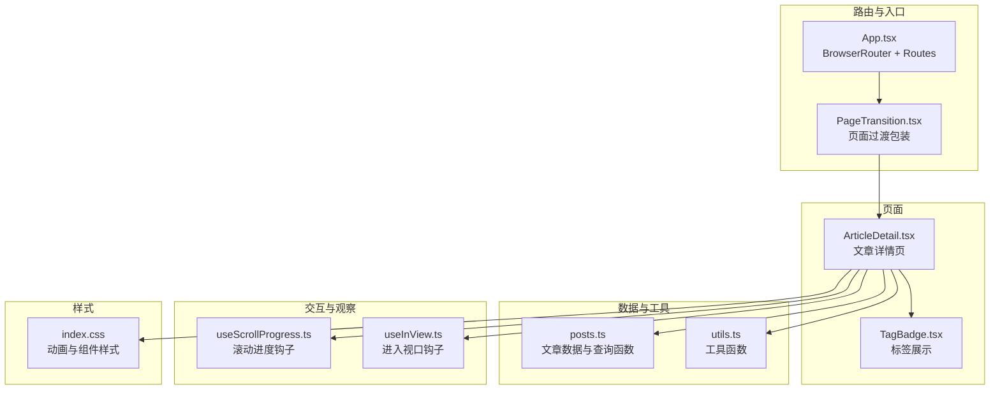
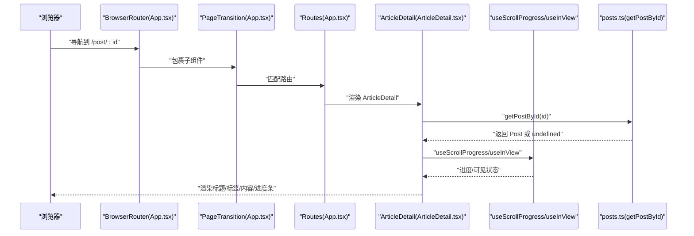
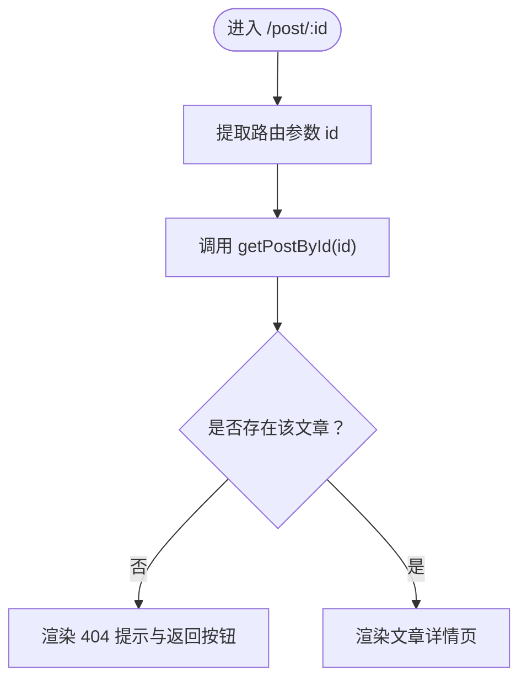
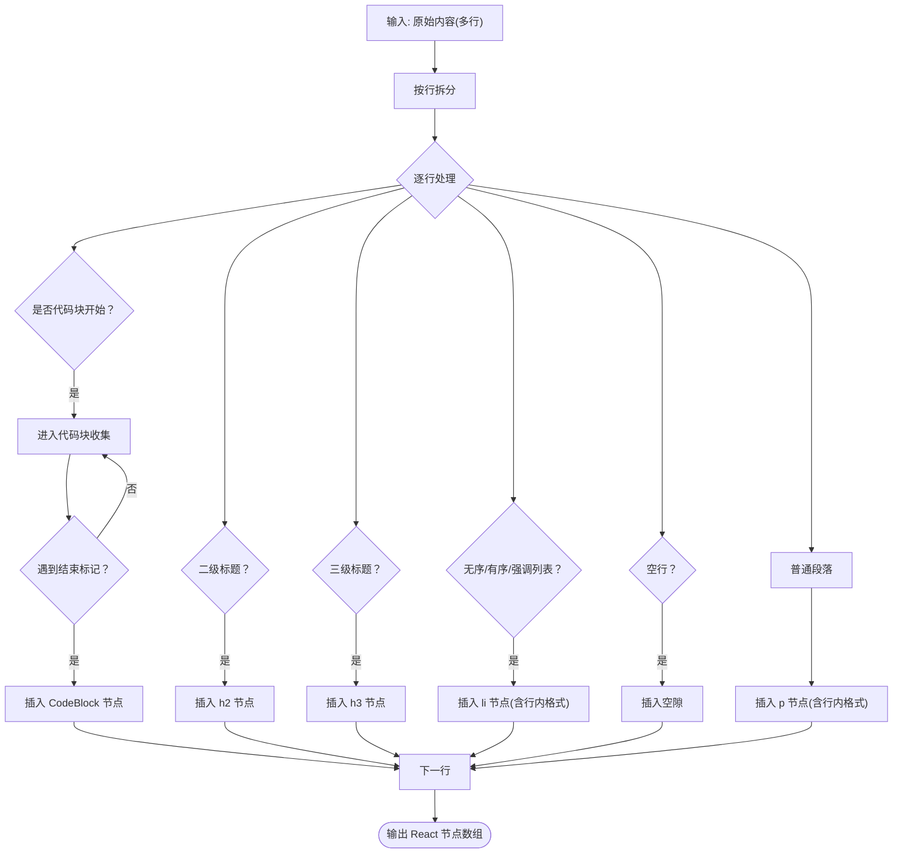
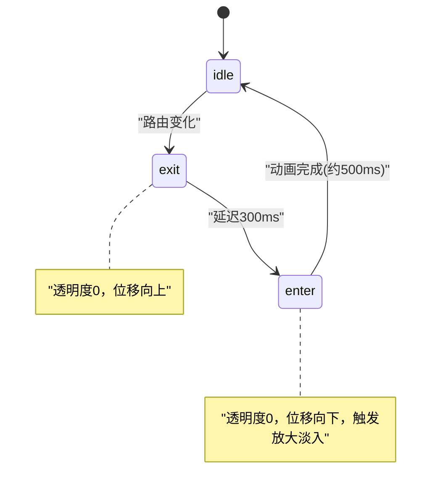
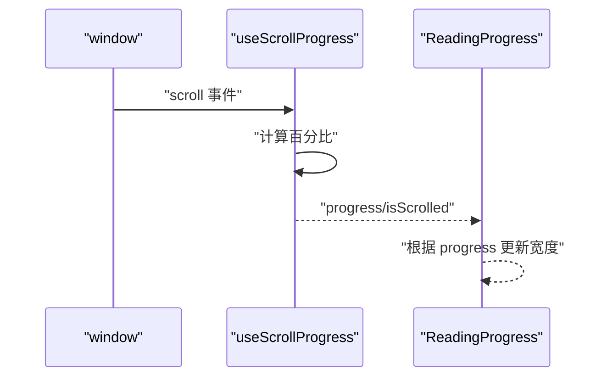
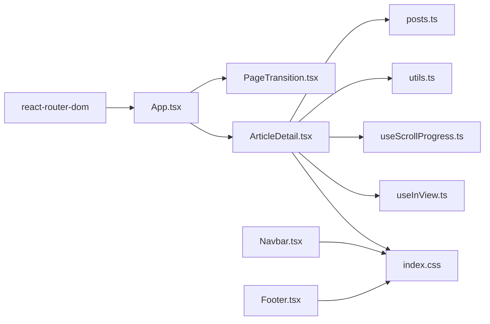

# 文章详情页

<cite>
**本文引用的文件**
- [src/pages/ArticleDetail.tsx](file://src/pages/ArticleDetail.tsx)
- [src/data/posts.ts](file://src/data/posts.ts)
- [src/components/PageTransition.tsx](file://src/components/PageTransition.tsx)
- [src/components/ReadingProgress.tsx](file://src/components/ReadingProgress.tsx)
- [src/hooks/useScrollProgress.ts](file://src/hooks/useScrollProgress.ts)
- [src/hooks/useInView.ts](file://src/hooks/useInView.ts)
- [src/lib/utils.ts](file://src/lib/utils.ts)
- [src/App.tsx](file://src/App.tsx)
- [src/index.css](file://src/index.css)
- [src/components/TagBadge.tsx](file://src/components/TagBadge.tsx)
- [src/components/Navbar.tsx](file://src/components/Navbar.tsx)
- [src/components/Footer.tsx](file://src/components/Footer.tsx)
- [vite.config.ts](file://vite.config.ts)
- [package.json](file://package.json)
</cite>

## 目录
1. [简介](#简介)
2. [项目结构](#项目结构)
3. [核心组件](#核心组件)
4. [架构总览](#架构总览)
5. [详细组件分析](#详细组件分析)
6. [依赖分析](#依赖分析)
7. [性能考虑](#性能考虑)
8. [故障排查指南](#故障排查指南)
9. [结论](#结论)
10. [附录](#附录)

## 简介
本文件面向B02项目的“文章详情页”，系统性说明以下方面：
- 动态路由与参数解析机制
- 文章内容的解析与渲染流程
- 页面切换动画与过渡效果
- 阅读进度条的实现原理
- SEO优化建议（meta与结构化数据）
- 社交分享与社交媒体集成方案
- 评论系统与“相关文章”推荐的扩展实现指南

## 项目结构
文章详情页位于src/pages/ArticleDetail.tsx，配合路由配置、数据源、通用组件与样式层共同构成完整的页面体验。



图表来源
- [src/App.tsx:12-31](file://src/App.tsx#L12-L31)
- [src/pages/ArticleDetail.tsx:118-200](file://src/pages/ArticleDetail.tsx#L118-L200)
- [src/data/posts.ts:361-382](file://src/data/posts.ts#L361-L382)
- [src/hooks/useScrollProgress.ts:1-23](file://src/hooks/useScrollProgress.ts#L1-L23)
- [src/hooks/useInView.ts:1-76](file://src/hooks/useInView.ts#L1-L76)
- [src/index.css:161-201](file://src/index.css#L161-L201)

章节来源
- [src/App.tsx:12-31](file://src/App.tsx#L12-L31)
- [src/pages/ArticleDetail.tsx:118-200](file://src/pages/ArticleDetail.tsx#L118-L200)
- [src/data/posts.ts:361-382](file://src/data/posts.ts#L361-L382)
- [src/index.css:161-201](file://src/index.css#L161-L201)

## 核心组件
- 动态路由与参数解析：在App.tsx中通过react-router-dom配置路径“/post/:id”，在ArticleDetail.tsx中使用useParams提取id。
- 数据获取：通过getPostById根据id从本地posts数组中查找对应文章。
- 内容渲染：ArticleDetail.tsx内联函数renderContent将原始markdown风格文本转换为React节点树；同时提供renderInlineCode处理行内代码与粗体。
- 页面过渡：PageTransition.tsx在路由切换时提供淡入/淡出与位移动画，并自动滚动至顶部。
- 阅读进度：ReadingProgress.tsx结合useScrollProgress.ts计算滚动百分比并在顶部绘制进度条。
- 标签展示：TagBadge.tsx用于渲染文章标签，支持交互态与尺寸控制。
- 视口进入动画：useInView.ts提供IntersectionObserver封装，ArticleDetail将其用于文章内容首次进入视口时的淡入动画。

章节来源
- [src/App.tsx:21-25](file://src/App.tsx#L21-L25)
- [src/pages/ArticleDetail.tsx:118-200](file://src/pages/ArticleDetail.tsx#L118-L200)
- [src/data/posts.ts:361-382](file://src/data/posts.ts#L361-L382)
- [src/components/PageTransition.tsx:1-40](file://src/components/PageTransition.tsx#L1-L40)
- [src/components/ReadingProgress.tsx:1-19](file://src/components/ReadingProgress.tsx#L1-L19)
- [src/hooks/useScrollProgress.ts:1-23](file://src/hooks/useScrollProgress.ts#L1-L23)
- [src/hooks/useInView.ts:1-76](file://src/hooks/useInView.ts#L1-L76)
- [src/components/TagBadge.tsx:1-28](file://src/components/TagBadge.tsx#L1-L28)

## 架构总览
下图展示了从路由到页面渲染、再到交互与样式的完整调用链路。



图表来源
- [src/App.tsx:19-26](file://src/App.tsx#L19-L26)
- [src/pages/ArticleDetail.tsx:118-200](file://src/pages/ArticleDetail.tsx#L118-L200)
- [src/data/posts.ts:361-382](file://src/data/posts.ts#L361-L382)
- [src/hooks/useScrollProgress.ts:1-23](file://src/hooks/useScrollProgress.ts#L1-L23)
- [src/hooks/useInView.ts:1-76](file://src/hooks/useInView.ts#L1-L76)

## 详细组件分析

### 动态路由与参数处理
- 路由配置：在App.tsx中定义“/post/:id”的路径规则，确保文章详情页支持动态id参数。
- 参数提取：在ArticleDetail.tsx中使用useParams获取id，随后调用getPostById(id)获取文章对象。
- 未命中处理：若getPostById返回undefined，则渲染“文章未找到”提示与返回首页按钮。



图表来源
- [src/App.tsx:21-25](file://src/App.tsx#L21-L25)
- [src/pages/ArticleDetail.tsx:118-138](file://src/pages/ArticleDetail.tsx#L118-L138)
- [src/data/posts.ts:361-363](file://src/data/posts.ts#L361-L363)

章节来源
- [src/App.tsx:21-25](file://src/App.tsx#L21-L25)
- [src/pages/ArticleDetail.tsx:118-138](file://src/pages/ArticleDetail.tsx#L118-L138)
- [src/data/posts.ts:361-363](file://src/data/posts.ts#L361-L363)

### 文章内容渲染与格式化
- Markdown风格解析：renderContent按行扫描，识别标题、列表、空行等结构，并生成对应的React节点。
- 代码块：以“```”开头/结尾的块被识别为代码块，内部文本原样渲染。
- 行内格式：renderInlineCode支持行内代码（反引号）与粗体（双星号），并处理混合场景。
- 列表：支持无序列表与有序列表，以及特殊“**标题**正文”格式的强调项。
- 段落与标题：普通段落与二级/三级标题分别渲染为段落与标题节点。



图表来源
- [src/pages/ArticleDetail.tsx:19-116](file://src/pages/ArticleDetail.tsx#L19-L116)

章节来源
- [src/pages/ArticleDetail.tsx:19-116](file://src/pages/ArticleDetail.tsx#L19-L116)

### PageTransition 组件与页面切换动画
- 状态机：enter/exit/idle三种阶段，通过CSS类与内联样式驱动动画。
- 切换流程：检测到location变化后先触发exit动画，再更新children并进入enter动画，完成后回到idle；同时滚动至顶部。
- 样式：index.css中定义page-enter-active/page-exit-active等关键帧与过渡属性。



图表来源
- [src/components/PageTransition.tsx:1-40](file://src/components/PageTransition.tsx#L1-L40)
- [src/index.css:182-201](file://src/index.css#L182-L201)

章节来源
- [src/components/PageTransition.tsx:1-40](file://src/components/PageTransition.tsx#L1-L40)
- [src/index.css:182-201](file://src/index.css#L182-L201)

### ReadingProgress 组件与阅读进度跟踪
- 数据来源：useScrollProgress监听滚动事件，计算scrollTop/docHeight比例，限定0~100。
- 渲染：ReadingProgress仅在进度大于0时显示，宽度随进度变化，同时设置aria属性便于无障碍访问。
- 样式：index.css中定义reading-progress固定定位与过渡动画。



图表来源
- [src/hooks/useScrollProgress.ts:1-23](file://src/hooks/useScrollProgress.ts#L1-L23)
- [src/components/ReadingProgress.tsx:1-19](file://src/components/ReadingProgress.tsx#L1-L19)
- [src/index.css:161-170](file://src/index.css#L161-L170)

章节来源
- [src/hooks/useScrollProgress.ts:1-23](file://src/hooks/useScrollProgress.ts#L1-L23)
- [src/components/ReadingProgress.tsx:1-19](file://src/components/ReadingProgress.tsx#L1-L19)
- [src/index.css:161-170](file://src/index.css#L161-L170)

### 文章详情页的SEO优化策略
- 页面标题与描述：在ArticleDetail渲染前或通过路由配置注入，使用文章title与excerpt作为页面标题与description。
- 结构化数据：为Article类型添加JSON-LD，包含headline、datePublished、author、publisher、image等字段。
- 元标签：确保canonical链接指向当前文章URL，避免重复内容；可选添加Open Graph与Twitter Card元标签以优化社交分享预览。
- 可访问性：ReadingProgress已设置aria属性；建议为文章主内容容器添加role="main"与aria-labelledby。

说明：以上为通用SEO最佳实践，具体实现需在ArticleDetail.tsx中结合路由与数据源动态生成。

### 文章详情页的分享功能与社交媒体集成
- 分享接口：利用Web Share API或navigator.clipboard复制链接；在移动端可调用系统分享面板。
- 社交媒体：提供复制链接按钮，或在Navbar/Footbar中加入分享图标，点击后打开对应平台分享页面（如微博、Twitter、LinkedIn）。
- Open Graph/Twitter Card：在head中注入og:title、og:description、og:image、og:url、twitter:card等元标签。

说明：以上为通用集成方案，可在ArticleDetail渲染时动态注入相应元标签与分享按钮。

### 评论系统与“相关文章”推荐的扩展实现指南
- 评论系统
  - 存储：可采用第三方服务（如Disqus、Remark42、Gitalk）或自建后端API。
  - 前端：在ArticleDetail底部插入评论容器，传入文章id作为标识符。
  - 无障碍：确保评论区具备可访问性标签与键盘导航支持。
- 相关文章推荐
  - 策略：基于标签交集、分类匹配或内容相似度（可引入向量化与近似检索）。
  - 展示：使用BlogCard组件渲染卡片列表，点击跳转至对应文章详情页。
  - 性能：推荐在客户端缓存热门文章与热门标签，减少重复计算。

## 依赖分析
- 路由与页面：react-router-dom负责路由与参数传递；App.tsx集中配置路由与PageTransition包装。
- 数据层：posts.ts提供文章数据与查询函数，ArticleDetail直接依赖其导出的getPostById。
- 样式层：index.css统一定义动画、组件样式与主题变量；utils.ts提供类名合并工具。
- 交互层：useScrollProgress与useInView分别提供滚动进度与视口进入检测能力。



图表来源
- [src/App.tsx:1-43](file://src/App.tsx#L1-L43)
- [src/pages/ArticleDetail.tsx:1-201](file://src/pages/ArticleDetail.tsx#L1-L201)
- [src/data/posts.ts:1-382](file://src/data/posts.ts#L1-L382)
- [src/hooks/useScrollProgress.ts:1-23](file://src/hooks/useScrollProgress.ts#L1-L23)
- [src/hooks/useInView.ts:1-76](file://src/hooks/useInView.ts#L1-L76)
- [src/lib/utils.ts:1-7](file://src/lib/utils.ts#L1-L7)
- [src/components/Navbar.tsx:1-113](file://src/components/Navbar.tsx#L1-L113)
- [src/components/Footer.tsx:1-30](file://src/components/Footer.tsx#L1-L30)
- [src/index.css:1-234](file://src/index.css#L1-L234)

章节来源
- [src/App.tsx:1-43](file://src/App.tsx#L1-L43)
- [src/pages/ArticleDetail.tsx:1-201](file://src/pages/ArticleDetail.tsx#L1-L201)
- [src/data/posts.ts:1-382](file://src/data/posts.ts#L1-L382)
- [src/index.css:1-234](file://src/index.css#L1-L234)

## 性能考虑
- 滚动事件优化：useScrollProgress使用passive监听器，降低主线程阻塞风险。
- IntersectionObserver：useInView使用阈值与rootMargin减少频繁回调，提高滚动性能。
- 样式动画：PageTransition与ReadingProgress均使用CSS过渡与transform，避免强制同步布局。
- 代码分割：若未来文章内容巨大，可考虑将renderContent拆分为独立模块并按需加载。

## 故障排查指南
- 动态路由无效
  - 检查App.tsx中路由路径是否为“/post/:id”，且ArticleDetail组件已注册。
  - 章节来源
    - [src/App.tsx:21-25](file://src/App.tsx#L21-L25)
- 文章未找到
  - ArticleDetail对getPostById返回undefined的情况做了降级处理，检查id是否正确或数据源是否包含该id。
  - 章节来源
    - [src/pages/ArticleDetail.tsx:124-138](file://src/pages/ArticleDetail.tsx#L124-L138)
    - [src/data/posts.ts:361-363](file://src/data/posts.ts#L361-L363)
- 进度条不显示
  - ReadingProgress仅在progress>0时渲染；确认页面存在足够高度以产生滚动。
  - 章节来源
    - [src/components/ReadingProgress.tsx:6-7](file://src/components/ReadingProgress.tsx#L6-L7)
    - [src/hooks/useScrollProgress.ts:8-15](file://src/hooks/useScrollProgress.ts#L8-L15)
- 页面切换动画异常
  - 检查index.css中page-enter-active/page-exit-active类是否生效，确认PageTransition包裹了Routes。
  - 章节来源
    - [src/components/PageTransition.tsx:22-39](file://src/components/PageTransition.tsx#L22-L39)
    - [src/index.css:182-201](file://src/index.css#L182-L201)
    - [src/App.tsx:19-26](file://src/App.tsx#L19-L26)

## 结论
文章详情页通过简洁的路由与数据模型、可复用的交互钩子与样式系统，实现了流畅的阅读体验。动态路由与内容渲染逻辑清晰，页面过渡与阅读进度增强了用户感知。结合本文提供的SEO与社交分享建议，以及评论与相关推荐的扩展指南，可进一步完善站点的可用性与传播力。

## 附录
- 构建与别名
  - Vite别名@指向src目录，便于在组件中使用相对导入。
  - 章节来源
    - [vite.config.ts:7-11](file://vite.config.ts#L7-L11)
- 依赖与脚本
  - React、React Router、Tailwind CSS、Lucide等依赖已声明。
  - 章节来源
    - [package.json:11-31](file://package.json#L11-L31)