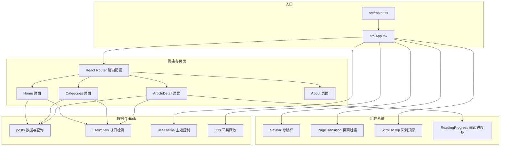
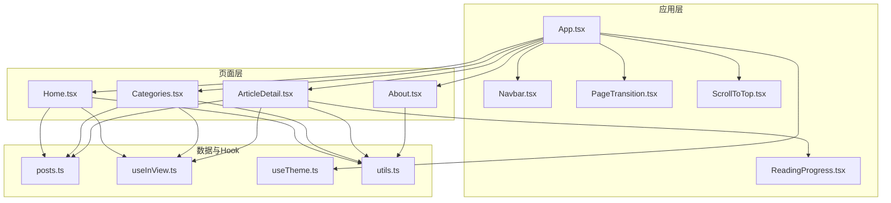
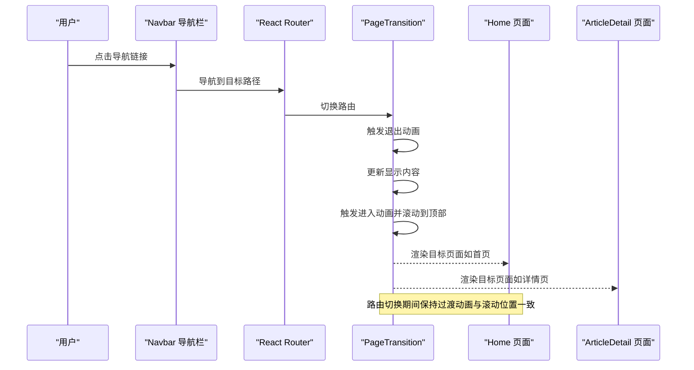
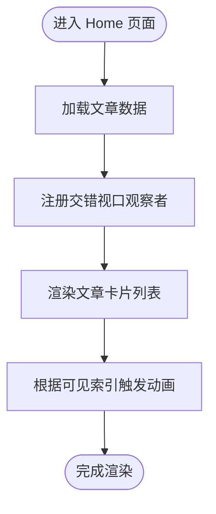
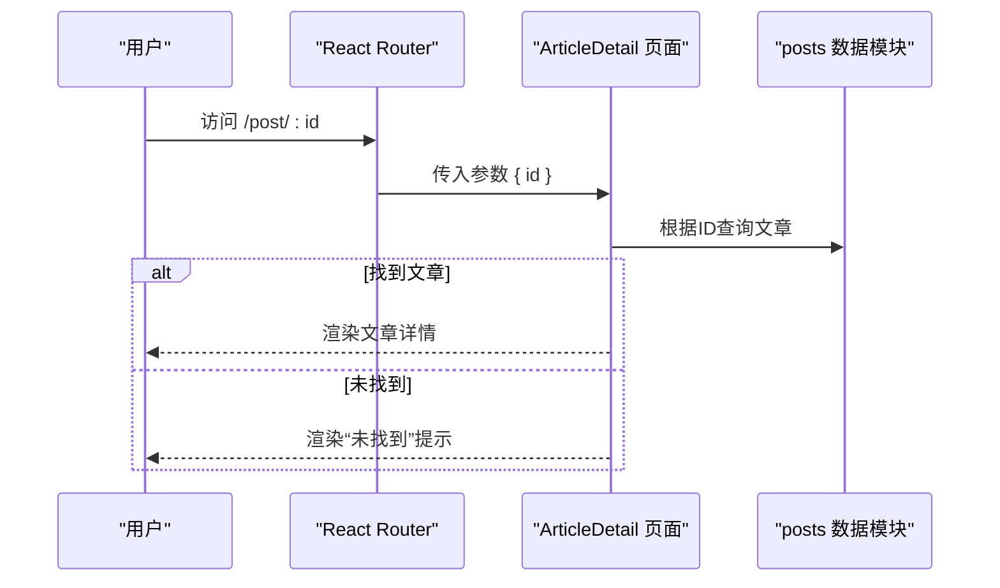
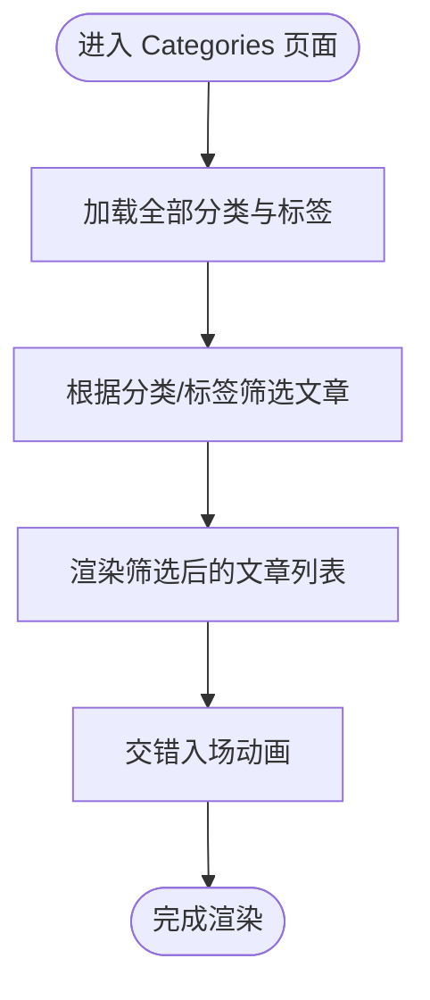
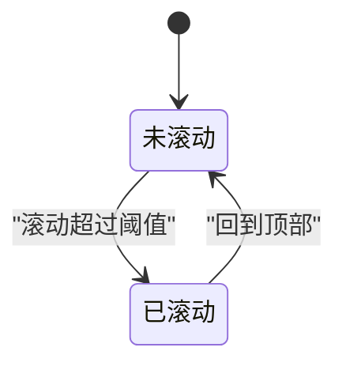
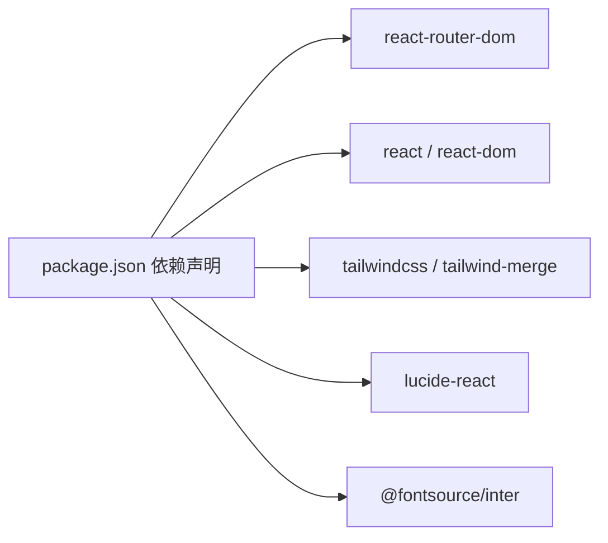

# 页面组件

<cite>
**本文引用的文件**
- [src/App.tsx](file://src/App.tsx)
- [src/main.tsx](file://src/main.tsx)
- [src/pages/Home.tsx](file://src/pages/Home.tsx)
- [src/pages/About.tsx](file://src/pages/About.tsx)
- [src/pages/ArticleDetail.tsx](file://src/pages/ArticleDetail.tsx)
- [src/pages/Categories.tsx](file://src/pages/Categories.tsx)
- [src/data/posts.ts](file://src/data/posts.ts)
- [src/components/Navbar.tsx](file://src/components/Navbar.tsx)
- [src/components/PageTransition.tsx](file://src/components/PageTransition.tsx)
- [src/components/ScrollToTop.tsx](file://src/components/ScrollToTop.tsx)
- [src/components/ReadingProgress.tsx](file://src/components/ReadingProgress.tsx)
- [src/hooks/useInView.ts](file://src/hooks/useInView.ts)
- [src/hooks/useTheme.ts](file://src/hooks/useTheme.ts)
- [src/lib/utils.ts](file://src/lib/utils.ts)
- [package.json](file://package.json)
</cite>

## 目录
1. [简介](#简介)
2. [项目结构](#项目结构)
3. [核心组件](#核心组件)
4. [架构总览](#架构总览)
5. [详细组件分析](#详细组件分析)
6. [依赖分析](#依赖分析)
7. [性能考虑](#性能考虑)
8. [故障排查指南](#故障排查指南)
9. [结论](#结论)
10. [附录](#附录)

## 简介
本文件面向B02项目的页面组件，系统梳理各页面组件的实现逻辑、路由配置、数据获取方式、页面间导航与参数传递、与组件系统的集成与复用、页面级状态管理与生命周期处理、SEO与元数据管理建议、性能优化与懒加载策略、页面过渡动画与用户体验设计，并提供扩展与定制指南。

## 项目结构
项目采用按功能分层的组织方式：页面位于 pages 目录，通用UI组件位于 components 目录，数据模型与数据访问位于 data 目录，自定义Hook位于 hooks 目录，工具函数位于 lib 目录。入口文件负责应用初始化与路由装配。

图表来源
- [src/main.tsx:1-15](file://src/main.tsx#L1-L15)
- [src/App.tsx:1-43](file://src/App.tsx#L1-L43)
- [src/pages/Home.tsx:1-34](file://src/pages/Home.tsx#L1-L34)
- [src/pages/ArticleDetail.tsx:1-201](file://src/pages/ArticleDetail.tsx#L1-L201)
- [src/pages/Categories.tsx:1-120](file://src/pages/Categories.tsx#L1-L120)
- [src/pages/About.tsx:1-104](file://src/pages/About.tsx#L1-L104)
- [src/data/posts.ts:1-382](file://src/data/posts.ts#L1-L382)
- [src/hooks/useInView.ts:1-76](file://src/hooks/useInView.ts#L1-L76)
- [src/hooks/useTheme.ts:1-28](file://src/hooks/useTheme.ts#L1-L28)
- [src/lib/utils.ts:1-7](file://src/lib/utils.ts#L1-L7)

章节来源
- [src/main.tsx:1-15](file://src/main.tsx#L1-L15)
- [src/App.tsx:1-43](file://src/App.tsx#L1-L43)

## 核心组件
- 应用根组件与路由装配：在根组件中集中声明路由与页面映射，统一包裹导航栏、页脚、滚动到顶部等全局行为。
- 页面组件：Home、ArticleDetail、Categories、About分别承担列表页、详情页、分类筛选页、关于页的职责。
- 通用组件：Navbar、PageTransition、ScrollToTop、ReadingProgress提供跨页面的导航、过渡、滚动控制与阅读进度反馈。
- 数据与Hook：posts.ts提供文章数据与查询；useInView提供视口可见性检测与交错入场；useTheme提供主题持久化与切换；utils提供类名合并工具。

章节来源
- [src/App.tsx:12-32](file://src/App.tsx#L12-L32)
- [src/pages/Home.tsx:5-33](file://src/pages/Home.tsx#L5-L33)
- [src/pages/ArticleDetail.tsx:118-200](file://src/pages/ArticleDetail.tsx#L118-L200)
- [src/pages/Categories.tsx:8-119](file://src/pages/Categories.tsx#L8-L119)
- [src/pages/About.tsx:4-103](file://src/pages/About.tsx#L4-L103)
- [src/data/posts.ts:14-381](file://src/data/posts.ts#L14-L381)
- [src/hooks/useInView.ts:9-75](file://src/hooks/useInView.ts#L9-L75)
- [src/hooks/useTheme.ts:5-27](file://src/hooks/useTheme.ts#L5-L27)
- [src/lib/utils.ts:4-6](file://src/lib/utils.ts#L4-L6)

## 架构总览
下图展示页面组件与路由、数据、通用组件及Hook的关系：

图表来源
- [src/App.tsx:12-32](file://src/App.tsx#L12-L32)
- [src/components/Navbar.tsx:18-112](file://src/components/Navbar.tsx#L18-L112)
- [src/components/PageTransition.tsx:4-39](file://src/components/PageTransition.tsx#L4-L39)
- [src/components/ScrollToTop.tsx:5-29](file://src/components/ScrollToTop.tsx#L5-L29)
- [src/components/ReadingProgress.tsx:3-18](file://src/components/ReadingProgress.tsx#L3-L18)
- [src/pages/Home.tsx:5-33](file://src/pages/Home.tsx#L5-L33)
- [src/pages/ArticleDetail.tsx:118-200](file://src/pages/ArticleDetail.tsx#L118-L200)
- [src/pages/Categories.tsx:8-119](file://src/pages/Categories.tsx#L8-L119)
- [src/pages/About.tsx:4-103](file://src/pages/About.tsx#L4-L103)
- [src/data/posts.ts:14-381](file://src/data/posts.ts#L14-L381)
- [src/hooks/useInView.ts:9-75](file://src/hooks/useInView.ts#L9-L75)
- [src/hooks/useTheme.ts:5-27](file://src/hooks/useTheme.ts#L5-L27)
- [src/lib/utils.ts:4-6](file://src/lib/utils.ts#L4-L6)

## 详细组件分析

### 路由与导航流程
- 路由配置：在根组件中集中声明路径与页面组件的映射，包含首页、文章详情、关于页、分类页。
- 参数传递：文章详情页通过URL参数携带文章ID，使用路由参数解析后查询数据。
- 导航触发：页面内返回按钮使用编程式导航返回上一页；导航栏使用声明式导航到不同页面。
- 页面过渡：PageTransition在路由切换时触发动画序列，配合滚动重置实现平滑过渡。

图表来源
- [src/App.tsx:20-26](file://src/App.tsx#L20-L26)
- [src/components/PageTransition.tsx:9-20](file://src/components/PageTransition.tsx#L9-L20)
- [src/components/Navbar.tsx:12-16](file://src/components/Navbar.tsx#L12-L16)

章节来源
- [src/App.tsx:21-24](file://src/App.tsx#L21-L24)
- [src/pages/ArticleDetail.tsx:119-121](file://src/pages/ArticleDetail.tsx#L119-L121)
- [src/components/Navbar.tsx:12-16](file://src/components/Navbar.tsx#L12-L16)
- [src/components/PageTransition.tsx:9-20](file://src/components/PageTransition.tsx#L9-L20)

### 页面组件实现与数据获取

#### 首页 Home
- 实现要点：读取本地文章数据，使用交错视口检测实现逐项入场动画，渲染文章卡片列表。
- 数据获取：直接从本地数据模块导入文章集合。
- 状态与生命周期：使用自定义Hook管理视口可见项集合，组件挂载后自动观察列表项。
- 复用策略：将卡片渲染与动画控制抽象为可复用的Hook与组件。

图表来源
- [src/pages/Home.tsx:5-33](file://src/pages/Home.tsx#L5-L33)
- [src/hooks/useInView.ts:39-75](file://src/hooks/useInView.ts#L39-L75)

章节来源
- [src/pages/Home.tsx:5-33](file://src/pages/Home.tsx#L5-L33)
- [src/data/posts.ts:14-381](file://src/data/posts.ts#L14-L381)
- [src/hooks/useInView.ts:39-75](file://src/hooks/useInView.ts#L39-L75)

#### 文章详情 ArticleDetail
- 实现要点：解析URL参数获取文章ID，查询对应文章；渲染标题、标签、阅读时间、日期与正文；提供返回上一页与返回首页的导航。
- 数据获取：通过ID查询本地文章集合。
- 错误处理：当文章不存在时渲染“未找到”提示与返回按钮。
- 正文渲染：自定义解析器将内容文本转换为标题、段落、列表、行内代码与代码块等元素。
- 阅读进度：在页面顶部渲染阅读进度条，随滚动更新。

图表来源
- [src/pages/ArticleDetail.tsx:118-138](file://src/pages/ArticleDetail.tsx#L118-L138)
- [src/data/posts.ts:361-363](file://src/data/posts.ts#L361-L363)

章节来源
- [src/pages/ArticleDetail.tsx:118-200](file://src/pages/ArticleDetail.tsx#L118-L200)
- [src/data/posts.ts:361-363](file://src/data/posts.ts#L361-L363)

#### 分类与标签 Categories
- 实现要点：提供分类与标签的筛选器，根据当前激活的分类与标签过滤文章列表；支持清除筛选条件。
- 数据获取：从本地数据模块读取全部文章，并提供获取分类与标签集合的辅助方法。
- 状态与生命周期：使用useState管理当前筛选条件，useStaggeredInView实现列表项交错入场动画。
- 交互设计：点击分类或标签按钮切换激活状态；清空筛选按钮一键恢复默认。

图表来源
- [src/pages/Categories.tsx:8-119](file://src/pages/Categories.tsx#L8-L119)
- [src/data/posts.ts:365-381](file://src/data/posts.ts#L365-L381)
- [src/hooks/useInView.ts:39-75](file://src/hooks/useInView.ts#L39-L75)

章节来源
- [src/pages/Categories.tsx:8-119](file://src/pages/Categories.tsx#L8-L119)
- [src/data/posts.ts:365-381](file://src/data/posts.ts#L365-L381)

#### 关于 About
- 实现要点：分节展示个人简介、技术栈与联系方式；使用视口检测为各节添加进入动画。
- 动画策略：为每个区块绑定独立的视口观察器，按顺序触发动画，增强阅读节奏感。
- 图片懒加载：头像图片使用懒加载属性，降低首屏压力。

章节来源
- [src/pages/About.tsx:4-103](file://src/pages/About.tsx#L4-L103)

### 页面级状态管理与生命周期
- 全局主题：通过自定义Hook在应用层管理主题状态与持久化，支持明暗主题切换与系统偏好检测。
- 页面过渡：PageTransition在路由切换时维护进入/退出/闲置阶段，控制动画与滚动重置。
- 视口可见性：useInView与useStaggeredInView在组件挂载后注册IntersectionObserver，在卸载时清理，避免内存泄漏。
- 滚动进度：ReadingProgress与ScrollToTop结合滚动进度Hook，提供阅读进度条与回到顶部按钮。

图表来源
- [src/components/PageTransition.tsx:7-20](file://src/components/PageTransition.tsx#L7-L20)
- [src/hooks/useInView.ts:14-34](file://src/hooks/useInView.ts#L14-L34)
- [src/hooks/useTheme.ts:15-24](file://src/hooks/useTheme.ts#L15-L24)

章节来源
- [src/hooks/useTheme.ts:5-27](file://src/hooks/useTheme.ts#L5-L27)
- [src/components/PageTransition.tsx:4-39](file://src/components/PageTransition.tsx#L4-L39)
- [src/hooks/useInView.ts:9-75](file://src/hooks/useInView.ts#L9-L75)

### SEO与元数据管理最佳实践
- 页面标题与描述：建议在各页面组件中设置动态标题与描述，便于搜索引擎识别与社交分享。
- 结构化数据：可为文章详情页添加Article类型的结构化数据，提升搜索结果丰富度。
- 链接与面包屑：在详情页提供“返回首页”与“返回列表”的语义化链接，改善可访问性。
- 图片优化：为图片设置alt属性与尺寸，使用现代格式与懒加载，提升加载性能与可访问性。
- 字体与渲染：确保字体加载策略合理，避免阻塞关键渲染路径。

[本节为通用指导，无需特定文件引用]

### 性能优化与懒加载
- 列表渲染优化：使用交错入场与视口观察，仅在元素进入视口时渲染动画，减少初始渲染压力。
- 资源懒加载：图片采用懒加载；路由层面可进一步采用React.lazy与Suspense实现页面级懒加载。
- 动画与滚动：避免在滚动事件中执行昂贵操作，使用防抖或requestAnimationFrame；合理设置IntersectionObserver阈值与rootMargin。
- 构建优化：启用Tree Shaking与按需打包；压缩与缓存静态资源；使用CDN加速字体与第三方资源。

[本节为通用指导，无需特定文件引用]

### 页面过渡动画与用户体验设计
- 页面过渡：PageTransition在路由切换时提供淡入淡出与位移动画，配合滚动重置，营造连贯的页面切换体验。
- 元素入场：交错入场动画提升列表加载的节奏感，增强用户注意力引导。
- 交互反馈：按钮与导航提供悬停、按下等状态反馈，提升可感知性。
- 无障碍：为图标与按钮提供aria-label；为进度条提供aria属性；保证键盘可达性。

章节来源
- [src/components/PageTransition.tsx:22-38](file://src/components/PageTransition.tsx#L22-L38)
- [src/hooks/useInView.ts:39-75](file://src/hooks/useInView.ts#L39-L75)

### 扩展与定制指南
- 新增页面：在路由配置中新增Route映射，创建页面组件并在其中实现数据获取与渲染逻辑。
- 自定义Hook：将通用逻辑（如视口检测、主题管理、滚动进度）抽象为可复用Hook，便于在多个页面共享。
- 组件复用：将可复用UI拆分为独立组件（如卡片、徽标、进度条），并通过props进行定制。
- 样式与主题：通过主题Hook与CSS变量实现主题切换；使用工具函数合并类名，简化样式组合。
- 数据层扩展：在数据模块中新增查询方法与类型定义，保持数据访问的一致性与类型安全。

章节来源
- [src/App.tsx:20-26](file://src/App.tsx#L20-L26)
- [src/hooks/useTheme.ts:5-27](file://src/hooks/useTheme.ts#L5-L27)
- [src/lib/utils.ts:4-6](file://src/lib/utils.ts#L4-L6)

## 依赖分析
- 外部依赖：React、React Router、Tailwind CSS、Lucide React、字体与工具库等。
- 内部依赖：页面组件依赖数据模块与通用Hook；通用组件依赖工具函数与Hook；应用根组件统一装配路由与全局组件。

图表来源
- [package.json:11-31](file://package.json#L11-L31)

章节来源
- [package.json:11-31](file://package.json#L11-L31)

## 性能考虑
- 列表渲染：使用交错入场与视口观察，减少初始渲染成本。
- 资源加载：图片懒加载与字体预加载策略，避免阻塞关键路径。
- 动画帧率：避免在滚动中执行重计算，使用requestAnimationFrame或节流。
- 构建优化：启用Tree Shaking与最小化打包，合理缓存静态资源。

[本节为通用指导，无需特定文件引用]

## 故障排查指南
- 路由不生效：检查路由配置中的路径与页面组件映射是否正确。
- 文章未找到：确认URL参数ID与数据模块中的ID一致；检查错误分支的渲染逻辑。
- 动画不触发：检查视口观察器的阈值与rootMargin设置；确认元素是否正确挂载。
- 主题不持久：检查本地存储键名与主题类名的同步逻辑。
- 过渡动画异常：确认PageTransition的阶段状态与样式类名匹配。

章节来源
- [src/pages/ArticleDetail.tsx:124-138](file://src/pages/ArticleDetail.tsx#L124-L138)
- [src/hooks/useInView.ts:14-34](file://src/hooks/useInView.ts#L14-L34)
- [src/hooks/useTheme.ts:15-24](file://src/hooks/useTheme.ts#L15-L24)
- [src/components/PageTransition.tsx:7-20](file://src/components/PageTransition.tsx#L7-L20)

## 结论
B02项目的页面组件围绕清晰的路由结构、可复用的通用组件与Hook、以及良好的动画与交互体验展开。通过本地数据模型与视口观察实现高性能渲染，借助主题Hook与工具函数提升可维护性。建议在后续迭代中完善SEO与结构化数据、探索页面级懒加载与更细粒度的性能优化。

## 附录
- 入口与启动：应用在入口文件中初始化字体与样式，挂载根组件。
- 主题持久化：主题状态保存在本地存储，启动时读取系统偏好或历史设置。
- 类名合并：使用工具函数合并Tailwind类，避免冲突与冗余。

章节来源
- [src/main.tsx:1-15](file://src/main.tsx#L1-L15)
- [src/hooks/useTheme.ts:6-24](file://src/hooks/useTheme.ts#L6-L24)
- [src/lib/utils.ts:4-6](file://src/lib/utils.ts#L4-L6)