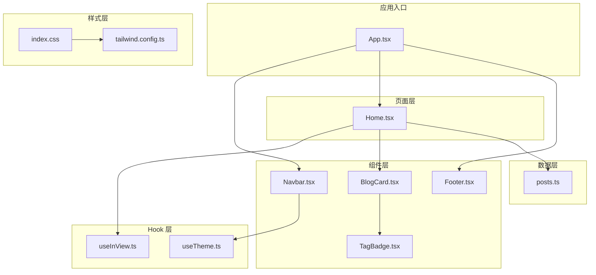
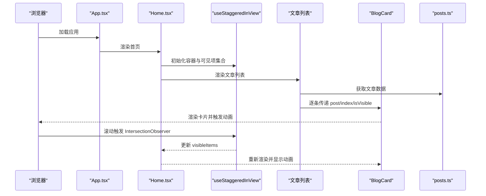
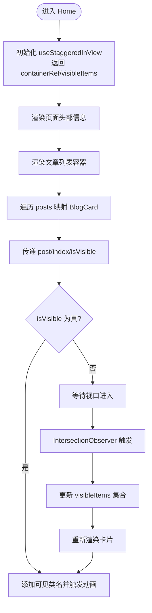
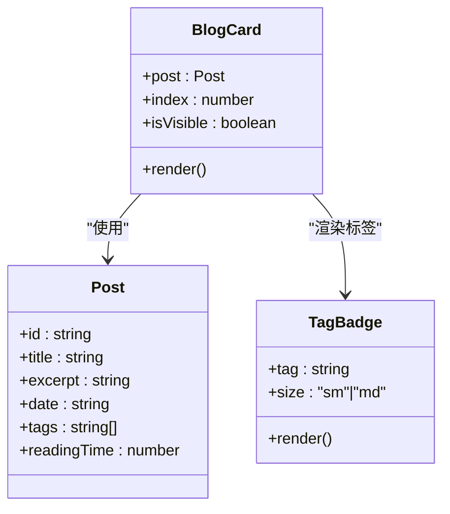
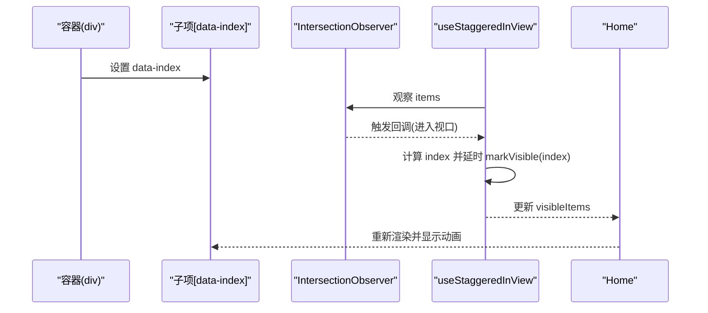
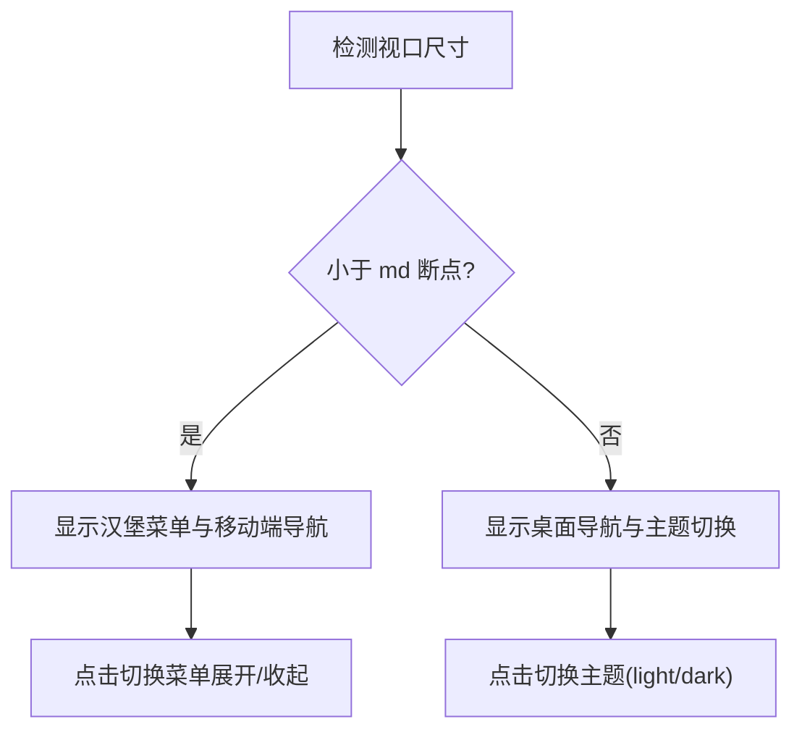
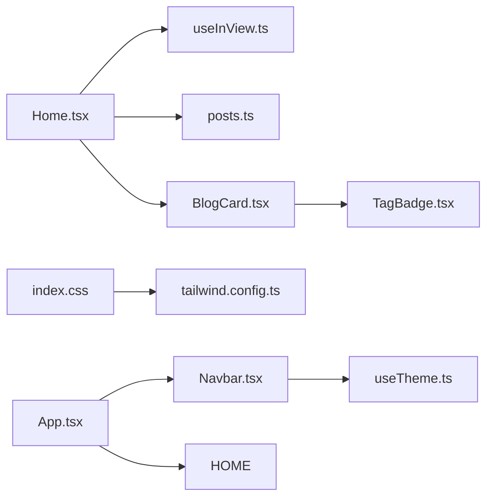

# 首页组件

<cite>
**本文引用的文件**
- [Home.tsx](file://src/pages/Home.tsx)
- [BlogCard.tsx](file://src/components/BlogCard.tsx)
- [useInView.ts](file://src/hooks/useInView.ts)
- [posts.ts](file://src/data/posts.ts)
- [utils.ts](file://src/lib/utils.ts)
- [index.css](file://src/index.css)
- [tailwind.config.ts](file://tailwind.config.ts)
- [App.tsx](file://src/App.tsx)
- [Navbar.tsx](file://src/components/Navbar.tsx)
- [Footer.tsx](file://src/components/Footer.tsx)
- [TagBadge.tsx](file://src/components/TagBadge.tsx)
- [useTheme.ts](file://src/hooks/useTheme.ts)
- [package.json](file://package.json)
</cite>

## 目录
1. [简介](#简介)
2. [项目结构](#项目结构)
3. [核心组件](#核心组件)
4. [架构总览](#架构总览)
5. [详细组件分析](#详细组件分析)
6. [依赖分析](#依赖分析)
7. [性能考虑](#性能考虑)
8. [故障排除指南](#故障排除指南)
9. [结论](#结论)
10. [附录](#附录)

## 简介
本文件为 B02 项目的首页组件提供系统化、可操作的技术文档。内容涵盖首页布局与内容组织、文章数据源集成、视口检测 Hook 的渐进式加载实现、BlogCard 组件的使用模式与数据传递机制、响应式设计与移动端适配策略、性能优化（虚拟滚动与懒加载）、SEO 与元数据管理最佳实践，以及首页扩展开发指南与自定义内容区域方法。文档面向不同技术背景的读者，既提供高层概览也包含代码级细节与可视化图表。

## 项目结构
首页位于 pages 层，采用“页面 + 组件 + Hook + 数据 + 样式”的分层组织方式：
- 页面层：Home.tsx 负责布局与数据聚合
- 组件层：BlogCard.tsx、TagBadge.tsx、Navbar.tsx、Footer.tsx 等
- Hook 层：useInView.ts、useTheme.ts 等
- 数据层：posts.ts 提供文章数据与查询函数
- 样式层：index.css、tailwind.config.ts 提供主题与动画

**图表来源**
- [App.tsx:12-32](file://src/App.tsx#L12-L32)
- [Home.tsx:1-34](file://src/pages/Home.tsx#L1-L34)
- [BlogCard.tsx:1-66](file://src/components/BlogCard.tsx#L1-L66)
- [useInView.ts:1-76](file://src/hooks/useInView.ts#L1-L76)
- [posts.ts:1-382](file://src/data/posts.ts#L1-L382)
- [Navbar.tsx:1-113](file://src/components/Navbar.tsx#L1-L113)
- [Footer.tsx:1-30](file://src/components/Footer.tsx#L1-L30)
- [TagBadge.tsx:1-28](file://src/components/TagBadge.tsx#L1-L28)
- [useTheme.ts:1-28](file://src/hooks/useTheme.ts#L1-L28)
- [index.css:1-234](file://src/index.css#L1-L234)
- [tailwind.config.ts:1-107](file://tailwind.config.ts#L1-L107)

**章节来源**
- [App.tsx:12-32](file://src/App.tsx#L12-L32)
- [Home.tsx:1-34](file://src/pages/Home.tsx#L1-L34)
- [index.css:1-234](file://src/index.css#L1-L234)
- [tailwind.config.ts:1-107](file://tailwind.config.ts#L1-L107)

## 核心组件
- 首页页面 Home：负责页面头部信息展示与文章列表渲染，集成 useStaggeredInView Hook 实现渐进式加载。
- BlogCard：展示单篇文章的卡片式 UI，包含标题、摘要、标签、阅读时间与日期等信息，并通过 isVisible 控制动画可见性。
- useInView/useStaggeredInView：提供视口检测与交错动画控制，支持一次性触发与延迟可见性。
- posts 数据：统一的文章数据模型与查询函数，便于按分类、标签筛选与全量展示。
- Navbar/Footer：提供导航与页脚，配合主题切换与移动端菜单。

**章节来源**
- [Home.tsx:5-33](file://src/pages/Home.tsx#L5-L33)
- [BlogCard.tsx:6-10](file://src/components/BlogCard.tsx#L6-L10)
- [useInView.ts:9-37](file://src/hooks/useInView.ts#L9-L37)
- [posts.ts:1-10](file://src/data/posts.ts#L1-L10)

## 架构总览
首页采用“页面聚合 + 组件拆分 + Hook 抽象 + 数据模型”的架构模式，通过 Hook 将视口检测与动画控制与页面解耦，使组件具备可复用性与可测试性。

**图表来源**
- [App.tsx:20-26](file://src/App.tsx#L20-L26)
- [Home.tsx:6-30](file://src/pages/Home.tsx#L6-L30)
- [useInView.ts:39-75](file://src/hooks/useInView.ts#L39-L75)
- [BlogCard.tsx:12-20](file://src/components/BlogCard.tsx#L12-L20)
- [posts.ts:14-382](file://src/data/posts.ts#L14-L382)

## 详细组件分析

### 首页页面 Home
- 布局结构
  - 头部区域：标题与描述信息，用于引导用户认知。
  - 文章列表区域：使用 Flex 布局与间距控制，承载多篇 BlogCard。
- 数据集成
  - 直接导入 posts.ts 的文章数组，映射为 BlogCard 列表。
  - 通过 useStaggeredInView 返回容器引用与可见索引集合，驱动卡片动画。
- 渐进式加载
  - 使用交错延迟（默认 80ms）实现“瀑布式”出现效果，提升视觉层次与加载感知。
  - isVisible 为 true 时，卡片添加可见类名，触发动画。

**图表来源**
- [Home.tsx:6-30](file://src/pages/Home.tsx#L6-L30)
- [useInView.ts:39-75](file://src/hooks/useInView.ts#L39-L75)

**章节来源**
- [Home.tsx:5-33](file://src/pages/Home.tsx#L5-L33)

### BlogCard 组件
- 数据结构
  - 接收 post（文章对象）、index（序号）、isVisible（是否可见）。
  - 通过 Link 跳转至文章详情页，路径形如 /post/:id。
- 视觉与交互
  - 使用 cn 合并类名，实现主题过渡与悬停效果。
  - meta 区域展示日期与阅读时长；标题与摘要提供内容概览；标签区使用 TagBadge 渲染。
  - 动画控制：根据 index 设置 animationDelay，结合 CSS stagger-item/visible 实现交错入场。
- 可访问性
  - Link 使用块级包裹，提升点击面积；卡片具备 ripple 效果增强触控反馈。

**图表来源**
- [BlogCard.tsx:6-10](file://src/components/BlogCard.tsx#L6-L10)
- [TagBadge.tsx:3-8](file://src/components/TagBadge.tsx#L3-L8)
- [posts.ts:1-10](file://src/data/posts.ts#L1-L10)

**章节来源**
- [BlogCard.tsx:12-65](file://src/components/BlogCard.tsx#L12-L65)
- [TagBadge.tsx:10-27](file://src/components/TagBadge.tsx#L10-L27)

### 视口检测 Hook：useInView 与 useStaggeredInView
- useInView
  - 基于 IntersectionObserver，支持阈值、根边距与一次性触发选项。
  - 返回 ref 与 isInView，适用于单元素观察。
- useStaggeredInView
  - 在容器内对子元素设置 data-index 属性，逐个观察并延迟标记为可见。
  - 返回 containerRef 与 visibleItems（Set<number>），用于控制子项动画。
  - 默认阈值与根边距优化了首屏与滚动体验。

**图表来源**
- [useInView.ts:55-72](file://src/hooks/useInView.ts#L55-L72)
- [Home.tsx:6-30](file://src/pages/Home.tsx#L6-L30)

**章节来源**
- [useInView.ts:9-37](file://src/hooks/useInView.ts#L9-L37)
- [useInView.ts:39-75](file://src/hooks/useInView.ts#L39-L75)

### 文章数据源 posts.ts
- 数据模型
  - Post 接口定义 id、title、excerpt、content、date、category、tags、readingTime。
  - 提供 categories、posts 数组与若干查询函数：按 ID、分类、标签检索，以及去重后的标签与分类列表。
- 使用方式
  - 首页直接导入 posts 作为数据源；组件间可按需调用查询函数实现筛选与聚合。

**章节来源**
- [posts.ts:1-10](file://src/data/posts.ts#L1-L10)
- [posts.ts:14-382](file://src/data/posts.ts#L14-L382)

### 响应式设计与移动端适配
- 容器与宽度
  - Tailwind 配置中定义 content/wide 最大宽度，首页容器使用 max-w-content 限制内容宽度。
- 移动端菜单
  - Navbar 在小屏下隐藏桌面导航，显示汉堡菜单与主题切换按钮；点击展开移动菜单。
- 动画与交互
  - 首页卡片在小屏下仍保持交错动画，但延迟时间可按需调整。
- 滚动行为
  - 全局启用 smooth scroll，提升滚动体验。

**图表来源**
- [Navbar.tsx:67-90](file://src/components/Navbar.tsx#L67-L90)
- [Navbar.tsx:57-63](file://src/components/Navbar.tsx#L57-L63)
- [tailwind.config.ts:22-25](file://tailwind.config.ts#L22-L25)

**章节来源**
- [Navbar.tsx:18-112](file://src/components/Navbar.tsx#L18-L112)
- [tailwind.config.ts:11-17](file://tailwind.config.ts#L11-L17)

## 依赖分析
- 组件耦合
  - Home 依赖 useStaggeredInView 与 posts；BlogCard 依赖 TagBadge 与 Link；Navbar 依赖 useTheme 与 useScrollProgress。
- 外部依赖
  - React Router 用于页面路由；Tailwind CSS 与 Tailwind Merge 用于样式；Lucide React 用于图标；clsx/twMerge 用于类名合并。
- 样式依赖
  - index.css 定义主题变量与动画；tailwind.config.ts 扩展颜色、圆角与动画。

**图表来源**
- [Home.tsx:1-3](file://src/pages/Home.tsx#L1-L3)
- [BlogCard.tsx:1-4](file://src/components/BlogCard.tsx#L1-L4)
- [Navbar.tsx:4-5](file://src/components/Navbar.tsx#L4-L5)
- [useTheme.ts:1-28](file://src/hooks/useTheme.ts#L1-L28)
- [index.css:1-234](file://src/index.css#L1-L234)
- [tailwind.config.ts:1-107](file://tailwind.config.ts#L1-L107)
- [App.tsx:1-43](file://src/App.tsx#L1-L43)

**章节来源**
- [package.json:11-21](file://package.json#L11-L21)
- [App.tsx:1-43](file://src/App.tsx#L1-L43)

## 性能考虑
- 渐进式加载与动画
  - 使用 useStaggeredInView 与 CSS stagger-item/visible，避免一次性渲染大量 DOM，降低首屏阻塞。
  - 动画延迟按索引线性增长，确保视觉流畅且不造成卡顿。
- 虚拟滚动建议
  - 当文章数量增长时，可引入虚拟滚动（例如 react-window 或 react-virtualized）仅渲染可视区域内的卡片，显著降低内存占用与重排成本。
- 懒加载建议
  - 对卡片中的图片或富文本内容可采用懒加载策略（如 loading="lazy"、IntersectionObserver 触发加载），减少初始网络压力。
- 代码分割与路由懒加载
  - 将文章详情页与分类页按需加载，减少首页初始包体积。
- 图标与字体
  - 使用 lucide-react 的细粒度图标，避免整包引入；字体通过 @fontsource/inter 按需加载。
- 主题切换与本地存储
  - useTheme 将主题持久化到 localStorage，避免每次刷新重算匹配媒体查询带来的抖动。

**章节来源**
- [useInView.ts:39-75](file://src/hooks/useInView.ts#L39-L75)
- [index.css:152-160](file://src/index.css#L152-L160)
- [useTheme.ts:6-20](file://src/hooks/useTheme.ts#L6-L20)
- [package.json:11-21](file://package.json#L11-L21)

## 故障排除指南
- 卡片未触发动画
  - 检查容器是否正确传入 containerRef；确认子项是否设置 data-index；检查 IntersectionObserver 阈值与根边距配置。
- 卡片闪烁或重复触发
  - 若 triggerOnce 为 true，元素离开视口后将不再触发；若需反复触发，将 triggerOnce 设为 false。
- 样式不生效
  - 确认 Tailwind 配置的 content 路径包含当前文件；检查主题变量与类名合并逻辑。
- 移动端菜单无法展开
  - 检查移动端状态切换逻辑与过渡动画类名；确认触摸事件绑定正常。
- 主题切换无效
  - 检查 useTheme 是否正确写入 localStorage 并更新根节点类名。

**章节来源**
- [useInView.ts:9-37](file://src/hooks/useInView.ts#L9-L37)
- [useInView.ts:55-72](file://src/hooks/useInView.ts#L55-L72)
- [Navbar.tsx:21-90](file://src/components/Navbar.tsx#L21-L90)
- [useTheme.ts:15-24](file://src/hooks/useTheme.ts#L15-L24)

## 结论
首页组件通过清晰的分层设计与 Hook 抽象，实现了良好的可维护性与可扩展性。交错动画与视口检测提升了用户体验，同时为后续性能优化（虚拟滚动、懒加载）预留了空间。配合响应式设计与主题系统，首页在桌面与移动端均具备优秀的可用性。未来可在数据层引入分页或服务端渲染，进一步提升性能与 SEO 表现。

## 附录

### SEO 与元数据管理最佳实践
- 页面标题与描述
  - 在路由层或页面组件中动态设置 document.title 与 meta description，确保搜索引擎抓取到准确信息。
- 结构化数据
  - 为文章卡片添加 JSON-LD 的 Article Schema，包含 headline、datePublished、author、publisher 等字段。
- 可访问性
  - 为图片提供 alt；为链接提供语义化标题；确保键盘可访问与屏幕阅读器友好。
- 链接与导航
  - 使用 Link 替代 a 标签，避免页面刷新；为外部链接添加 rel="noopener noreferrer"。

### 首页扩展开发指南
- 自定义内容区域
  - 在首页头部区域插入轮播图、公告栏或推荐位，保持与现有布局结构一致。
- 分类与标签筛选
  - 基于 posts.ts 的查询函数实现分类/标签过滤，结合 Navbar 或独立筛选面板。
- 无限滚动与分页
  - 在文章列表底部添加加载更多按钮或监听滚动到底部触发加载，避免一次性渲染过多卡片。
- 主题与配色
  - 通过 useTheme 与 CSS 变量扩展更多主题色板，或引入暗色/高对比度模式。