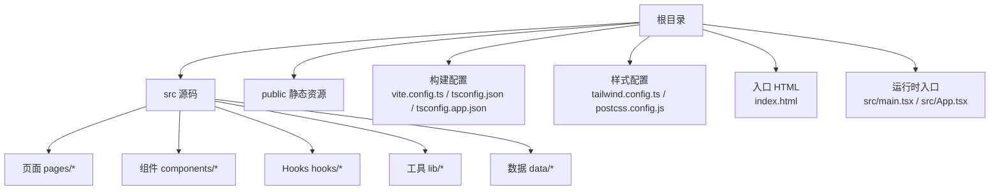
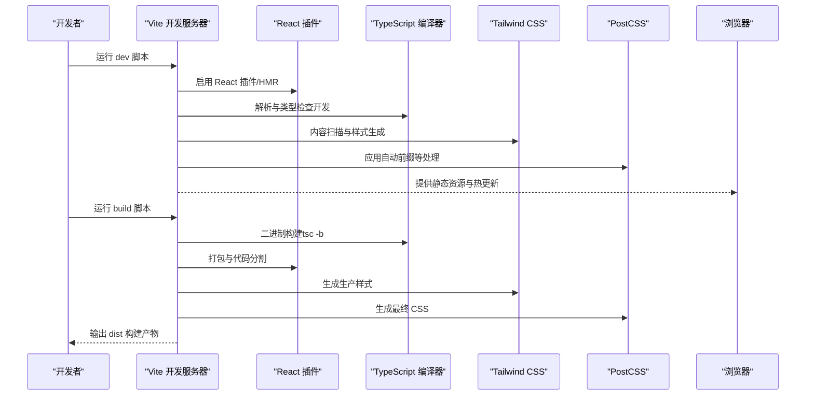
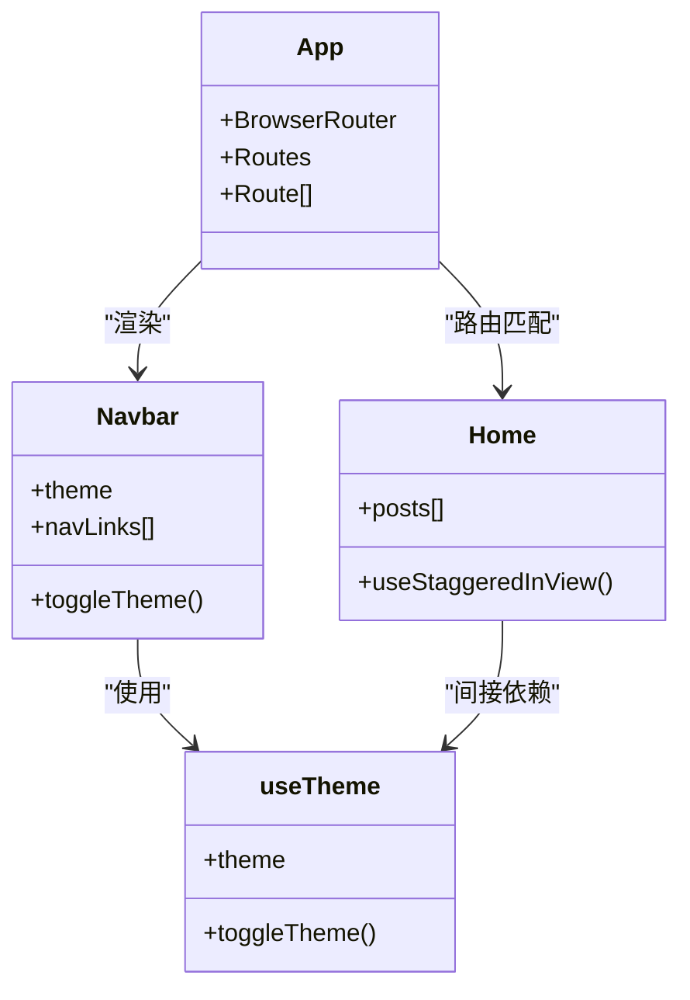
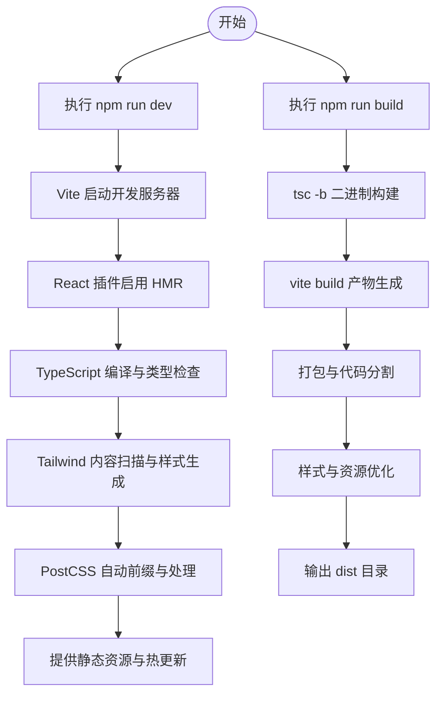

# 构建配置

<cite>
**本文引用的文件**
- [vite.config.ts](file://vite.config.ts)
- [package.json](file://package.json)
- [tsconfig.json](file://tsconfig.json)
- [tsconfig.app.json](file://tsconfig.app.json)
- [tailwind.config.ts](file://tailwind.config.ts)
- [postcss.config.js](file://postcss.config.js)
- [index.html](file://index.html)
- [src/main.tsx](file://src/main.tsx)
- [src/App.tsx](file://src/App.tsx)
- [src/components/Navbar.tsx](file://src/components/Navbar.tsx)
- [src/hooks/useTheme.ts](file://src/hooks/useTheme.ts)
- [src/pages/Home.tsx](file://src/pages/Home.tsx)
</cite>

## 目录
1. [简介](#简介)
2. [项目结构](#项目结构)
3. [核心组件](#核心组件)
4. [架构总览](#架构总览)
5. [详细组件分析](#详细组件分析)
6. [依赖关系分析](#依赖关系分析)
7. [性能考量](#性能考量)
8. [故障排查指南](#故障排查指南)
9. [结论](#结论)
10. [附录](#附录)

## 简介
本文件面向B02项目的构建系统，围绕Vite作为构建工具的选择与配置进行系统化说明，涵盖路径别名、开发服务器、插件体系、TypeScript编译配置、Tailwind CSS与PostCSS集成、以及开发/生产差异与构建优化策略。同时提供构建产物结构与部署要点，帮助开发者高效维护与扩展构建系统。

## 项目结构
该项目采用Vite + React + TypeScript + Tailwind CSS的技术栈，目录组织清晰：
- 源码位于 src 目录，包含页面、组件、Hooks、工具库与数据。
- 根目录提供入口 HTML、构建配置、类型与样式配置。
- 开发与构建脚本通过 package.json 的 scripts 字段统一管理。

图示来源
- [vite.config.ts](file://vite.config.ts)
- [tsconfig.json](file://tsconfig.json)
- [tsconfig.app.json](file://tsconfig.app.json)
- [tailwind.config.ts](file://tailwind.config.ts)
- [postcss.config.js](file://postcss.config.js)
- [index.html](file://index.html)
- [src/main.tsx](file://src/main.tsx)
- [src/App.tsx](file://src/App.tsx)

章节来源
- [vite.config.ts](file://vite.config.ts)
- [package.json](file://package.json)
- [tsconfig.json](file://tsconfig.json)
- [tsconfig.app.json](file://tsconfig.app.json)
- [tailwind.config.ts](file://tailwind.config.ts)
- [postcss.config.js](file://postcss.config.js)
- [index.html](file://index.html)
- [src/main.tsx](file://src/main.tsx)
- [src/App.tsx](file://src/App.tsx)

## 核心组件
- Vite 构建与开发服务器：提供快速热更新、按需打包与现代化特性支持。
- React 插件：启用 JSX 转换、HMR 与 React Refresh。
- 路径别名：统一以 @ 指向 src，提升导入可读性与可维护性。
- TypeScript 编译：严格模式、模块解析策略与路径映射，确保类型安全与模块兼容。
- Tailwind CSS：内容扫描、主题扩展、动画与暗色模式支持。
- PostCSS：自动前缀与 Tailwind 集成，保证跨浏览器兼容。

章节来源
- [vite.config.ts](file://vite.config.ts)
- [package.json](file://package.json)
- [tsconfig.app.json](file://tsconfig.app.json)
- [tailwind.config.ts](file://tailwind.config.ts)
- [postcss.config.js](file://postcss.config.js)

## 架构总览
下图展示从开发到构建的关键流程与组件交互。

图示来源
- [package.json](file://package.json)
- [vite.config.ts](file://vite.config.ts)
- [tsconfig.app.json](file://tsconfig.app.json)
- [tailwind.config.ts](file://tailwind.config.ts)
- [postcss.config.js](file://postcss.config.js)

## 详细组件分析

### Vite 配置与开发服务器
- 插件体系
  - React 插件：启用 JSX 转换、React Refresh 与 HMR，提升开发体验。
- 路径别名
  - 通过 resolve.alias 将 @ 映射到 src，便于在组件中使用相对路径导入。
- 开发服务器
  - 默认端口 3000，启动后自动打开浏览器，提升调试效率。
- 生产构建
  - 通过 vite build 产出静态资源；配合 tsc -b 先进行二进制构建，确保类型一致性。

章节来源
- [vite.config.ts](file://vite.config.ts)
- [package.json](file://package.json)

### TypeScript 编译配置
- 多项目引用
  - 根 tsconfig.json 通过 references 引用 tsconfig.app.json，实现分层编译与隔离。
- 编译目标与模块
  - 目标 ES2020，模块为 ESNext，适配现代浏览器与打包器的模块解析策略。
- 模块解析策略
  - 使用 bundler，结合 allowImportingTsExtensions、isolatedModules、moduleDetection 等选项，确保与 Vite/打包器协同。
- 路径映射
  - 在 tsconfig.app.json 中定义 baseUrl 与 paths，与 Vite 别名保持一致，避免路径不一致导致的类型错误。
- 严格模式
  - 启用严格模式与多项 noEmit 相关规则，减少潜在问题并提升代码质量。

章节来源
- [tsconfig.json](file://tsconfig.json)
- [tsconfig.app.json](file://tsconfig.app.json)

### Tailwind CSS 与 PostCSS 集成
- 内容扫描
  - Tailwind 配置扫描 index.html 与 src 下的 TS/TSX 文件，仅生成所需样式，避免无用 CSS。
- 主题与变量
  - 定义容器宽度、字体族、颜色系统与圆角变量，配合 CSS 变量实现主题切换。
- 动画与过渡
  - 自定义 keyframes 与 animation，用于页面过渡与交互反馈。
- 插件与前缀
  - 启用 tailwindcss-animate 插件与 autoprefixer，增强动画能力与跨浏览器兼容。

章节来源
- [tailwind.config.ts](file://tailwind.config.ts)
- [postcss.config.js](file://postcss.config.js)

### 入口与路由
- HTML 入口
  - index.html 包含根节点与描述信息，加载 src/main.tsx 作为应用入口。
- React 入口
  - main.tsx 导入字体、全局样式与应用根组件，挂载到 DOM。
- 应用结构
  - App.tsx 使用 React Router 管理路由，引入导航、页脚、滚动控制与主题切换逻辑。
- 组件与数据
  - 页面组件通过 @ 别名导入，数据与 Hooks 位于对应目录，体现清晰的模块边界。

章节来源
- [index.html](file://index.html)
- [src/main.tsx](file://src/main.tsx)
- [src/App.tsx](file://src/App.tsx)
- [src/components/Navbar.tsx](file://src/components/Navbar.tsx)
- [src/hooks/useTheme.ts](file://src/hooks/useTheme.ts)
- [src/pages/Home.tsx](file://src/pages/Home.tsx)

### 类图：应用与组件关系

图示来源
- [src/App.tsx](file://src/App.tsx)
- [src/components/Navbar.tsx](file://src/components/Navbar.tsx)
- [src/hooks/useTheme.ts](file://src/hooks/useTheme.ts)
- [src/pages/Home.tsx](file://src/pages/Home.tsx)

### 流程图：开发与构建流程

图示来源
- [package.json](file://package.json)
- [vite.config.ts](file://vite.config.ts)
- [tsconfig.app.json](file://tsconfig.app.json)
- [tailwind.config.ts](file://tailwind.config.ts)
- [postcss.config.js](file://postcss.config.js)

## 依赖关系分析
- 脚本命令
  - dev：启动 Vite 开发服务器。
  - build：先执行 tsc -b，再执行 vite build 生成生产包。
  - preview：预览构建产物。
- 运行时依赖
  - React 生态与 UI 工具：react、react-dom、react-router-dom。
  - 样式与图标：lucide-react、@fontsource/inter、tailwind-merge、class-variance-authority、clsx。
- 开发依赖
  - Vite、React 插件、TypeScript、Tailwind CSS、PostCSS、autoprefixer。
- 路径别名一致性
  - Vite 的 @ 与 TypeScript 的 @/* 保持一致，避免导入错误。

章节来源
- [package.json](file://package.json)
- [vite.config.ts](file://vite.config.ts)
- [tsconfig.app.json](file://tsconfig.app.json)

## 性能考量
- 代码分割
  - Vite 默认按需打包与动态导入，建议将大型页面或路由组件拆分为独立模块，利用浏览器缓存与懒加载。
- Tree Shaking
  - 使用 ES 模块语法与严格的 TypeScript 配置，确保未使用的导出被移除；避免副作用与全局变量污染。
- 压缩与最小化
  - 生产构建默认启用压缩；如需进一步优化，可在 Vite 配置中调整压缩器参数或启用更多优化选项。
- 样式体积
  - Tailwind 的内容扫描仅生成使用到的类，建议定期清理未使用类，避免样式膨胀。
- 资源优化
  - 图片与字体建议使用现代格式与合适的尺寸；对图标使用 lucide-react 的按需导入，减少体积。
- 缓存策略
  - 构建产物采用哈希命名，建议在部署时开启长期缓存与 CDN 加速。

## 故障排查指南
- 别名导入失败
  - 症状：无法通过 @/xxx 导入。
  - 排查：确认 Vite 与 TypeScript 的 paths 与 baseUrl 一致；检查 tsconfig.app.json 的 paths 是否包含 @/*。
- 类型错误或编译失败
  - 症状：TypeScript 报错或构建中断。
  - 排查：先执行 tsc -b 确认类型检查；检查 moduleResolution 与 bundler 设置是否正确。
- Tailwind 样式未生效
  - 症状：自定义类无效。
  - 排查：确认 tailwind.config.ts 的 content 路径包含当前文件；检查 PostCSS 配置是否启用 tailwindcss 与 autoprefixer。
- 开发服务器端口占用
  - 症状：无法启动 dev 服务。
  - 排查：修改 vite.config.ts 的 server.port 或关闭占用端口的应用。
- 预览构建异常
  - 症状：npm run preview 报错。
  - 排查：先执行 npm run build，确认 dist 目录存在且无错误；检查静态资源路径与基础路径配置。

章节来源
- [vite.config.ts](file://vite.config.ts)
- [tsconfig.app.json](file://tsconfig.app.json)
- [tailwind.config.ts](file://tailwind.config.ts)
- [postcss.config.js](file://postcss.config.js)
- [package.json](file://package.json)

## 结论
本项目以 Vite 为核心，结合 React、TypeScript、Tailwind CSS 与 PostCSS，形成一套现代化、高性能且易于维护的前端构建体系。通过路径别名、严格类型与按需打包，既保证了开发体验，也兼顾了生产性能。建议在后续迭代中持续关注模块拆分、Tree Shaking 与资源优化，以进一步提升构建效率与运行性能。

## 附录
- 构建产物结构
  - dist 目录包含 HTML、JS、CSS 与静态资源；建议配合 CDN 与缓存策略进行部署。
- 部署建议
  - 使用静态站点托管（如 GitHub Pages、Vercel、Netlify）；确保基础路径与路由模式与部署环境一致。
- 扩展方向
  - 可考虑添加环境变量、条件加载、多环境配置文件与更细粒度的构建优化策略。