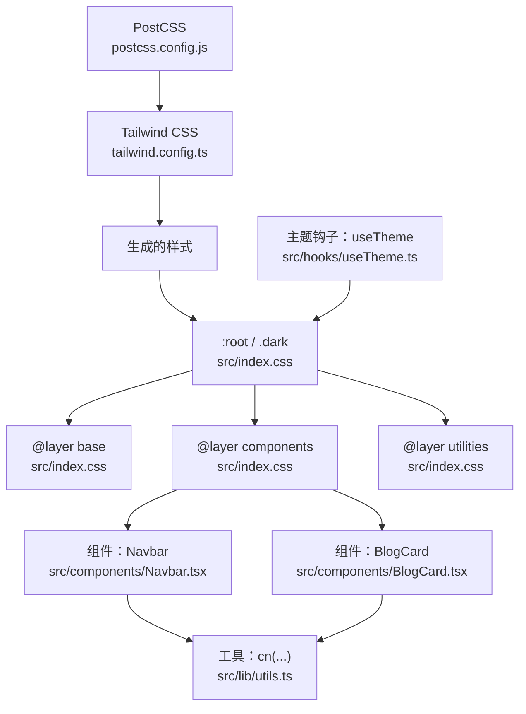
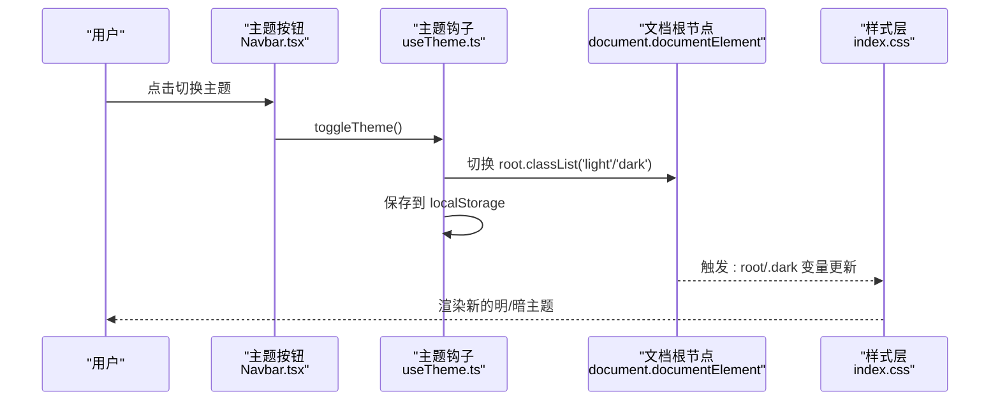
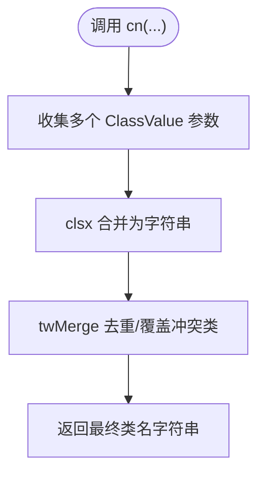
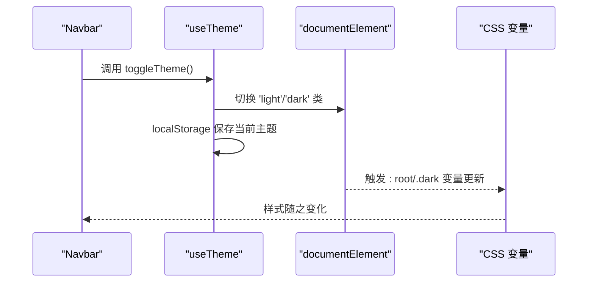
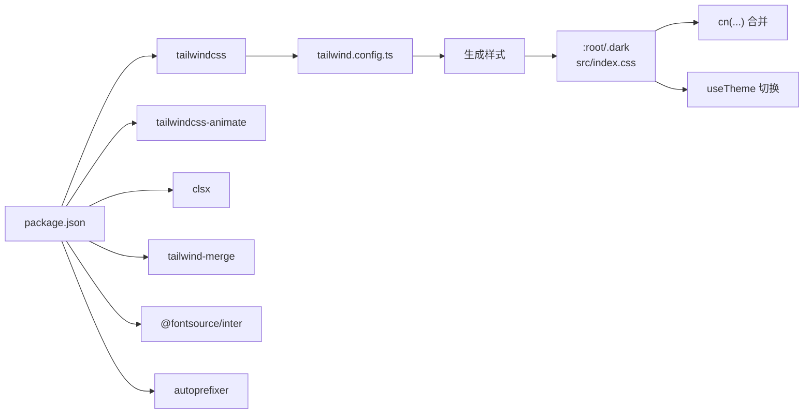

# 样式系统架构

<cite>
**本文引用的文件**
- [tailwind.config.ts](file://tailwind.config.ts)
- [src/index.css](file://src/index.css)
- [src/lib/utils.ts](file://src/lib/utils.ts)
- [src/hooks/useTheme.ts](file://src/hooks/useTheme.ts)
- [src/App.tsx](file://src/App.tsx)
- [src/components/Navbar.tsx](file://src/components/Navbar.tsx)
- [src/components/BlogCard.tsx](file://src/components/BlogCard.tsx)
- [src/pages/Home.tsx](file://src/pages/Home.tsx)
- [postcss.config.js](file://postcss.config.js)
- [package.json](file://package.json)
</cite>

## 更新摘要
**变更内容**
- 更新了 src/index.css 的完整 CSS 自定义属性定义和暗色模式支持
- 新增了博客卡片渐进淡入动画、代码块呼吸边框动画、涟漪效果等复杂动画
- 增强了设计令牌系统，包括阴影、过渡时间曲线、导航高度等自定义变量
- 改进了主题切换机制，使用 localStorage 存储主题偏好
- 更新了组件级样式组织和命名约定

## 目录
1. [引言](#引言)
2. [项目结构](#项目结构)
3. [核心组件](#核心组件)
4. [架构总览](#架构总览)
5. [详细组件分析](#详细组件分析)
6. [依赖关系分析](#依赖关系分析)
7. [性能考量](#性能考量)
8. [故障排查指南](#故障排查指南)
9. [结论](#结论)
10. [附录](#附录)

## 引言
本文件面向设计师与开发者，系统化梳理 B02 项目的样式系统架构，重点围绕 Tailwind CSS 的实用优先理念与工程化配置展开，覆盖以下主题：
- Tailwind 配置策略：暗色模式、自定义颜色系统、动画与关键帧扩展
- CSS 类名组织原则与命名约定
- 工具函数 cn(...) 的实现与使用场景
- 响应式设计断点与媒体查询策略
- 主题切换对样式的动态影响与实现机制
- 样式定制最佳实践与可复用模式

## 项目结构
样式系统由"构建管线 + 配置 + 基础样式层 + 组件级样式"四部分组成：
- 构建管线：PostCSS 负责解析 @tailwind 指令并注入生成的样式
- 配置层：tailwind.config.ts 定义内容扫描范围、主题扩展（颜色、圆角、字体、动画）与插件
- 基础层：src/index.css 定义 CSS 变量、明/暗两套主题、基础与组件层样式、过渡与动画
- 组件层：各组件通过 cn(...) 合并类名，并结合基础层提供的变量与动画实现一致风格

**图表来源**
- [postcss.config.js:1-7](file://postcss.config.js#L1-L7)
- [tailwind.config.ts:1-107](file://tailwind.config.ts#L1-L107)
- [src/index.css:1-258](file://src/index.css#L1-L258)
- [src/lib/utils.ts:1-7](file://src/lib/utils.ts#L1-L7)
- [src/hooks/useTheme.ts:1-28](file://src/hooks/useTheme.ts#L1-L28)
- [src/components/Navbar.tsx:1-113](file://src/components/Navbar.tsx#L1-L113)
- [src/components/BlogCard.tsx:1-117](file://src/components/BlogCard.tsx#L1-L117)

**章节来源**
- [postcss.config.js:1-7](file://postcss.config.js#L1-L7)
- [tailwind.config.ts:1-107](file://tailwind.config.ts#L1-L107)
- [src/index.css:1-258](file://src/index.css#L1-L258)

## 核心组件
- Tailwind 配置与主题扩展
  - 内容扫描：确保源码与 HTML 中的类名被收录
  - 暗色模式：基于类名切换，根元素添加 light/dark 类
  - 主题变量：以 CSS 变量形式集中管理颜色与阴影等设计令牌
  - 字体与宽度：扩展无衬线字体与内容/宽屏最大宽度
  - 圆角：基于变量统一圆角尺寸
  - 动画与关键帧：内置多组动效，如淡入、呼吸、进度脉冲、滑入等
  - 插件：tailwindcss-animate 提供增强的动画控制
- 基础样式层
  - :root 与 .dark：两套主题变量，覆盖背景、前景、主色、次色、边框、输入、环形光晕等
  - @layer base：全局边框基线、滚动行为、选区与滚动条样式
  - @layer components：链接下划线、涟漪、分组项渐显、阅读进度条、代码块、页面过渡等
  - @layer utilities：主题过渡通用类
- 工具函数 cn(...)
  - 基于 clsx 与 tailwind-merge，安全合并类名，避免冲突与重复
- 主题钩子 useTheme()
  - 读取/保存本地偏好，监听系统配色，切换根元素类名，驱动 CSS 变量生效

**章节来源**
- [tailwind.config.ts:1-107](file://tailwind.config.ts#L1-L107)
- [src/index.css:1-258](file://src/index.css#L1-L258)
- [src/lib/utils.ts:1-7](file://src/lib/utils.ts#L1-L7)
- [src/hooks/useTheme.ts:1-28](file://src/hooks/useTheme.ts#L1-L28)

## 架构总览
Tailwind 在构建阶段根据配置生成类名，运行时通过 CSS 变量与根元素类名实现主题切换，组件通过 cn(...) 合并类名并应用基础层样式。

**图表来源**
- [src/components/Navbar.tsx:57-63](file://src/components/Navbar.tsx#L57-L63)
- [src/hooks/useTheme.ts:22-24](file://src/hooks/useTheme.ts#L22-L24)
- [src/index.css:41-66](file://src/index.css#L41-L66)

## 详细组件分析

### Tailwind 配置与主题扩展
- 内容扫描与前缀
  - content 包含 HTML 与 TS/TSX 源码，确保按需生成类
  - prefix 留空，便于直接使用默认类名
- 暗色模式
  - 使用 class 策略，根元素类名为 light 或 dark
- 主题扩展
  - 字体：sans 使用 Inter 与系统回退
  - 最大宽度：content 与 wide 两类内容宽度
  - 颜色：基于 hsl(var(--*)) 的语义色板，覆盖背景、前景、主/次、破坏性、遮罩、强调、气泡、卡片等
  - 圆角：lg/md/sm 基于 CSS 变量 --radius
  - 动画与关键帧：内置多组动效，配合 animation 属性使用
- 插件
  - tailwindcss-animate 提供更丰富的动画类

**章节来源**
- [tailwind.config.ts:3-107](file://tailwind.config.ts#L3-L107)

### 基础样式层（src/index.css）
- 设计令牌
  - :root 定义品牌色与阴影等变量；.dark 定义暗色变量
  - 自定义变量：导航高度、内容最大宽度、过渡曲线、阴影等
- @layer base
  - 全局边框基线、平滑滚动、抗锯齿
  - body 应用背景与前景色，并使用变量进行主题过渡
  - 选区与滚动条样式
- @layer components
  - 链接下划线：悬停时宽度从 0 延展至 100%
  - 涟漪：触摸时产生波纹扩散
  - 分组项渐显：.stagger-item 与 .visible 组合实现交错入场
  - 阅读进度条：固定定位，随滚动宽度变化
  - 代码块：带边框与悬停呼吸动效
  - 页面过渡：进入/退出时的位移与透明度过渡
- @layer utilities
  - theme-transition：统一主题切换时的过渡属性

**章节来源**
- [src/index.css:5-105](file://src/index.css#L5-L105)
- [src/index.css:107-211](file://src/index.css#L107-L211)
- [src/index.css:213-258](file://src/index.css#L213-L258)

### 类名合并工具函数（cn(...)）
- 实现要点
  - 使用 clsx 与 tailwind-merge，先拆分再合并，消除冲突类
- 使用场景
  - 组件条件类名拼接（如可见状态、活动态、悬停态）
  - 复杂交互下的类名组合（如卡片 hover、移动端菜单展开）

**图表来源**
- [src/lib/utils.ts:4-6](file://src/lib/utils.ts#L4-L6)

**章节来源**
- [src/lib/utils.ts:1-7](file://src/lib/utils.ts#L1-L7)

### 主题切换机制（useTheme）
- 状态初始化
  - 优先读取 localStorage；若无则采用系统配色偏好
- DOM 操作
  - 切换 document.documentElement 的类名（light/dark），驱动 CSS 变量切换
- 本地持久化
  - 将当前主题写入 localStorage，刷新后保持
- 组件集成
  - Navbar 接收 theme 与 toggleTheme，渲染太阳/月亮图标并触发切换

**图表来源**
- [src/components/Navbar.tsx:57-63](file://src/components/Navbar.tsx#L57-L63)
- [src/hooks/useTheme.ts:15-20](file://src/hooks/useTheme.ts#L15-L20)
- [src/index.css:41-66](file://src/index.css#L41-L66)

**章节来源**
- [src/hooks/useTheme.ts:1-28](file://src/hooks/useTheme.ts#L1-L28)
- [src/components/Navbar.tsx:18-82](file://src/components/Navbar.tsx#L18-L82)

### 响应式设计与断点
- 断点策略
  - 通过 Tailwind 默认断点（sm 及以上）与组件内条件类名实现响应式布局
- 实践示例
  - 导航栏在小屏隐藏，使用 md 控制显示/隐藏
  - 卡片内边距在 sm 及以上增大
  - 文章列表容器限制最大宽度并居中

**章节来源**
- [src/components/Navbar.tsx:42-64](file://src/components/Navbar.tsx#L42-L64)
- [src/components/BlogCard.tsx:24-30](file://src/components/BlogCard.tsx#L24-L30)
- [src/pages/Home.tsx:9-31](file://src/pages/Home.tsx#L9-L31)

### 动画与过渡
- 关键帧与动画
  - 配置中定义多组关键帧（淡入、缩放弹跳、呼吸、进度脉冲、滑入）
  - 通过 animation 属性组合使用
- 基础层动效
  - 组件层提供链接下划线、涟漪、交错入场、代码块呼吸、页面过渡等
- 使用建议
  - 优先使用配置中已定义的动画类，避免重复定义
  - 对于复杂序列，可在组件层局部组合基础动画类

**章节来源**
- [tailwind.config.ts:66-100](file://tailwind.config.ts#L66-L100)
- [src/index.css:107-211](file://src/index.css#L107-L211)

### 组件级样式组织与命名约定
- 命名约定
  - 语义化类名：如 link-underline、ripple、stagger-item、reading-progress、code-block、page-enter/exit
  - 状态类：visible（交错入场）、theme-transition（主题过渡）
  - 响应式前缀：md: 控制桌面端显示
- 组织原则
  - 基础样式集中在 @layer components 与 utilities
  - 组件内部仅拼接必要的语义类与状态类，避免重复定义
  - 使用 cn(...) 合并条件类名，保证可维护性

**章节来源**
- [src/index.css:107-211](file://src/index.css#L107-L211)
- [src/components/Navbar.tsx:25-30](file://src/components/Navbar.tsx#L25-L30)
- [src/components/BlogCard.tsx:16-19](file://src/components/BlogCard.tsx#L16-L19)

## 依赖关系分析
- 构建依赖
  - PostCSS 加载 tailwindcss 与 autoprefixer 插件
  - Tailwind 依据配置生成类名
- 运行时依赖
  - useTheme 通过 DOM 类名驱动 CSS 变量
  - cn(...) 保障类名合并正确性
- 第三方库
  - clsx/tailwind-merge：类名合并
  - tailwindcss-animate：动画增强
  - @fontsource/inter：字体资源

**图表来源**
- [package.json:11-31](file://package.json#L11-L31)
- [tailwind.config.ts:103](file://tailwind.config.ts#L103)
- [src/index.css:5-66](file://src/index.css#L5-L66)
- [src/lib/utils.ts:1-2](file://src/lib/utils.ts#L1-L2)
- [src/hooks/useTheme.ts:15-20](file://src/hooks/useTheme.ts#L15-L20)

**章节来源**
- [package.json:1-36](file://package.json#L1-L36)
- [postcss.config.js:1-7](file://postcss.config.js#L1-L7)

## 性能考量
- 按需生成：content 配置确保仅生成实际使用的类，减少体积
- CSS 变量：主题切换只变更变量，避免重排与重绘
- 动画优化：使用 CSS 动画而非 JS，利用 GPU 加速
- 类名合并：通过 twMerge 避免冗余类导致的样式冲突与体积膨胀

## 故障排查指南
- 类名未生效
  - 检查 tailwind.config.ts 的 content 是否包含对应文件路径
  - 确认组件是否使用 cn(...) 合并类名
- 主题切换无效
  - 确认 useTheme 正确设置 document.documentElement 类名
  - 检查 :root 与 .dark 变量是否正确覆盖目标属性
- 动画不出现
  - 确认 animation 名称与 keyframes 定义一致
  - 检查组件是否正确引入基础层动画类或使用配置中的动画类

**章节来源**
- [tailwind.config.ts:5-8](file://tailwind.config.ts#L5-L8)
- [src/hooks/useTheme.ts:15-20](file://src/hooks/useTheme.ts#L15-L20)
- [src/index.css:213-258](file://src/index.css#L213-L258)

## 结论
B02 的样式系统以 Tailwind 的实用优先为核心，通过配置扩展与 CSS 变量实现了高内聚、低耦合的主题与动效体系。工具函数 cn(...) 与 useTheme 钩子进一步提升了类名管理与主题切换的可靠性。遵循本文的命名约定与最佳实践，可快速构建一致、可维护且高性能的界面。

## 附录
- 快速参考
  - 主题切换：Navbar 中的切换按钮触发 useTheme.toggleTheme，根元素类名驱动 :root/.dark
  - 类名合并：组件内部使用 cn(...) 组合条件类名
  - 响应式：使用 md: 等断点控制桌面端显示
  - 动效：优先使用配置中定义的动画类，必要时在组件层组合基础动画类