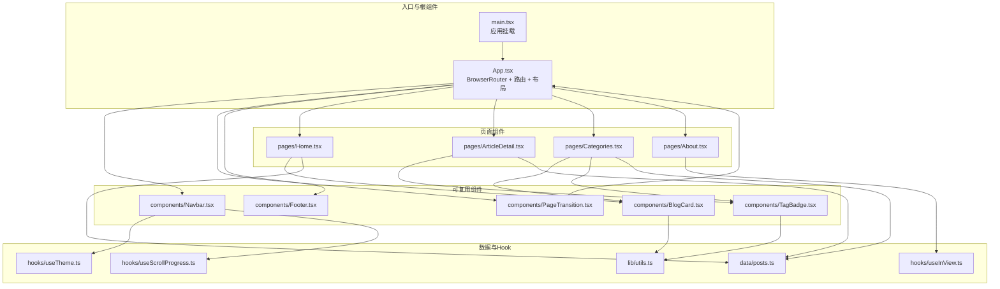
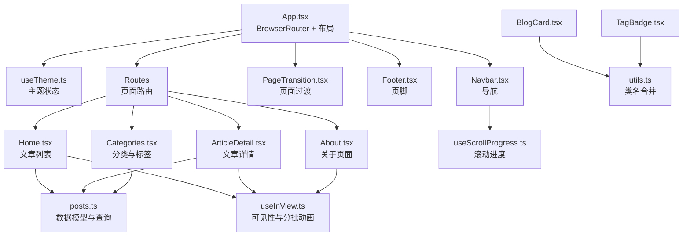
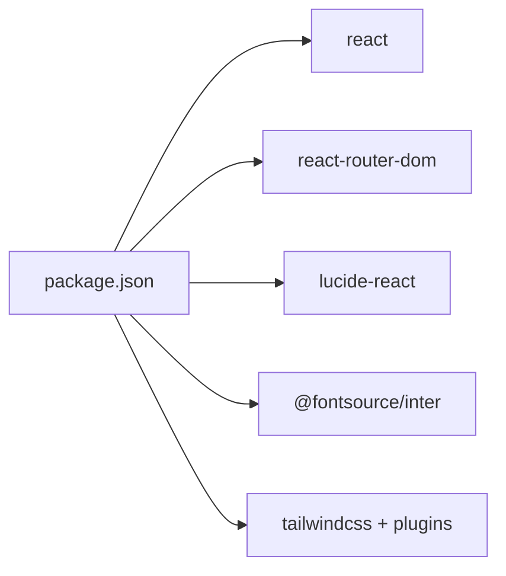

# 组件架构设计

<cite>
**本文引用的文件**
- [src/App.tsx](file://src/App.tsx)
- [src/main.tsx](file://src/main.tsx)
- [src/pages/Home.tsx](file://src/pages/Home.tsx)
- [src/pages/ArticleDetail.tsx](file://src/pages/ArticleDetail.tsx)
- [src/pages/Categories.tsx](file://src/pages/Categories.tsx)
- [src/pages/About.tsx](file://src/pages/About.tsx)
- [src/components/Navbar.tsx](file://src/components/Navbar.tsx)
- [src/components/Footer.tsx](file://src/components/Footer.tsx)
- [src/components/PageTransition.tsx](file://src/components/PageTransition.tsx)
- [src/components/BlogCard.tsx](file://src/components/BlogCard.tsx)
- [src/components/TagBadge.tsx](file://src/components/TagBadge.tsx)
- [src/data/posts.ts](file://src/data/posts.ts)
- [src/hooks/useTheme.ts](file://src/hooks/useTheme.ts)
- [src/hooks/useInView.ts](file://src/hooks/useInView.ts)
- [src/hooks/useScrollProgress.ts](file://src/hooks/useScrollProgress.ts)
- [src/lib/utils.ts](file://src/lib/utils.ts)
- [package.json](file://package.json)
</cite>

## 目录
1. [引言](#引言)
2. [项目结构](#项目结构)
3. [核心组件](#核心组件)
4. [架构总览](#架构总览)
5. [组件详解](#组件详解)
6. [依赖关系分析](#依赖关系分析)
7. [性能考量](#性能考量)
8. [故障排查指南](#故障排查指南)
9. [结论](#结论)
10. [附录](#附录)

## 引言
本文件面向B02项目的组件架构设计，围绕基于React 18的组件化理念，系统梳理根组件App.tsx的结构与层次关系，解析页面组件（Home、ArticleDetail、Categories、About）的职责与组织方式，总结可复用组件（Navbar、Footer、PageTransition等）的设计原则与复用策略，并阐明组件间通信机制（props传递、状态提升、Context使用）、生命周期管理与性能优化策略。文档同时提供最佳实践与开发指导，帮助开发者高效、稳定地扩展组件体系。

## 项目结构
项目采用按功能域分层的组织方式：
- 页面层：pages目录下存放路由级页面组件，负责承载页面级数据与交互。
- 组件层：components目录下存放可复用UI组件与业务通用组件。
- 数据层：data目录下集中管理静态数据与数据访问函数。
- 自定义Hook层：hooks目录下封装与DOM/浏览器API相关的可复用逻辑。
- 工具层：lib目录下提供跨模块通用工具函数。
- 入口与根组件：main.tsx负责应用挂载，App.tsx负责路由与全局布局。

图表来源
- [src/main.tsx:1-15](file://src/main.tsx#L1-L15)
- [src/App.tsx:1-43](file://src/App.tsx#L1-L43)
- [src/pages/Home.tsx:1-34](file://src/pages/Home.tsx#L1-L34)
- [src/pages/ArticleDetail.tsx:1-201](file://src/pages/ArticleDetail.tsx#L1-L201)
- [src/pages/Categories.tsx:1-120](file://src/pages/Categories.tsx#L1-L120)
- [src/pages/About.tsx:1-104](file://src/pages/About.tsx#L1-L104)
- [src/components/Navbar.tsx:1-113](file://src/components/Navbar.tsx#L1-L113)
- [src/components/Footer.tsx:1-30](file://src/components/Footer.tsx#L1-L30)
- [src/components/PageTransition.tsx:1-40](file://src/components/PageTransition.tsx#L1-L40)
- [src/components/BlogCard.tsx:1-66](file://src/components/BlogCard.tsx#L1-L66)
- [src/components/TagBadge.tsx:1-28](file://src/components/TagBadge.tsx#L1-L28)
- [src/data/posts.ts:1-382](file://src/data/posts.ts#L1-L382)
- [src/hooks/useTheme.ts:1-28](file://src/hooks/useTheme.ts#L1-L28)
- [src/hooks/useInView.ts:1-76](file://src/hooks/useInView.ts#L1-L76)
- [src/hooks/useScrollProgress.ts:1-23](file://src/hooks/useScrollProgress.ts#L1-L23)
- [src/lib/utils.ts:1-7](file://src/lib/utils.ts#L1-L7)

章节来源
- [src/main.tsx:1-15](file://src/main.tsx#L1-L15)
- [src/App.tsx:1-43](file://src/App.tsx#L1-L43)

## 核心组件
- 根组件与路由容器
  - App.tsx通过BrowserRouter包裹，内部定义AppContent作为布局容器，负责导航栏、页面过渡动画、路由渲染与页脚的统一布局。
  - 使用自定义Hook useTheme在根部管理主题状态与持久化，向Navbar传递theme与toggleTheme，实现主题切换。
  - PageTransition包裹Routes，实现页面切换时的入场/出场动画与滚动复位。
- 页面组件职责
  - Home：展示文章列表，结合useStaggeredInView实现逐项出现的入场动画。
  - ArticleDetail：根据URL参数加载指定文章，渲染富文本内容，提供返回与阅读进度提示。
  - Categories：聚合分类与标签，支持筛选与清空筛选，动态过滤文章列表。
  - About：分节展示个人信息、技能与联系方式，使用useInView实现分节进入动画。
- 可复用组件
  - Navbar：响应式导航，移动端抽屉菜单，滚动时的样式变化，主题切换按钮。
  - Footer：版权与外部链接。
  - PageTransition：基于location变化的页面过渡动画。
  - BlogCard：文章卡片，包含元信息、标题、摘要与标签。
  - TagBadge：标签徽章，支持点击与激活态。
- 数据与Hook
  - posts.ts：文章数据模型与查询函数（按ID、分类、标签、去重集合）。
  - useTheme：主题状态与本地存储同步。
  - useInView/useStaggeredInView：交集观察器封装，支持单元素与列表项分批可见。
  - useScrollProgress：滚动进度与“已滚动”状态。
  - utils.ts：类名合并工具函数。

章节来源
- [src/App.tsx:12-42](file://src/App.tsx#L12-L42)
- [src/pages/Home.tsx:5-34](file://src/pages/Home.tsx#L5-L34)
- [src/pages/ArticleDetail.tsx:118-201](file://src/pages/ArticleDetail.tsx#L118-L201)
- [src/pages/Categories.tsx:8-120](file://src/pages/Categories.tsx#L8-L120)
- [src/pages/About.tsx:4-104](file://src/pages/About.tsx#L4-L104)
- [src/components/Navbar.tsx:18-113](file://src/components/Navbar.tsx#L18-L113)
- [src/components/Footer.tsx:1-30](file://src/components/Footer.tsx#L1-L30)
- [src/components/PageTransition.tsx:4-40](file://src/components/PageTransition.tsx#L4-L40)
- [src/components/BlogCard.tsx:12-66](file://src/components/BlogCard.tsx#L12-L66)
- [src/components/TagBadge.tsx:10-28](file://src/components/TagBadge.tsx#L10-L28)
- [src/data/posts.ts:1-382](file://src/data/posts.ts#L1-L382)
- [src/hooks/useTheme.ts:5-28](file://src/hooks/useTheme.ts#L5-L28)
- [src/hooks/useInView.ts:9-76](file://src/hooks/useInView.ts#L9-L76)
- [src/hooks/useScrollProgress.ts:3-23](file://src/hooks/useScrollProgress.ts#L3-L23)
- [src/lib/utils.ts:4-7](file://src/lib/utils.ts#L4-L7)

## 架构总览
整体采用“路由驱动的页面组件 + 可复用UI组件 + Hook抽象”的分层架构。根组件负责全局布局与主题管理；页面组件专注页面级数据与交互；可复用组件承担通用UI与行为；Hook封装横切关注点（主题、滚动、可见性）；数据层提供统一的数据访问接口。

图表来源
- [src/App.tsx:12-42](file://src/App.tsx#L12-L42)
- [src/hooks/useTheme.ts:5-28](file://src/hooks/useTheme.ts#L5-L28)
- [src/components/Navbar.tsx:18-113](file://src/components/Navbar.tsx#L18-L113)
- [src/components/PageTransition.tsx:4-40](file://src/components/PageTransition.tsx#L4-L40)
- [src/components/Footer.tsx:1-30](file://src/components/Footer.tsx#L1-L30)
- [src/pages/Home.tsx:5-34](file://src/pages/Home.tsx#L5-L34)
- [src/pages/ArticleDetail.tsx:118-201](file://src/pages/ArticleDetail.tsx#L118-L201)
- [src/pages/Categories.tsx:8-120](file://src/pages/Categories.tsx#L8-L120)
- [src/pages/About.tsx:4-104](file://src/pages/About.tsx#L4-L104)
- [src/data/posts.ts:1-382](file://src/data/posts.ts#L1-L382)
- [src/hooks/useInView.ts:9-76](file://src/hooks/useInView.ts#L9-L76)
- [src/hooks/useScrollProgress.ts:3-23](file://src/hooks/useScrollProgress.ts#L3-L23)
- [src/lib/utils.ts:4-7](file://src/lib/utils.ts#L4-L7)

## 组件详解

### 根组件与布局（App.tsx）
- 结构要点
  - 使用BrowserRouter包裹，确保路由能力可用。
  - AppContent负责布局：顶部导航、中间内容区（含PageTransition包裹的Routes）、底部页脚与回到顶部组件。
  - 通过useTheme在根部集中管理主题状态与切换，并将theme与toggleTheme传递给Navbar。
- 设计原则
  - 单一职责：根组件仅负责布局与主题，不承载页面业务逻辑。
  - 可组合性：通过子组件（Navbar、PageTransition、Routes）实现功能拼装。
- 生命周期与性能
  - 根组件无复杂副作用，渲染开销低。
  - 主题切换通过useTheme集中处理，避免多处重复逻辑。

章节来源
- [src/App.tsx:12-42](file://src/App.tsx#L12-L42)
- [src/hooks/useTheme.ts:5-28](file://src/hooks/useTheme.ts#L5-L28)

### 页面组件

#### Home（文章列表）
- 职责与数据流
  - 读取posts数据，使用useStaggeredInView实现逐项入场动画。
  - 将每篇文章映射为BlogCard，传递post、index与isVisible。
- 通信机制
  - props：post、index、isVisible。
  - 状态提升：Home持有visibleItems集合，向子组件传递可见性状态。
- 性能优化
  - 列表项使用IntersectionObserver分批触发，降低首屏压力。
  - 动画延迟与可见性控制避免不必要的重排。

章节来源
- [src/pages/Home.tsx:5-34](file://src/pages/Home.tsx#L5-L34)
- [src/hooks/useInView.ts:39-76](file://src/hooks/useInView.ts#L39-L76)
- [src/components/BlogCard.tsx:12-66](file://src/components/BlogCard.tsx#L12-L66)

#### ArticleDetail（文章详情）
- 职责与数据流
  - 通过URL参数获取文章ID，调用getPostById获取文章内容。
  - 自定义渲染器将Markdown风格内容转换为React节点树。
  - 使用useInView监听内容区域进入视口，触发动画。
- 通信机制
  - props：文章对象与导航钩子。
  - 状态提升：ArticleDetail内部管理文章对象与可见性状态。
- 错误处理
  - 文章不存在时渲染占位页与返回链接。
- 性能优化
  - 内容渲染器按行解析，避免全量正则导致的长任务。
  - 滚动监听使用被动事件，减少主线程阻塞。

章节来源
- [src/pages/ArticleDetail.tsx:118-201](file://src/pages/ArticleDetail.tsx#L118-L201)
- [src/data/posts.ts:361-363](file://src/data/posts.ts#L361-L363)
- [src/hooks/useInView.ts:9-37](file://src/hooks/useInView.ts#L9-L37)

#### Categories（分类与标签）
- 职责与数据流
  - 读取所有分类与标签，维护activeCategory与activeTag状态。
  - 根据筛选条件过滤文章列表，使用BlogCard渲染。
- 通信机制
  - props：标签徽章的isActive与onClick回调。
  - 状态提升：Categories管理筛选状态并向子组件传递。
- 性能优化
  - 过滤在内存中进行，避免重复渲染。
  - 使用TagBadge组件统一标签交互与样式。

章节来源
- [src/pages/Categories.tsx:8-120](file://src/pages/Categories.tsx#L8-L120)
- [src/data/posts.ts:373-381](file://src/data/posts.ts#L373-L381)
- [src/components/TagBadge.tsx:10-28](file://src/components/TagBadge.tsx#L10-L28)

#### About（关于页面）
- 职责与数据流
  - 分节展示个人信息、技能与联系方式。
  - 为每个小节绑定useInView，实现分节进入动画。
- 通信机制
  - props：各节的ref与可见性状态。
  - 状态提升：About内部管理多个可见性状态。

章节来源
- [src/pages/About.tsx:4-104](file://src/pages/About.tsx#L4-L104)
- [src/hooks/useInView.ts:9-37](file://src/hooks/useInView.ts#L9-L37)

### 可复用组件

#### Navbar（导航）
- 设计原则
  - 响应式：桌面端显示导航与主题切换，移动端以抽屉菜单呈现。
  - 视觉反馈：滚动时改变背景与阴影，突出导航层次。
  - 交互一致性：当前路由高亮，移动端点击后自动收起菜单。
- 通信机制
  - props：theme与toggleTheme（来自根组件）。
  - 状态提升：Navbar内部维护移动端菜单开关状态。
- 性能优化
  - 使用useScrollProgress计算滚动状态，避免频繁重排。
  - 主题切换通过根部统一处理，减少重复逻辑。

章节来源
- [src/components/Navbar.tsx:18-113](file://src/components/Navbar.tsx#L18-L113)
- [src/hooks/useScrollProgress.ts:3-23](file://src/hooks/useScrollProgress.ts#L3-L23)
- [src/hooks/useTheme.ts:5-28](file://src/hooks/useTheme.ts#L5-L28)

#### Footer（页脚）
- 设计原则
  - 简洁：仅包含版权与外部链接，避免信息过载。
  - 可访问性：外链使用noopener noreferrer，链接具备悬停反馈。
- 通信机制
  - 无状态组件，通过props传入链接地址与文案。

章节来源
- [src/components/Footer.tsx:1-30](file://src/components/Footer.tsx#L1-L30)

#### PageTransition（页面过渡）
- 设计原则
  - 无侵入：通过包装Routes实现页面切换动画。
  - 语义化：使用enter/exit/idle三阶段控制动画序列。
- 通信机制
  - props：children（路由渲染的页面）。
  - 状态提升：内部维护动画阶段与显示内容。
- 性能优化
  - 动画结束后清理定时器，避免内存泄漏。
  - 切换时主动滚动至顶部，保证用户体验一致。

章节来源
- [src/components/PageTransition.tsx:4-40](file://src/components/PageTransition.tsx#L4-L40)

#### BlogCard（文章卡片）
- 设计原则
  - 可复用：接收Post对象与可见性状态，适配不同页面。
  - 交互友好：悬停效果、涟漪效果与缩放动画增强反馈。
- 通信机制
  - props：post、index、isVisible。
  - 与Home的useStaggeredInView配合，实现分批可见。

章节来源
- [src/components/BlogCard.tsx:12-66](file://src/components/BlogCard.tsx#L12-L66)

#### TagBadge（标签徽章）
- 设计原则
  - 语义化：根据是否存在onClick决定渲染为button或span。
  - 主题适配：根据isActive切换样式，支持不同尺寸。
- 通信机制
  - props：tag、isActive、onClick、size。
  - 与Categories的筛选逻辑协作。

章节来源
- [src/components/TagBadge.tsx:10-28](file://src/components/TagBadge.tsx#L10-L28)

### 数据与Hook

#### posts.ts（数据模型与查询）
- 设计原则
  - 类型安全：明确Post接口，约束字段与枚举。
  - 查询函数：提供按ID、分类、标签与去重集合的查询。
- 复用策略
  - 页面组件直接导入posts与查询函数，避免重复逻辑。

章节来源
- [src/data/posts.ts:1-382](file://src/data/posts.ts#L1-L382)

#### useTheme（主题Hook）
- 设计原则
  - 本地持久化：首次渲染读取localStorage或系统偏好。
  - 全局生效：通过根节点className切换light/dark。
- 复用策略
  - 根组件统一管理，Navbar等组件仅消费状态。

章节来源
- [src/hooks/useTheme.ts:5-28](file://src/hooks/useTheme.ts#L5-L28)

#### useInView/useStaggeredInView（可见性Hook）
- 设计原则
  - 可配置：支持阈值、rootMargin与一次性触发。
  - 列表优化：分批标记可见项，避免全量更新。
- 复用策略
  - Home与About等组件复用，统一动画触发时机。

章节来源
- [src/hooks/useInView.ts:9-76](file://src/hooks/useInView.ts#L9-L76)

#### useScrollProgress（滚动Hook）
- 设计原则
  - 轻量：仅计算滚动百分比与“已滚动”标志。
  - 被动监听：避免阻塞主线程。
- 复用策略
  - Navbar用于控制样式变化。

章节来源
- [src/hooks/useScrollProgress.ts:3-23](file://src/hooks/useScrollProgress.ts#L3-L23)

#### utils.ts（工具函数）
- 设计原则
  - 组合式：clsx与tailwind-merge组合，保证类名冲突最小化。
- 复用策略
  - 所有组件通过cn统一处理类名拼接。

章节来源
- [src/lib/utils.ts:4-7](file://src/lib/utils.ts#L4-L7)

### 组件间通信机制
- Props传递
  - 根组件向Navbar传递theme与toggleTheme；Home向BlogCard传递post、index、isVisible；Categories向TagBadge传递isActive与onClick。
- 状态提升
  - App.tsx管理主题状态；Home与Categories管理可见性与筛选状态；ArticleDetail与About管理各自页面的可见性状态。
- Context使用
  - 本项目未使用React Context进行跨层级状态共享，采用props与状态提升实现，保持结构清晰、易于调试。

章节来源
- [src/App.tsx:12-42](file://src/App.tsx#L12-L42)
- [src/pages/Home.tsx:5-34](file://src/pages/Home.tsx#L5-L34)
- [src/pages/Categories.tsx:8-120](file://src/pages/Categories.tsx#L8-L120)
- [src/components/TagBadge.tsx:10-28](file://src/components/TagBadge.tsx#L10-L28)

### 生命周期管理
- 根组件
  - 无副作用，渲染轻量。
- 页面组件
  - ArticleDetail与About在卸载时无需清理，Home与Categories在组件卸载时自动断开IntersectionObserver。
- Hook
  - useTheme在依赖变更时更新根节点类名并持久化；useInView在组件卸载时断开观察器；useScrollProgress在组件卸载时移除监听。

章节来源
- [src/hooks/useTheme.ts:15-24](file://src/hooks/useTheme.ts#L15-L24)
- [src/hooks/useInView.ts:34-36](file://src/hooks/useInView.ts#L34-L36)
- [src/hooks/useScrollProgress.ts:17-19](file://src/hooks/useScrollProgress.ts#L17-L19)

### 性能优化策略
- 渲染优化
  - 列表分批可见：useStaggeredInView按索引延迟触发，降低首屏压力。
  - 动画控制：通过isVisible与过渡类名控制动画，避免不必要的重绘。
- 交互优化
  - 被动事件监听：滚动监听使用passive选项，减少主线程阻塞。
  - 主题切换：统一在根部处理，避免多处重复逻辑。
- 资源优化
  - 字体与样式：通过@fontsource与Tailwind按需生成，减少冗余。
  - 图片懒加载：About中使用loading="lazy"。

章节来源
- [src/hooks/useInView.ts:39-76](file://src/hooks/useInView.ts#L39-L76)
- [src/hooks/useScrollProgress.ts:17-19](file://src/hooks/useScrollProgress.ts#L17-L19)
- [src/pages/About.tsx:30-37](file://src/pages/About.tsx#L30-L37)

## 依赖关系分析
- 运行时依赖
  - React 18、react-router-dom、lucide-react、@fontsource/inter、tailwindcss生态。
- 开发时依赖
  - Vite、TypeScript、TailwindCSS及相关插件。
- 模块依赖
  - 页面组件依赖数据层与Hook；可复用组件依赖工具层；根组件依赖主题Hook与路由。

图表来源
- [package.json:11-31](file://package.json#L11-L31)

章节来源
- [package.json:11-31](file://package.json#L11-L31)

## 性能考量
- 首屏渲染
  - 使用useStaggeredInView延迟渲染列表项，缩短感知等待时间。
- 交互流畅性
  - 被动事件监听与轻量状态管理，避免主线程阻塞。
- 样式与资源
  - Tailwind按需生成与字体预加载，减少CSS与字体闪烁。
- 可维护性
  - 统一的类名合并工具与Hook抽象，降低耦合度，便于重构与扩展。

## 故障排查指南
- 文章详情为空
  - 现象：ArticleDetail渲染“文章未找到”。
  - 排查：确认URL参数id与posts.ts中的id一致；检查getPostById返回值。
  - 参考路径：[src/pages/ArticleDetail.tsx:124-138](file://src/pages/ArticleDetail.tsx#L124-L138)，[src/data/posts.ts:361-363](file://src/data/posts.ts#L361-L363)
- 列表项不出现动画
  - 现象：Home或Categories中文章卡片不触发进入动画。
  - 排查：确认containerRef与[data-index]属性设置；检查useStaggeredInView的observer配置。
  - 参考路径：[src/pages/Home.tsx:6](file://src/pages/Home.tsx#L6)，[src/hooks/useInView.ts:39-76](file://src/hooks/useInView.ts#L39-L76)
- 主题切换无效
  - 现象：切换主题后未持久化或样式未更新。
  - 排查：确认useTheme在根部正确初始化；检查documentElement类名切换与localStorage写入。
  - 参考路径：[src/hooks/useTheme.ts:15-24](file://src/hooks/useTheme.ts#L15-L24)，[src/App.tsx:13](file://src/App.tsx#L13)
- 导航样式异常
  - 现象：滚动时导航背景未变化。
  - 排查：确认useScrollProgress返回值；检查Navbar中类名拼接逻辑。
  - 参考路径：[src/hooks/useScrollProgress.ts:3-23](file://src/hooks/useScrollProgress.ts#L3-L23)，[src/components/Navbar.tsx:24-30](file://src/components/Navbar.tsx#L24-L30)

章节来源
- [src/pages/ArticleDetail.tsx:124-138](file://src/pages/ArticleDetail.tsx#L124-L138)
- [src/data/posts.ts:361-363](file://src/data/posts.ts#L361-L363)
- [src/pages/Home.tsx:6](file://src/pages/Home.tsx#L6)
- [src/hooks/useInView.ts:39-76](file://src/hooks/useInView.ts#L39-L76)
- [src/hooks/useTheme.ts:15-24](file://src/hooks/useTheme.ts#L15-L24)
- [src/App.tsx:13](file://src/App.tsx#L13)
- [src/hooks/useScrollProgress.ts:3-23](file://src/hooks/useScrollProgress.ts#L3-L23)
- [src/components/Navbar.tsx:24-30](file://src/components/Navbar.tsx#L24-L30)

## 结论
本项目以React 18为基础，采用“路由驱动页面 + 可复用组件 + Hook抽象”的架构，实现了清晰的职责分离与良好的可维护性。通过状态提升与props传递实现组件间通信，借助useInView与useScrollProgress等Hook优化用户体验与性能。建议在后续迭代中继续坚持单一职责与可组合性原则，逐步引入必要的Context以应对跨层级状态需求，并完善测试覆盖以保障稳定性。

## 附录
- 最佳实践清单
  - 页面组件尽量无副作用，将副作用集中在Hook中。
  - 使用useStaggeredInView处理长列表的可见性与动画，避免首屏卡顿。
  - 通过utils.ts统一类名拼接，减少样式冲突。
  - 在根组件集中管理主题与全局状态，避免分散逻辑。
  - 对外链与交互元素提供可访问性属性与反馈。
- 开发流程建议
  - 新增页面：先在pages目录创建组件，再在routes中注册。
  - 新增可复用组件：先在components目录创建，再在页面中按需引入。
  - 新增Hook：先在hooks目录创建，再在页面或组件中使用。
- 参考路径
  - [src/main.tsx:10-14](file://src/main.tsx#L10-L14)
  - [src/App.tsx:20-26](file://src/App.tsx#L20-L26)