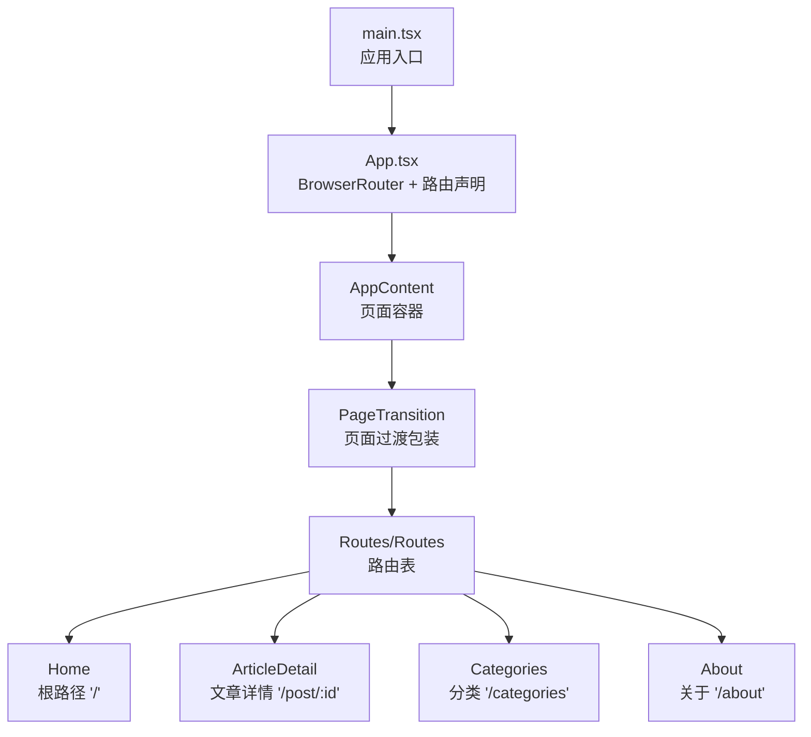
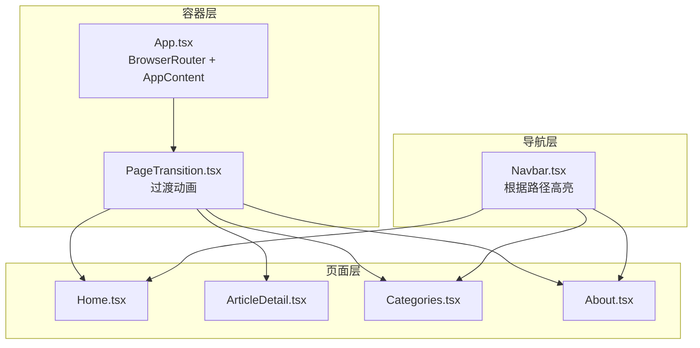
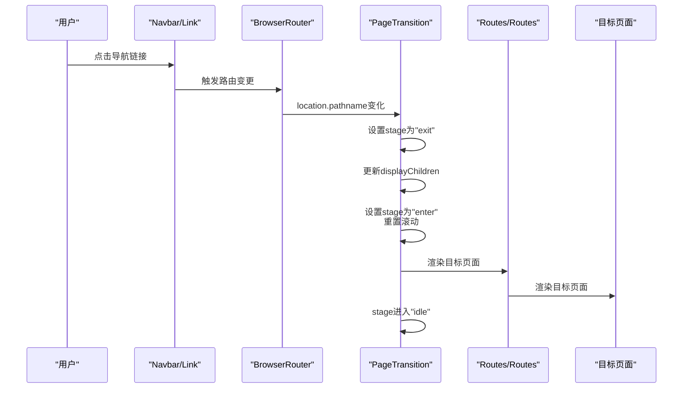
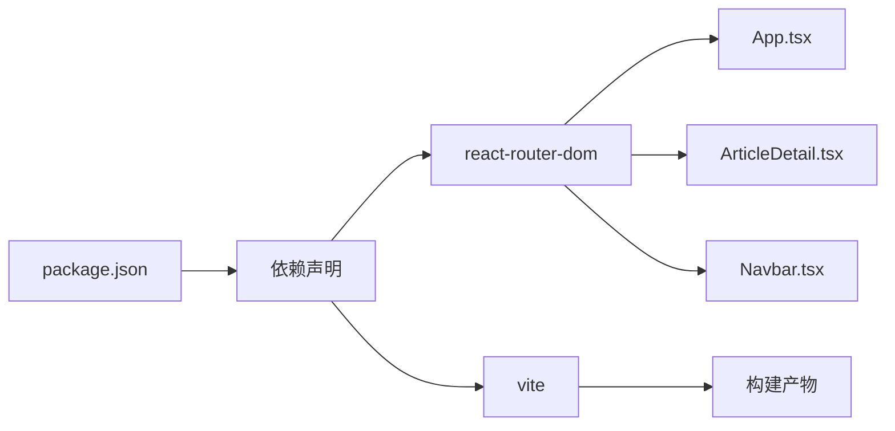

# 路由系统

<cite>
**本文引用的文件**
- [App.tsx](file://src/App.tsx)
- [main.tsx](file://src/main.tsx)
- [Home.tsx](file://src/pages/Home.tsx)
- [ArticleDetail.tsx](file://src/pages/ArticleDetail.tsx)
- [Categories.tsx](file://src/pages/Categories.tsx)
- [About.tsx](file://src/pages/About.tsx)
- [PageTransition.tsx](file://src/components/PageTransition.tsx)
- [posts.ts](file://src/data/posts.ts)
- [Navbar.tsx](file://src/components/Navbar.tsx)
- [useInView.ts](file://src/hooks/useInView.ts)
- [utils.ts](file://src/lib/utils.ts)
- [package.json](file://package.json)
- [vite.config.ts](file://vite.config.ts)
</cite>

## 目录
1. [简介](#简介)
2. [项目结构](#项目结构)
3. [核心组件](#核心组件)
4. [架构总览](#架构总览)
5. [详细组件分析](#详细组件分析)
6. [依赖分析](#依赖分析)
7. [性能考虑](#性能考虑)
8. [故障排查指南](#故障排查指南)
9. [结论](#结论)
10. [附录](#附录)

## 简介
本文件面向B02项目的路由系统，系统采用React Router DOM v6+风格的声明式路由配置，结合Vite构建与路径别名，提供根路径、文章详情、分类与关于页面的完整路由覆盖。文档将详细说明：
- BrowserRouter的设置与路由声明模式
- 各页面路由配置与参数获取（特别是文章ID）
- 页面过渡动画集成与PageTransition组件作用
- 路由导航最佳实践与代码示例路径
- 路由懒加载与代码分割策略

## 项目结构
路由系统位于src目录下，核心入口为main.tsx挂载App，App中通过BrowserRouter包裹，并在AppContent中声明所有路由。页面组件按功能分层放置于src/pages，公共组件与工具函数分别位于src/components与src/lib等目录。

图表来源
- [main.tsx:10-14](file://src/main.tsx#L10-L14)
- [App.tsx:34-40](file://src/App.tsx#L34-L40)
- [App.tsx:19-26](file://src/App.tsx#L19-L26)

章节来源
- [main.tsx:1-15](file://src/main.tsx#L1-L15)
- [App.tsx:1-43](file://src/App.tsx#L1-L43)

## 核心组件
- BrowserRouter：在App顶层提供路由上下文，使所有路由组件可用。
- Routes/Route：集中声明各页面路由，包含根路径、文章详情、分类与关于页面。
- PageTransition：包裹Routes，实现页面切换时的过渡动画与滚动重置。
- AppContent：承载导航栏、页面主体与页脚，统一布局。
- 页面组件：Home、ArticleDetail、Categories、About分别对应不同路由。

章节来源
- [App.tsx:1-43](file://src/App.tsx#L1-L43)
- [PageTransition.tsx:1-40](file://src/components/PageTransition.tsx#L1-L40)

## 架构总览
路由系统采用“容器-页面”分层：
- 容器层：App.tsx负责BrowserRouter与全局布局；PageTransition负责过渡动画。
- 页面层：各页面组件独立渲染，共享数据与工具函数。
- 导航层：Navbar根据当前路径高亮导航项，提供跨页面跳转。

图表来源
- [App.tsx:34-40](file://src/App.tsx#L34-L40)
- [App.tsx:19-26](file://src/App.tsx#L19-L26)
- [Navbar.tsx:18-112](file://src/components/Navbar.tsx#L18-L112)

## 详细组件分析

### 路由声明与BrowserRouter设置
- 在App.tsx中，顶层使用BrowserRouter包裹AppContent，确保所有子组件具备路由能力。
- AppContent中声明Routes与四个Route：
  - 根路径'/'映射至Home
  - 文章详情'/post/:id'映射至ArticleDetail
  - 分类'/categories'映射至Categories
  - 关于'/about'映射至About
- PageTransition包裹Routes，实现页面切换时的过渡效果与滚动重置。

章节来源
- [App.tsx:34-40](file://src/App.tsx#L34-L40)
- [App.tsx:19-26](file://src/App.tsx#L19-L26)

### 页面路由配置与参数获取
- 根路径'/'：直接渲染Home组件。
- 文章详情'/post/:id'：通过useParams获取路由参数id，调用数据层getPostById(id)获取文章内容；若未找到文章，返回“文章未找到”的降级UI并提供返回首页的链接。
- 分类路由'/categories'：展示分类与标签筛选，内部通过useState与posts过滤实现筛选逻辑。
- 关于页面'/about'：展示个人信息、技能与联系方式，使用多个useInView实现进入视口时的渐入动画。

章节来源
- [App.tsx:21-24](file://src/App.tsx#L21-L24)
- [ArticleDetail.tsx:118-138](file://src/pages/ArticleDetail.tsx#L118-L138)
- [ArticleDetail.tsx:119-121](file://src/pages/ArticleDetail.tsx#L119-L121)
- [Categories.tsx:8-26](file://src/pages/Categories.tsx#L8-L26)
- [About.tsx:4-7](file://src/pages/About.tsx#L4-L7)

### 页面过渡动画与PageTransition组件
- PageTransition通过useLocation监听pathname变化，触发退出与进入阶段的切换。
- 在退出阶段（exit）设置透明度与位移，随后更新显示children并进入进入阶段（enter），期间重置滚动位置。
- 进入阶段结束后进入idle稳定态，用于后续过渡控制。
- 该组件为所有页面提供统一的过渡体验，避免页面切换时的闪烁与跳动。

图表来源
- [PageTransition.tsx:9-20](file://src/components/PageTransition.tsx#L9-L20)
- [PageTransition.tsx:22-38](file://src/components/PageTransition.tsx#L22-L38)
- [Navbar.tsx:42-56](file://src/components/Navbar.tsx#L42-L56)

章节来源
- [PageTransition.tsx:1-40](file://src/components/PageTransition.tsx#L1-L40)
- [Navbar.tsx:18-112](file://src/components/Navbar.tsx#L18-L112)

### 路由导航最佳实践
- 使用Link组件进行同站跳转，避免刷新整页，保证过渡动画生效。
- 在文章详情页中，使用useNavigate(-1)实现后退，或通过Link回到首页，保持一致的导航体验。
- Navbar根据当前路径动态高亮，增强用户的空间定位感。
- 对于移动端，Navbar提供抽屉式菜单，确保小屏也能顺畅导航。

章节来源
- [ArticleDetail.tsx:145-151](file://src/pages/ArticleDetail.tsx#L145-L151)
- [ArticleDetail.tsx:189-196](file://src/pages/ArticleDetail.tsx#L189-L196)
- [Navbar.tsx:42-107](file://src/components/Navbar.tsx#L42-L107)

### 路由懒加载与代码分割
- 项目使用Vite作为构建工具，其原生支持ES模块的动态导入与代码分割。
- 虽然当前路由声明为静态导入，但可通过将页面组件改为动态导入（如import动态导入）实现按需加载与代码分割，从而降低首屏体积。
- 建议将大型页面组件（如ArticleDetail）改为动态导入，配合Suspense实现加载占位，进一步优化性能。

章节来源
- [package.json:1-33](file://package.json#L1-L33)
- [vite.config.ts:1-17](file://vite.config.ts#L1-L17)

## 依赖分析
- React Router DOM：提供BrowserRouter、Routes、Route、useParams、useNavigate、useLocation等核心API。
- Vite：提供开发服务器与构建工具，支持路径别名与动态导入。
- 路由与页面组件的耦合度低，通过useParams与数据层交互，便于扩展与维护。

图表来源
- [package.json:11-21](file://package.json#L11-L21)
- [App.tsx:1-10](file://src/App.tsx#L1-L10)
- [ArticleDetail.tsx:1](file://src/pages/ArticleDetail.tsx#L1)
- [Navbar.tsx:1](file://src/components/Navbar.tsx#L1)

章节来源
- [package.json:1-33](file://package.json#L1-L33)
- [vite.config.ts:1-17](file://vite.config.ts#L1-L17)

## 性能考虑
- 页面过渡动画：PageTransition在退出与进入阶段使用CSS属性与定时器控制，建议确保动画时长与缓动函数合理，避免阻塞主线程。
- 视口观察：Home与About使用useInView实现进入视口时的渐入动画，注意IntersectionObserver的阈值与rootMargin设置，避免过度触发。
- 路由懒加载：建议将大型页面组件改为动态导入，结合Suspense实现加载占位，减少首屏加载压力。
- 数据访问：文章详情通过id直接从内存数据中查找，避免网络请求，提高响应速度。

章节来源
- [PageTransition.tsx:9-20](file://src/components/PageTransition.tsx#L9-L20)
- [useInView.ts:9-37](file://src/hooks/useInView.ts#L9-L37)
- [posts.ts:361-363](file://src/data/posts.ts#L361-L363)

## 故障排查指南
- 文章未找到：ArticleDetail在未找到文章时返回降级UI并提供返回首页的链接，检查id参数是否正确传递与数据层是否存在对应id。
- 导航高亮异常：Navbar根据当前路径高亮，若高亮不生效，检查Link的to属性与当前路径是否一致。
- 过渡动画异常：PageTransition依赖useLocation监听pathname变化，若动画不触发，检查是否在BrowserRouter上下文中使用。
- 移动端菜单：Navbar移动端抽屉依赖状态控制，若无法展开，请检查状态切换逻辑与事件绑定。

章节来源
- [ArticleDetail.tsx:124-138](file://src/pages/ArticleDetail.tsx#L124-L138)
- [Navbar.tsx:42-107](file://src/components/Navbar.tsx#L42-L107)
- [PageTransition.tsx:5-20](file://src/components/PageTransition.tsx#L5-L20)

## 结论
B02项目的路由系统以简洁清晰的声明式配置为核心，结合PageTransition实现流畅的页面过渡体验。通过useParams与数据层交互，文章详情路由实现了稳定的参数解析与内容渲染。建议在后续迭代中引入动态导入与Suspense，以进一步优化首屏性能与用户体验。

## 附录
- 路由声明示例路径：[App.tsx:20-25](file://src/App.tsx#L20-L25)
- 参数获取示例路径：[ArticleDetail.tsx:119-121](file://src/pages/ArticleDetail.tsx#L119-L121)
- 导航组件示例路径：[Navbar.tsx:42-56](file://src/components/Navbar.tsx#L42-L56)
- 过渡组件示例路径：[PageTransition.tsx:9-20](file://src/components/PageTransition.tsx#L9-L20)
- 数据访问示例路径：[posts.ts:361-363](file://src/data/posts.ts#L361-L363)