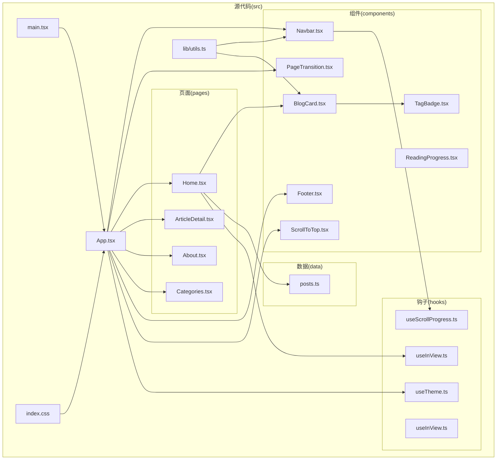
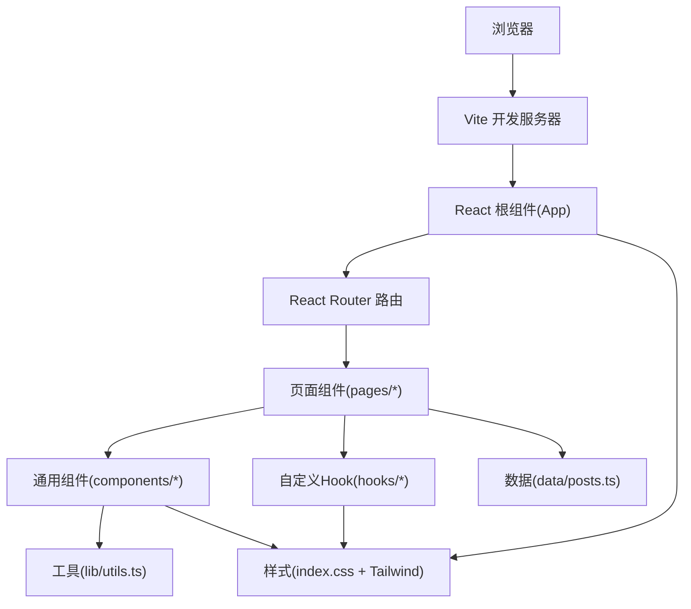
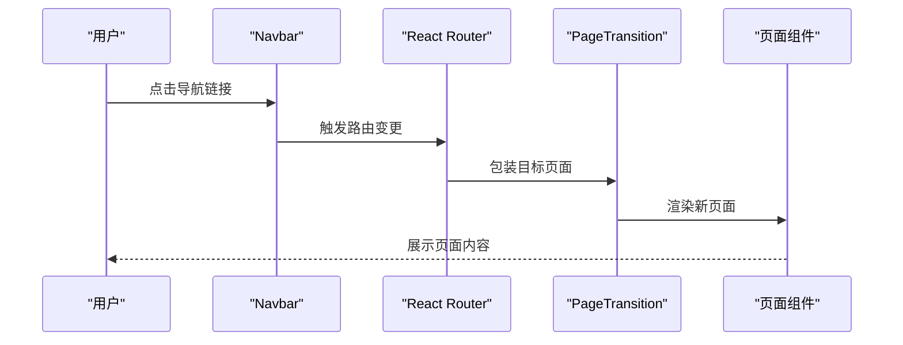
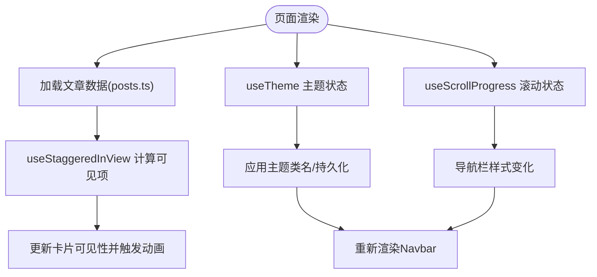
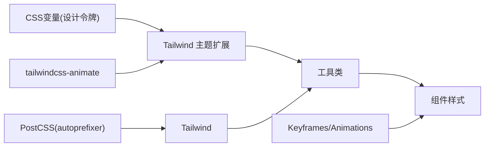
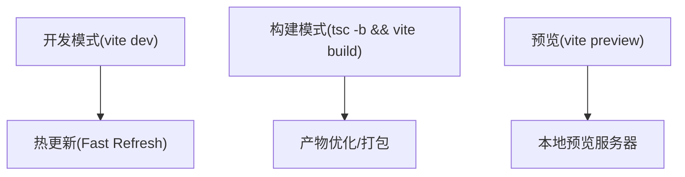
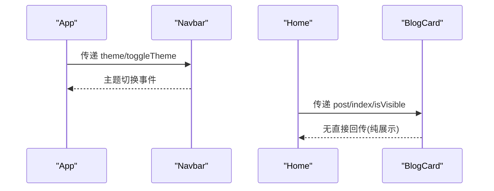
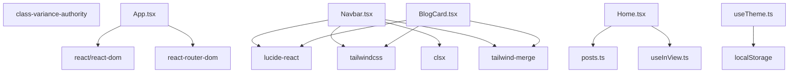

# 项目架构

<cite>
**本文引用的文件**
- [package.json](file://package.json)
- [vite.config.ts](file://vite.config.ts)
- [tailwind.config.ts](file://tailwind.config.ts)
- [postcss.config.js](file://postcss.config.js)
- [src/main.tsx](file://src/main.tsx)
- [src/App.tsx](file://src/App.tsx)
- [src/index.css](file://src/index.css)
- [src/lib/utils.ts](file://src/lib/utils.ts)
- [src/hooks/useTheme.ts](file://src/hooks/useTheme.ts)
- [src/hooks/useInView.ts](file://src/hooks/useInView.ts)
- [src/hooks/useScrollProgress.ts](file://src/hooks/useScrollProgress.ts)
- [src/components/Navbar.tsx](file://src/components/Navbar.tsx)
- [src/components/BlogCard.tsx](file://src/components/BlogCard.tsx)
- [src/pages/Home.tsx](file://src/pages/Home.tsx)
- [src/data/posts.ts](file://src/data/posts.ts)
</cite>

## 目录
1. [引言](#引言)
2. [项目结构](#项目结构)
3. [核心组件](#核心组件)
4. [架构总览](#架构总览)
5. [详细组件分析](#详细组件分析)
6. [依赖分析](#依赖分析)
7. [性能考虑](#性能考虑)
8. [故障排查指南](#故障排查指南)
9. [结论](#结论)
10. [附录](#附录)

## 引言
本架构文档面向B02项目，围绕基于React 18的组件化架构展开，系统梳理应用的层次结构、组件关系、路由配置、页面组织、数据流向、样式系统与构建工具选型，并对自定义Hook与状态管理进行深入分析。文档同时提供系统边界图与组件交互图，帮助架构师与高级开发者快速把握整体设计与技术权衡。

## 项目结构
项目采用“按功能域分层”的组织方式，核心目录与职责如下：
- src/main.tsx：应用入口，挂载根组件并注入全局样式与字体资源。
- src/App.tsx：应用根组件，负责路由配置与顶层布局容器。
- src/pages：页面级组件，承载具体业务视图。
- src/components：通用UI组件，如导航栏、页脚、卡片等。
- src/hooks：自定义Hook，封装跨组件可复用的副作用逻辑。
- src/data：静态数据与数据访问函数，提供文章列表与分类/标签查询。
- src/lib：工具函数库，如类名合并工具。
- src/index.css：Tailwind样式入口与自定义设计令牌。
- vite.config.ts：Vite构建与开发服务器配置。
- tailwind.config.ts：Tailwind CSS主题、动画与暗色模式配置。
- postcss.config.js：PostCSS流水线，集成Tailwind与自动前缀。

图表来源
- [src/main.tsx:1-15](file://src/main.tsx#L1-L15)
- [src/App.tsx:1-43](file://src/App.tsx#L1-L43)
- [src/pages/Home.tsx:1-34](file://src/pages/Home.tsx#L1-L34)
- [src/components/Navbar.tsx:1-113](file://src/components/Navbar.tsx#L1-L113)
- [src/components/BlogCard.tsx:1-66](file://src/components/BlogCard.tsx#L1-L66)
- [src/hooks/useTheme.ts:1-28](file://src/hooks/useTheme.ts#L1-L28)
- [src/hooks/useInView.ts:1-76](file://src/hooks/useInView.ts#L1-L76)
- [src/hooks/useScrollProgress.ts:1-23](file://src/hooks/useScrollProgress.ts#L1-L23)
- [src/data/posts.ts:1-382](file://src/data/posts.ts#L1-L382)
- [src/lib/utils.ts:1-7](file://src/lib/utils.ts#L1-L7)
- [src/index.css:1-234](file://src/index.css#L1-L234)

章节来源
- [src/main.tsx:1-15](file://src/main.tsx#L1-L15)
- [src/App.tsx:1-43](file://src/App.tsx#L1-L43)

## 核心组件
- 应用入口与根组件
  - 入口文件负责加载字体与全局样式，并通过ReactDOM将根组件挂载到DOM。
  - 根组件负责路由容器、主题Provider、页面过渡与全局布局。
- 页面组件
  - Home：展示文章列表，结合自定义Hook实现进入视口的逐项动画。
  - ArticleDetail、About、Categories：占位页面，配合路由与导航使用。
- 通用组件
  - Navbar：响应式导航，集成滚动进度检测与主题切换。
  - BlogCard：文章卡片，包含元信息、标题、摘要与标签徽章。
  - Footer、PageTransition、ScrollToTop、ReadingProgress：辅助性布局与交互组件。
- 自定义Hook
  - useTheme：主题状态与持久化，支持明/暗主题切换。
  - useScrollProgress：滚动进度计算，用于导航栏视觉反馈。
  - useInView/useStaggeredInView：基于IntersectionObserver的可见性检测与交错动画。
- 数据层
  - posts.ts：文章数据模型与查询函数（按分类、标签、ID检索）。

章节来源
- [src/main.tsx:1-15](file://src/main.tsx#L1-L15)
- [src/App.tsx:1-43](file://src/App.tsx#L1-L43)
- [src/pages/Home.tsx:1-34](file://src/pages/Home.tsx#L1-L34)
- [src/components/Navbar.tsx:1-113](file://src/components/Navbar.tsx#L1-L113)
- [src/components/BlogCard.tsx:1-66](file://src/components/BlogCard.tsx#L1-L66)
- [src/hooks/useTheme.ts:1-28](file://src/hooks/useTheme.ts#L1-L28)
- [src/hooks/useScrollProgress.ts:1-23](file://src/hooks/useScrollProgress.ts#L1-L23)
- [src/hooks/useInView.ts:1-76](file://src/hooks/useInView.ts#L1-L76)
- [src/data/posts.ts:1-382](file://src/data/posts.ts#L1-L382)

## 架构总览
B02采用“页面驱动 + 组件复用 + 自定义Hook”的React 18架构。路由由react-router-dom提供，页面组件负责数据消费与视图渲染；通用组件承担UI与交互；自定义Hook封装横切关注点；Tailwind CSS提供实用优先的样式体系；Vite提供开发与构建支持。

图表来源
- [src/App.tsx:1-43](file://src/App.tsx#L1-L43)
- [src/pages/Home.tsx:1-34](file://src/pages/Home.tsx#L1-L34)
- [src/components/Navbar.tsx:1-113](file://src/components/Navbar.tsx#L1-L113)
- [src/hooks/useTheme.ts:1-28](file://src/hooks/useTheme.ts#L1-L28)
- [src/data/posts.ts:1-382](file://src/data/posts.ts#L1-L382)
- [src/lib/utils.ts:1-7](file://src/lib/utils.ts#L1-L7)
- [src/index.css:1-234](file://src/index.css#L1-L234)

## 详细组件分析

### 路由与页面组织
- 路由配置
  - 使用BrowserRouter包裹根组件，定义首页、文章详情、关于、分类等路径。
  - 路由切换通过PageTransition组件包裹，实现页面进入/退出的过渡效果。
- 页面组件
  - Home：读取文章数据，使用useStaggeredInView实现逐项进入视口时的淡入动画。
  - ArticleDetail/About/Categories：占位页面，便于后续扩展。
- 组件间关系
  - App作为布局容器，聚合Navbar、Footer、ScrollToTop等横切组件。
  - 页面组件仅关注自身业务数据与渲染，降低耦合。

图表来源
- [src/App.tsx:1-43](file://src/App.tsx#L1-L43)
- [src/components/Navbar.tsx:1-113](file://src/components/Navbar.tsx#L1-L113)

章节来源
- [src/App.tsx:1-43](file://src/App.tsx#L1-L43)
- [src/pages/Home.tsx:1-34](file://src/pages/Home.tsx#L1-L34)

### 数据流与状态管理
- 数据来源
  - 文章数据集中存储于posts.ts，提供按ID、分类、标签的查询函数。
  - 页面组件通过导入数据模块直接消费数据，保持简单直接的数据流。
- 状态管理
  - 主题状态：useTheme提供主题切换与本地持久化，根组件将其传递给Navbar。
  - 滚动状态：useScrollProgress计算滚动百分比与是否滚动，Navbar根据该状态调整样式。
  - 可见性状态：useInView/useStaggeredInView基于IntersectionObserver观测元素进入视口，触发动画与可见集合更新。
- 状态与UI绑定
  - Navbar根据主题与滚动状态动态切换类名，实现背景模糊、阴影与图标切换。
  - Home根据可见集合控制卡片动画，实现交错入场效果。

图表来源
- [src/pages/Home.tsx:1-34](file://src/pages/Home.tsx#L1-L34)
- [src/hooks/useTheme.ts:1-28](file://src/hooks/useTheme.ts#L1-L28)
- [src/hooks/useScrollProgress.ts:1-23](file://src/hooks/useScrollProgress.ts#L1-L23)
- [src/hooks/useInView.ts:1-76](file://src/hooks/useInView.ts#L1-L76)
- [src/data/posts.ts:1-382](file://src/data/posts.ts#L1-L382)

章节来源
- [src/data/posts.ts:1-382](file://src/data/posts.ts#L1-L382)
- [src/hooks/useTheme.ts:1-28](file://src/hooks/useTheme.ts#L1-L28)
- [src/hooks/useScrollProgress.ts:1-23](file://src/hooks/useScrollProgress.ts#L1-L23)
- [src/hooks/useInView.ts:1-76](file://src/hooks/useInView.ts#L1-L76)
- [src/pages/Home.tsx:1-34](file://src/pages/Home.tsx#L1-L34)

### 样式系统与Tailwind架构
- 实用优先理念
  - 通过Tailwind工具类直接组合样式，避免手写CSS，提高开发效率与一致性。
  - 使用cn工具函数合并与去重类名，确保样式冲突最小化。
- 设计令牌与主题
  - 在index.css中定义CSS变量，承载背景、前景、阴影、圆角等设计令牌。
  - tailwind.config.ts扩展colors、borderRadius、keyframes与animation，统一动画节奏与视觉语言。
  - 支持暗色模式(class策略)，通过根节点类名切换主题。
- 动画与过渡
  - PageTransition、stagger-item、ripple、link-underline等组件级动画通过@layer与keyframes实现。
  - theme-transition统一主题切换的过渡时序，提升交互质感。
- 插件与后处理器
  - tailwindcss-animate插件提供内置动画变体。
  - PostCSS集成Tailwind与autoprefixer，保证跨浏览器兼容。

图表来源
- [src/index.css:1-234](file://src/index.css#L1-L234)
- [tailwind.config.ts:1-107](file://tailwind.config.ts#L1-L107)
- [postcss.config.js:1-7](file://postcss.config.js#L1-L7)
- [src/lib/utils.ts:1-7](file://src/lib/utils.ts#L1-L7)

章节来源
- [src/index.css:1-234](file://src/index.css#L1-L234)
- [tailwind.config.ts:1-107](file://tailwind.config.ts#L1-L107)
- [postcss.config.js:1-7](file://postcss.config.js#L1-L7)
- [src/lib/utils.ts:1-7](file://src/lib/utils.ts#L1-L7)

### 构建与开发工具链
- Vite配置
  - 启用@vitejs/plugin-react，支持React 18与Fast Refresh。
  - 设置路径别名@指向src，简化导入路径。
  - 开发服务器端口3000，默认打开浏览器。
- TypeScript与类型安全
  - 项目使用TypeScript，提供强类型约束与IDE支持。
- 依赖生态
  - React 18、react-router-dom、lucide-react、tailwindcss及其相关插件与工具库。

图表来源
- [package.json:1-33](file://package.json#L1-L33)
- [vite.config.ts:1-17](file://vite.config.ts#L1-L17)

章节来源
- [package.json:1-33](file://package.json#L1-L33)
- [vite.config.ts:1-17](file://vite.config.ts#L1-L17)

### 组件通信与数据传递
- Props向下传递
  - App向Navbar传递theme与toggleTheme；Home向BlogCard传递post、index与isVisible。
- 事件回调向上冒泡
  - Navbar通过toggleTheme回调通知App切换主题；移动端菜单开关状态在Navbar内部管理。
- 上下文与全局状态
  - 主题状态通过根组件状态提升至App，再传递给Navbar；滚动状态通过Hook在Navbar内部使用。
- 数据访问
  - 页面组件直接从数据模块导入数据，减少中间层，保持数据流简洁。

图表来源
- [src/App.tsx:1-43](file://src/App.tsx#L1-L43)
- [src/components/Navbar.tsx:1-113](file://src/components/Navbar.tsx#L1-L113)
- [src/pages/Home.tsx:1-34](file://src/pages/Home.tsx#L1-L34)
- [src/components/BlogCard.tsx:1-66](file://src/components/BlogCard.tsx#L1-L66)

章节来源
- [src/App.tsx:1-43](file://src/App.tsx#L1-L43)
- [src/components/Navbar.tsx:1-113](file://src/components/Navbar.tsx#L1-L113)
- [src/pages/Home.tsx:1-34](file://src/pages/Home.tsx#L1-L34)
- [src/components/BlogCard.tsx:1-66](file://src/components/BlogCard.tsx#L1-L66)

## 依赖分析
- 外部依赖
  - React 18：组件模型与并发特性。
  - react-router-dom：声明式路由与导航。
  - lucide-react：轻量图标库。
  - Tailwind CSS及相关插件：实用优先样式系统。
  - class-variance-authority、clsx、tailwind-merge：类名合并与条件样式。
- 内部依赖
  - App依赖各页面与通用组件；页面依赖数据模块与自定义Hook；组件依赖工具函数与样式。
- 耦合与内聚
  - 页面与数据模块松耦合，通过函数接口访问；组件与Hook松耦合，通过props与返回值交互。
- 循环依赖
  - 当前结构未见循环依赖迹象，模块间单向依赖清晰。

图表来源
- [package.json:1-33](file://package.json#L1-L33)
- [src/App.tsx:1-43](file://src/App.tsx#L1-L43)
- [src/components/Navbar.tsx:1-113](file://src/components/Navbar.tsx#L1-L113)
- [src/components/BlogCard.tsx:1-66](file://src/components/BlogCard.tsx#L1-L66)
- [src/pages/Home.tsx:1-34](file://src/pages/Home.tsx#L1-L34)
- [src/hooks/useTheme.ts:1-28](file://src/hooks/useTheme.ts#L1-L28)
- [src/hooks/useInView.ts:1-76](file://src/hooks/useInView.ts#L1-L76)
- [src/data/posts.ts:1-382](file://src/data/posts.ts#L1-L382)

章节来源
- [package.json:1-33](file://package.json#L1-L33)
- [src/App.tsx:1-43](file://src/App.tsx#L1-L43)

## 性能考虑
- 懒加载与按需渲染
  - 使用IntersectionObserver延迟触发动画，减少首屏压力。
- 事件监听优化
  - useScrollProgress使用passive事件监听，避免主线程阻塞。
- 样式与类名
  - 通过clsx与tailwind-merge合并类名，避免冗余样式与冲突。
- 构建优化
  - Vite提供快速冷启动与热更新；生产构建由Vite负责代码分割与压缩。
- 动画与过渡
  - 使用transform与opacity等可合成属性，避免强制同步布局。

## 故障排查指南
- 主题切换无效
  - 检查useTheme是否正确设置根节点类名与localStorage写入。
  - 确认index.css中的:root与.dark块定义完整。
- 卡片动画不触发
  - 检查Home中useStaggeredInView的containerRef与data-index属性是否正确设置。
  - 确认stagger-item与visible类名在index.css中存在。
- 导航栏样式异常
  - 检查useScrollProgress返回的isScrolled与Navbar的类名拼接逻辑。
  - 确认theme-transition类在index.css中生效。
- 路由跳转无过渡
  - 检查App中PageTransition包裹Routes的结构与类名。
- 构建/开发问题
  - 确认vite.config.ts中alias与plugin配置正确。
  - 检查postcss.config.js中tailwindcss与autoprefixer是否启用。

章节来源
- [src/hooks/useTheme.ts:1-28](file://src/hooks/useTheme.ts#L1-L28)
- [src/index.css:1-234](file://src/index.css#L1-L234)
- [src/pages/Home.tsx:1-34](file://src/pages/Home.tsx#L1-L34)
- [src/components/Navbar.tsx:1-113](file://src/components/Navbar.tsx#L1-L113)
- [src/App.tsx:1-43](file://src/App.tsx#L1-L43)
- [vite.config.ts:1-17](file://vite.config.ts#L1-L17)
- [postcss.config.js:1-7](file://postcss.config.js#L1-L7)

## 结论
B02项目以React 18为核心，结合react-router-dom实现页面级路由，通过自定义Hook抽象横切逻辑，借助Tailwind CSS的实用优先理念实现高可维护的样式体系，并以Vite提供高效开发与构建体验。整体架构强调“低耦合、高内聚、可扩展”，适合在保持简洁的同时逐步演进为更复杂的博客平台。

## 附录
- 技术选型权衡
  - React 18：并发特性带来更好的用户体验，但需注意严格模式下的副作用行为。
  - Tailwind CSS：开发效率高、一致性好，需通过设计令牌与插件规范统一风格。
  - Vite：冷启动快、生态完善，适合中小型项目；大型项目可评估打包策略。
- 最佳实践建议
  - 为页面组件增加错误边界与骨架屏。
  - 对频繁滚动场景使用节流/防抖优化。
  - 对动画与过渡统一使用CSS变量与时序，便于主题与性能调优。