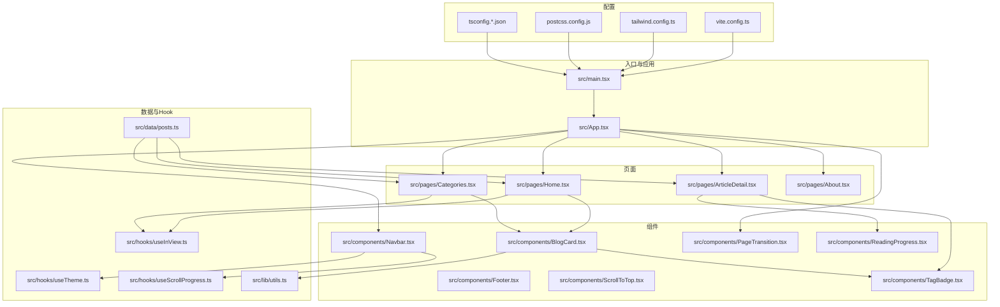
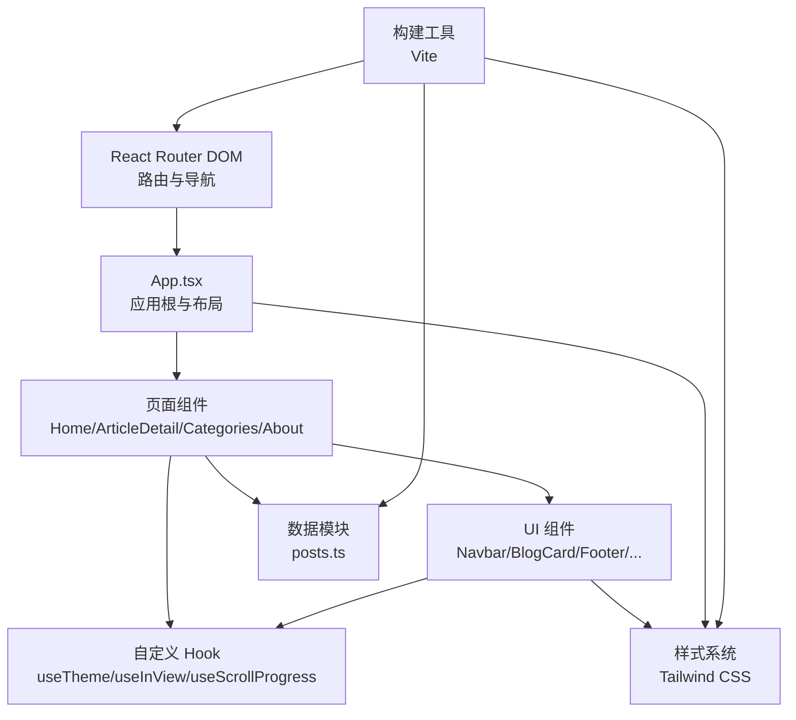
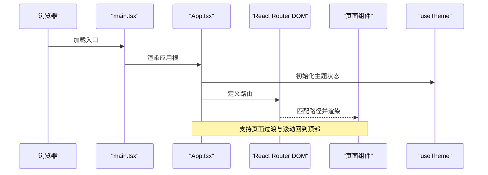
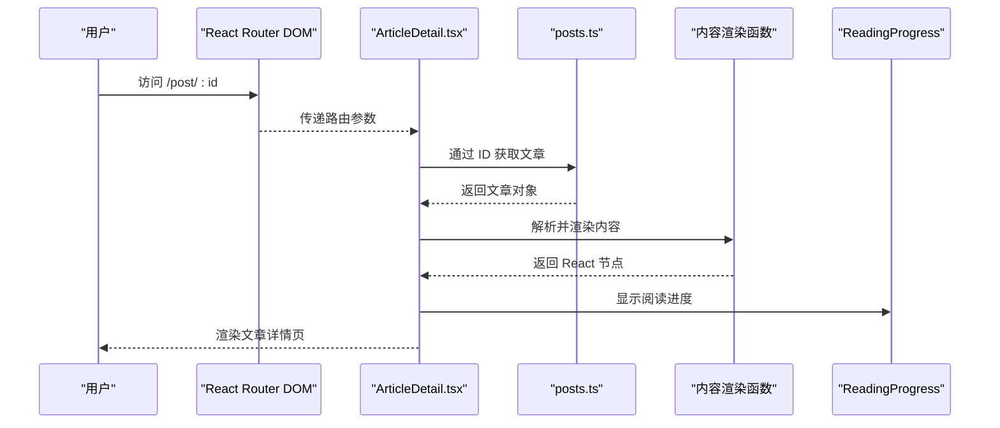
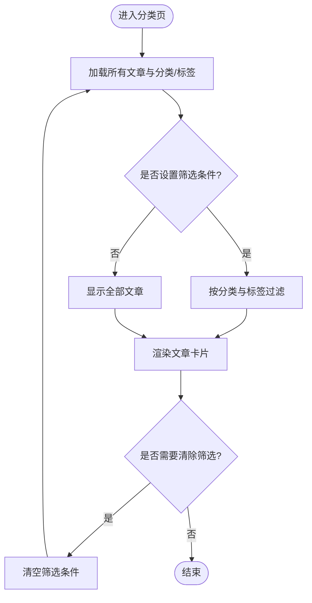
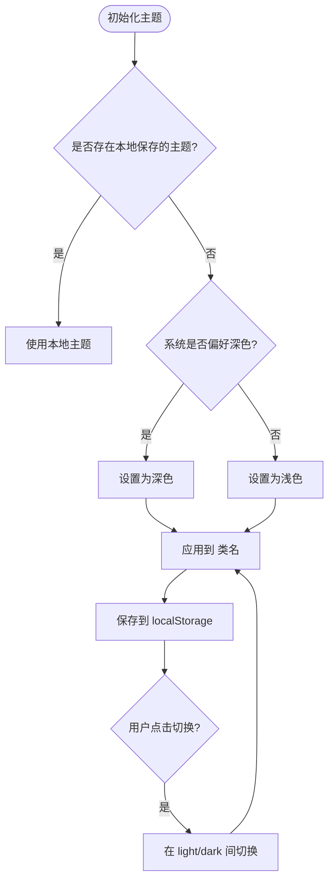
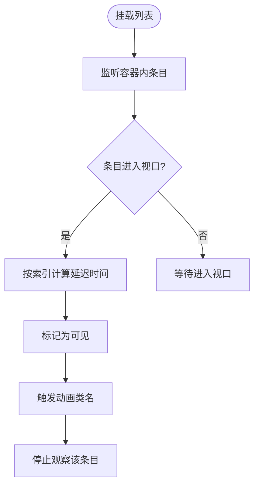
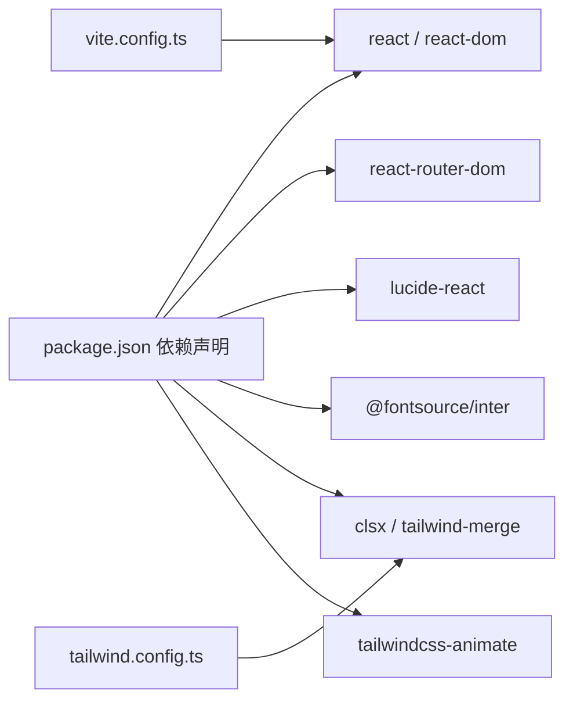

# 项目概述

<cite>
**本文档引用的文件**
- [package.json](file://package.json)
- [vite.config.ts](file://vite.config.ts)
- [tailwind.config.ts](file://tailwind.config.ts)
- [src/main.tsx](file://src/main.tsx)
- [src/App.tsx](file://src/App.tsx)
- [src/data/posts.ts](file://src/data/posts.ts)
- [src/hooks/useTheme.ts](file://src/hooks/useTheme.ts)
- [src/hooks/useInView.ts](file://src/hooks/useInView.ts)
- [src/hooks/useScrollProgress.ts](file://src/hooks/useScrollProgress.ts)
- [src/lib/utils.ts](file://src/lib/utils.ts)
- [src/components/Navbar.tsx](file://src/components/Navbar.tsx)
- [src/components/BlogCard.tsx](file://src/components/BlogCard.tsx)
- [src/pages/Home.tsx](file://src/pages/Home.tsx)
- [src/pages/ArticleDetail.tsx](file://src/pages/ArticleDetail.tsx)
- [src/pages/Categories.tsx](file://src/pages/Categories.tsx)
</cite>

## 目录
1. [引言](#引言)
2. [项目结构](#项目结构)
3. [核心组件](#核心组件)
4. [架构总览](#架构总览)
5. [详细组件分析](#详细组件分析)
6. [依赖分析](#依赖分析)
7. [性能考虑](#性能考虑)
8. [故障排除指南](#故障排除指南)
9. [结论](#结论)

## 引言
本项目是一个基于 React 18 与 TypeScript 构建的现代化静态博客平台，旨在提供简洁优雅的文章浏览体验。项目采用 Vite 作为构建工具，Tailwind CSS 作为样式基础，并通过 React Router DOM 实现页面路由与导航。整体设计强调内容优先、交互流畅与主题适配，支持明暗主题切换、响应式布局、滚动进度指示与阅读进度反馈等特性。

## 项目结构
项目采用按功能模块划分的目录结构，核心文件分布如下：
- 入口与应用根：src/main.tsx、src/App.tsx
- 页面组件：src/pages/Home.tsx、src/pages/ArticleDetail.tsx、src/pages/Categories.tsx、src/pages/About.tsx
- 可复用组件：src/components/Navbar.tsx、src/components/BlogCard.tsx、src/components/Footer.tsx、src/components/PageTransition.tsx、src/components/ReadingProgress.tsx、src/components/ScrollToTop.tsx、src/components/TagBadge.tsx
- 数据与类型：src/data/posts.ts
- 自定义 Hook：src/hooks/useTheme.ts、src/hooks/useInView.ts、src/hooks/useScrollProgress.ts
- 工具函数：src/lib/utils.ts
- 构建与样式配置：vite.config.ts、tailwind.config.ts、postcss.config.js、tsconfig.*.json

图表来源
- [src/main.tsx:1-15](file://src/main.tsx#L1-L15)
- [src/App.tsx:1-43](file://src/App.tsx#L1-L43)
- [src/pages/Home.tsx:1-34](file://src/pages/Home.tsx#L1-L34)
- [src/pages/ArticleDetail.tsx:1-201](file://src/pages/ArticleDetail.tsx#L1-L201)
- [src/pages/Categories.tsx:1-120](file://src/pages/Categories.tsx#L1-L120)
- [src/components/Navbar.tsx:1-113](file://src/components/Navbar.tsx#L1-L113)
- [src/components/BlogCard.tsx:1-66](file://src/components/BlogCard.tsx#L1-L66)
- [src/data/posts.ts:1-382](file://src/data/posts.ts#L1-L382)
- [src/hooks/useTheme.ts:1-28](file://src/hooks/useTheme.ts#L1-L28)
- [src/hooks/useInView.ts:1-76](file://src/hooks/useInView.ts#L1-L76)
- [src/hooks/useScrollProgress.ts:1-23](file://src/hooks/useScrollProgress.ts#L1-L23)
- [src/lib/utils.ts:1-7](file://src/lib/utils.ts#L1-L7)
- [vite.config.ts:1-17](file://vite.config.ts#L1-L17)
- [tailwind.config.ts:1-107](file://tailwind.config.ts#L1-L107)

章节来源
- [package.json:1-33](file://package.json#L1-L33)
- [vite.config.ts:1-17](file://vite.config.ts#L1-L17)
- [tailwind.config.ts:1-107](file://tailwind.config.ts#L1-L107)

## 核心组件
- 应用根与路由：App.tsx 使用 React Router DOM 定义站点路由，包含首页、文章详情、分类页与关于页；同时集成主题切换与全局过渡效果。
- 页面组件：Home 展示文章列表；ArticleDetail 渲染 Markdown 风格内容并提供返回与阅读进度；Categories 支持按分类与标签筛选文章。
- 可视化与交互：BlogCard 提供卡片式文章条目；Navbar 支持主题切换、移动端菜单与滚动阴影；ReadingProgress 与 ScrollToTop 提升阅读体验。
- 数据与类型：posts.ts 定义文章接口与数据源，提供按分类、标签与 ID 查询的辅助函数。
- 自定义 Hook：useTheme 管理主题持久化与切换；useInView 与 useStaggeredInView 控制元素进入视口的动画与延迟；useScrollProgress 提供滚动进度与头部样式变化。
- 工具函数：utils.ts 封装 clsx 与 tailwind-merge，统一类名合并策略。

章节来源
- [src/App.tsx:1-43](file://src/App.tsx#L1-L43)
- [src/pages/Home.tsx:1-34](file://src/pages/Home.tsx#L1-L34)
- [src/pages/ArticleDetail.tsx:1-201](file://src/pages/ArticleDetail.tsx#L1-L201)
- [src/pages/Categories.tsx:1-120](file://src/pages/Categories.tsx#L1-L120)
- [src/components/BlogCard.tsx:1-66](file://src/components/BlogCard.tsx#L1-L66)
- [src/components/Navbar.tsx:1-113](file://src/components/Navbar.tsx#L1-L113)
- [src/data/posts.ts:1-382](file://src/data/posts.ts#L1-L382)
- [src/hooks/useTheme.ts:1-28](file://src/hooks/useTheme.ts#L1-L28)
- [src/hooks/useInView.ts:1-76](file://src/hooks/useInView.ts#L1-L76)
- [src/hooks/useScrollProgress.ts:1-23](file://src/hooks/useScrollProgress.ts#L1-L23)
- [src/lib/utils.ts:1-7](file://src/lib/utils.ts#L1-L7)

## 架构总览
本项目采用“页面-组件-Hook-数据”分层架构，页面负责路由与布局，组件封装 UI 与交互，Hook 抽象跨页面的通用行为，数据模块集中管理文章与元数据。Tailwind CSS 提供原子化样式，Vite 提供快速开发与构建能力。

图表来源
- [src/App.tsx:1-43](file://src/App.tsx#L1-L43)
- [src/pages/Home.tsx:1-34](file://src/pages/Home.tsx#L1-L34)
- [src/pages/ArticleDetail.tsx:1-201](file://src/pages/ArticleDetail.tsx#L1-L201)
- [src/pages/Categories.tsx:1-120](file://src/pages/Categories.tsx#L1-L120)
- [src/components/Navbar.tsx:1-113](file://src/components/Navbar.tsx#L1-L113)
- [src/components/BlogCard.tsx:1-66](file://src/components/BlogCard.tsx#L1-L66)
- [src/hooks/useTheme.ts:1-28](file://src/hooks/useTheme.ts#L1-L28)
- [src/hooks/useInView.ts:1-76](file://src/hooks/useInView.ts#L1-L76)
- [src/hooks/useScrollProgress.ts:1-23](file://src/hooks/useScrollProgress.ts#L1-L23)
- [src/data/posts.ts:1-382](file://src/data/posts.ts#L1-L382)
- [tailwind.config.ts:1-107](file://tailwind.config.ts#L1-L107)
- [vite.config.ts:1-17](file://vite.config.ts#L1-L17)

## 详细组件分析

### 应用根与路由流程
应用根负责装配导航栏、页面过渡、路由与页脚，并通过自定义 Hook 管理主题状态。路由覆盖首页、文章详情、分类页与关于页，配合页面过渡组件实现平滑切换。

图表来源
- [src/main.tsx:1-15](file://src/main.tsx#L1-L15)
- [src/App.tsx:1-43](file://src/App.tsx#L1-L43)
- [src/hooks/useTheme.ts:1-28](file://src/hooks/useTheme.ts#L1-L28)

章节来源
- [src/main.tsx:1-15](file://src/main.tsx#L1-L15)
- [src/App.tsx:1-43](file://src/App.tsx#L1-L43)

### 文章详情渲染流程
文章详情页根据路由参数加载对应文章，解析内容中的标题、列表、代码块与行内代码，渲染为语义化的 HTML 结构，并提供返回与阅读进度反馈。

图表来源
- [src/pages/ArticleDetail.tsx:1-201](file://src/pages/ArticleDetail.tsx#L1-L201)
- [src/data/posts.ts:1-382](file://src/data/posts.ts#L1-L382)

章节来源
- [src/pages/ArticleDetail.tsx:1-201](file://src/pages/ArticleDetail.tsx#L1-L201)
- [src/data/posts.ts:1-382](file://src/data/posts.ts#L1-L382)

### 列表与筛选流程
分类页支持按分类与标签双重筛选，实时更新文章列表，并提供清除筛选的操作提示。

图表来源
- [src/pages/Categories.tsx:1-120](file://src/pages/Categories.tsx#L1-L120)
- [src/data/posts.ts:1-382](file://src/data/posts.ts#L1-L382)

章节来源
- [src/pages/Categories.tsx:1-120](file://src/pages/Categories.tsx#L1-L120)
- [src/data/posts.ts:1-382](file://src/data/posts.ts#L1-L382)

### 主题切换与持久化
主题 Hook 在初始化时读取本地存储或系统偏好，随后通过类名切换实现明暗主题，并将当前主题持久化到本地存储。

图表来源
- [src/hooks/useTheme.ts:1-28](file://src/hooks/useTheme.ts#L1-L28)

章节来源
- [src/hooks/useTheme.ts:1-28](file://src/hooks/useTheme.ts#L1-L28)

### 列表项入场动画与延迟
列表组件通过 useStaggeredInView 为每个条目设置延迟，结合 IntersectionObserver 实现“阶梯式”入场动画，提升阅读节奏与视觉层次。

图表来源
- [src/hooks/useInView.ts:1-76](file://src/hooks/useInView.ts#L1-L76)
- [src/components/BlogCard.tsx:1-66](file://src/components/BlogCard.tsx#L1-L66)

章节来源
- [src/hooks/useInView.ts:1-76](file://src/hooks/useInView.ts#L1-L76)
- [src/components/BlogCard.tsx:1-66](file://src/components/BlogCard.tsx#L1-L66)

## 依赖分析
- 运行时依赖：React 18、React DOM、React Router DOM、Lucide React（图标）、Tailwind Merge 与 clsx（类名合并）、Fontsource Inter（字体）、Tailwindcss-animate（动画插件）
- 开发依赖：Vite、React 插件、TypeScript、Tailwind CSS、PostCSS、Autoprefixer
- 构建与别名：Vite 配置启用 React 插件与路径别名 @ 指向 src，开发服务器端口 3000 并自动打开浏览器
- 样式系统：Tailwind CSS 配置启用类名驱动的深色模式、自定义颜色变量、动画 keyframes 与容器宽度

图表来源
- [package.json:1-33](file://package.json#L1-L33)
- [vite.config.ts:1-17](file://vite.config.ts#L1-L17)
- [tailwind.config.ts:1-107](file://tailwind.config.ts#L1-L107)

章节来源
- [package.json:1-33](file://package.json#L1-L33)
- [vite.config.ts:1-17](file://vite.config.ts#L1-L17)
- [tailwind.config.ts:1-107](file://tailwind.config.ts#L1-L107)

## 性能考虑
- 懒加载与按需渲染：通过 IntersectionObserver 控制元素进入视口后才触发动画与渲染，降低首屏压力。
- 动画与过渡：使用 CSS 动画与类名切换，避免重型 JavaScript 动画库带来的体积与性能负担。
- 样式合并：利用 clsx 与 tailwind-merge 合并类名，减少无效样式与重绘。
- 构建优化：Vite 提供快速热更新与打包优化，TypeScript 在构建阶段进行类型检查与编译。
- 字体与图标：仅引入 Inter 字体的必要字重与 Lucide React 图标，控制资源体积。

## 故障排除指南
- 文章未找到：当访问不存在的文章 ID 时，详情页会显示“文章未找到”的提示与返回首页的链接，便于用户快速回到正常浏览路径。
- 主题不生效：确认 <html> 根元素存在对应类名（light/dark），并检查本地存储中是否存在 blog-theme 键；若无，系统将依据系统偏好自动设置。
- 列表不显示动画：确保每个条目设置了 data-index 属性，并且容器内条目数量大于 0；检查 useStaggeredInView 的阈值与 rootMargin 设置。
- 移动端菜单无法展开：检查移动端状态切换逻辑与过渡样式，确认触摸事件绑定正常。

章节来源
- [src/pages/ArticleDetail.tsx:124-138](file://src/pages/ArticleDetail.tsx#L124-L138)
- [src/hooks/useTheme.ts:15-20](file://src/hooks/useTheme.ts#L15-L20)
- [src/hooks/useInView.ts:55-72](file://src/hooks/useInView.ts#L55-L72)
- [src/components/Navbar.tsx:75-82](file://src/components/Navbar.tsx#L75-L82)

## 结论
本项目以 React 18 与 TypeScript 为基础，结合 Vite 与 Tailwind CSS，构建了一个简洁优雅、性能友好的静态博客平台。其核心价值体现在：清晰的页面与组件分层、可复用的自定义 Hook、完善的主题与响应式设计、以及良好的可扩展性。对于初学者，项目提供了从入口到页面再到组件与 Hook 的完整示例；对于有经验的开发者，项目展示了现代前端工程化实践与设计理念的落地。